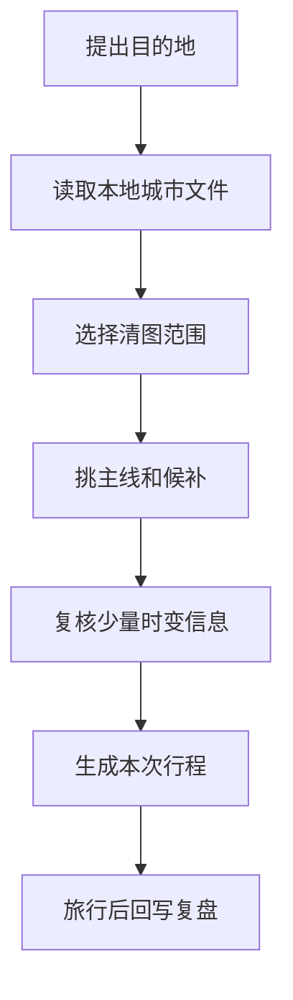
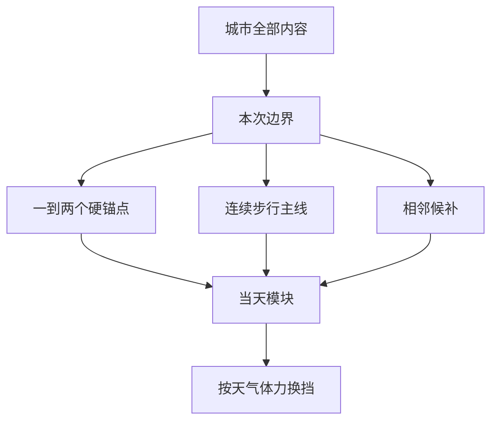

# 这套本地旅行资料怎么用

## 想去一个地方时先做什么

先打开对应城市 Markdown，看城市片区、核心景点和可串联路线。文件里的稳定内容用于快速形成方向；只有真正影响当天执行的部分才联网复核。

这里最重要的是第四步以前基本可以离线完成。联网不是重新从零搜攻略，而是核对少量会变的信息。

## 哪些内容可以长期复用

- 城市有哪些核心片区；
- 景点大致类型、地理关系与游览价值；
- 哪些地方适合连续步行，哪些必须跨区交通；
- 代表性菜品和饮食结构；
- 首访、重游、雨天、摄影等线路思路；
- 哪些远郊点不应放进普通城市清图分母。

## 哪些内容出发前仍要复核

- 营业时间、闭馆日和临时闭馆；
- 门票、优惠身份和预约放票规则；
- 展览、演出、节庆的具体日期；
- 台风、山火、暴雨、高温等安全影响；
- 铁路、航班、轮渡、索道和景区接驳；
- 餐厅是否仍营业、是否搬店、是否需要排号。

城市文件会用“出发前复核”单独列出这些项目。旧信息不会被写成永久保证。

## 清图率怎样保持公平

清图率不是搜索结果数量的比值。每次先冻结一个范围：

- A 级：本次城市核心，默认进入分母；
- B 级：同片区次要点，有余力再补；
- C 级：远郊、季节性或需要单独半天以上的内容；
- 配套：车站、商场、餐厅、游客中心和普通交通节点，不算景点；
- 临时关闭：是否从分母剔除，在出发前固定规则。

景区与内部子点是否同时计数，按城市文件的说明处理。不能既把整座景区算一项，又把每个小门、小亭重复算成完整分母。

## 城市文件怎样变成用户的行程

这套结构保留用户现场调整的自由，同时避免临时在手机上反复搜索“附近还有什么”。

## 旅行后怎样维护

复盘时优先补充：实际停留时长、路线是否顺、景点是否值得进入 A 级、餐厅排队是否吞噬行程、独行适配、摄影高光和天气影响。个人体验可以影响以后推荐权重，但不要无证据改写官方开放事实。

