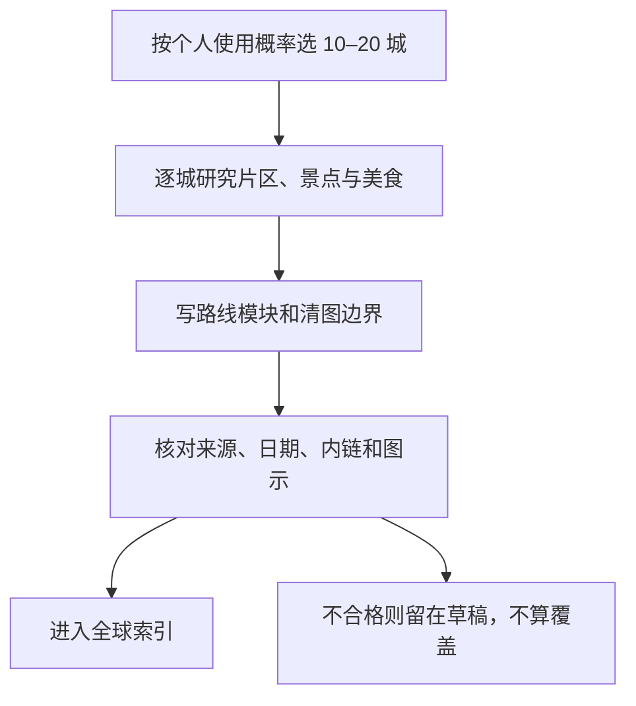

# 覆盖状态与扩展计划

## 先说明“覆盖”是什么意思

这里的覆盖单位是**有实质内容的城市页**，不是创建了目录，也不是搜索到一串景点名称。一座城市只有同时具备片区关系、主要景点、美食、路线模块、A/B/C 清图边界、出发前复核项、来源和研究日期，才进入“已覆盖”。

第一批范围是 4 个国家、19 座城市：

- 中国 13 座：北京、上海、大连、武汉、成都、厦门、广州、深圳、杭州、宁波、临海、南京、苏州；
- 日本 4 座：东京、京都、大阪、福冈；
- 英国 1 座：伦敦；
- 法国 1 座：巴黎。

这 19 座是为了校准写法和个人适配，不代表四国的城市或景点已经收齐。

## “全球所有景点”为什么不是一个可完结数字

景区、街区、路线、建筑、展馆、观景点和季节活动之间没有全球统一的计数口径；新地点会开放，旧地点会关闭，同一景区又可以按父级整体或内部子点重复计数。因此本项目不承诺一个虚假的全球百分比，而采用可审核的城市覆盖层级。

以下数字是本项目的**规划刻度**，不是对世界城市总数的统计：

| 层级 | 目标城市页 | 按每城 10–25 个景点父项估算 | 能解决什么 |
|---|---:|---:|---|
| 高频底盘 | 100 | 约 1,000–2,500 个父项 | 覆盖个人高概率目的地和主要经典城市 |
| 广域旅行网 | 500 | 约 5,000–12,500 个父项 | 覆盖多数常见跨国、跨省旅行询问 |
| 深层长尾 | 2,000 | 约 20,000–50,000 个父项 | 进入区域小城、海岛、国家公园门户与主题目的地 |
| “全球所有” | 不设完成承诺 | 无稳定分母 | 长期新增与纠错队列，只能持续维护 |

首批 19 城相当于“100 城高频底盘”的 19%，但只相当于“500 城广域旅行网”的 3.8%。真正的质量指标是打开某座已覆盖城市时能否直接做选择，而不是文件数量看起来很大。

## 每批怎样扩展

一个常规批次预计包含：

- 10–20 个完整城市页；
- 约 100–500 个景点父项，视城市规模而定；
- 每城 3–5 个可拆装路线模块；
- 每城若干官方或开放来源链接，并注明用途和研究日期；
- 一次统一的结构、内链、图示和时变信息检查。

开始下一批前，先向用户报告城市清单、预计页数、重点来源、会不会调用接口、是否涉及受限许可证，以及哪些内容仍必须在出发前联网。默认仍是定向研究，不做全站抓取。

## 推荐的后续批次

### 第二批：回填已有经验与中国高复用目的地

建议 12 城：天津、香港、澳门、防城港、南宁、北海、桂林、南昌、景德镇、重庆、西安、青岛。

这批优先把用户去过但尚未系统沉淀的地方补回来，再加入交通便利、历史或美食辨识度高的候选。完成后可更好地校准“海滨、历史街区、地方饮食、紧凑城市”的个人权重。

### 第三批：日本与东亚近程网络

建议 12 城：札幌、函馆、仙台、横滨、镰仓、金泽、奈良、神户、广岛、长崎、首尔、釜山。

这批适合建立“大城市＋近郊历史城＋海港城市”的对照，也能检验日本四城写法是否可复制到更小尺度目的地。

### 第四批：欧洲经典网络

建议 12 城：爱丁堡、牛津、巴斯、里昂、尼斯、罗马、佛罗伦萨、威尼斯、巴塞罗那、马德里、阿姆斯特丹、维也纳。

这批与伦敦、巴黎形成可串联的首次欧洲底盘，但跨国交通、罢工、预约、夏季高温和无障碍需要比国内城市更多的出发前复核。

### 区域专题批次

自然型或长距离地区不应只写孤立城市，后续宜按完整区域研究，例如川西、云南环线、青甘、新疆、北海道、九州、阿尔卑斯和地中海岛屿。它们需要同时处理季节、海拔、自驾或公共交通、天气安全和线路退出机制。

## 何时需要更新旧城市页

- 实际准备去这座城市时，先核对文末时变清单；
- 页面研究日期超过一年且城市发生重大交通、场馆或街区变化时，做一次结构复核；
- 旅行回来后，回写实际用时、路线顺畅度、排队教训和 A/B/C 调整；
- 若只改票价或开放时间，不把临时数字永久焊进正文，而是更新复核说明和日期。

这使本地资料能长期承担“先形成可靠方案”的工作，同时承认任何知识库都无法替代临行前对安全和营业状态的最后确认。
