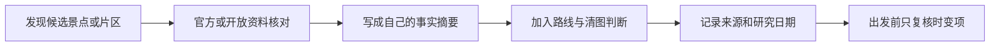

# 来源与引用策略

这套知识库的目标不是复制某一家攻略，而是把可追溯事实重新组织成适合本人的城市判断、片区关系和路线模块。默认采用“少量定向检索 + 多源核对 + 自己概括”的方式，不进行无边界抓取。

## 不同来源各自负责什么

| 来源 | 适合支持 | 不应单独承担 |
|---|---|---|
| 政府、文旅部门、遗产管理机构 | 行政归属、公共文化资源、遗产背景、正式公告 | 主观体验、真实排队强度、完整城市清单 |
| 景区、博物馆、场馆官网 | 开放、预约、票务、入口、无障碍、临时调整 | 跨景点路线和城市级取舍 |
| 公共交通运营方 | 线路、站点、机场铁路轮渡接驳及施工公告 | 景点价值和步行体验 |
| OpenStreetMap | 空间定位、道路与步行网络、发现附近对象 | 景点重要性、最新开放状态；也不直接把整批数据复制进 Markdown |
| Wikidata | 多语言名称、稳定标识、坐标和实体关系的辅助核对 | 细腻的游览体验和最新现场规则 |
| Wikipedia 等百科 | 历史背景、别名、概念梳理和继续查证的线索 | 当天开放、票价、排队、预约等时变信息 |
| 第三方攻略、媒体和点评 | 发现候选、理解常见体验与风险 | 作为唯一证据写入高风险事实，或整段改写成自己的内容 |
| 用户本人复盘 | 实际用时、路线顺畅度、摄影体验、排队教训和个人适配 | 替代官方开放规则，或把一次体验推广成普遍事实 |

## 许可证边界

- **OpenStreetMap** 数据采用 ODbL。若以后真正导入、改编或分发其数据库内容，必须保留 OpenStreetMap 及贡献者署名，并单独评估衍生数据库的同许可义务；当前城市页只把它当定位和路线核对工具，不批量复制数据。官方说明：[OpenStreetMap Copyright and License](https://www.openstreetmap.org/copyright/attribution-guide/)。
- **Wikidata** 主命名空间的结构化数据采用 CC0，可用于稳定标识、名称和坐标核对。即使法律上不强制署名，本知识库仍保留链接和研究日期以便追溯。官方说明：[Wikidata Data Access](https://www.wikidata.org/wiki/Wikidata:Data_access)。
- **Wikipedia** 正文通常采用 CC BY-SA。城市页默认只核对事实后自行概括；若将来确需复用有独创性的原文表达，必须按对应页面许可署名并处理相同方式共享要求。官方说明：[Wikimedia Foundation: Wikipedia](https://wikimediafoundation.org/what-we-do/wikimedia-projects/wikipedia/)。
- **官方网站和普通商业网站** 不因公开可访问就自动允许批量复制。只记录必要事实、链接和核验日期，不搬运长篇介绍、图片、地图或点评集合；真正调用接口或批量采集前，先检查其使用条款、robots 规则、频率限制和数据许可证。
- **图片与地图截图** 不默认进入本地知识库。需要配图时逐项确认作者、来源和具体媒体许可证，不能用页面正文的许可推断图片许可。

这些是项目维护规则，不是针对某个司法辖区的法律意见。涉及公开发布、商业使用或大规模衍生数据集时，要重新做专门的许可证审查。

## 每座城市怎样留下证据

城市页文末至少保留以下三类信息：

1. 来源名称和可点击链接；
2. 该来源支持什么，例如“馆舍定位”“遗产范围”“交通接驳”；
3. 最后研究日期，以及哪些内容仍需出发前复核。

如果两个可靠来源冲突，不静默挑一个：正文采用更权威、更新且更直接的来源，并在“出发前复核”中保留冲突事项。用户真实体验与官方规则冲突时，两者分别标注为“个人体验”和“当前规定”。

## 批量扩展前的默认选择

当前采用 **每批 10–20 座城市的定向研究**：每座城市查核心官方资料和必要的开放资料，写完正文并通过结构、内链和来源检查后再进入全球索引。

只有出现以下需求时，才考虑接口或批量数据导入：需要为数百座城市统一补坐标、多语言名称或行政归属；已有明确许可证；能保留来源版本和获取时间；并且用户已经看过预计请求量、文件规模、更新负担和许可影响。否则不进行全站抓取，也不把“搜到多少条”当作景点覆盖率。
