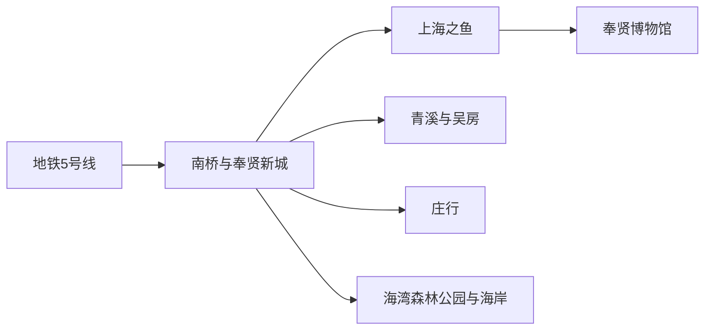
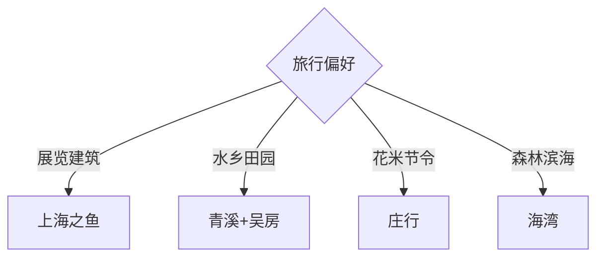

# 奉贤旅行指南

奉贤适合从上海中心城区安排一日或周末微度假。上海之鱼与奉贤博物馆构成城市文化主线，青溪、吴房与庄行展示水乡田园，海湾森林公园和碧海金沙则需要单独留出南部滨海时段。

## 城市速览

| 项目 | 信息 |
|---|---|
| 主线 | 南桥—上海之鱼—青溪—庄行—海湾森林公园—碧海金沙 |
| 停留 | 单一区域1天；城市文化加滨海共2天 |
| 住宿 | 南桥交通餐饮完整；上海之鱼适合场馆；海湾适合清晨与晚间活动 |
| 交通 | 地铁5号线到奉贤新城，远端乡村和海湾再换公交或合规车辆 |
| 风险 | 滨海潮汐、雷雨大风、高温暴晒、季节活动和郊区末班车 |
| 边界 | 海塘、滩涂、湿地、林地与农业生产区按开放入口和运营时段进入 |

## 城市格局与游览区域

固定 **Nanqiao / GeoNames 1799823** 是奉贤区南桥一带的人口点，本页用奉贤区实体 `Q662694` 承接完整区级旅行范围。南桥与上海之鱼适合轨道交通，青溪、庄行和海湾彼此分散；一天只选一个远端方向，体验更完整。

## 主要景点

| 景点 | 区域 | 类型 | 核心体验 | 用时 | 环境 | 体力 | 研究价值 | 拥挤 | 优先级 |
|---|---|---|---|---:|---|---|---|---|---|
| 上海之鱼公共空间 | 金海街道 | 城市景观 | 金海湖、公园群与新城设计 | 2–4小时 | 室外 | 低中 | 高 | 周末高 | A |
| 奉贤博物馆 | 上海之鱼 | 综合博物馆 | 地方史与高质量专题展览 | 2–4小时 | 室内 | 低 | 很高 | 特展高 | A |
| 九棵树未来艺术中心 | 新城 | 艺术场馆 | 建筑、演出与森林剧场 | 2–4小时 | 混合 | 低 | 高 | 演出时高 | A |
| 青溪老街 | 青村镇 | 水乡街区 | 河港、桥弄与社区商业 | 2–4小时 | 室外 | 低中 | 高 | 节假日高 | B |
| 吴房村 | 青村镇 | 乡村旅游 | 黄桃产业、村史与田园空间 | 半日 | 混合 | 低中 | 高 | 花果季高 | B |
| 花米庄行公开点位 | 庄行镇 | 农旅与非遗 | 菜花、伏羊、稻米与陶瓷体验 | 半日至1天 | 混合 | 中 | 高 | 节庆高 | B |
| 上海海湾国家森林公园 | 海湾镇 | 森林湿地 | 湖林、梅园与季节花木 | 半日至1天 | 室外 | 中 | 高 | 花季高 | A |
| 碧海金沙正式运营区 | 海湾旅游区 | 人工沙滩 | 滨海休闲与季节水上项目 | 半日 | 室外 | 中 | 中 | 夏季很高 | B |

## 美食与餐饮

南桥与奉贤新城适合本帮菜和日常餐饮，庄行可按季节体验伏羊、菜花主题餐饮与新米，青村可选水乡小吃。活动限定菜单先确认价格、份量和供应日期；乡村采摘与农产品购买选择公开经营点，并核对称重和配送方式。

## 经典行程

### 一日城市文化线
**路线**：地铁奉贤新城—上海之鱼—奉贤博物馆—九棵树。**逻辑**：步行与短程接驳串联新城地标。**预约锚点**：博物馆、演出与特展。**休息**：湖区商业。**删除条件**：无演出时删九棵树室内参观。

### 青溪吴房线
**路线**：青溪老街—吴房村—返南桥。**逻辑**：把水乡街区与乡村产业放在同一方向。**预约锚点**：村内活动、用餐与公交返程。**休息**：老街或游客中心。**删除条件**：暴雨时只留老街短段。

### 花米庄行线
**路线**：庄行老街—华亭海塘开放段—花米庄行。**逻辑**：从水利遗产读到农业节令。**预约锚点**：节庆、展馆与采摘。**休息**：庄行镇。**删除条件**：非花果季时缩为半日。

### 海湾森林线
**路线**：海湾国家森林公园—湖林步道—季节花园。**逻辑**：完整留给大尺度公园。**预约锚点**：门票、园内交通与闭园时间。**休息**：游客中心。**删除条件**：雷雨、大风或高温预警时缩短。

### 滨海半日线
**路线**：渔人码头公共区域—碧海金沙正式入口—海岸日落。**逻辑**：按潮汐和运营时段安排海边。**预约锚点**：景区开放、潮汐与返程。**休息**：海湾商业区。**删除条件**：台风、大风或水质管控时取消涉水项目。

### 亲子科普线
**路线**：奉贤博物馆—上海之鱼公园—都市菜园或正规农场。**逻辑**：室内知识与户外观察交替。**预约锚点**：场馆、体验课与年龄要求。**休息**：上海之鱼。**删除条件**：农业项目未开放时留新城。

### 低体力线
**路线**：地铁—车辆环上海之鱼—奉贤博物馆—湖边短步行。**逻辑**：把活动压缩在新城核心。**预约锚点**：无障碍、落客点与馆内服务。**休息**：博物馆。**删除条件**：高温或暴雨时只留室内。

## 住宿区域

南桥适合餐饮、地铁和跨区公交；上海之鱼周边适合博物馆、演出与湖区；海湾住宿适合森林、公园与滨海早晚时段。订房时确认离最近轨道站的实际接驳、夜间餐饮、郊区网约车供应和末班公交。

## 市内交通

地铁5号线是从中心城区进入奉贤新城的主轴。青溪、庄行、海湾与各乡村点位需要换乘公交，线路跨度大时可用合规车辆；把上海行政区内距离视作郊区跨城距离来规划，并为返程预留末班车余量。

## 不同旅行者须知

展览与建筑兴趣者选上海之鱼；亲子家庭选博物馆、森林公园和预约农场；摄影者按花季、日落与潮汐选择；长者以新城核心或单一乡镇为主；骑行者优先公开绿道。海塘防护设施、非开放滩涂、湿地保育区、林地防火区和农业生产区保留明确边界。

## 行前核对

- 核对博物馆、演出、森林公园、碧海金沙和乡村体验的开放、预约与季节条件。
- 核对地铁与郊区公交末班、潮汐、台风、大风、高温和雨天替代方案。
- 采摘、涉水和露营只选正规运营区域，海塘与滩涂按现场管理进入。

## 来源与更新记录

| 来源 | 支持内容 | 核验日期 |
|---|---|---|
| [奉贤区政府：旅游服务](https://www.fengxian.gov.cn/lyfw/index.html) | 上海之鱼、场馆、青溪、吴房、庄行、森林公园与滨海景点 | 2026-09-01 |
| [上海市政府：奉贤全域线路](https://www.shanghai.gov.cn/nw17239/20250930/75a22caae3e34ea881fef2cb9e7e2d1b.html) | 各街镇线路与区域组合 | 2026-09-01 |
| [上海市政府：奉贤区概况](https://www.shanghai.gov.cn/fengxian/index.html) | 奉贤区身份、文脉与区域格局 | 2026-09-01 |
| [GeoNames 1799823](https://www.geonames.org/1799823/) | Nanqiao 固定人口点及坐标 | 2026-09-01 |
| [Wikidata Q662694](https://www.wikidata.org/wiki/Q662694) | 奉贤区实体与跨库标识 | 2026-09-01 |

| 日期 | 更新 |
|---|---|
| 2026-09-01 | 首次完成奉贤旅行研究，按新城、水乡田园、森林和滨海组织。 |
