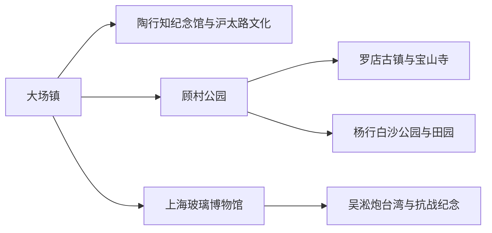
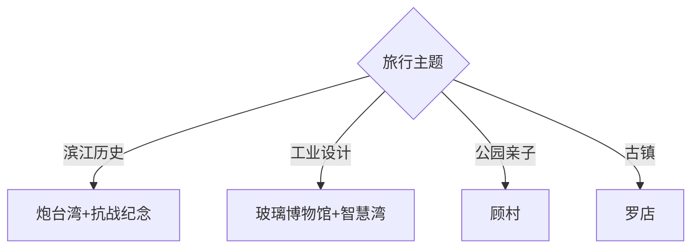

# 宝山旅行指南

宝山从大场—顾村的城市公园与博物馆，延伸到杨行田园、吴淞口滨江、工业遗产和罗店古镇。首次到访可用一天走吴淞炮台湾—淞沪抗战纪念公园，另一天在顾村、杨行、玻璃博物馆、大场或罗店中选择同方向组合；上海中心城区只是交通来源，不是宝山行程的一部分。

## 城市速览

| 项目 | 信息 |
|---|---|
| 主线 | 大场文化—顾村公园—杨行田园—上海玻璃博物馆—吴淞口滨江—罗店古镇 |
| 停留 | 2天完成滨江与南中部；罗店或北部乡村另留1天 |
| 住宿 | 大场靠近中心城区；顾村适合公园；友谊路—吴淞适合滨江；罗店适合北部慢游 |
| 交通 | 上海轨道交通连接大场、顾村、吴淞与罗店外围，末段用公交或短途车辆 |
| 风险 | 台风暴雨、高温、大型花展客流、滨江大风与工业交通 |
| 边界 | 港区、码头、钢铁与仓储生产区、军事海事设施、湿地核心和大场机场周边按管制范围通行 |

## 城市格局与游览区域

固定 **Dachang / GeoNames 1814544** 对应宝山区西南部大场镇。本页以它定位南部城市入口，并以宝山区实体 `Q661828`、代码 `310113` 覆盖全区。固定 `Yanghang / GeoNames 1787592` 对应杨行镇，适合用白沙公园、应季采摘和公共文化承接；固定 `Yuepu / GeoNames 1785916` 对应月浦镇，适合用顾泾河、沪北乡野花漫公园和公开花卉农旅点承接；固定 `Gaojing / GeoNames 7843633` 与 `Songnan / GeoNames 1793999` 分别对应高境镇和淞南镇，可用南泗塘滨水社区游线、淞南博物馆群与工业更新承接。这些镇级记录都由本页统一提供区域、景点、路线、住宿与交通选择。大场与上海中心城区连续建成，但吴淞口、顾村、杨行、月浦、高境、淞南、罗店和北部乡村分别需要轨道加末段接驳。邮轮港、工业岸线和公共滨江相邻，入口和功能必须逐一识别。

## 主要景点

| 景点 | 区域 | 类型 | 核心体验 | 用时 | 环境 | 体力 | 研究价值 | 拥挤 | 优先级 |
|---|---|---|---|---:|---|---|---|---|---|
| 吴淞炮台湾国家湿地公园 | 友谊路滨江 | 河口湿地 | 长江黄浦江交汇、河口生态与滨江步道 | 3–5小时 | 混合 | 中高 | 很高 | 周末高 | A |
| 上海淞沪抗战纪念公园与纪念馆 | 友谊路 | 纪念场馆 | 淞沪抗战史、纪念空间与城市防御 | 2–3小时 | 混合 | 低至中 | 很高 | 中 | A |
| 上海玻璃博物馆 | 长江西路 | 工业文博 | 玻璃材料、工业遗产与设计展陈 | 3–5小时 | 室内 | 中 | 很高 | 周末高 | A |
| 淞南博物馆群—美院公园公开点 | 淞南镇 | 工业文博与公园 | 玻璃、工业设计、陶瓷艺术及南泗塘湾更新 | 半日至1天 | 混合 | 中 | 高 | 活动时高 | B |
| 高境“8+2”社区游线公开点 | 高境镇 | 社区文化 | 高境二村、南泗塘滨水、新境地公园与文化空间 | 半日 | 混合 | 低中 | 中 | 活动时中 | C |
| 顾村公园 | 顾村镇 | 城市森林公园 | 大尺度绿地、季节花景与亲子活动 | 半日至1天 | 室外 | 中高 | 高 | 花期很高 | A |
| 白沙公园—杨行田园公开点 | 杨行镇 | 公园与农旅 | 滨水湿地、公共文化、应季采摘与花卉 | 半日 | 室外为主 | 低中 | 高 | 季节很高 | B |
| 沪北乡野花漫公园—月浦顽酷乡村公开点 | 月浦镇 | 乡村农旅 | 顾泾河、花卉、体育、亲子与三村联动 | 半日 | 室外为主 | 低中 | 高 | 季节高 | B |
| 陶行知纪念馆 | 大场镇 | 名人纪念 | 教育思想、山海工学团与大场文化 | 1.5–2.5小时 | 室内 | 低 | 高 | 中 | B |
| 上海木文化博物馆或沪太路公开文博 | 大场镇 | 专题博物馆 | 木作、工艺和南部文旅转型 | 2–3小时 | 室内 | 低 | 中 | 中 | B |
| 罗店古镇—宝山寺公共游线 | 罗店镇 | 古镇古建 | 江南街巷、龙船文化与寺院空间 | 半日至1天 | 混合 | 中 | 高 | 节庆高 | B |
| 美兰湖公共岸线 | 罗店新镇 | 城市湖区 | 新城湖景、步行与北部换乘 | 1.5–3小时 | 室外 | 低至中 | 中 | 中 | C |
| 智慧湾或工业设计公开展陈 | 蕰藻浜沿线 | 工业更新 | 工业建筑更新、设计与当期展览 | 2–4小时 | 混合 | 中 | 高 | 活动时高 | B |

## 美食与餐饮

大场、顾村和吴淞生活区适合本帮面点、熟食、江南家常菜与多样餐饮，罗店可按活动体验地方小吃。河鲜菜先确认来源、计价和过敏；花展、赛事或邮轮抵离日可离开入口客流区再选同类门店。工业园内餐饮与公众商业区按入口标识区分。

## 经典行程

### 两日基础线
**路线**：吴淞炮台湾—抗战纪念—上海玻璃博物馆—顾村公园。**逻辑**：一天滨江历史、一天工业与公园。**预约锚点**：博物馆和花展。**休息**：友谊路或顾村商业。**删除条件**：雨天保留两座博物馆。

### 吴淞滨江线
**路线**：淞沪抗战纪念馆—炮台湾湿地—公共滨江观景。**逻辑**：把战争史与河口地理结合。**预约锚点**：场馆和公园。**休息**：游客中心。**删除条件**：大风、高水位或封控时缩短岸线。

### 工业文博线
**路线**：上海玻璃博物馆—工业设计公开展陈—智慧湾活动。**逻辑**：从制造材料看工业更新。**预约锚点**：展览、热玻璃表演和活动。**休息**：馆内。**删除条件**：园区无公开活动时只留玻璃馆。

淞南可把这条线收紧为上海玻璃博物馆—中国工业设计博物馆当期开放展陈—美院公园或南泗塘湾公共空间。以各馆展览和公园开放为预约锚点，在闭馆或施工时删除对应点，并在淞南镇区完整坐休。

### 大场教育线
**路线**：陶行知纪念馆—木文化展陈—大场公共街区。**逻辑**：以教育与工艺理解固定记录所在镇。**预约锚点**：两馆开放。**休息**：大华商圈。**删除条件**：闭馆时改顾村公园。

高境可作为南部社区替代：高境二村—南泗塘滨水步道公开段—新境地公园—社区文化空间。以“8+2”游线当期开放和活动为预约锚点，在施工、暴雨或活动停办时删滨水段，回轨道站周边商业休息。

### 顾村花木线
**路线**：顾村公园正式入口—当季开放区域—民间艺术展陈。**逻辑**：把大型公园完整成日。**预约锚点**：花展票务和入园时段。**休息**：园内服务点。**删除条件**：极端高温、雷雨或超大客流时改期。

杨行可作为这条线的季节替代：白沙公园—正规采摘园或花卉基地—杨行镇区。以实时果蔬花期和经营接待为预约锚点，农忙、暴雨或活动停办时整段删除。

月浦可作为另一条完整替代：沪北乡野花漫公园公开入口—月狮或沈家桥当期开放项目—月浦镇区。三村联动把顾泾河、花卉、体育和亲子活动串在同一方向；以村庄项目公告、花期和经营接待为预约锚点，在农忙、河岸封闭、暴雨或活动停办时删除乡村段，回到镇区公共空间休息。

### 罗店古镇线
**路线**：罗店公共古街—宝山寺开放区—美兰湖。**逻辑**：从旧镇到新城观察北部空间。**预约锚点**：寺院、节庆与返程。**休息**：罗店镇。**删除条件**：龙船节管制时按观众路线调整。

### 低体力线
**路线**：车辆到玻璃博物馆—抗战纪念馆—炮台湾近入口短段。**逻辑**：以室内、电梯和短接驳控制负担。**预约锚点**：无障碍与落客。**休息**：每站场馆。**删除条件**：滨江大风时只留两馆。

## 住宿区域

大场—大华适合接近中心城区、南部文博和夜间餐饮；高境适合南部社区游线与中心城区联程；淞南适合玻璃、工业设计等博物馆主题；顾村适合花展和亲子；杨行适合田园活动、宝山站方向或北中部联程；月浦适合乡村花艺活动和次日早出，优先选择可核验资质与交通的常规住宿；友谊路—吴淞适合滨江、纪念场馆与邮轮前后夜；罗店—美兰湖适合北部古镇。订房时核对轨道站、末班、邮轮港实际入口、花展价格和跨片区时间。

## 市内交通

轨道交通1、3、7、15号线等可接近宝山不同片区，但多数景点仍有公交或步行末段。高境和淞南先按目标轨道站分别进入，前者用公交或步行衔接社区点，后者围绕长江西路与淞南镇内馆群移动；杨行可由1号线、3号线周边公交进入；月浦先用轨道或骨干公交到邻近换乘点，再按当日公交、村庄接驳或合规车辆完成末段，宝山站及新线路以实际启用公告为准。各镇之间适合按片区顺向组合；邮轮港按船票指定入口，工业区和滨江道路按交通管制通行。大型花展、演出和邮轮靠离会改变客流。

## 不同旅行者须知

历史兴趣者优先吴淞与抗战纪念；亲子家庭选择顾村和玻璃馆；工业设计兴趣者选玻璃馆与公开园区；教育主题旅行者从大场开始；长者以两馆加滨江短段为主。港区、码头、钢铁仓储、机场周边、湿地核心和军警设施保留明确限制。

## 行前核对

- 核对炮台湾、抗战纪念馆、玻璃博物馆、顾村公园、陶行知纪念馆与罗店活动。
- 核对轨道施工、公交末班、邮轮靠离、花展预约、台风暴雨和滨江大风。
- 工业园区只进入公开展厅、活动场地和指定步道，摄影与航拍遵循现场规定。

## 来源与更新记录

| 来源 | 支持内容 | 核验日期 |
|---|---|---|
| [宝山区文旅“十四五”规划](https://xxgk.shbsq.gov.cn/BigFileUpLoadStorage/temp/2023-08-23/4105418a-129c-4cfd-85f0-ece55e3f1e5c/%E5%AE%9D%E5%B1%B1%E5%8C%BA%E4%BF%83%E8%BF%9B%E6%96%87%E6%97%85%E6%B7%B1%E5%BA%A6%E8%9E%8D%E5%90%88%E5%8F%91%E5%B1%95%E2%80%9C%E5%8D%81%E5%9B%9B%E4%BA%94%E2%80%9D%E5%8F%91%E5%B1%95%E8%A7%84%E5%88%92.pdf) | 文博场馆、滨江、顾村、罗店与工业更新格局 | 2026-09-01 |
| [宝山区政府：吴淞口旅游休闲区](https://xxgk.shbsq.gov.cn/article.html?infoid=2c38067f-bbc6-4063-83c8-74036bd7d392) | 炮台湾、抗战纪念与滨江组成 | 2026-09-01 |
| [宝山区政府：大场镇信息公开](https://xxgk.shbsq.gov.cn/department.html?infoid=7afeaca7-7303-4ba7-aba5-f4e77311163a) | 固定记录所在镇、现行范围与位置 | 2026-09-01 |
| [宝山区大场镇发展规划](https://xxgk.shbsq.gov.cn/ztzl/decision/decision_detail.html?infoid=9ccee6fd-8e92-4178-973a-2a87de962381) | 陶行知、木文化与沪太路文旅线路 | 2026-09-01 |
| [宝山区农文旅线路答复](https://xxgk.shbsq.gov.cn/article.html?infoid=c2e54c53-cfa6-4879-a412-818b0737f078) | 杨行田园生态圈、白沙公园，以及月浦顾泾河、沪北乡野花漫公园和三村联动路线 | 2026-09-01 |
| [高境镇政府工作报告](https://xxgk.shbsq.gov.cn/BigFileUpLoadStorage/temp/2024-04-09/b73ec298-8d89-47c5-bb39-5f68b4698e5d/%E6%94%BF%E5%BA%9C%E5%B7%A5%E4%BD%9C%E6%8A%A5%E5%91%8A.pdf) | 高境“8+2”社区游线、南泗塘滨水与新境地公园 | 2026-09-01 |
| [淞南镇“十五五”规划](https://xxgk.shbsq.gov.cn/ztzl/decision/decision_detail.html?infoid=b129c23a-d7e2-414b-835f-f739107360be) | 淞南博物馆群、美院公园、南泗塘湾与微旅游 | 2026-09-01 |
| [GeoNames 1814544](https://www.geonames.org/1814544/) | Dachang 固定人口点 | 2026-09-01 |
| [Wikidata Q661828](https://www.wikidata.org/wiki/Q661828) | 宝山区实体与跨库标识 | 2026-09-01 |

| 日期 | 更新 |
|---|---|
| 2026-09-01 | 首次完成宝山旅行研究；为大场固定记录建立区级独立页，并分开滨江、工业、顾村与罗店路线。 |
