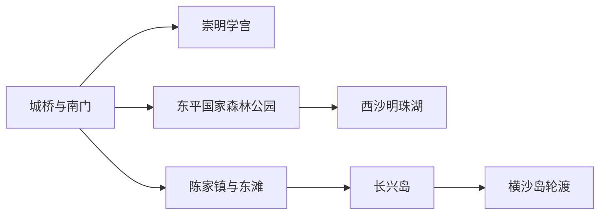
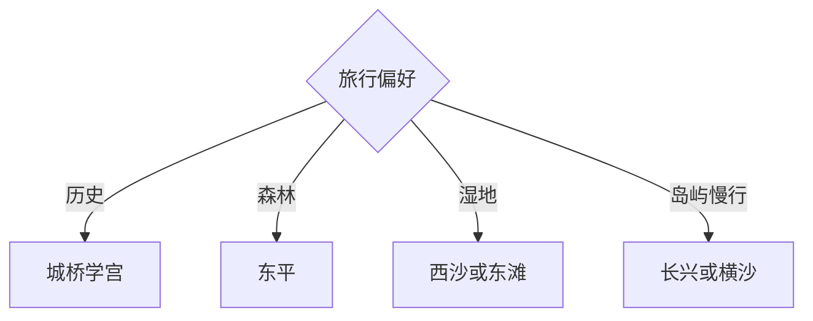

# 崇明旅行指南

崇明由崇明岛、长兴岛和横沙岛等空间组成，适合围绕森林、湿地、学宫与乡村慢行。首次到访可住城桥或陈家镇，一天只选西沙明珠湖、东平森林、东滩湿地或长兴横沙中的一个方向；轮渡、桥隧和岛内道路决定了实际旅行尺度。

## 城市速览

| 项目 | 信息 |
|---|---|
| 主线 | 城桥学宫—东平森林—西沙明珠湖—东滩湿地—长兴与横沙 |
| 停留 | 崇明岛2–3天；长兴或横沙各另留1天 |
| 住宿 | 城桥适合历史与西中部；陈家镇适合东滩和进出岛；景区周边适合慢游 |
| 交通 | 长江隧桥、公路公交与轮渡共同连接，岛内远线预留大段车程 |
| 风险 | 台风、大风、暴雨、浓雾、轮渡停航、江堤水情与虫晒 |
| 边界 | 自然保护地、鸟类栖息地、江堤管制段、农田鱼塘、船厂港区和水利设施按公告进入 |

## 城市格局与游览区域

固定 **Chongming / GeoNames 13608003** 对应崇明岛城市点，本页以现行崇明区实体 `Q788812` 与代码 `310151` 覆盖区级旅行范围。固定清单中的 **Chengqiao / GeoNames 1814915** 对应城桥镇，是崇明区政府驻地和岛西南住宿、餐饮、公共文化底盘；崇明学宫、区博物馆、瀛洲公园与南门公共滨江已经构成完整城桥人文线，因此并入本页。东平森林在岛中北部，西沙明珠湖在西端，东滩在东端；长兴岛通过道路连接上海市区与崇明岛，横沙岛主要依赖轮渡。上海中心城区的景点由上海页承接。

## 主要景点

| 景点 | 区域 | 类型 | 核心体验 | 用时 | 环境 | 体力 | 研究价值 | 拥挤 | 优先级 |
|---|---|---|---|---:|---|---|---|---|---|
| 崇明学宫与崇明区博物馆 | 城桥镇 | 古建文博 | 孔庙建筑、岛史与民俗展陈 | 2–3小时 | 混合 | 低 | 很高 | 中 | A |
| 东平国家森林公园 | 岛中北部 | 森林公园 | 森林花卉、骑行与公共游憩 | 半日至1天 | 室外 | 中高 | 高 | 旺季高 | A |
| 西沙明珠湖景区 | 西部 | 湖泊湿地 | 湖景、西沙湿地与生态游览 | 1天 | 室外 | 中 | 高 | 旺季高 | A |
| 东滩湿地公园 | 东部 | 湿地公园 | 河口湿地、观鸟与生态教育 | 半日至1天 | 室外 | 中 | 很高 | 季节高 | A |
| 城桥—南门公共滨江与瀛洲公园 | 城桥镇 | 城市公园 | 县城生活、江岸与历史轴线 | 2–4小时 | 室外 | 低至中 | 中 | 中 | B |
| 江南三民文化村 | 林风公路 | 民俗展示 | 崇明民俗、收藏与乡村文化 | 2–4小时 | 混合 | 中 | 中 | 中 | B |
| 长兴岛郊野公园 | 长兴岛 | 郊野公园 | 果园、乡野和岛屿公共空间 | 半日至1天 | 室外 | 中 | 中 | 节假日高 | B |
| 横沙岛公开乡村与骑行路线 | 横沙乡 | 岛屿乡村 | 轮渡、田园与慢行体验 | 1天 | 室外 | 中高 | 中 | 中 | C |

## 美食与餐饮

崇明糕、金瓜丝、白山羊、清水蟹和时令蔬菜体现岛屿农产，城桥、陈家镇和正规农家乐更易确认价格与来源。蟹类和河鲜关注过敏、计价与季节；白山羊等共享菜先问份量。生态农场和采摘园选择公开接待项目，农田与养殖塘按生产边界活动。

## 经典行程

### 两日基础线
**路线**：城桥学宫—东平森林—西沙明珠湖或东滩。**逻辑**：先人文，再选一处生态大景区。**预约锚点**：景区与住宿。**休息**：城桥或景区服务区。**删除条件**：风雨时保留学宫与民俗馆。

### 城桥人文线
**路线**：崇明学宫—博物馆—瀛洲公园—南门公共滨江。**逻辑**：连续理解岛史与县城。**预约锚点**：场馆开放。**休息**：城桥餐饮。**删除条件**：高水位或大风时缩短江岸。

### 东平森林线
**路线**：正式入口—当日开放骑行或步行环线—花卉园区。**逻辑**：把森林公园完整成日。**预约锚点**：票务、租赁和活动。**休息**：游客中心。**删除条件**：雷雨、大风或高温时缩短户外。

### 西沙明珠湖线
**路线**：明珠湖—景区交通—西沙湿地开放区。**逻辑**：以一个运营景区完成西部生态。**预约锚点**：门票、交通和表演。**休息**：景区服务点。**删除条件**：封闭时改城桥人文。

### 东滩观鸟线
**路线**：陈家镇—东滩湿地公园—观鸟设施—返程。**逻辑**：按潮汐、季节和开放游线观察河口。**预约锚点**：票务、日出项目与交通。**休息**：游客中心。**删除条件**：台风、大雾或保护管控时取消。

### 长兴横沙线
**路线**：长兴郊野公园或横沙轮渡—公开乡村路线—原路返程。**逻辑**：两个岛屿按交通条件二选一。**预约锚点**：轮渡与返程。**休息**：镇区服务点。**删除条件**：停航时留长兴。

### 低体力线
**路线**：车辆到学宫—民俗馆—明珠湖景交短线。**逻辑**：用室内、车辆与景交控制步行。**预约锚点**：无障碍与景交。**休息**：每站服务区。**删除条件**：客流高时保留城桥。

## 住宿区域

城桥适合学宫、餐饮与西中部线路；陈家镇适合东滩、长江隧桥与早晚进出岛；东平或明珠湖周边正规住宿适合生态慢游；长兴、横沙住宿适合岛内体验。订房时核对具体岛屿、桥隧或轮渡路径、餐饮时段、防潮与虫害处理。

## 市内交通

上海市区进入崇明依靠长江隧桥公交、自驾与部分轮渡，岛内点位相距远。城桥、东平、西沙和东滩之间按公路时间选择，长兴与横沙则先确认是否需要轮渡。节假日桥隧拥堵、大风浓雾、台风和水情会改变班次与通行。

## 不同旅行者须知

观鸟者优先东滩并遵守安静、距离与光线规范；亲子家庭选择森林公园、学宫和生态教育；骑行者按公开道路、补给和返程设计；长者选择城桥与景交完善的大景区。保护区核心、潮滩、江堤作业段、芦苇地、船厂港区和水利设施保持明确限制。

## 行前核对

- 核对崇明学宫、东平、西沙明珠湖、东滩、长兴郊野公园的开放、票务与景交。
- 核对桥隧拥堵、轮渡、公交末班、台风大风、浓雾、水情与观鸟季管理。
- 湿地与江岸只进入正式游线和观景设施，使用长焦与望远镜保持生态距离。

## 来源与更新记录

| 来源 | 支持内容 | 核验日期 |
|---|---|---|
| [崇明区政府：A级旅游景区名单](https://www.shcm.gov.cn/bmpd/019008/019008002/20251212/eea64452-67d6-42ce-9b68-465e2ad4d68e.html) | 西沙明珠湖、东平、东滩、长兴与民俗景区 | 2026-09-01 |
| [崇明区文化旅游规划](https://www.shcm.gov.cn/govxxgk/qzfbgs/2022-01-13/b03b7885-6304-4513-bc3e-92fdf284ab84.html) | 五区三带一环、学宫和三岛旅行格局 | 2026-09-01 |
| [崇明区政府：春秋游线路](https://www.shcm.gov.cn/xwzx/002009/20260430/52249166-3188-4f99-b088-5a8ff63f520d.html) | 明珠湖、东平与崇明学宫组合 | 2026-09-01 |
| [崇明区政府：城桥瀛洲公园](https://www.shcm.gov.cn/zjcm/006008/20230425/5dab5433-9405-46aa-be06-7d4621c90200.html) | 城桥镇、崇明学宫、瀛洲公园与南门江堤的空间关系 | 2026-09-04 |
| [崇明区旅游地图](https://www.shcm.gov.cn/shcm/f69f80a9-1dbf-4f45-a037-4c004d6338af/8e95a877-1868-4f0d-8ee3-0045c1623994/20240321152201090522.pdf) | 岛内景点和交通空间 | 2026-09-01 |
| [GeoNames 13608003](https://www.geonames.org/13608003/) | Chongming 固定人口点 | 2026-09-01 |
| [GeoNames 1814915](https://www.geonames.org/1814915/) | Chengqiao 固定人口点及其区内合并关系 | 2026-09-04 |
| [Wikidata Q788812](https://www.wikidata.org/wiki/Q788812) | 崇明区实体与跨库标识 | 2026-09-01 |

| 日期 | 更新 |
|---|---|
| 2026-09-01 | 首次完成崇明旅行研究；按崇明岛、长兴岛、横沙岛及湿地保护边界组织。 |
| 2026-09-04 | 固定 Chengqiao 人口点并入崇明页，以现有城桥人文线、住宿和岛内交通承接。 |
