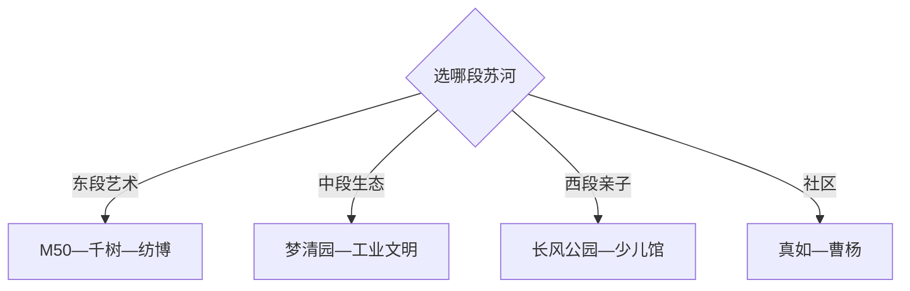

# 普陀旅行指南

上海普陀最适合沿苏州河选择片段：莫干山路与M50看工业遗产和艺术，长风看公园与亲子场馆，真如看古镇肌理，曹杨与长寿路则连接社区生活和商圈。一天选河东或河西，完整两天再把水岸、工业与社区拼起来。

## 城市速览

| 项目 | 信息 |
|---|---|
| 主线 | 莫干山路—M50—天安千树—长风公园—真如—曹杨 |
| 停留 | 1天选一段苏河；2天覆盖水岸、工业与社区 |
| 住宿 | 长寿路交通便利，长风与真如适合较安静住宿 |
| 交通 | 上海轨道交通、公交和苏州河游船组合，水岸以分段步行为主 |
| 风险 | 高温台风、滨水长距离、展馆闭馆、赛事与临时管制 |
| 边界 | 普陀区与长征镇为两级实体；河道、码头、在建区和工业遗存按开放边界进入 |

## 城市格局与游览区域

固定 `Changzheng / GeoNames 7843638` 位于普陀区长征镇，本页以法定上海市普陀区 `Q660952` 承接，因为旅行者需要区级水岸、住宿和轨道交通结构。长征是区内一片，不等同整个普陀；页内明确保留真如、长风、长寿路等区域关系。

## 主要景点

| 景点 | 区域 | 类型 | 核心体验 | 用时 | 环境 | 体力 | 预约风险 | 天气影响 | 优先级 |
|---|---|---|---|---:|---|---|---|---|---|
| M50创意园 | 莫干山路 | 工业遗产与艺术 | 老厂房、画廊与当代艺术 | 2–4小时 | 混合 | 中 | 中 | 中 | A |
| 天安千树与苏河水岸 | 莫干山路 | 建筑与商业 | 立体建筑、商业与水岸关系 | 1–3小时 | 混合 | 低中 | 低 | 中 | A |
| 上海纺织博物馆 | 苏州河东段 | 行业博物馆 | 上海纺织工业与厂区历史 | 1.5–3小时 | 室内 | 低 | 中 | 低 | A |
| 梦清园与苏州河工业文明展示馆 | 宜昌路 | 生态与工业 | 水环境治理、工业遗产与滨河公园 | 2–4小时 | 混合 | 低中 | 中 | 中 | A |
| 长风公园 | 长风 | 城市公园 | 湖面、绿地与亲子休闲 | 2–5小时 | 室外 | 低中 | 低 | 高 | A |
| 上海少年儿童图书馆长风馆 | 长风 | 公共文化 | 儿童阅读与主题活动 | 1.5–3小时 | 室内 | 低 | 高 | 低 | B |
| 真如寺与真如历史片区 | 真如 | 宗教与街区 | 寺院、老镇地名与社区肌理 | 2–4小时 | 混合 | 低中 | 中 | 中 | B |
| 曹杨新村历史文化街区 | 曹杨 | 社区与建筑 | 工人新村规划与社区生活 | 2–4小时 | 室外为主 | 中 | 中 | 高 | B |

## 美食与餐饮

长寿路、环球港、长风和真如商圈选择密集，可按本帮菜、面点、小吃、咖啡与多国餐饮选择。水岸长走时把午餐放在商圈而非临时寻找；宗教场所周边饮食和社区菜场按营业时段安排。

## 经典行程

### 一日经典线
**路线**：M50—天安千树—午餐—梦清园。**逻辑**：沿苏州河从艺术厂房走向生态治理。**预约锚点**：当期展览和工业文明展示馆。**休息**：天安千树。**删除条件**：高温时缩短水岸段。

### 两日水岸线
**路线**：首日莫干山路与梦清园；次日长风公园与少儿图书馆。**逻辑**：东段工业艺术和西段亲子公园分日。**预约锚点**：图书馆活动、游船。**休息**：长风商圈。**删除条件**：游船停航时改岸上慢行。

### 工业遗产线
**路线**：上海纺织博物馆—M50—苏州河工业文明展示馆。**逻辑**：从行业史到再利用和水环境。**预约锚点**：三处开馆。**休息**：莫干山路。**删除条件**：闭馆时保留M50公共区域。

### 长风亲子线
**路线**：长风公园—午休—少年儿童图书馆—长风商圈。**逻辑**：户外与阅读交替。**预约锚点**：图书馆与当期活动。**休息**：公园或商场。**删除条件**：恶劣天气时保留室内场馆。

### 真如社区线
**路线**：真如寺—真如历史片区—曹杨新村。**逻辑**：从老镇到现代工人新村。**预约锚点**：寺院与社区展陈。**休息**：真如商圈。**删除条件**：时间不足时保留曹杨或真如其一。

### 雨天线
**路线**：纺织博物馆—环球港—少年儿童图书馆。**逻辑**：依轨道与室内空间移动。**预约锚点**：两馆。**休息**：环球港。**删除条件**：强对流时就近单馆。

### 低体力线
**路线**：车辆到梦清园短段—天安千树—M50核心院落。**逻辑**：缩短滨水长走并增加室内休息。**预约锚点**：无障碍入口与落客。**休息**：商业体。**删除条件**：高温时只留室内与短段院落。

## 住宿区域

长寿路适合中心城区联程和夜间餐饮；长风适合亲子、苏河西段和较安静环境；真如连接轨道与西北方向；长征镇适合商务或就近活动。用最近轨道站和实际步行距离筛选，苏州河两岸过河点会影响路线。

## 市内交通

普陀由多条上海轨道交通和公交覆盖，跨片区优先轨道，水岸内部用步行或骑行。苏州河游船按码头、班次、水位和天气核对；大型活动会临时调整道路。长征镇是区内片区，前往莫干山路仍需跨区内移动。

## 不同旅行者须知

艺术兴趣者选M50；工业史兴趣者串三馆；亲子选长风公园与少儿馆；低体力者用轨道和商业体分段休息。河道岸线、码头作业区、施工围挡、社区住宅与宗教活动空间保留明确边界。

## 行前核对

- 核对各博物馆、图书馆、M50展览、真如寺和苏州河游船开放。
- 核对轨道施工、游船班次、台风高温、赛事与滨水临时管制。
- 社区参观保持安静，工业遗存和码头依公开入口进入，骑行遵守岸线分流规则。

## 来源与更新记录

| 来源 | 支持内容 | 核验日期 |
|---|---|---|
| [普陀区三条文旅路线](https://www.shpt.gov.cn/wlj-zfbm/xwdt-wlj/20230522/898980.html) | 长风、纺织博物馆、梦清园、M50与工业文明展示馆 | 2026-09-01 |
| [半马苏河沿线介绍](https://www.shanghai.gov.cn/nw17239/20250321/4f9da8b4be7e4951a49121014b42c6c3.html) | M50、天安千树、环球港与苏河关系 | 2026-09-01 |
| [普陀区文旅建设答复](https://www.shpt.gov.cn/zhengwu/qrddbjybljg-jytabljg/2026/184/204444.html) | 长风、少儿图书馆、半马苏河与工业展示 | 2026-09-01 |
| [GeoNames 7843638](https://www.geonames.org/7843638/) | Changzheng 固定镇级点 | 2026-09-01 |
| [Wikidata Q660952](https://www.wikidata.org/wiki/Q660952) | 上海市普陀区实体与跨库标识 | 2026-09-01 |

| 日期 | 更新 |
|---|---|
| 2026-09-01 | 首次完成上海普陀旅行研究，以区级结构承接长征镇记录。 |
