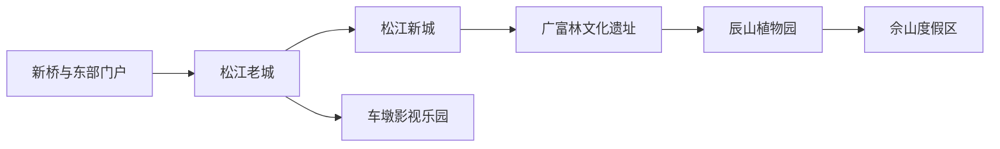
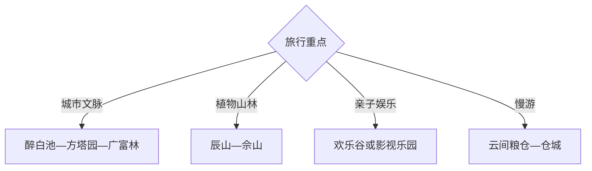

# 松江旅行指南

松江把上海之根、江南园林、佘山丘陵与大型主题乐园放在同一区域里。首访可用两天分别走老城—广富林文化线和辰山—佘山自然线；欢乐谷、影视乐园等高耗时项目适合单独成日。

## 城市速览

| 项目 | 信息 |
|---|---|
| 主线 | 松江老城—广富林—辰山植物园—佘山 |
| 停留 | 人文与自然2天；主题乐园或影视主题另加1天 |
| 住宿 | 松江新城便于换线，佘山适合度假，老城适合园林与地方生活 |
| 交通 | 轨道交通接入后换公交、出租车或景区接驳 |
| 风险 | 高温雷雨、山林防火、节假日客流与大型项目排队 |
| 边界 | 遗址保护区、宗教空间、影视拍摄区和林地按开放范围进入 |

## 城市格局与游览区域

固定 `Xinqiao / GeoNames 1788669` 是松江东部的新桥镇城市点，本页以法定松江区 `Q662380` 组织完整旅行范围。老城、新城、广富林、辰山与佘山自东向西展开；车墩在南部，适合另组主题线。

## 主要景点

| 景点 | 区域 | 类型 | 核心体验 | 用时 | 环境 | 体力 | 预约风险 | 天气影响 | 优先级 |
|---|---|---|---|---:|---|---|---|---|---|
| 广富林文化遗址 | 广富林街道 | 考古与城市史 | 遗址展示、上海地域文化与水乡景观 | 4–6小时 | 室内外 | 中 | 很高 | 中 | A |
| 上海辰山植物园 | 辰花路 | 植物园 | 温室、矿坑花园与季节植物 | 4–7小时 | 室内外 | 中 | 很高 | 高 | A |
| 佘山国家森林公园开放区 | 佘山镇 | 山林与人文 | 上海丘陵、林地和山顶历史建筑 | 3–6小时 | 室外为主 | 中高 | 高 | 极高 | A |
| 上海醉白池公园 | 松江老城 | 江南园林 | 古典园林、碑刻与松江文脉 | 1.5–3小时 | 室内外 | 低中 | 中 | 中 | A |
| 上海方塔园 | 松江老城 | 古建园林 | 方塔、照壁与现代园林设计 | 2–4小时 | 室内外 | 低中 | 中 | 中 | A |
| 上海欢乐谷 | 佘山度假区 | 主题乐园 | 大型游乐设施与演艺 | 1天 | 室内外 | 中高 | 极高 | 极高 | B |
| 上海影视乐园 | 车墩镇 | 影视场景 | 近代城市布景、影视工业与演出 | 半日至1天 | 室内外 | 中 | 很高 | 高 | B |
| 云间粮仓及仓城公开街区 | 老城西部 | 工业与水乡遗产 | 粮仓更新、运河街巷与公共文化 | 2–4小时 | 室内外 | 低 | 中 | 中 | B |

## 美食与餐饮

松江可找仓桥水晶梨、佘山兰笋、叶榭软糕、泗泾小笼和本帮菜。老城适合传统点心，新城与大学城选择更密集；郊野日提前确认餐饮营业，购买季节农产品按正规摊点和清晰计价选择。

## 经典行程

### 一日经典线
**路线**：醉白池—方塔园—广富林文化遗址。**逻辑**：从老城园林走到考古展示，建立松江历史纵深。**预约锚点**：广富林展馆。**休息**：老城午餐或广富林游客服务区。**删除条件**：时间不足时删除方塔园与醉白池中的一处。

### 两日人文自然线
**路线**：首日老城—广富林；次日辰山植物园—佘山。**逻辑**：两条相邻主题分别成日。**预约锚点**：广富林、辰山与佘山开放。**休息**：新城或大学城。**删除条件**：恶劣天气时次日改老城室内展陈。

### 三日主题线
**路线**：前两日按经典线；第三日欢乐谷或影视乐园二选一。**逻辑**：大型运营项目保留完整时段。**预约锚点**：票务、演出与闭园时间。**休息**：园区服务点。**删除条件**：第三日优先整段删除。

### 雨天文化线
**路线**：松江博物馆—广富林室内展馆—云间粮仓室内空间。**逻辑**：用公共文化和更新空间降低淋雨。**预约锚点**：各馆开放。**休息**：新城。**删除条件**：极端天气按预警停止跨片区移动。

### 亲子植物线
**路线**：辰山植物园短线—广富林亲子展陈。**逻辑**：植物观察与城市史各保留一个重点。**预约锚点**：温室、活动年龄与推车规则。**休息**：辰山游客中心。**删除条件**：高温时保留温室与室内展陈。

### 远郊主题线
**路线**：新城—上海影视乐园—车墩镇—返程。**逻辑**：南部片区独立往返，避免与佘山折返。**预约锚点**：拍摄影响、演出与交通。**休息**：园区。**删除条件**：开放受拍摄影响时改老城文化线。

### 低体力线
**路线**：车辆到醉白池—午休—广富林主要展馆。**逻辑**：园林和平缓展馆替代山地与主题乐园。**预约锚点**：无障碍入口、落客与座椅。**休息**：老城。**删除条件**：园林石径负担较大时只留展馆。

## 住宿区域

松江新城和大学城适合轨道换线、餐饮与多日访问；老城适合园林和仓城慢游；佘山度假区适合山林与主题乐园；新桥适合虹桥或市区西南方向抵离。预订时比较到实际入口的换乘次数，而非只看直线距离。

## 市内交通

轨道交通覆盖新桥、新城、大学城和佘山方向，景点入口仍常需公交或短途车。老城景点可小范围步行；辰山、佘山、欢乐谷和影视乐园按片区分日。自驾关注景区预约停车与节假日分流。

## 不同旅行者须知

历史爱好者优先老城与广富林；植物爱好者给辰山完整半日至一天；亲子家庭在辰山和主题乐园中按年龄选择；低体力旅行者用车辆连接园林与展馆。遗址保护区、佘山林地、宗教活动区和影视拍摄区域保留明确限制。

## 行前核对

- 核对广富林、辰山、佘山、欢乐谷与影视乐园的开放、预约和演出。
- 核对轨道施工、景区接驳、高温雷雨、林火与节假日分流。
- 山林沿开放步道游览；拍摄区、宗教空间与遗址核心按现场管理进入。

## 来源与更新记录

| 来源 | 支持内容 | 核验日期 |
|---|---|---|
| [松江区旅游景区服务调研](https://www.songjiang.gov.cn/shsj_main/54a54138-5652-4522-af1b-6fb5109174a0/ad2709f9-0a0a-40d1-ad9e-8a30e981c628/%E5%AE%9A%E7%A8%BF--%E6%97%85%E6%B8%B8%E4%BC%81%E4%B8%9A%E6%BB%A1%E6%84%8F%E5%BA%A6%E8%B0%83%E7%A0%9410.18.pdf) | 广富林、辰山、佘山、园林与主题项目名录 | 2026-09-01 |
| [松江区政府：广富林文化遗址](https://www.songjiang.gov.cn/xwzx/001001/20260407/ce368f1f-cddd-4f2a-bb9c-04b7d176b979.html) | 遗址游览内容与客流管理 | 2026-09-01 |
| [GeoNames 1788669](https://www.geonames.org/1788669/) | Xinqiao 固定城市点 | 2026-09-01 |
| [Wikidata Q662380](https://www.wikidata.org/wiki/Q662380) | 松江区实体与跨库标识 | 2026-09-01 |

| 日期 | 更新 |
|---|---|
| 2026-09-01 | 首次完成松江旅行研究，按老城广富林、辰山佘山与主题乐园分线。 |
