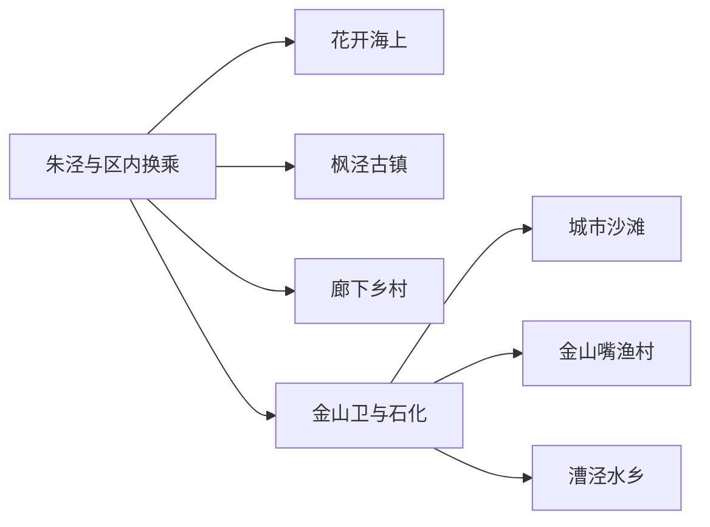
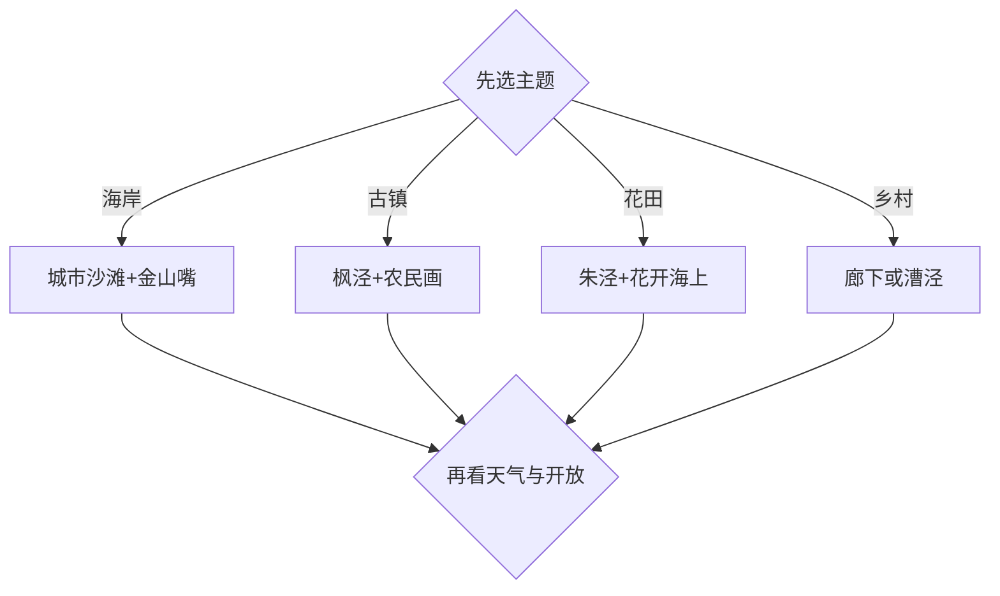

# 金山旅行指南

金山位于上海西南部，海岸、古镇和乡村分别构成三套旅行空间。第一次到访可在金山城市沙滩—金山嘴渔村与枫泾古镇之间二选一；花开海上、廊下和漕泾更适合按花期、农事活动或水乡主题单独成日。朱泾是区内公共服务与换乘节点，花开海上生态园也位于朱泾镇，但它与滨海、枫泾仍需车辆接驳。

## 城市速览

| 项目 | 信息 |
|---|---|
| 主线 | 滨海休闲、枫泾古镇、朱泾花海、廊下乡村四选二 |
| 停留 | 单一区域1天；滨海加古镇或乡村共2–3天 |
| 住宿 | 金山卫—石化便于海岸线；枫泾适合古镇慢游；朱泾便于区内换乘 |
| 交通 | 金山铁路、市域公交、跨区公交与合规车辆组合 |
| 季节 | 春秋适合花田与乡村；夏季偏向海滨；台风、暴雨和高温会改变开放 |
| 边界 | 海域保护地、渔港生产区、化工与工业岸线、农田果园分别管理 |

## 城市格局与游览区域

固定 **Zhujing / GeoNames 1783903** 对应金山区朱泾镇，本页用它承接金山区完整旅行范围。朱泾位于区内中北部，花开海上可从镇区接驳；枫泾在西北，廊下在西南乡村，城市沙滩、金山嘴渔村和石化滨海公园集中在东南海岸。各片区适合按一天一个方向组织，中心城区到达金山后仍要计算区内末段时间。

金山三岛及其周边海域具有自然保护属性，适合从获准公共岸线远观和认识海洋生态。渔港、养殖水域、航道、化工码头与工业园承担生产功能；旅行活动按正式景区、公共步道、开放村落和经营项目进入。

## 主要景点

| 景点 | 区域 | 类型 | 核心体验 | 用时 | 环境 | 体力 | 研究价值 | 拥挤 | 优先级 |
|---|---|---|---|---:|---|---|---|---|---|
| 金山城市沙滩 | 金山卫—石化海岸 | 滨海景区 | 人工沙滩、堤岸视野与季节水上活动 | 半日至1天 | 室外 | 中 | 中高 | 高 | A |
| 金山嘴渔村 | 山阳镇海岸 | 渔村与地方文化 | 渔业记忆、海鲜餐饮与滨海村落 | 3–5小时 | 混合 | 中 | 高 | 高 | A |
| 枫泾古镇 | 枫泾镇 | 江南古镇 | 河埠、桥街、地方艺术与开放馆舍 | 半日至1天 | 混合 | 中 | 很高 | 高 | A |
| 花开海上生态园 | 朱泾镇待泾村 | 花卉与乡村景区 | 分季花海、田园步道与郊野休闲 | 3–5小时 | 室外 | 中 | 中高 | 高 | A |
| 中国农民画村 | 枫泾镇方向 | 艺术乡村 | 金山农民画、乡村创作与展陈 | 2–3小时 | 混合 | 低至中 | 高 | 中 | B |
| 廊下郊野公园与生态园开放区 | 廊下镇 | 郊野与农耕 | 农田肌理、乡村步道与农事体验 | 半日至1天 | 室外 | 中 | 高 | 中 | B |
| 漕泾水窠景区 | 漕泾镇 | 水乡村落 | 河网、乡村公共空间与季节活动 | 2–4小时 | 室外 | 低至中 | 中高 | 中 | B |
| 上海南社纪念馆 | 张堰镇 | 近代史场馆 | 南社人物、地方文脉与张堰街镇 | 2–3小时 | 室内 | 低 | 高 | 低 | B |
| 石化滨海公园 | 石化街道 | 公共滨海 | 城市岸线、慢行与日落短停 | 1–2小时 | 室外 | 低 | 中 | 中 | C |
| 吕巷水果公园及开放果园 | 吕巷镇 | 农业体验 | 果树景观、采摘与乡村季节 | 2–4小时 | 室外 | 低至中 | 中 | 中 | C |

海滨项目先看当日水域开放、潮位、风浪、救生范围和项目资质；进入沙滩不等于适合下水。花田、果园和农田按经营方划定线路体验，采摘按品种、成熟度和计价确认。古镇民居、纪念馆和历史建筑按开放入口参观。

## 美食与餐饮

海鲜可在金山嘴、石化和正规餐厅按人数选择，点单时先确认品种、重量、单价、加工费与过敏原。枫泾可体验丁蹄、黄酒和江南糕点，朱泾、张堰与廊下适合寻找本地家常菜和时令农产品。驾驶者可用茶饮替代酒类；采摘所得按园方说明清洗、保存和运输。

## 经典行程

### 一日滨海线
**路线**：金山卫到达—金山城市沙滩—金山嘴渔村—石化滨海短段。**逻辑**：沿东南海岸顺向移动。**预约锚点**：沙滩、水上项目、餐厅与返程。**休息**：游客中心或渔村正规餐饮。**删除条件**：台风、雷暴、大风浪或水域关闭时改区内场馆。

### 枫泾古镇线
**路线**：枫泾古镇—开放馆舍—中国农民画村。**逻辑**：把江南街镇与地方艺术放在同一方向。**预约锚点**：馆舍、讲解和城乡接驳。**休息**：古镇正规餐饮。**删除条件**：暴雨积水或馆舍集中闭馆时缩为古镇短线。

### 朱泾花海线
**路线**：朱泾镇区—花开海上生态园—镇区用餐。**逻辑**：用固定记录所在镇承接季节花田。**预约锚点**：花期、门票、园区活动与末班。**休息**：园区服务点。**删除条件**：花期落空、暴晒或园区临时关闭时改张堰文化线。

### 廊下农耕线
**路线**：廊下郊野公园开放区—生态园—明月山塘或当期开放村落。**逻辑**：用完整一天认识上海西南乡村。**预约锚点**：农事体验、餐饮和返程车辆。**休息**：游客服务点。**删除条件**：农事项目停办或强降雨时只留室内体验。

### 漕泾水乡线
**路线**：漕泾镇—水窠景区—公共河岸短线。**逻辑**：避开跨区折返，集中观察河网乡村。**预约锚点**：活动、公交末班与开放入口。**休息**：镇区。**删除条件**：河道施工、汛情或高温时缩短户外段。

### 两日基础线
**路线**：第一天滨海；第二天枫泾，或按花期换成朱泾花海。**逻辑**：一天海岸、一天古镇或乡村，避免同日横穿金山。**预约锚点**：住宿、金山铁路、景区与跨镇交通。**休息**：每天午后固定一段室内休息。**删除条件**：只有一天时保留最符合季节的一条线。

### 低体力线
**路线**：车辆到上海南社纪念馆—张堰短街区—金山嘴或石化滨海近入口短停。**逻辑**：以场馆、落客和短步行为主。**预约锚点**：无障碍入口、座椅、卫生间和返程。**休息**：每站均安排固定座位。**删除条件**：滨海大风时保留场馆和镇区餐饮。

## 住宿区域

金山卫—石化适合城市沙滩、金山嘴和金山铁路抵离；枫泾适合古镇早晚与西向到发；朱泾适合花开海上、张堰和区内多方向换乘；廊下住宿更适合已确认接待条件的乡村项目。订房时核对完整地址、最近公交站、末班、早餐、停车、无障碍和退改，避免仅凭“金山”二字判断与海边的距离。

## 市内交通

从上海中心城区可先乘金山铁路或轨道加公交进入金山，再按目标片区换乘。金山卫站接近东南滨海，但到城市沙滩、金山嘴仍有末段；枫泾、朱泾、廊下、漕泾和吕巷之间适合按方向安排公交或合规车辆。金山铁路与普通地铁在车站、票制和班次上分别核对，返程为末班和节假日客流留出余量。

## 不同旅行者须知

亲子家庭可在城市沙滩、花开海上和农耕项目中选择一项主活动；历史兴趣者优先枫泾、农民画与南社纪念馆；长者以朱泾、张堰和海岸近入口短段组合；摄影者按潮汐、花期和公开拍摄规则选时段。海域保护地、港口码头、化工生产区、养殖水面和基本农田保留明确边界，无人机按空域、景区和现场管理执行。

## 行前核对

- 核对城市沙滩水域、救生区、水上项目、台风和潮位公告。
- 核对花开海上、枫泾馆舍、农民画村、廊下、漕泾与采摘项目的当期开放。
- 核对金山铁路、跨镇公交、末班、住宿接驳与返程余量。
- 进入海岸、村落、果园和古镇时按公开入口与运营范围活动。

## 来源与更新记录

| 来源 | 支持内容 | 核验日期 |
|---|---|---|
| [上海市人民政府：金山区](https://www.shanghai.gov.cn/jinshan/index.html) | 金山区概况、枫泾与张堰古镇、城市沙滩、金山嘴渔村、花开海上、漕泾水窠及海域保护属性 | 2026-09-04 |
| [上海市政府：金山水岸活动与区域分布](https://www.shanghai.gov.cn/nw17239/20260323/6284bdeea6bd44319e31050e042812fa.html) | 城市沙滩、石化滨海公园、漕泾、吕巷、廊下、枫泾和花开海上的分区线索 | 2026-09-04 |
| [上海市政府：枫泾古镇](https://www.shanghai.gov.cn/fygz/20260625/e6c5d4759061409197c64dd71464e984.html) | 枫泾历史街镇、建筑与开放文化内容 | 2026-09-04 |
| [上海市政府：朱枫文旅协同发展](https://www.shanghai.gov.cn/nw4411/20260519/568acbacd7f74a2a80b7f83870679c01.html?siteId=1) | 花开海上生态园位于朱泾镇待泾村及其花卉主题 | 2026-09-04 |
| [上海文旅：国家4A级旅游景区名录](https://whlyj.sh.gov.cn/4ajjq/20191008/0022-28627.html) | 金山城市沙滩的正式景区身份 | 2026-09-04 |
| [上海文旅：国家3A级旅游景区名录](https://whlyj.sh.gov.cn/3ajjq/20191008/0022-29707.html) | 中国农民画村、上海南社纪念馆等正式景区线索 | 2026-09-04 |
| [GeoNames 1783903](https://www.geonames.org/1783903/) | Zhujing 固定人口点 | 2026-09-04 |

| 日期 | 更新 |
|---|---|
| 2026-09-04 | 首次完成金山旅行研究；以朱泾固定记录建立区级指南，并拆分滨海、枫泾、花海与乡村路线。 |
