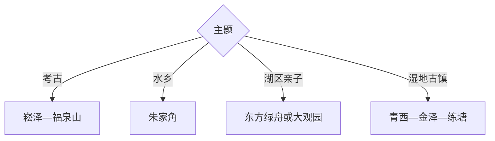

# 青浦旅行指南

青浦从虹桥会展门户向西延伸到青浦新城、朱家角、淀山湖及金泽—练塘水乡。首访用两天安排史前考古与朱家角古镇；东方绿舟、大观园、青西郊野公园、金泽和练塘各需按兴趣增加时段。

## 城市速览

| 项目 | 信息 |
|---|---|
| 主线 | 徐泾会展—崧泽遗址—青浦新城—朱家角—淀山湖—青西三镇 |
| 停留 | 考古古镇2天；湖区与青西另加1–2天 |
| 住宿 | 青浦新城便于换线，朱家角适合水乡慢游，徐泾适合会展抵离 |
| 交通 | 轨道交通17号线为骨架，西部湖区换公交、游船或预约车 |
| 风险 | 台风暴雨、河湖水情、古镇拥挤、郊野湿滑与会展客流 |
| 边界 | 湿地保育区、村落民宅、古建内部、会展作业区和跨省湖岸按开放范围进入 |

## 城市格局与游览区域

固定 `Xiayang / GeoNames 7845495` 对应青浦新城夏阳街道，本页以法定青浦区 `Q662548` 组织。东部徐泾连接虹桥，中部新城承担住宿，西部湖区与古镇跨度大，适合沿轨道与公路分段。

## 主要景点

| 景点 | 区域 | 类型 | 核心体验 | 用时 | 环境 | 体力 | 预约风险 | 天气影响 | 优先级 |
|---|---|---|---|---:|---|---|---|---|---|
| 朱家角古镇 | 朱家角镇 | 水乡古镇 | 河港、放生桥、街巷与江南生活 | 5–8小时 | 室内外 | 中高 | 很高 | 高 | A |
| 上海崧泽遗址博物馆 | 赵巷镇 | 考古博物馆 | 上海史前文化、遗址与出土器物 | 2–4小时 | 室内 | 低 | 很高 | 低 | A |
| 福泉山遗址公开区 | 重固镇 | 考古遗址 | 新石器遗址地貌与考古层位 | 2–3小时 | 室外为主 | 中 | 很高 | 高 | B |
| 曲水园 | 青浦新城 | 江南园林 | 清代园林、池山与地方文脉 | 1.5–3小时 | 室内外 | 低中 | 中 | 中 | A |
| 东方绿舟 | 淀山湖东岸 | 科普与户外 | 国防科普、湖区活动与亲子空间 | 半日至1天 | 室内外 | 中 | 极高 | 极高 | B |
| 上海大观园 | 淀山湖方向 | 园林主题 | 红楼主题园林、建筑与湖区休闲 | 3–6小时 | 室内外 | 中 | 很高 | 高 | B |
| 青西郊野公园公开区 | 金泽方向 | 湿地郊野 | 水上森林、湿地与乡村景观 | 半日至1天 | 室外 | 中 | 很高 | 极高 | A |
| 陈云故里·练塘古镇 | 练塘镇 | 纪念与古镇 | 纪念馆、江南镇区与地方社会史 | 半日至1天 | 室内外 | 中 | 很高 | 高 | B |
| 金泽古镇 | 金泽镇 | 水乡古镇 | 古桥、河街与低商业化水乡 | 3–5小时 | 室外为主 | 中 | 中 | 高 | B |

## 美食与餐饮

可尝青浦白切羊肉、茭白、河鲜、扎肉、糕团和水乡家常菜。河鲜先确认来源、重量和时价；古镇小吃分散尝试，避开用一餐塞入过多甜咸点心。郊野日提前准备水并确认餐饮点营业。

## 经典行程

### 一日经典线
**路线**：崧泽遗址博物馆—曲水园—青浦新城水系。**逻辑**：从史前文明进入现今城区。**预约锚点**：崧泽馆。**休息**：青浦新城。**删除条件**：时间不足时删除水系步行。

### 两日古镇考古线
**路线**：首日崧泽—曲水园；次日朱家角古镇。**逻辑**：博物馆与大尺度古镇各成一日。**预约锚点**：场馆、古镇小馆和游船。**休息**：朱家角。**删除条件**：水情影响游船时保留陆上街巷。

### 三日湖区线
**路线**：前两日基础线；第三日东方绿舟或大观园二选一。**逻辑**：大型湖区项目保留完整时段。**预约锚点**：票务、活动与返程。**休息**：园区服务点。**删除条件**：第三日优先整段删除。

### 雨天文博线
**路线**：崧泽遗址博物馆—青浦博物馆或公共文化场馆—曲水园短段。**逻辑**：室内场馆为主。**预约锚点**：两馆开放。**休息**：新城。**删除条件**：暴雨预警时取消园林。

### 亲子湖区线
**路线**：东方绿舟—湖岸正规活动—朱家角短线。**逻辑**：把科普户外与水乡观察组合。**预约锚点**：年龄、活动、装备和天气。**休息**：东方绿舟。**删除条件**：高温雷雨时只留室内科普。

### 青西湿地线
**路线**：青西郊野公园—金泽古镇或练塘古镇二选一。**逻辑**：湿地与相邻水乡共享西部交通。**预约锚点**：郊野开放、古镇场馆与返程。**休息**：所选古镇。**删除条件**：台风或积水时取消郊野。

### 低体力线
**路线**：车辆到崧泽遗址博物馆—午休—曲水园主要平缓段。**逻辑**：室内展陈加小尺度园林控制步数。**预约锚点**：无障碍、落客与座椅。**休息**：新城。**删除条件**：园林石径湿滑时只留博物馆。

## 住宿区域

青浦新城适合轨道换线和多日游；朱家角适合早晚古镇；徐泾适合会展和虹桥抵离；淀山湖、金泽与练塘住宿适合西部慢游。节假日比较古镇噪声、停车和到轨道站的末段交通。

## 市内交通

轨道交通17号线连接徐泾、青浦新城、朱家角与东方绿舟，金泽、练塘和青西郊野仍需公交或公路接驳。古镇步行为主，游船视水情开放。跨江苏、浙江移动按实际省界、道路与票务重新规划。

## 不同旅行者须知

考古爱好者串联崧泽与福泉山；水乡旅行者在朱家角、金泽、练塘中分日选择；亲子家庭优先东方绿舟；低体力旅行者留在新城。湿地保育区、古镇民宅、会展作业区和跨省湖岸保留明确限制。

## 行前核对

- 核对朱家角、崧泽、福泉山、东方绿舟、大观园、青西和练塘开放。
- 核对台风暴雨、河湖水情、游船、轨道运营、公交与会展分流。
- 湿地沿开放栈道游览，古镇住宅和古建以公布入口为准。

## 来源与更新记录

| 来源 | 支持内容 | 核验日期 |
|---|---|---|
| [青浦区政府：文旅出行指南](https://www.shqp.gov.cn/shqp/ggfw/bmts/20250106/1223473.html) | 朱家角、东方绿舟、大观园、崧泽、练塘、金泽与交通入口 | 2026-09-01 |
| [青浦区政府：淀山湖度假区](https://www.shqp.gov.cn/shqp/qpyw/20240301/1160957.html) | 湖区、青西郊野与青西古镇关系 | 2026-09-01 |
| [GeoNames 7845495](https://www.geonames.org/7845495/) | Xiayang 固定城市点 | 2026-09-01 |
| [Wikidata Q662548](https://www.wikidata.org/wiki/Q662548) | 青浦区实体与跨库标识 | 2026-09-01 |

| 日期 | 更新 |
|---|---|
| 2026-09-01 | 首次完成青浦旅行研究，按考古、新城、水乡与淀山湖组织。 |
