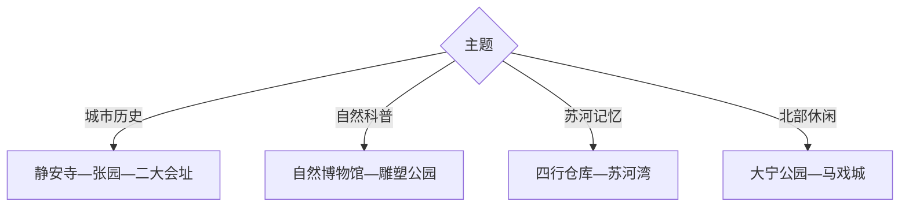

# 静安旅行指南

静安从南京西路的近代街区、静安寺与张园一路延伸到苏州河工业遗产、自然博物馆和北部大宁—彭浦生活区。核心点位轨道密集，适合按“南京西路”“苏河湾”“大宁北部”三条线选走。

## 城市速览

| 项目 | 信息 |
|---|---|
| 主线 | 静安寺—南京西路—张园—自然博物馆—苏河湾—大宁 |
| 停留 | 核心1天；加入红色旧址、苏河湾和大宁共2–3天 |
| 住宿 | 南京西路方便核心步行，苏河湾连接火车站，大宁适合北部活动 |
| 交通 | 轨道交通为主，片区内连续步行 |
| 风险 | 高温暴雨、节假日客流、历史建筑台阶与临时展览预约 |
| 边界 | 宗教空间、居民住宅、学校、历史建筑内部和河岸施工区按开放规则进入 |

## 城市格局与游览区域

固定 `Pengpu / GeoNames 1798919` 对应静安北部彭浦一带，本页以法定静安区 `Q660789` 组织南北完整旅行范围。南京西路与苏河湾可连续安排，大宁和彭浦更适合另留半日。

## 主要景点

| 景点 | 区域 | 类型 | 核心体验 | 用时 | 环境 | 体力 | 预约风险 | 天气影响 | 优先级 |
|---|---|---|---|---:|---|---|---|---|---|
| 上海自然博物馆 | 静安雕塑公园 | 自然科学 | 地球生命、动植物与儿童科普 | 3–6小时 | 室内 | 中 | 极高 | 低 | A |
| 上海四行仓库抗战纪念馆 | 苏河湾 | 历史纪念 | 淞沪抗战、仓库遗址与苏州河 | 2–3小时 | 室内外 | 低 | 很高 | 低 | A |
| 中共二大会址纪念馆 | 老成都北路 | 红色文博 | 会议历史、党章与石库门空间 | 1.5–3小时 | 室内 | 低 | 很高 | 低 | A |
| 静安寺 | 南京西路 | 宗教建筑 | 都市寺院、建筑与民俗 | 1–2小时 | 室内外 | 低中 | 中 | 中 | A |
| 张园公开街区 | 南京西路 | 历史街区 | 石库门建筑、城市更新与公共商业 | 1–3小时 | 室内外 | 低 | 中 | 中 | A |
| 苏河湾公共岸线 | 苏州河静安段 | 滨水遗产 | 总商会旧址、天后宫与仓库建筑群 | 2–4小时 | 室外为主 | 中 | 中 | 高 | B |
| 大宁公园 | 大宁 | 城市公园 | 湖泊、湿地、季节花展与休息空间 | 2–4小时 | 室外 | 低中 | 低 | 高 | B |
| 上海马戏城当期演出 | 大宁 | 表演艺术 | 大型杂技与舞台演出 | 2–3小时 | 室内 | 低 | 极高 | 低 | B |

## 美食与餐饮

南京西路适合本帮菜、咖啡与精致餐饮，陕西北路和昌平路周边有社区型选择，苏河湾与大宁更适合行程中段休息。单人用餐可选面馆、生煎和简餐；点本帮菜先确认甜度、海鲜、酒糟和共享份量。

## 经典行程

### 一日经典线
**路线**：静安寺—张园—中共二大会址—上海自然博物馆。**逻辑**：沿南京西路片区向东移动，建筑与场馆互补。**预约锚点**：自然博物馆和二大会址。**休息**：张园或静安雕塑公园。**删除条件**：时间不足时删除静安寺内部参观。

### 两日城区线
**路线**：首日南京西路与自然博物馆；次日四行仓库—苏河湾—大宁。**逻辑**：核心商旅与滨水北部各成一日。**预约锚点**：自然博物馆、四行仓库和演出。**休息**：苏河湾。**删除条件**：次日晚无合适演出时结束于大宁公园。

### 三日旧址线
**路线**：前两日基础线；第三日陕西北路历史建筑—红色旧址开放点—社区文化空间。**逻辑**：用慢走补足建筑与社会史。**预约锚点**：各旧址开放。**休息**：陕西北路。**删除条件**：只保留已确认入内的两处。

### 雨天场馆线
**路线**：自然博物馆—中共二大会址—四行仓库。**逻辑**：轨道连接三处室内场馆。**预约锚点**：三个场馆时段。**休息**：南京西路。**删除条件**：暴雨预警时减少换乘并择一馆。

### 亲子科普线
**路线**：自然博物馆—静安雕塑公园短段—大宁公园。**逻辑**：室内科普后用公园释放活动量。**预约锚点**：亲子票与活动。**休息**：自然博物馆内。**删除条件**：高温或降雨时取消户外段。

### 苏河建筑线
**路线**：四行仓库—总商会旧址方向—天后宫开放点—河岸步道。**逻辑**：沿同一岸线理解工业与商贸遗产。**预约锚点**：建筑入内和水上航线。**休息**：苏河湾公共空间。**删除条件**：岸线施工时保留四行仓库。

### 低体力线
**路线**：车辆到张园—午休—自然博物馆重点展层。**逻辑**：平缓街区与电梯场馆控制步数。**预约锚点**：无障碍入口、轮椅与落客。**休息**：张园。**删除条件**：场馆体量负担较大时缩短展层。

## 住宿区域

南京西路适合首访、购物与步行；静安寺周边便于东西向交通；苏河湾和上海站周边适合铁路抵离；大宁适合马戏城、赛事及北部活动。临街房间可优先比较隔音，历史建筑酒店需核对电梯和无障碍条件。

## 市内交通

轨道交通覆盖主要片区，南京西路一带站内换乘和地面出口距离可能较长。苏河湾适合步行串联，前往大宁和彭浦改乘轨道。骑行沿当期允许路段进行，繁忙商业街和河岸人流密集处以步行为主。

## 不同旅行者须知

城市史爱好者优先张园、二大会址与苏河湾；亲子家庭给自然博物馆完整时段；表演观众以演出时间倒排交通；低体力者按单片区安排。宗教礼仪区、居民住宅、学校和历史建筑非开放内部保留明确限制。

## 行前核对

- 核对自然博物馆、四行仓库、二大会址、张园建筑与马戏演出预约。
- 核对苏河岸线施工、水上航线、轨道运营和极端天气措施。
- 历史建筑以公布入口参观，宗教活动期间遵守现场礼仪与摄影规则。

## 来源与更新记录

| 来源 | 支持内容 | 核验日期 |
|---|---|---|
| [静安区政府：特色旅游](https://www.jingan.gov.cn/jagl/006004/006004003/jaglmoreinfo.html) | 静安寺、二大会址、四行仓库与大宁公园 | 2026-09-01 |
| [静安区政府：苏河湾文保建筑](https://www.jingan.gov.cn/govxxgk/JA0/2024-05-17/423ec1c3-0134-4b89-bb3f-c3c88f19ae80.html) | 苏州河岸线、历史建筑与水上线路 | 2026-09-01 |
| [GeoNames 1798919](https://www.geonames.org/1798919/) | Pengpu 固定城市点 | 2026-09-01 |
| [Wikidata Q660789](https://www.wikidata.org/wiki/Q660789) | 静安区实体与跨库标识 | 2026-09-01 |

| 日期 | 更新 |
|---|---|
| 2026-09-01 | 首次完成静安旅行研究，按南京西路、苏河湾和大宁北部分线。 |
