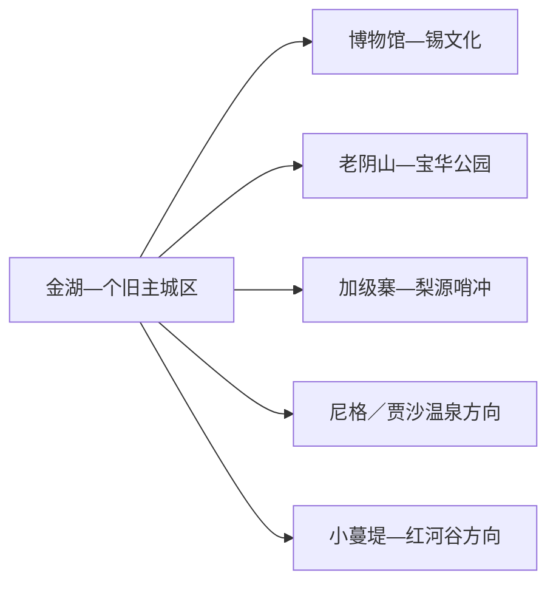
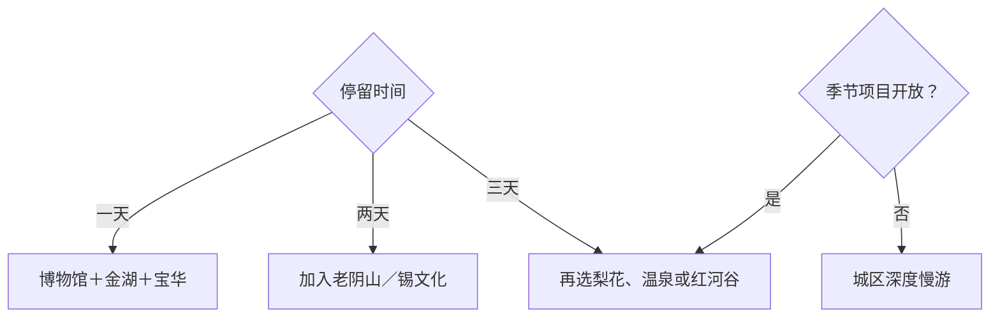

# 个旧旅行指南

个旧是一座“两山夹一湖”的高原锡都。主城区的金湖、博物馆和宝华公园适合组成一日；第二天可选老阴山与锡工业文化，第三天再从加级寨梨花谷、尼格温泉或小蔓堤等季节远线中择一。矿业塑造了城市，但参观应落在公开展馆、景区和预约研学中。

> 建议停留：2–3 天；每条乡村或温泉远线各留完整时段 
> 旅行关键词：世界锡都、金湖、老阴山、个旧博物馆、宝华公园、梨花谷 
> 主要体力：城区低至中等；老阴山和远线中高 
> 最近研究：2026-08-13

## 城市速览

| 项目 | 旅行信息 |
|---|---|
| 主要旅行价值 | 在高原湖城、锡工业史、山地公园、温泉与乡村旅居之间理解个旧 |
| 建议停留 | 1 天城区核心；2 天加入老阴山或锡文化；3 天再选一条季节远线 |
| 较舒适季节 | 全年可按天气选择；春季梨花、夏季避暑更有主题性 |
| 预算特点 | 城区平实，索道、温泉、滑翔伞和远线车辆增加预算 |
| 步行强度 | 金湖低，宝华与老阴山中高，乡村线路依道路而变 |
| 主要天气风险 | 高原强紫外线、雷雨、山雾、地灾、低温和山地大风 |
| 独行旅行 | 城区服务完整，远线返程和活动资质先确认 |
| 亲子旅行 | 博物馆、动物园和公园可选；飞行与温泉按年龄规则 |
| 长者与低体力旅行 | 金湖短线、博物馆和车辆观景最稳妥 |
| 无障碍信息 | 城区公共场馆可先咨询；山地、索道、温泉和乡村设施连续性需向官方确认 |

## 城市格局与游览区域

个旧市是红河州下辖县级市，法定代码 `532501`。GeoNames `1810240` 与 Wikidata `Q1016730` 的 `P1566` 精确对应，固定点用于主城定位，页面按完整县级市组织。蒙自、开远、弥勒等是红河州内独立县级市，跨城时重新计算交通与住宿。

| 区域 | 主要内容 | 游览特点 | 与其他区域的关系 |
|---|---|---|---|
| 金湖—主城区 | 金湖、博物馆、城市商业与住宿 | 紧凑，适合步行加短车程 | 是所有远线的补给基地 |
| 老阴山—宝华公园 | 城市俯瞰、森林公园和正式索道／步道 | 高差明显，天气影响大 | 可与城区组成一日 |
| 锡工业文化公开点 | 博物馆、创意园或预约展陈 | 重点看工业史与非遗工艺 | 作业厂矿另按生产管理 |
| 加级寨—梨源哨冲方向 | 梨花、乡村、3A景区与季节活动 | 花期和接待决定体验 | 适合春季完整半日至一日 |
| 尼格—贾沙等温泉方向 | 正式运营温泉与康养项目 | 水质、营业、健康和交通需核 | 不与红河谷远点同日 |
| 小蔓堤—蔓耗方向 | 红河谷、热带环境和正式乡村项目 | 海拔变化大、路程长 | 单独一日并核保护边界 |

城区外围仍有矿山、选冶厂、尾矿库、铁路专用线和工业园区。理解锡都可从博物馆、公开工艺展示和正规研学开始；作业区、废弃矿洞和尾矿设施按安全管理使用。大屯海等水体还承担生产与生态功能，公共观景与水上活动以属地公告为准。

## 主要景点

### 城区与锡文化

| 景点 | 区域 | 类型 | 主要看点 | 建议用时 | 室内外 | 体力 | 预约风险 | 天气影响 | 优先级 |
|---|---|---|---|---:|---|---|---|---|---|
| 个旧市博物馆 | 主城区 | 地方文博、3A景区 | 锡工业历史、地方文物和数字化展陈 | 2–3 小时 | 室内 | 低 | 中 | 低 | A |
| 金湖公园与公开湖岸 | 主城区 | 城市湖泊、公园 | 两山夹一湖格局和城市生活 | 1.5–3 小时 | 室外 | 低 | 低 | 高 | A |
| 锡文化创意产业园等正式展陈 | 城区 | 工业文化、非遗 | 斑锡、石范工艺和公开展示 | 2–4 小时 | 混合 | 低至中 | 很高 | 低 | B |
| 宝华公园／宝华森林公园公开游线 | 主城区山地 | 城市森林、公园 | 山地绿地、城市视野和休闲设施 | 2–4 小时 | 室外 | 中 | 中 | 高 | B |

### 山地与远线

| 景点 | 区域 | 类型 | 主要看点 | 建议用时 | 室内外 | 体力 | 预约风险 | 天气影响 | 优先级 |
|---|---|---|---|---:|---|---|---|---|---|
| 老阴山公开游览单元 | 城区西侧 | 山地、观景 | 城市俯瞰、正式步道与当期索道／飞行项目 | 4–7 小时 | 室外 | 中高 | 很高 | 极高 | A |
| 加级寨梨花谷 | 市域乡村 | 季节花景、乡村 | 梨花、村落和当期节庆 | 4–7 小时 | 室外 | 中 | 很高 | 很高 | B |
| 梨源哨冲景区 | 市域乡村 | 乡村、3A景区 | 乡村景观与正式接待内容 | 3–6 小时 | 混合 | 中 | 高 | 高 | B |
| 个旧动物园 | 城郊 | 动物展示、3A景区 | 正式动物展示与亲子活动 | 2–4 小时 | 混合 | 中 | 高 | 高 | B |
| 正式运营温泉项目 | 尼格／贾沙等方向 | 温泉、康养 | 温泉休闲与住宿 | 4–8 小时 | 混合 | 低至中 | 很高 | 中 | C |
| 小蔓堤等正式红河谷项目 | 南部方向 | 河谷、乡村 | 低海拔河谷、季节景观和公开活动 | 6–9 小时 | 室外为主 | 中 | 很高 | 很高 | C |

老阴山的索道、玻璃栈道、滑翔伞等并非同一运营条件；规划时按当日开放项目选择，不用项目名称替代资质和天气判断。温泉也应核对水质公示、卫生、适用人群与交通。

## 美食与餐饮

| 菜品或餐饮类型 | 常见区域 | 一个人用餐与常见份量 | 风味、过敏原与饮食限制 | 排队风险与替代方法 |
|---|---|---|---|---|
| 过桥米线与小锅米线 | 主城区 | 一人一份 | 汤底、肉类、蛋、花生和辣椒 | 调整配料或选清汤 |
| 烧豆腐与蘸水小吃 | 市场、夜间餐饮区 | 可按份尝试 | 大豆、辣椒、花生和折耳根 | 先问蘸水配料 |
| 山地菌菇与家常菜 | 正规餐馆 | 适合共享 | 菌种、烹熟程度和误采风险 | 只选可说明来源的菌类 |
| 河谷水果与季节农产品 | 市场、正式采摘点 | 按量购买 | 糖分、清洗和保存 | 选择明码标价与许可采摘 |

## 经典行程

### 一日经典路线

**路线**：个旧市博物馆 → 午餐 → 金湖短线 → 宝华公园公开游线

- **串联逻辑**：从锡都历史走到两山夹一湖的城市格局，移动集中。
- **预约锚点**：博物馆开放和宝华公园当期入口。
- **休息安排**：午餐长休，金湖和公园分别只走一段。
- **时间不足时**：保留博物馆与金湖。

### 两日城市路线

**路线**：第 1 天博物馆—金湖—宝华公园。 
**第 2 天**：老阴山公开游线 → 午休 → 锡文化正式展陈。

- **串联逻辑**：第一天认识湖城，第二天补城市俯瞰与工业文化。
- **预约锚点**：老阴山入口、索道或活动、锡文化展陈。
- **休息安排**：下山后完整午休，再进室内展陈。
- **时间不足时**：第二天只留老阴山或锡文化之一。

### 三日深度路线

**路线**：第 1 天城区核心。 
**第 2 天**：老阴山与锡文化。 
**第 3 天**：加级寨梨花谷、正式温泉或小蔓堤三选一。

- **串联逻辑**：稳定城市内容在前，季节与长距离项目作为第三天替换。
- **预约锚点**：第三天花期、营业、车辆和返程。
- **休息安排**：使用正规接待点，温泉前后补水。
- **时间不足时**：删除第三天。

### 雨天路线

**路线**：个旧市博物馆 → 午餐 → 锡文化正式室内展陈或城区公共文化空间

- **适用条件**：城区道路正常；强降雨与地灾预警时减少山地移动。
- **串联逻辑**：两处室内内容围绕锡都主题展开。
- **预约锚点**：场馆开放与工业文化接待。
- **休息安排**：馆内和城区餐饮区。
- **时间不足时**：只留博物馆。

### 亲子或低体力路线

**亲子路线**：博物馆互动展陈 → 午餐 → 个旧动物园当期开放核心或金湖短线。 
**低体力路线**：车辆到博物馆 → 核心展厅 → 午餐长休 → 金湖平缓短段。

- **减负方式**：亲子线只选一个下午点；低体力线取消山地、索道和远线。
- **预约锚点**：儿童活动、动物园规则、轮椅、座椅和落客点。
- **休息安排**：每个主点后坐休。
- **时间不足时**：两线均保留博物馆。

### 远郊一日路线

**路线**：城区 → 一个已确认开放的梨花谷／温泉／红河谷项目 → 原路返回

- **适用条件**：季节、运营、天气、道路和返程明确。
- **串联逻辑**：单方向完整体验，适应个旧明显的海拔和气候变化。
- **预约锚点**：接待、车辆、项目资质和退改。
- **休息安排**：正规接待点午休，驾驶者早返。
- **时间不足时**：改为金湖—宝华半日。

## 住宿区域

| 区域 | 优点 | 缺点 | 适合人群 | 交通特点 |
|---|---|---|---|---|
| 金湖—主城区 | 餐饮、商业、场馆和叫车集中 | 山城道路仍有坡度 | 首访、公共交通、慢住 | 适合作统一基地 |
| 城区外围与大屯方向 | 出城和停车较方便 | 夜间服务密度较低 | 自驾、远线 | 先匹配次日方向 |
| 正式温泉住宿 | 可完成康养慢游 | 距城区远，运营和卫生需核 | 温泉专题、长住 | 订房前确认接送和退改 |
| 梨花谷等正规民宿 | 花季与乡村体验完整 | 季节波动、餐饮和交通较少 | 摄影、花季 | 先锁道路和返程 |

## 市内交通

| 场景 | 建议与取舍 | 行前需要重查的内容 |
|---|---|---|
| 从红河站、蒙自或开远抵达 | 比较城际公交、客运和正规车辆 | 上下客点、班次、行李和末班 |
| 城区移动 | 公交、出租或网约车连接金湖与山脚 | 坡度、施工、索道接驳和夜间叫车 |
| 老阴山与锡文化点 | 先核开放入口，再安排车辆 | 索道、项目、停车和返程 |
| 乡村与温泉远线 | 自驾或正规预约车辆更灵活 | 道路、活动、通信、健康规则和返程 |

## 不同旅行者须知

| 旅行维度 | 可行条件 | 主要取舍 | 需额外核对 |
|---|---|---|---|
| 独行旅行 | 城区服务完整 | 远线和夜返容错低 | 正规车辆、通信和末班 |
| 亲子旅行 | 博物馆、动物园和湖岸可组合 | 飞行、索道和温泉按年龄选择 | 儿童规则、看护和卫生 |
| 长者或低体力旅行 | 金湖和一馆短线可行 | 坡道、山地和长距离减量 | 座椅、落客点和医疗 |
| 无障碍需求 | 现代场馆与湖岸优先咨询 | 山城、索道和乡村连接易中断 | 设施连续性需向官方确认 |
| 摄影旅行 | 湖城、工业、山地和梨花题材丰富 | 作业区、居民和无人机规则优先 | 拍摄许可、禁飞和花期 |
| 工业与生态空间 | 公开展陈和正规研学可行 | 厂矿、尾矿库、保护地和水体管理优先 | 准入、防护、保险和讲解 |

## 行前核对

| 核对事项 | 为什么需要重查 | 建议核对时间 | 官方入口 |
|---|---|---|---|
| 个旧博物馆与锡文化展陈 | 开放、讲解和接待方式会调整 | 排路线前及前一日 | [个旧市博物馆资料](https://www.hhgj.gov.cn/info/11691/529851.htm) |
| 老阴山、梨花与温泉项目 | 索道、飞行、花期和营业变化明显 | 出发前一周及当天 | [个旧市政府文旅动态](https://www.hhgj.gov.cn/info/6681/619591.htm) |
| 城际交通 | 红河站、蒙自和开远方向班次调整 | 购票前及当天 | [中国铁路12306](https://www.12306.cn/) |
| 天气与地灾 | 高原雷雨、山雾、大风和滑坡影响户外 | 出发前三日及当天 | [云南省气象局](http://yn.cma.gov.cn/) |

## 来源与更新记录

### 主要来源

| 来源 | 类型 | 支持内容 | 核验日期 |
|---|---|---|---|
| [个旧市博物馆](https://www.hhgj.gov.cn/info/11691/529851.htm) | 属地政府、场馆 | 锡工业史、展陈功能与3A身份 | 2026-08-13 |
| [个旧市政府：锡工业文化与旅居](https://www.hhgj.gov.cn/info/6681/596841.htm) | 属地政府 | 博物馆改造、工业文化和旅居场景 | 2026-08-13 |
| [个旧市政府：2025年工作报告](https://www.hhgj.gov.cn/info/12201/592971.htm) | 属地政府 | 梨源哨冲、动物园、梨花谷、温泉和市域方向 | 2026-08-13 |
| [个旧市城市安全发展白皮书](https://www.hhgj.gov.cn/info/13111/330781.htm) | 属地政府 | 两山夹一湖、海拔、锡文化和城市风险 | 2026-08-13 |
| [Wikidata Q1016730](https://www.wikidata.org/wiki/Special:EntityData/Q1016730.json) | 开放结构化数据 | 个旧与 GeoNames 精确交叉核验 | 2026-08-13 |
| [GeoNames 1810240](https://sws.geonames.org/1810240/about.rdf) | 开放地名数据 | 固定个旧城市记录 | 2026-08-13 |
| [民政部行政区划代码查询](https://dmfw.mca.gov.cn/xzqh/getList?code=532501&trimCode=false&maxLevel=3) | 国家行政区划数据 | 法定代码 532501 | 2026-08-13 |

### 更新记录

| 日期 | 更新内容 |
|---|---|
| 2026-08-13 | 首次完成个旧指南，核验锡都文化、湖城山地、温泉乡村和县级市边界 |
