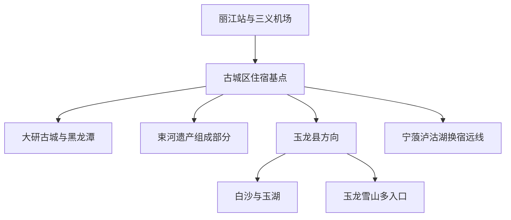
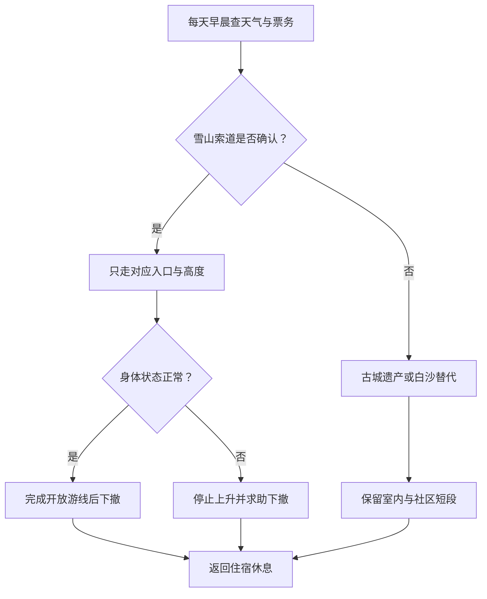

# 丽江旅行指南

丽江不是“一座古城加一座雪山”的紧凑景区，而是一座横跨高原坝区、雪山、金沙江峡谷和泸沽湖方向的地级市。古城区承接机场、铁路、城市服务和大研古城；玉龙纳西族自治县包含玉龙雪山、白沙、玉湖、拉市海等多个独立片区；宁蒗、永胜、华坪则是需要长途公路、换宿与天气缓冲的县域远线。第一次到访最稳妥的结构是以古城区为基点，分别安排古城遗产日和玉龙雪山日；泸沽湖至少作为 2–3 天换宿段，香格里拉与大理则另按新的城市行程计算。

> 建议停留：古城区与遗产古镇 2–3 天；玉龙雪山增加 1 天；泸沽湖增加 2–3 天并换宿 
> 旅行关键词：世界遗产古城、纳西文化、水系、玉龙雪山、高海拔、茶马古道、泸沽湖、民族生活 
> 主要体力：古城中等步行；雪山入口和高海拔游线中等至较高；县域远线以长途乘车为主要负担 
> 最近研究：2026-08-12

## 城市速览

| 项目 | 旅行信息 |
|---|---|
| 主要旅行价值 | 在大研、束河、白沙三个遗产组成部分理解丽江古城与水系，在玉龙雪山观察垂直气候和高山景观，再按天数选择拉市海或泸沽湖等独立方向 |
| 建议停留 | 2 天只处理古城与一个近郊；3–4 天可增加雪山并留天气缓冲；泸沽湖需另加 2–3 天，宝山石头城、老君山等远线也不宜当天往返 |
| 较舒适季节 | 四季均可旅行但体验差异大；雨季云雾、雷电、地灾与道路风险集中，冬春干燥、昼夜温差和森林火险突出，高海拔天气全年可能突变 |
| 预算特点 | 古城公共街巷可低成本步行；玉龙雪山门票、不同索道、环保车、演出、旺季住宿和县域包车形成主要增量；黄牛票与不透明套餐风险高 |
| 步行强度 | 古城石板路、桥坡、台阶和拥挤会累积体力；雪山索道只替代部分垂直移动，高海拔栈道仍需缓慢步行；泸沽湖负担主要来自长途弯道路程 |
| 主要天气风险 | 高原紫外线、低温、大风、雷电、缺氧不适、雨季滑坡泥石流、山火与湖面风浪；古城木结构还需特别注意消防和狭窄巷道疏散 |
| 独行旅行 | 古城区和正规景区交通便于独立安排；远县、雪山票务和夜间交通应使用可核验运营方，不接受客栈无资质组织的一日游或私人揽客 |
| 亲子旅行 | 文化院落、古城短段和低海拔雪山景点较易组合；水渠、湖岸、马匹、拥挤与高海拔需持续看护，不以儿童兴奋程度判断缺氧 |
| 长者与低体力旅行 | 先在古城适应 1 天，再决定是否进入雪山；优先车辆可达点、短街巷与低海拔线路，不把乘索道等同于无体力和无高反风险 |
| 无障碍信息 | 新建车站、机场和公共场馆较可能具备基础设施；古城石板、古宅门槛、雪山接驳、索道站和湖岸连续无障碍资料不足，需逐段确认 |

## 城市格局与游览区域

丽江市法定行政区划代码为 `530700`，辖古城区、玉龙纳西族自治县、永胜县、华坪县和宁蒗彝族自治县。地级市名称、主城名称与景区品牌容易混在一起：日常所说“丽江市区”主要指古城区城市生活范围；玉龙雪山位于玉龙县；泸沽湖云南侧主要位于宁蒗县，并跨云南—四川省界；香格里拉属于迪庆州，大理属于大理州，均不是丽江远郊景点。

| 区域 | 主要内容 | 游览特点 | 边界与安排原则 |
|---|---|---|---|
| 古城区主城 | 大研古城、黑龙潭、木府及城市公共文化服务 | 步行密集、住宿餐饮集中，适合作为首次到访基点 | 世界遗产不等于整个现代古城区；居民院落、客栈后场、水渠和古建维护区各有边界 |
| 束河片区 | 束河民居建筑群、公共街巷与茶马古道文化 | 与大研有明显地面交通距离，商业和社区空间并存 | 束河是丽江古城世界遗产三个组成部分之一，不重复称作另一项世界遗产 |
| 白沙—玉湖片区 | 白沙民居建筑群、白沙壁画、玉湖村与雪山脚下社区 | 位于玉龙县，需要车辆或合规骑行接驳 | 白沙属于遗产组成部分，玉湖是生活村落；农田、民居和生产空间不默认开放 |
| 玉龙雪山景区 | 甘海子、冰川公园方向、云杉坪、牦牛坪、蓝月谷等 | 多入口、多索道、多高度层级，票种、环保车和开放状态不能互换 | 同一父景区只计一次；任何一条索道售罄或停运都不应通过黄牛或封闭步道绕行 |
| 拉市海方向 | 湿地、村落与经许可的体验项目 | 受季节水位、候鸟、经营资质和交通影响 | 湿地保护区不等于可自由进入的环湖公园；骑马、划船只选证照与保险清楚的项目 |
| 宁蒗—泸沽湖 | 泸沽湖云南侧、沿湖村落和摩梭文化生活空间 | 长途山路，至少换宿两晚；湖区跨省、跨县、跨管理体系 | 四川侧属于凉山州盐源县；环湖、乘船、住宿和跨省返程分别核对，不把全湖算作丽江市区 |
| 永胜县 | 程海、县城与金沙江相关县域 | 与古城距离远，需独立交通与住宿判断 | 湖泊生态、生产与游客开放边界不同，不以地图岸线推定可达 |
| 华坪县 | 金沙江河谷县域、芒果产业与山地 | 远离古城旅游核心，公路与季节性生产是主要条件 | 果园、矿业和加工空间不是默认参观点，只进入明确开放项目 |
| 香格里拉、大理 | 独立地级目的地 | 铁路、公路可串联，但换宿、海拔与票务独立 | 不纳入丽江景点表；虎跳峡也需按实际入口、属地和线路重新核对 |

丽江古城世界遗产由三个组成部分构成：大研古城（含黑龙潭）、白沙民居建筑群和束河民居建筑群。它们空间分离，却属于同一个遗产父项目；古城公共街巷、木府等收费或独立管理点、白沙壁画开放建筑和社区住宅也不是同一种访问权。

## 主要景点

优先级用于安排时间：**A** 为首访核心，**B** 为按兴趣补充，**C** 为远线或季节性目的地。“路线节点”不计入景点完成率。同一父景区及其内部子景点不重复计算；玉龙雪山的不同索道入口用于选择路线，不是多座雪山。

### 丽江古城世界遗产

| 景点 | 区域 | 类型 | 主要看点 | 建议用时 | 室内外 | 体力 | 预约风险 | 天气影响 | 优先级 |
|---|---|---|---|---:|---|---|---|---|---|
| 大研古城—黑龙潭遗产片区 | 古城区 | 世界文化遗产、历史城镇 | 水系、桥梁、街巷、木构民居与黑龙潭水源关系；整体按一个遗产组成部分计算 | 0.5–1 天 | 混合 | 中 | 中 | 中 | A |
| 木府 | 大研古城内 | 历史建筑、独立管理点 | 理解木氏土司与丽江历史；票务、开放与古城公共街巷分开 | 1–2 小时 | 混合 | 中 | 中 | 中 | B |
| 束河民居建筑群 | 古城区北部 | 世界遗产组成部分、生活古镇 | 茶马古道集镇、水系和民居空间 | 2–4 小时 | 混合 | 中 | 中 | 中 | A |
| 白沙民居建筑群与白沙壁画 | 玉龙县白沙镇 | 世界遗产组成部分、壁画与社区 | 较早的纳西聚落格局、多文化宗教艺术与雪山脚下生活 | 3–5 小时 | 混合 | 中 | 高 | 中 | A |

古城水系仍承担环境、消防和生活功能，不在水渠洗涤、投放食物或进入封闭水源区。木结构街巷对明火、吸烟、堵塞通道和大功率电器格外敏感；入住古城民宿时应先看消防疏散和车辆实际落客点。世界遗产身份也不把居民家门、庭院、宗教空间和非遗生产过程变成随意拍摄的布景。

### 玉龙雪山与玉龙县近郊

| 景点 | 区域 | 类型 | 主要看点 | 建议用时 | 室内外 | 体力 | 预约风险 | 天气影响 | 优先级 |
|---|---|---|---|---:|---|---|---|---|---|
| 玉龙雪山景区 | 玉龙县 | 高山、综合景区 | 雪山垂直景观、甘海子及不同索道和步道系统；内部所有子点合并计一次 | 1 天 | 室外 | 中至高 | 很高 | 很高 | A |
| 冰川公园方向 | 玉龙雪山内部 | 高海拔索道与栈道 | 高海拔冰川地貌和山体视野，受大风、结冰、能见度和身体状态影响最大 | 3–5 小时 | 室外 | 高 | 很高 | 很高 | 路线分支 |
| 云杉坪方向 | 玉龙雪山内部 | 索道、林地与草甸 | 相对较低海拔的森林草甸景观，仍需步行与接驳 | 2–4 小时 | 室外 | 中 | 高 | 很高 | 路线分支 |
| 牦牛坪方向 | 玉龙雪山内部 | 索道、高山草甸 | 草甸与雪山远景，海拔、风和交通时间仍不可低估 | 3–5 小时 | 室外 | 中至高 | 高 | 很高 | 路线分支 |
| 蓝月谷公开游线 | 玉龙雪山内部 | 山谷、水体、环保车节点 | 山谷水景与雪山融水环境；不下水、不越过护栏 | 1–2 小时 | 室外 | 中 | 高 | 高 | 路线分支 |
| 玉湖村公开接待区 | 玉龙县 | 纳西村落、雪山文化 | 雪山脚下村落、水渠与生活空间 | 2–4 小时 | 混合 | 中 | 中至高 | 高 | B |
| 拉市海正式开放点 | 玉龙县 | 高原湿地、村落 | 湿地、候鸟季与村落文化；体验项目需单独核验经营许可 | 0.5–1 天 | 室外 | 中 | 高 | 很高 | C |

玉龙雪山各条索道的起点、票种、海拔、环保车线路和关闭条件不同，不能把“雪山索道票”视为可互换通票。高海拔不适没有统一安全阈值；出现持续头痛、恶心、步态不稳、胸闷、呼吸困难或意识异常时，应停止上升并尽快下撤、求助，不能靠吸氧把行程硬撑完。有心肺等基础疾病、孕期或近期身体状况不稳者应先咨询医疗专业人士。

### 城市文化与演艺

| 景点 | 区域 | 类型 | 主要看点 | 建议用时 | 室内外 | 体力 | 预约风险 | 天气影响 | 优先级 |
|---|---|---|---|---:|---|---|---|---|---|
| 丽江市博物院等公共文化场馆 | 古城区 | 博物馆 | 建立丽江历史、纳西文化与区域民族关系框架；具体馆舍与展览以当期公告为准 | 2–3 小时 | 室内 | 低 | 中 | 低 | B |
| 正规纳西古乐或文化院落活动 | 大研古城 | 表演、非遗 | 通过公开演出与讲解接触音乐、东巴文字和传统技艺 | 1–2 小时 | 室内 | 低 | 高 | 低 | B |
| 玉龙雪山景区正规演艺 | 玉龙雪山内部 | 实景演出 | 以雪山环境为背景的当代舞台呈现，不替代对真实社区与文化的理解 | 1–2 小时 | 室外 | 中 | 很高 | 很高 | C |

“纳西文化”“摩梭文化”不是统一旅游表演标签。文字、音乐、宗教仪式、服饰、婚俗和日常生活属于不同知识与社区主体；只参加明确公开、知情同意和合法经营的活动，不要求居民为拍摄重复仪式，不购买来源不明的文物、宗教物品和野生动植物制品。

### 县域远线

| 景点 | 区域 | 类型 | 主要看点 | 建议用时 | 室内外 | 体力 | 预约风险 | 天气影响 | 优先级 |
|---|---|---|---|---:|---|---|---|---|---|
| 泸沽湖云南侧正式游览区 | 宁蒗县 | 高原湖泊、跨省景区 | 湖泊、沿湖村落与摩梭文化生活空间；与四川侧共同构成完整湖区 | 2–3 天 | 混合 | 中 | 高 | 很高 | A |
| 宝山石头城公开游览区 | 玉龙县远线 | 山地村落、传统聚落 | 金沙江峡谷环境与纳西聚落；长途山路和社区接待决定可行性 | 2 天以上 | 混合 | 中至高 | 高 | 很高 | C |
| 老君山正式开放景区 | 玉龙县远线 | 三江并流相关山地、自然保护 | 高山地貌与生态景观；只进入正式开放游线 | 1–2 天 | 室外 | 高 | 高 | 很高 | C |
| 程海公开观景与县域路线 | 永胜县 | 高原湖泊、县域文化 | 湖泊与地方生产生活关系 | 1–2 天 | 混合 | 中 | 高 | 高 | C |

泸沽湖湖面和环湖公路跨行政边界，船只、码头、住宿、门票和交通可能由不同主体管理。购买“环湖”产品前写清云南侧或四川侧的上车点、住宿地、是否跨省、返程终点和保险；不乘无证船只，不进入保护岸线，不用无人机追拍居民、祭祀和野生动物。

## 美食与餐饮

丽江餐饮受到纳西、彝、藏、汉等多种文化和高原物产影响。古城核心区适合体验但客流与价格波动大，新城生活街区更容易找到份量清楚的日常餐；泸沽湖、永胜和华坪等县域食物应在当地吃，不为一道菜跨县赶路。

| 菜品或餐饮类型 | 常见区域 | 一个人用餐与常见份量 | 风味、过敏原与饮食限制 | 排队风险与替代方法 |
|---|---|---|---|---|
| 鸡豆凉粉 | 古城、新城与县域小吃店 | 一盘可作小吃或配菜，单人通常可完成 | 名称中的“鸡豆”不是鸡肉；调料可能含花生、芝麻、大豆、辣椒和醋，需问共锅 | 热门古城店排队时可去生活街区找同类，不必锁定一家 |
| 丽江粑粑 | 古城、白沙、束河与早餐店 | 一张或切块适合 1–2 人，甜咸口份量不同 | 通常含小麦；可能含猪油、糖、芝麻、花生或蛋奶，麸质过敏者避开 | 选择现做、价格标明的普通店；多人共享可减少油腻负担 |
| 腊排骨火锅 | 古城外生活区、新城 | 常为 2 人以上锅底，单人先问小锅或改点套餐 | 高盐、含猪肉；蘸水和配菜可能含花生、芝麻、大豆，素菜共煮不等于素食 | 晚餐高峰排队长，可改为小份腊排骨菜或普通菌蔬锅 |
| 纳西烤肉与马帮菜 | 古城、白沙、玉龙县 | 多为合菜，单人宜点一肉一菜并确认份量 | 可能偏咸辣，含猪肉、酒、酱油；“民族风味”不能推定清真或无过敏原 | 套餐不透明时按单品点餐，先问价格、克重和服务费 |
| 米灌肠 | 古城与当地小吃市场 | 一份适合分享或作点心 | 通常含米和动物血、肉或香料，不适合素食者；询问制作与保存条件 | 路边摊卫生信息不足时选择正规餐馆或包装产品 |
| 野生菌菜肴 | 雨季餐馆 | 菌锅通常多人份，单人不宜为尝鲜过量 | 只在正规餐馆食用可食用菌并确保彻底熟制；不自采、不购买来源不明混合菌 | 雨季热门菌店等位久，可改吃人工栽培菌或普通时蔬 |
| 三文鱼等冷水鱼菜 | 城区餐馆 | 整鱼或多吃套餐常为多人份，先问鱼种、来源和加工方式 | 鱼类过敏、寄生虫和生食风险需考虑；“三文鱼”商品名不能替代物种与来源说明 | 不接受强制多吃，改点熟制鱼块或常规热菜 |
| 酥油茶、乳饼与乳制品 | 古城、县域与部分体验店 | 饮品和小份点心适合短休 | 含乳制品；茶含咖啡因，酥油茶脂肪和盐较高；乳糖不耐需询问 | 体验套餐价格不清时改点单杯或普通茶饮 |
| 泸沽湖摩梭风味合菜 | 宁蒗湖区 | 多为多人合菜，单人先问小份 | 腌肉、鱼、酒和乳制品常见；文化名称不能说明配料和过敏原 | 尊重社区接待安排，不为表演式“家访”支付来源不明费用 |

点餐时用明确语言表达：“不要辣椒油”“不用猪油或肉汤”“鱼、虾和花生都过敏”。严格素食、清真或严重过敏者还应确认砧板、锅具与油槽是否共用；高海拔不适、肠胃不适或长途乘车前，避免大量饮酒、过油和生冷食物。

## 经典行程

### 一日大研古城路线

**路线**：黑龙潭 → 大研古城水系与公共街巷 → 木府按开放选择 → 文化院落或早退休息

- **适用人群**：首次到访、抵达后适应海拔或不进入山地者。
- **串联逻辑**：从水源与城市格局开始，再进入街巷和独立管理建筑，避免先在商业街迷失方向。
- **预约锚点**：木府、文化院落与演出开放是锚点；公共街巷不等于所有建筑都开放。
- **休息安排**：中午离开最拥挤街段坐下休息，傍晚只选一段夜景，不连续熬夜。
- **时间不足时**：删木府或文化院落之一，只保留黑龙潭到大研核心街巷的连续短线。

### 一日玉龙雪山路线

**路线**：古城区 → 景区游客集散点 → 已确认的一条索道分支 → 蓝月谷视开放与体力选择 → 古城区

- **适用人群**：已适应高原、身体状态稳定且拿到正规票务的旅行者。
- **串联逻辑**：一天只选择冰川公园、云杉坪或牦牛坪的一条主分支，再决定是否增加蓝月谷，避免索道入口间横跳。
- **预约锚点**：景区入园、索道时段、环保车、实名证件与返程是同一组硬锚点。
- **休息安排**：每次换乘前检查身体，缓慢步行、补水保暖；回城后不安排酒吧夜游。
- **时间不足时**：先删蓝月谷或演出；索道未订到或天气关闭时整段改为白沙—束河，不找黄牛。

### 两日古城与雪山路线

**第 1 天**：黑龙潭 → 大研古城 → 木府或文化院落 → 古城区住宿。 
**第 2 天**：玉龙雪山单索道分支 → 蓝月谷视体力选择 → 返回。

- **适用人群**：第一次到丽江、时间紧但希望兼顾遗产和雪山者。
- **串联逻辑**：先在较低海拔熟悉环境，第二天把完整天气窗口留给雪山。
- **预约锚点**：雪山票务优先；第 1 天内容可按索道日期前后调换。
- **休息安排**：第一晚保证睡眠；第二天回城后只安排晚餐和休息。
- **时间不足时**：第 1 天删独立场馆；若只有一天，古城与雪山二选一，不做半日雪山。

### 三日遗产三组成部分路线

**第 1 天**：黑龙潭—大研古城。 
**第 2 天**：束河民居建筑群 → 城区休息。 
**第 3 天**：白沙民居建筑群与壁画 → 玉湖村公开街巷视时间选择。

- **适用人群**：对世界遗产、建筑、水系与纳西生活文化感兴趣者。
- **串联逻辑**：把三个组成部分按空间分开，避免把束河、白沙误当大研内部步行景点。
- **预约锚点**：白沙壁画等独立开放建筑、村落体验和往返车辆。
- **休息安排**：每天只走一个主要古镇，午后在正规公共或经营空间休息。
- **时间不足时**：保留大研与白沙，删除玉湖；不把三镇压成一天拍照打卡。

### 泸沽湖三日换宿路线

**第 1 天**：古城区 → 正规长途交通 → 泸沽湖云南侧住宿 → 湖岸短段。 
**第 2 天**：按许可选择环湖分段或正规船只 → 村落公共空间 → 原住宿地。 
**第 3 天**：短湖岸或休息 → 预定车辆返回丽江或继续四川侧独立行程。

- **适用人群**：愿意承受长途弯道、至少两晚换宿并关注湖泊与社区者。
- **串联逻辑**：抵达和离开日不塞满景点，中间一天才完成湖区主体；跨省时重新确认运营与终点。
- **预约锚点**：长途车、住宿、正规船只、跨省边界与返程日期。
- **休息安排**：抵达后不立刻长距离环湖；晕车者选前排并准备医生建议的药物。
- **时间不足时**：不足两晚就不安排泸沽湖；删除环湖全程，保留住宿地附近公开湖岸。

### 雨季或雪山关闭替代路线

**路线**：丽江市博物院等室内场馆 → 午餐与长休 → 雨势允许时大研古城短段 → 正规室内文化活动

- **适用人群**：遇暴雨、雷电、大风、索道关闭、道路抢险或身体不适者。
- **串联逻辑**：转向城区室内空间，不以拉市海骑马、远县山路或未开放小径替代关闭的雪山。
- **预约锚点**：场馆开放、演出、气象与地质灾害预警、交通退改。
- **休息安排**：两次室内活动之间留完整午休，石板湿滑时缩短古城步行。
- **时间不足时**：只保留一个博物馆或文化院落；预警升级时取消全部户外段。

## 住宿区域

| 住宿区域 | 适合谁 | 优点 | 主要代价与核对项 |
|---|---|---|---|
| 大研古城外缘 | 首次到访、希望兼顾古城步行与车辆接驳者 | 比核心巷道更容易落客和搬运行李，餐饮选择多 | 具体城门、石板路距离、夜间噪声、电梯和停车需确认 |
| 大研古城内部合规客栈 | 想体验清晨与夜晚古城者 | 步行进入核心街巷方便 | 车辆通常不能到门口；木结构消防、隔音、行李、台阶与退改是重点 |
| 丽江新城—丽江站接驳区 | 铁路抵离、预算与城市服务优先者 | 酒店、电梯、医院、商超和车辆通行更容易核验 | 与古城核心有地面交通距离，不能只按“丽江”字样判断位置 |
| 束河 | 想放慢节奏、以束河和白沙为主者 | 靠近北部遗产与玉龙县方向 | 前往丽江站、机场和大研仍需接驳；核对古镇落客与夜间交通 |
| 白沙与玉湖合规住宿 | 雪山脚下村落慢游、摄影者 | 接近白沙、玉湖和雪山方向 | 服务密度低、早晚温差大；确认合法经营、村道落客、消防和居民边界 |
| 玉龙雪山景区周边 | 早入园、连续山地活动者 | 减少清晨从古城出发的路程 | 高度、餐饮、退改和实际入口差异大；不能保证索道票或好天气 |
| 泸沽湖云南侧合规住宿 | 湖区 2–3 日换宿者 | 减少当天往返，可观察早晚湖面 | 村落分散、跨省交通复杂；核对准确村名、码头、车辆、消防与污水处理 |

丽江市曾联合整治客栈、民宿无证组织旅游、代订玉龙雪山索道票等行为。住宿经营和旅行社业务是不同许可：客栈可以提供住宿信息，但不能仅凭“住店客人内部价”证明其有权组织包车、导游和景区票务。预订交通或一日游时查看旅行社资质、合同、保险、车牌和退改条款。

## 市内交通

### 铁路与机场

丽江站是主要铁路门户，丽江三义国际机场位于主城以南，两者与大研古城、束河、白沙和玉龙雪山均有不同地面距离。列车以 [中国铁路 12306](https://www.12306.cn/) 为准；航班、航站楼和机场接驳以 [云南机场集团](https://www.ynairport.com/) 与承运航空公司为准。早班机或晚到列车不要用白天无拥堵车程反推接驳时间。

### 古城与近郊交通

古城核心以步行为主，车辆落客点、行李转运和节假日禁限行可能调整。前往束河、白沙、玉湖和拉市海时，优先公交、景区直通、正规出租或网约车；骑行只适合天气稳定、路线明确且具备道路经验者，雪山方向公路不是封闭骑行道。

### 玉龙雪山交通

景区入园、环保车、索道和演出可能分别售票或预约。必须先确认所购索道对应哪个入口和高度，再安排景区车，不接受“到了随便换一条”的承诺。2026 年暑期提示继续实行限量、预约、错峰和动态流量管控；未提前购票的游客和车辆可能被疏导分流。

### 泸沽湖与县域长线

泸沽湖、宝山石头城、老君山、永胜和华坪方向需要长途山地公路。选择正规客运、旅行社合同车辆或可核验网约车，不乘黑车，不在夜间临时拼长途。雨季出发前查道路、地灾和景区公告，返程不要紧接不可改签的航班或列车。

### 自驾、骑马与水运

自驾只走正式公路并使用开放停车场，不把村道、保护地巡护路和湖岸生产路当捷径。拉市海等地的骑马、划船和泸沽湖船只应核验经营主体、价格、路线、保险和安全装备；骑马不是公共交通，船只也不能在未经批准的岸线随意上下客。

## 不同旅行者须知

| 旅行者 | 更适合的安排 | 主要风险 | 出发前确认 |
|---|---|---|---|
| 第一次到访 | 大研古城 1 天、雪山 1 天，再选白沙或束河 | 把所有古镇和索道塞进两天 | 住宿基点、雪山票、接驳和删减顺序 |
| 亲子家庭 | 黑龙潭、古城短段、公共场馆和雪山低海拔点 | 水渠、走失、马匹、湖岸与高反识别 | 儿童座椅、集合点、护栏、海拔和医疗点 |
| 长者或低体力者 | 先适应、短街巷、车辆接驳和单一雪山低强度分支 | 石板、台阶、候车和缺氧 | 最近落客点、索道站移动、座椅、氧气与下撤方案 |
| 无障碍需求 | 新城酒店、现代场馆、车辆串联公开入口 | 古城门槛、石板、索道换乘和湖岸中断 | 坡道、卫生间、轮椅尺寸、陪同与可达终点 |
| 独行旅行者 | 古城外缘或新城住宿、正规景区交通 | 黑车、无资质一日游、夜间远县和失联 | 合同、车牌、回程票、离线地图和紧急联系 |
| 摄影旅行 | 公开街巷、正式观景台与许可湖岸 | 居民隐私、无人机、旅拍占道和遗产保护 | 商业拍摄、三脚架、无人机、服装与场地许可 |
| 民族文化旅行 | 公开文化院落、博物馆和知情同意的社区体验 | 标签化叙述、摆拍仪式和侵入生活空间 | 活动主体、拍摄同意、内容来源与费用 |
| 雨季旅行 | 城区场馆和短古城路线作为备份 | 滑坡、泥石流、雷电、湿滑与道路中断 | 气象、地灾、景区关闭、道路和保险 |
| 国际旅行者 | 合规住宿、实名正规票务和公开交通 | 证件识别、支付、通信、无人机与高海拔医疗 | 签证、护照登记、票务证件、支付和领事联系 |

## 行前核对

| 核对事项 | 为什么需要重查 | 建议核对时间 | 官方入口 |
|---|---|---|---|
| 玉龙雪山入园与索道 | 不同索道不可互换，分时预约、动态流量和天气停运频繁影响路线 | 确定日期后、前一日及当天早晨 | [丽江市人民政府旅游入口](https://www.lijiang.gov.cn/ljsrmzf/c101852/dmlj.shtml)；景区当期官方票务 |
| 高海拔与天气 | 大风、雷电、低温、结冰、能见度和个人状态会要求下撤 | 出发前三日逐日查，当天每次上升前再判断 | [中央气象台丽江预报](https://www.nmc.cn/publish/forecast/AYN/lijiang.html)；景区公告 |
| 丽江古城三个遗产组成部分 | 大研、束河、白沙空间分离，独立建筑和活动开放不同 | 排线时及到访前一日 | [丽江古城官方网站](https://www.ljgc517.com/)；[UNESCO](https://whc.unesco.org/en/list/811) |
| 木府、壁画与文化院落 | 闭馆日、维护、预约、演出和摄影规则会变化 | 确定日期后及前一日 | 古城保护管理机构、场馆和运营方当期公告 |
| 泸沽湖跨省行程 | 云南、四川两侧住宿、交通、码头和规则不同 | 订住宿与车辆前、前一日及当天 | 丽江市、宁蒗县、凉山州与景区管理方公告 |
| 拉市海与体验项目 | 湿地保护、候鸟季、骑马划船资质和价格容易变化 | 付款前及到场后 | 玉龙县、林草、市场监管与经营主体公示 |
| 铁路和机场 | 车次、航班、航站楼、机场巴士和古城落客点持续变化 | 购票时、前一日及出发当天 | [中国铁路 12306](https://www.12306.cn/)；[云南机场集团](https://www.ynairport.com/) |
| 县域公路与地质灾害 | 泸沽湖、宝山、老君山、永胜和华坪长线受雨季影响大 | 出发前三日逐日查看，当天再查 | 云南交通、自然资源、应急与属地公告 |
| 客栈代订与一日游 | 无资质住宿经营者可能非法组织包车、导游或索道票 | 付款和签约前 | [丽江市文旅部门联合整治通告](https://credit.lijiang.gov.cn/466b0067d6f645c689396bd2c7ec46cd.html)；合同与许可证 |
| 餐饮与野生菌 | 价格、份量、过敏原和菌类安全不能从菜名判断 | 点餐与下锅前 | 经营主体公示、市场监管提示与[全国 12315 平台](https://www.12315.cn/) |
| 无人机与商业拍摄 | 机场净空、雪山、遗产地、湿地和人群区规则不同 | 携带设备前及每处起飞前 | [国家无人驾驶航空器监管平台](https://uom.caac.gov.cn/)；属地与景区公告 |

## 来源与更新记录

### 主要来源

| 来源 | 类型 | 支持内容 | 核验日期 |
|---|---|---|---|
| [丽江市人民政府](https://www.lijiang.gov.cn/) | 市级政府 | 行政、交通、公共服务与旅游动态入口 | 2026-08-12 |
| [丽江市人民政府：大美丽江](https://www.lijiang.gov.cn/ljsrmzf/c101852/dmlj.shtml) | 市级政府、旅游入口 | 丽江古城、玉龙雪山等主要城市旅游资源 | 2026-08-12 |
| [丽江古城官方网站](https://www.ljgc517.com/) | 世界遗产地管理与官方服务 | 古城保护、开放、文化院落和当期公告入口 | 2026-08-12 |
| [UNESCO：丽江古城](https://whc.unesco.org/en/list/811) | 联合国机构、世界遗产档案 | 大研含黑龙潭、白沙、束河三个组成部分及水系、建筑与文化价值 | 2026-08-12 |
| [UNESCO：丽江古城遗产文件](https://whc.unesco.org/en/list/811/documents/) | 联合国机构、边界资料 | 三个遗产组成部分及保护边界文件 | 2026-08-12 |
| [文化和旅游部：柔软时光·亲近纳西线路](https://zhuanti.mct.gov.cn/csxz2022/yunnan/detail/1589.html) | 国家文旅主管部门 | 古城、雪山、白沙、玉湖、宝山的空间距离与地方食物线索 | 2026-08-12 |
| [文化和旅游部：如梦之梦·万彩丽江线路](https://zhuanti.mct.gov.cn/csxz2022/yunnan/detail_g7yU_728/4432.html) | 国家文旅主管部门 | 古城三个组成部分、拉市海与丽江食物线索 | 2026-08-12 |
| [文化和旅游部：玉龙雪山标准化经验](https://zwgk.mct.gov.cn/zfxxgkml/kjjy/202311/P020231121570219053707.pdf) | 国家文旅主管部门 | 景区索道、交通、服务与安全属于多套运营体系 | 2026-08-12 |
| [丽江市文旅部门联合整治通告](https://credit.lijiang.gov.cn/466b0067d6f645c689396bd2c7ec46cd.html) | 市级文旅、公安与市场监管部门 | 客栈民宿无资质组织旅游和代订雪山索道票的风险 | 2026-08-12 |
| [玉龙雪山 2026 年暑期游览提示](https://www.yn.news.cn/20260718/f2d1560d5043462c9c5967496da38808/c.html) | 新华网转景区公告 | 限量、预约、错峰、车辆与游客动态分流 | 2026-08-12 |
| [云南机场集团](https://www.ynairport.com/) | 机场运营方 | 丽江机场与航班、航站楼、地面交通核对入口 | 2026-08-12 |
| [GeoNames：Lijiang，记录 1813253](https://www.geonames.org/1813253/lijiang.html) | 开放地名数据 | 固定清单采用的丽江城市点 | 2026-08-12 |
| [Wikidata：Q205914](https://www.wikidata.org/wiki/Q205914) | 开放结构化数据 | 丽江市实体与 GeoNames `P1566=1813253` 的实时精确对应 | 2026-08-12 |

### 行政与旅行边界

丽江市是代码 `530700` 的法定地级市。古城区是主城与大研古城所在地；玉龙县拥有玉龙雪山、白沙、玉湖、拉市海和更远的宝山、老君山方向；宁蒗县拥有泸沽湖云南侧主要旅游区；永胜、华坪也各有独立县域生活与交通。县域资源可以在丽江总行程中串联，却不能因都由丽江市管理而压缩为古城“周边景点”。

丽江古城按一个世界遗产父项目去重，大研含黑龙潭、束河、白沙是三个组成部分。木府、白沙壁画等因有独立开放和参观规则可作为具体访问点，但不另计为世界遗产项目。玉龙雪山按一个父景区去重，冰川公园、云杉坪、牦牛坪、蓝月谷、甘海子、索道和环保车是路线分支。泸沽湖跨宁蒗县与四川省盐源县，湖面、村落与运营边界不能用“丽江泸沽湖”一个品牌替代。

香格里拉是迪庆藏族自治州首府所在的县级市，大理是大理白族自治州内的独立目的地；二者即使与丽江通铁路或公路，也不纳入丽江景点完成率。民族村落、祭祀空间、水源地、湿地、森林保护地、农田、果园和住宿后场只在明确开放、得到同意并符合管理规定时进入。

### 地名标识说明

本页对应 GeoNames 2026-07-30 固定清单城市点 `1813253`。实时核验 Wikidata 地级市实体 `Q205914` 时，其 GeoNames 标识（`P1566`）精确指向 `1813253`；无需使用古城单体、县级行政记录或近邻聚落替换。法定市域仍以代码 `530700` 和现行行政区划为准，城市点用于覆盖清单对齐，不代表所有市域景点都在主城步行范围。

### 更新记录

| 日期 | 更新内容 |
|---|---|
| 2026-08-12 | 首次完成丽江城市指南；建立古城区—玉龙县—宁蒗泸沽湖—永胜—华坪边界，严格去重丽江古城与玉龙雪山父项目，补充高海拔、索道预约、跨省湖区、民族生活、水源、山火和地灾准入，并核验 GeoNames `1813253` 与 Wikidata `Q205914` 精确对应。 |
