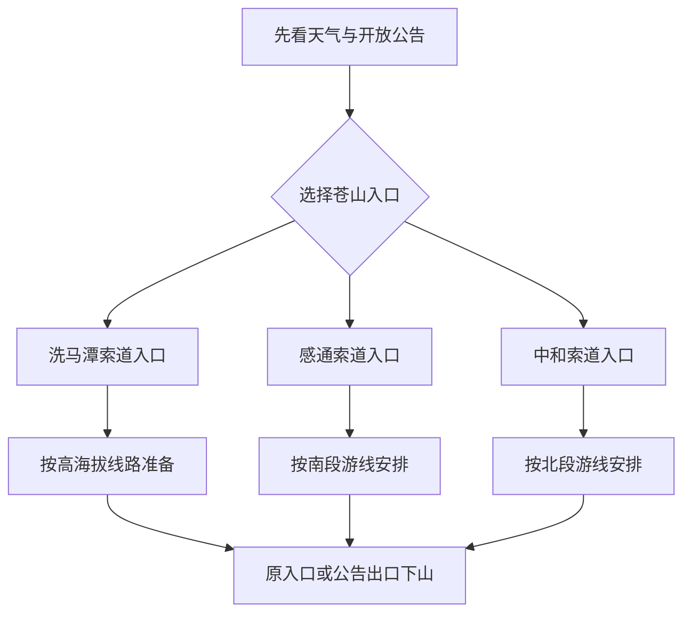
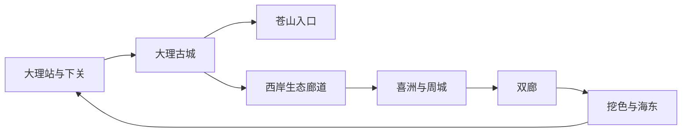

# 大理旅行指南

> **适合谁**：想在下关、大理古城、苍山和洱海之间做清楚取舍，并把喜洲或双廊作为独立片区安排，而不是一天匆忙“环海打卡”的旅行者。 
> **建议停留**：下关与大理古城 2 天，苍山和洱海西岸各 1 天；加入喜洲或双廊通常需 4–5 天，两处都深游可安排 6 天以上。 
> **核心取舍**：大理站、机场与州级公共服务集中在下关—满江一带，大理古城在苍山东麓北侧；苍山有多个不相通的运营入口，洱海沿岸也不是一条可随时高速绕行的景区道路。先选住宿基点和山、湖主题，再决定是否换宿喜洲或双廊。

## 城市速览

大理市是大理白族自治州州府所在地的法定县级市，行政区划代码为 `532901`。旅行语境中的“大理”常被同时用来指大理市、大理古城和整个大理州，本指南只把大理市现行行政范围内的下关、太和、满江、大理镇、银桥、湾桥、喜洲、上关、双廊、挖色、海东、凤仪与太邑等地作为城市内容。巍山、剑川、宾川、祥云、洱源、鹤庆、漾濞等州内县市拥有独立行政、交通和住宿结构，不并入大理市景点。

| 旅行问题 | 直接判断 |
|---|---|
| 第一次到大理住哪里 | 想方便进出站、机场接驳和城市餐饮，住下关；以古城、三塔和苍山为主，住大理古城及合法住宿集中区 |
| 只有一天 | 在“大理古城—大理市博物馆—崇圣寺三塔”与“下关—州博物馆—洱海公园”之间二选一，不跨到双廊 |
| 想上苍山 | 先选洗马潭、感通或中和其中一个入口，再核对索道、天气和开放段；不同入口不是同一售票口，也不能保证可以横向走通 |
| 想看洱海 | 西岸生态廊道适合选一段慢行；双廊、挖色和海东属于东岸或东北岸片区，需要公路或水运衔接，不能把环湖里程当普通城市骑行 |
| 想看白族建筑与手艺 | 喜洲古镇与周城适合组成一日；古宅、作坊和居民院落只在明确开放、付费或受邀时进入 |
| 想住双廊 | 把它当独立住宿片区，提前核对车辆落客、行李接驳、湖岸步行和返程，不把深夜赶回古城作为默认方案 |
| 雨季或大风天怎么办 | 删除高山、游船和长距离骑行，转入市州博物馆、古城公开展馆及下关城市路线；苍山天气不能用下关体感代替 |

大理市城市点位于下关核心区附近，固定 GeoNames 记录海拔为 1977 米。苍山高处可接近 4000 米，洱海西岸村镇、双廊和海东也有不同风、雨、日照与交通条件；“城市海拔”不能代表索道上站和山地步道。初到高原宜放慢节奏、补水和防晒，有心肺基础病、孕期、高龄或明显不适者应先获得专业意见，不以网红行程强行检验体力。

## 城市格局与游览区域

### 下关—太和—满江：交通与公共服务基点

下关是州府核心城区，大理站位于其南部交通片区，大理白族自治州博物馆、洱海公园和城市餐饮分布在下关及邻近区域；机场位于洱海东南侧，需地面接驳进入下关、古城或双廊。下关并非“大理古城的一个城门”，两地之间需要公交、直通车或出租车衔接。太和城遗址及南诏德化碑位于太和片区，适合放在下关与古城之间理解南诏都城迁移，但遗址保护区、村道和居民空间须分别识别。

### 大理古城—三塔：历史街区与公共场馆

大理古城以复兴路、人民路、洋人街一带为主要公共步行范围，大理市博物馆设于杜文秀帅府旧址。古城是活态街区，常住社区、学校、宗教场所、民宿和商业并存，不应把每座院落视作景点。崇圣寺三塔位于古城北郊，是独立售票与运营单元；从古城步行、公交或车辆到达后仍需为园区内长距离步行留出体力。

### 苍山东坡：三个主要入口不是一个站

苍山东坡常见的洗马潭、感通和中和入口分别连接不同索道、道路与游线。洗马潭索道从天龙八部影视城一带进入，可经中站前往高海拔上站；感通方向连接感通寺、清碧溪及玉带云游路南段；中和方向靠近古城西侧，连接中和寺和玉带路北段。即使地图显示玉带云游路可横向联系，天气、维修、防火、落石和运营状态也可能使其中一段关闭，不能先买一个入口的票再假定从另一入口下山。

索道运行只解决部分爬升，不等于高海拔无风险。上站风、雾、低温、紫外线和缺氧体感可快速变化；雷电、大风、冰雪、森林火险或设备维护出现时，应接受停运或缩短线路，不绕过围栏寻找“替代入口”。

### 洱海西岸生态廊道：选一段慢行

大理古城东侧的龙龛、才村向北延伸到磻溪、湾桥、古生、喜洲等地，形成多个可进入的湖岸与生态廊道片段。它们服务生态修复、居民出行、农业生产和游客慢行，不是一条完全封闭、全程服务密集的城市绿道。租车前确认车辆是否允许进入目标段、取还点是否相同、夜间是否营业；在湿地、芦苇、水鸟栖息地和农田边不离开开放路径。

### 喜洲—周城：古镇、田野与手艺

喜洲位于洱海西北岸，是独立古镇与生活社区，严家大院等具体院落各有开放和票务规则。周城位于更北侧，以白族扎染等活态技艺著称；参观正规传习所或明确接待的作坊，比随机进入居民院落更合适。稻田、乳畜生产、板蓝根种植、染布晾晒和乡村道路首先承担生产与生活功能，摄影不应踩入田埂、搬动布匹或要求居民配合摆拍。

### 双廊—挖色—海东：洱海东岸长线

双廊位于洱海东北岸，古镇步行区、玉几岛周边和通往南诏风情岛的码头是不同运营节点。挖色与小普陀方向继续向南，海东则更接近机场和东岸城市发展片区。东岸公路可能出现假期拥堵、施工、临时交通组织和停车限制；湖岸客栈、码头和餐馆并不形成连续公共通道。游船或摆渡只在当期批准码头、航线和天气条件下运行，不用私人揽客船替代正规水运。

这张环形关系图表示片区顺序，不表示存在一张通票或一条无需换乘的线路。四至六天更适合按西岸与东岸分日，短行程则应删除半圈，而不是压缩停留和返程余量。

### 行政、生态、水域与生产边界

洱海湖区、湖滨生态红线与生态保护缓冲区受专门制度管理，生态廊道属于湖滨保护与公共服务空间的一部分。进入廊道不表示可以走入湿地、下水游泳、露营生火、洗涤、垂钓、放飞无人机或靠近饮用水、监测、排污治理设施。苍山景区、苍山国家级自然保护区、世界地质公园和村镇林地的边界也不完全重合；游客只使用当期批准开放的索道、道路和步道。

## 主要景点

| 景点 | 区域 | 类型 | 主要看点 | 建议用时 | 室内外 | 体力 | 预约风险 | 天气影响 | 优先级 |
|---|---|---|---|---:|---|---|---|---|---|
| 大理白族自治州博物馆 | 下关 | 综合博物馆 | 州域历史、南诏大理、白族及多民族文化；作为一个完整场馆游览 | 2–3 小时 | 室内为主 | 低 | 闭馆日、临展与团体讲解需重查 | 低 | A |
| 洱海公园与团山公开区域 | 下关 | 城市公园、湖景 | 下关城市与洱海南端关系、公共绿地和观景 | 1–2 小时 | 室外 | 中低 | 个别区域维护、活动管制需确认 | 大风、强雨影响明显 | B |
| 太和城遗址及南诏德化碑 | 太和片区 | 考古遗址、文物 | 南诏早期都城与碑刻；遗址作为一个保护单元 | 2–3 小时 | 室外为主 | 中 | 展示区、讲解和道路状态需重查 | 强雨、日晒影响 | B |
| 大理古城公共街区 | 大理镇 | 历史街区、生活社区 | 城市格局、城门、复兴路与公共文化空间 | 半天 | 混合 | 中 | 大型活动与交通组织会变化 | 雨天石板湿滑 | A |
| 大理市博物馆 | 大理古城 | 历史博物馆 | 杜文秀帅府旧址、地方史和文物展示 | 2–3 小时 | 室内为主 | 低 | 闭馆日、预约和展厅开放需重查 | 低 | A |
| 崇圣寺三塔文化旅游区 | 古城北郊 | 文物、宗教文化景区 | 三塔文物、崇圣寺建筑群与苍洱空间关系 | 半天 | 混合 | 中至高 | 票制、观光车、宗教活动需确认 | 日晒、强雨影响 | A |
| 苍山洗马潭线路 | 古城西侧入口 | 高山、索道、地质 | 高海拔植被、冰川地貌与苍洱视野 | 半天至 1 天 | 室外为主 | 中至高 | 索道分段、票额与上站开放风险高 | 大风、雷电、雾雪影响极高 | A |
| 苍山感通—清碧溪线路 | 古城西南 | 山地、寺观、溪谷 | 感通入口、清碧溪与玉带路南段 | 半天至 1 天 | 室外为主 | 中至高 | 索道、步道和防火状态需重查 | 强雨、落石和雷电影响高 | B |
| 苍山中和线路 | 古城西侧 | 山地、寺观、步道 | 中和寺及玉带路北段；与其他入口分开核对 | 半天 | 室外为主 | 中至高 | 索道和步道维护风险较高 | 大风、雨雾影响高 | B |
| 龙龛—才村生态廊道片段 | 洱海西岸 | 湖滨、生态慢行 | 日出、村镇公共岸线与近古城慢行 | 2–4 小时 | 室外 | 中低 | 租车、取还点与车辆准入需确认 | 大风、暴晒、强雨影响 | A |
| 磻溪—古生生态廊道片段 | 湾桥一带 | 湖滨、乡村、生态 | 湿地修复、湖岸村落与田园关系 | 半天 | 室外 | 中 | 交通、廊道维护和社区活动需确认 | 大风、强雨影响 | B |
| 喜洲古镇 | 喜洲镇 | 古镇、白族建筑 | 街巷、合规开放院落、商帮与白族民居文化 | 半天至 1 天 | 混合 | 中 | 院落开放、展馆和活动需重查 | 雨天步行受影响 | A |
| 周城白族扎染公开传习点 | 喜洲镇周城 | 非遗、生活社区 | 扎花、染制与晾晒工序；只进入明确接待点 | 2–4 小时 | 混合 | 中低 | 体验课程与讲解宜预约 | 晾晒与生产受天气影响 | B |
| 蝴蝶泉公园 | 喜洲北侧 | 泉水、园林、文化景区 | 泉池、地方传说与公开游线 | 2–3 小时 | 室外为主 | 中 | 票制、活动和接驳需确认 | 强雨、湿滑影响 | C |
| 双廊古镇公共街区 | 双廊镇 | 古镇、湖岸社区 | 洱海东北岸街巷、白族村落与湖景 | 半天至 1 天 | 混合 | 中 | 落客、停车、住宿接驳变化快 | 大风、强雨影响 | A |
| 南诏风情岛 | 双廊镇 | 岛屿、经营景区 | 洱海岛屿景观与当代文化展示 | 2–3 小时 | 室外为主 | 中 | 摆渡、票务和停航风险高 | 风浪、雷电影响极高 | B |
| 挖色—小普陀公开观景点 | 挖色镇 | 湖岸、岛景、社区 | 东岸村镇与小普陀远近景；以当期开放为准 | 2–3 小时 | 室外 | 中 | 停车、水位、码头和岸线管理需确认 | 风浪、强雨影响高 | B |
| 海东公开滨水与城市观景区 | 海东镇 | 城市新区、湖景 | 洱海东岸观察苍山与城市发展；只用公共道路和平台 | 2–3 小时 | 室外 | 中低 | 道路施工、活动与停车需确认 | 午后逆光、大风影响 | C |

大理古城是一个历史街区，不把每条街、城门和商业院落拆成独立景点；崇圣寺三塔、洗马潭索道、感通索道和中和索道则因入口、票务、体力与天气决策不同而分别记录。生态廊道按可完成的片段组织，不把每个拍照平台或村口重复计数。

## 美食与餐饮

大理的饮食同时连接下关城市生活、白族节庆与村镇生产。乳扇、饵丝、喜洲粑粑、白族三道茶和下关沱茶常被当作“必吃清单”，更实用的做法是先分清份量、原料与卫生风险，再选择正规餐馆、茶馆或明确接待的非遗场所。生皮、生腌水产和野生菌的风险不能用“本地传统”抵消。

| 菜品或餐饮类型 | 常见区域 | 一个人用餐与常见份量 | 风味、过敏原与饮食限制 | 排队风险与替代方法 |
|---|---|---|---|---|
| 大理饵丝或饵块 | 下关、古城与各镇早餐店 | 通常按碗或份售卖，适合独行 | 米制品配肉帽、骨汤、酱油、花生和辣椒；米制不自动等于无麸质 | 选现煮社区店，汤底和调料可分放，不必追逐单一名店 |
| 喜洲粑粑 | 喜洲及大理古城 | 一只可作点心或简餐，甜咸口均有 | 常含小麦、油脂、糖或肉馅，可能含蛋和芝麻 | 喜洲热门时段可排队，可在正规烘焙店选择现制小份 |
| 乳扇 | 喜洲、周城及全市餐馆 | 小份分享或甜点，一人不宜一次点多种油炸做法 | 含乳；油炸版糖脂较高，乳糖不耐受者先少量尝试 | 选能说明储存和加工方式的门店，避免常温久置来源不明产品 |
| 白族三道茶 | 古城、喜洲及正规文化体验点 | 常按一套体验，适合一至多人 | 茶含咖啡因，配料可能含乳、核桃、花生、蜂蜜和糖 | 先问是否含演出、最低人数与收费；普通茶馆可替代套餐表演 |
| 下关沱茶 | 下关与全市正规茶馆 | 少量多泡，适合独行 | 含咖啡因；空腹、孕期、儿童及敏感者控制浓度 | 明码标价、先问试饮是否收费，购买时看标签并保留凭证 |
| 酸辣鱼或砂锅鱼 | 下关、古城与洱海沿岸 | 多为共享菜，独行先问小份 | 鱼刺、辣椒、腌菜、豆制品和汤底钠含量需留意 | 点活鱼先确认计价单位和加工费；可改点明确标价的鱼片小锅 |
| 白族家常菜与凉拌菜 | 下关、古城、喜洲 | 多人分享更合适，部分餐馆可做小份 | 腌菜、木瓜醋、辣椒、花生、芝麻和香草需逐项确认 | 选择明码标价餐馆，热门古镇可提前错峰用餐 |
| 生皮及生食水产 | 村镇宴席与部分餐馆 | 不作为必须体验项目 | 存在寄生虫、细菌与交叉污染风险；儿童、孕妇、老人和免疫力低者尤其不宜 | 最稳妥的替代是完全熟制的猪肉、鱼类和热菜 |
| 野生菌菜 | 雨季正规餐馆 | 常为共享菜 | 不自行采食、混食或购买品种不明散菌，必须充分加热 | 餐馆无法说明菌种和加工流程时，改点人工菌或普通蔬菜 |

进入喜洲、周城、双廊等生活社区用餐时，餐厅公开空间与居民厨房、仓储、染坊后场、奶牛养殖和田间生产不是同一范围。对严重过敏、清真、素食或无麸质有要求者，应把汤底、用油、蘸水和器具交叉接触一起问清；无法确认时在下关或古城的大型商超补给有完整标签的食品。

## 经典行程

### 一日古城与三塔路线

**路线**：大理古城公共街区 → 大理市博物馆 → 午餐与休息 → 崇圣寺三塔文化旅游区

- **适用人群**：首次到访、以历史与建筑为主、可完成半日步行的旅行者。
- **串联逻辑**：古城与市博物馆建立地方史背景，下午再进入独立运营的三塔景区；全程不跨洱海。
- **预约锚点**：市博物馆开馆日与三塔票务、最晚入园时间是当天锚点。
- **休息安排**：中午在古城坐下用餐并休息至少一小时；三塔园区内使用正式休息点和观光服务。
- **时间不足时**：保留古城主轴与市博物馆，删除三塔；不以夜间赶双廊补足“环海”。

### 一日下关与南诏历史路线

**路线**：大理白族自治州博物馆 → 下关午餐 → 太和城遗址及南诏德化碑 → 返回下关或古城

- **适用人群**：想先理解州域历史、以室内场馆为主或遇到苍山天气不佳的旅行者。
- **串联逻辑**：先从州博物馆建立南诏大理与民族文化框架，再到太和遗址对应真实空间；不是古城购物路线。
- **预约锚点**：州博物馆开馆与太和遗址展示区当期开放是首要锚点。
- **休息安排**：州博物馆结束后在下关完整午休，下午只走一个遗址单元。
- **时间不足时**：仅保留州博物馆和下关城市餐饮；太和遗址整段删除，不在闭馆前跨城。

### 一日苍山单入口路线

**路线**：洗马潭、感通或中和入口三选一 → 按当期开放游线游览 → 原入口或官方指定出口下山 → 古城休息

- **适用人群**：天气稳定、能适应高差，并接受因停运随时缩短线路的旅行者。
- **串联逻辑**：一天只围绕一个入口，避免把三条索道名称误当成连续观光线；高海拔目标优先给洗马潭，溪谷与较低海拔步道按感通或中和当期条件选择。
- **预约锚点**：索道实名票、分段运行、上站开放和森林防火公告共同构成锚点，任何一项不满足就降级。
- **休息安排**：上山前先吃易消化早餐，索道站和批准平台逐段休息；出现头痛、胸闷、明显气促或步态不稳立即下撤并求助。
- **时间不足时**：降级为中站或低海拔短线；取消横走玉带路，不绕围栏、不摸黑下山。

### 一日洱海西岸慢行路线

**路线**：大理古城 → 龙龛或才村进入生态廊道 → 选择一个向北片段慢行 → 合法取还点结束 → 返回古城

- **适用人群**：偏好湖岸慢行、摄影或亲子轻活动，不追求一天完成环湖里程的旅行者。
- **串联逻辑**：选择一个明确入口和回程点，以步行、合规自行车或运营接驳完成单段；湿地、村落和田野作为连续生态生活空间理解。
- **预约锚点**：租赁车辆准入、取还规则、末班接驳和廊道临时封控是首要锚点。
- **休息安排**：每 60–90 分钟在公共服务点休息补水，午后强日照或大风时提前返回。
- **时间不足时**：缩为龙龛—才村邻近短段；删除磻溪、喜洲和跨岸目标，不在无照明湖岸骑行。

### 一日喜洲与周城路线

**路线**：大理古城或下关 → 喜洲古镇 → 午餐与休息 → 周城明确开放的扎染传习点 → 原住宿地或喜洲住宿

- **适用人群**：对白族建筑、商帮史和活态手艺感兴趣，并愿意尊重社区生产节奏的旅行者。
- **串联逻辑**：上午看古镇公共街巷与开放院落，下午通过正规接待点理解扎染工序；不把稻田、居民院落和染布后场当免费摄影棚。
- **预约锚点**：院落开放、扎染课程与返程车辆是锚点；需要手作体验时提前确认时长和成品寄送。
- **休息安排**：午餐后在古镇公共空间休息，下午只安排一个传习点，不连续赶蝴蝶泉和双廊。
- **时间不足时**：保留喜洲古镇，删除周城；不以包车超速跨到东岸。

### 两日喜洲与双廊换宿路线

**第 1 天**：古城或下关 → 喜洲古镇 → 周城或西岸生态廊道二选一 → 喜洲或双廊住宿 
**第 2 天**：双廊古镇 → 南诏风情岛或挖色小普陀二选一 → 返回下关、古城或机场

- **适用人群**：至少有两整天、愿意换宿，并希望分别理解洱海西岸和东北岸的旅行者。
- **串联逻辑**：第一天完成西岸文化片区，第二天处理东岸水运或公路片区；岛屿与挖色不强行叠加。
- **预约锚点**：双廊住宿落客与行李接驳、南诏风情岛摆渡或东岸返程车是关键锚点。
- **休息安排**：换宿日不安排夜间赶路；第二天在双廊午休后再决定是否增加挖色。
- **时间不足时**：第二天只留双廊公共街区，删除岛屿与挖色；有航班或列车时至少预留独立跨岸缓冲。

### 四日第一次到访路线

**第 1 天**：抵达下关 → 州博物馆或洱海公园二选一 → 下关住宿 
**第 2 天**：大理古城 → 大理市博物馆 → 崇圣寺三塔 → 古城住宿 
**第 3 天**：苍山单入口路线 → 古城休息 
**第 4 天**：洱海西岸慢行，或喜洲一日二选一 → 返程

- **适用人群**：第一次到访、希望兼顾城市史、古城、山地和湖岸，同时不频繁换宿的旅行者。
- **串联逻辑**：抵达日先在下关适应海拔和交通，第二天处理历史主线，第三天把完整天气窗口留给苍山，第四天按体力选择湖岸或喜洲。
- **预约锚点**：第三天索道是全程最敏感锚点；若预报不佳，可与第二或第四天对调，但不把多个索道入口同时保留。
- **休息安排**：每天午后留一段坐下休息；苍山次日晚间不安排长距离骑行或跨岸换宿。
- **时间不足时**：依次删除喜洲、三塔或抵达日附加点，保留古城和一个山湖主题；双廊另行增加住宿天数。

## 住宿区域

| 住宿区域 | 适合谁 | 优点 | 主要代价与核对项 |
|---|---|---|---|
| 下关—大理站周边 | 早晚列车、机场接驳、商务或需要完整城市服务者 | 交通、餐饮、医院和商超较集中，适合抵达与离开 | 与古城、苍山入口有距离；核对酒店与车站具体出口、道路施工和夜间噪声 |
| 下关洱海南端 | 想兼顾城市服务与湖景者 | 靠近州博物馆、洱海公园等城市目的地 | 湖景不等于拥有私家岸线；核对步行入口、风噪、停车和合法经营 |
| 大理古城内外 | 首次到访、以古城、三塔和苍山为主者 | 步行餐饮丰富，前往多个西岸片区相对方便 | 古建消防、石板路、车辆禁限行、行李接驳和夜间噪声需确认；不要让车辆驶入禁止区域 |
| 龙龛—才村等西岸合规住宿 | 想早起看湖、慢行生态廊道者 | 接近西岸公开湖岸和骑行入口 | 与古城仍需接驳；确认住宿不占生态红线、车辆到达点、污水处理和退改 |
| 喜洲 | 想放慢节奏理解古镇与乡村者 | 适合避开当日往返，把古镇、周城分开 | 夜间餐饮和公共交通选择少于古城；核对院落消防、隔音、行李与返程 |
| 双廊 | 以东岸湖景、步行古镇和日出为主者 | 减少从古城当天往返的长距离交通 | 假期拥堵、落客和行李接驳复杂；临水房不代表可下水，核对消防、合法经营和退改 |
| 海东—机场方向 | 早班机、东岸短停或自驾衔接者 | 靠近机场及东岸道路 | 与古城、喜洲距离较远；核对航站楼接驳、施工、餐饮和夜间交通 |

预订民宿时应通过可核验平台查看经营主体、地址、消防与退改信息，临水、古建和村落住宿尤其要确认车辆实际停靠点。任何“苍山保护区内秘境”“洱海零距离下水”“私人码头接送”宣传都不能替代保护与水运许可；需要无障碍或电梯者也应取得房间入口、坡道、卫生间和行李搬运的具体答复。

## 市内交通

### 抵达与离开

大理站位于下关南部，是主要铁路客运入口；2024 年底启用的新站房不改变“车站不在大理古城”的空间事实。具体车次、检票口与退改以 [中国铁路 12306](https://www.12306.cn/) 为准。大理机场位于洱海东南侧，航班、航站楼、机场巴士与跨岸接驳以 [云南机场集团](https://www.ynairport.com/) 和承运人当期信息为准。机场、下关、古城、喜洲与双廊不是同一个接送价区，预约车辆前写明完整地址。

### 公交、景区直通与网约车

下关—古城之间有城市公交和旅游接驳，但线路编号、站位、末班和节假日交通组织会调整；旧攻略中的固定班次只能作历史参考。前往喜洲、周城、双廊、挖色或海东时，优先使用有资质的公交、客运、景区直通或网约车辆，不在车站和古城出口接受无法核验资质、价格与车牌的揽客。

### 自驾与停车

古城核心区、喜洲和双廊的车辆进入、落客和停车受道路条件与客流管理影响。导航终点应设置为当期开放停车场或住宿指定落客点，不把狭窄村道、生态廊道入口和湖岸生产路当捷径。雨季山路、环湖公路与东岸边坡可能出现积水、落石或施工；夜间不赶陌生山路，饮酒后不驾车。

### 骑行与生态廊道

租赁前检查刹车、轮胎、灯、头盔、保险、计费和取还范围，确认车辆类型是否允许进入目标廊道。骑行者与行人、运营接驳、村民生产出行共享空间，应按标线和限速通行，不并排占道、不用手机拍摄骑车、不将电动自行车驶入禁止路段。环洱海公路存在机动车、大车、弯道和侧风，“环湖”不是封闭赛道；普通旅行者更适合完成西岸一段后正规接驳返回。

### 游船、摆渡与水域

洱海游船、南诏风情岛摆渡和其他水上项目必须使用批准码头、实名票务和合规运营船舶。航线、开船时间、停靠点、风浪停航与返程地点均会变化；购票前同时确认“从哪里上船、在哪里下船、是否回到原码头”。不乘坐私人揽客船，不在非游泳区下水，不跨越围栏接近码头作业、水质监测或救援设施。

## 不同旅行者须知

| 旅行者 | 更适合的安排 | 主要风险 | 出发前确认 |
|---|---|---|---|
| 第一次到访 | 古城—市博物馆—三塔，加一个苍山或西岸廊道日 | 把下关、古城、双廊当同一片区，频繁折返 | 住宿基点、跨片区车程、索道或廊道规则 |
| 亲子家庭 | 州博物馆、市博物馆、古城短段与平缓湖岸 | 湖边落水、骑行混行、古城走失、高山温差 | 儿童座椅、护具、场馆规则、亲水边界和返程 |
| 长者或低体力旅行者 | 下关场馆、古城平缓短段、观光接驳和车辆串联 | 石板路、台阶、三塔长距离、苍山高差累积 | 最近落客点、座椅、电梯、索道站台与医疗点 |
| 无障碍需求 | 优先州博物馆等现代公共场馆，车辆接驳古城公开入口 | 古城石板、古宅门槛、山地步道与部分湖岸不连续 | 坡道、卫生间、轮椅尺寸、陪同规则与接驳车辆 |
| 摄影旅行 | 古城清晨、西岸公开观景点、喜洲与双廊公共街区 | 无人机限制、居民隐私、婚拍占道、湿地扰鸟 | 场馆摄影、无人机空域、三脚架、商业拍摄许可 |
| 独行旅行者 | 下关或古城作基点，用公共交通完成单片区 | 远端末班、私人揽客、夜骑与山地失联 | 回程票、车牌、离线地图、紧急联系人和通信信号 |
| 预算有限 | 免费公共街区、博物馆与一段生态廊道 | 包车、跨岸换宿、索道与多次租车是主要支出 | 免费场馆预约、公交、租车计费和住宿退改 |
| 雨季旅行 | 场馆、古城短段与下关城市路线 | 雷电、山洪、落石、路面积水、索道停运 | 气象与地质预警、景区关闭、道路管制和保险 |
| 国际旅行者 | 下关或古城合规住宿，实名购买铁路与景区票 | 证件识别、支付、通信和无人机规定差异 | 签证、护照登记、票务证件、支付与领事联系方式 |

白族村落、宗教场所、非遗传习和节庆活动都是活态生活，不是全天候演出。拍摄人物、婚礼、祭祀、扎染劳动和院落内部前先取得同意；不进入住宅、厨房、宗教后场、田地、畜牧区和生产车间。三道茶、扎染或民居参观只有在接待主体明确开放时才是旅游产品。

苍山与洱海的风险类型不同：苍山重点核对大风、雷电、低温、雾、冰雪、落石与森林火险；洱海重点核对强风、风浪、暴晒、雷雨、湿地保护和水域安全。天气或管理方关闭时，应取消整段户外路线；已经购买车票、租车或摄影服务不构成进入封闭区域的理由。

## 行前核对

| 核对事项 | 为什么需要重查 | 建议核对时间 | 官方入口 |
|---|---|---|---|
| 苍山三个入口与索道 | 洗马潭、感通、中和的入口、票务、开放段和出口不同，高海拔段可能单独关闭 | 订票前、前一日及当天早晨 | [大理州政府苍山资料](https://www.dali.gov.cn/dlzrmzf/c101724/pc/content/1968887167324360704/content_1968887167324360704.html)；景区与索道当期公告 |
| 苍山安全与森林防火 | 大风、雷电、冰雪、火险和设备维护会停运或封路 | 出发前三日逐日查看，入山当天再查 | [大理州政府苍山安全提示](https://www.dali.gov.cn/dlzrmzf/c101532/pc/content/2019595656597901312/content_2019595656597901312.html)；气象、林草和景区公告 |
| 大理古城与市博物馆 | 活动、交通组织、闭馆日、实名预约和古建维护会变化 | 排行程时、到访前一日 | [大理古城官方资料](https://www.dali.gov.cn/dlzrmzf/c101724/pc/content/1968887474976559104/content_1968887474976559104.html)；大理市文旅部门公告 |
| 崇圣寺三塔 | 票务、开放、观光车、宗教活动和最晚入园时间具有时效性 | 购票前及到访当天 | [大理州政府景区资料](https://www.dali.gov.cn/dlzrmzf/c101724/pc/content/1968887530844688384/content_1968887530844688384.html)；景区当期公告 |
| 洱海生态廊道 | 入口、维护、车辆准入、租赁取还、节庆分流和临时封控可能调整 | 租车前、出发前一日及抵达入口时 | [洱海“三区”管控实施细则](https://www.dali.gov.cn/dlzrmzf/xxgkml/c105993/pc/content/1970032608732614656/content_1970032608732614656.html)；大理市与运营方公告 |
| 洱海游船与岛屿摆渡 | 航线、码头、风浪停航、下船点和返程会变化 | 购票前、前一日及开船前 | [大理州政府洱海资料](https://www.dali.gov.cn/dlzrmzf/c101724/pc/content/1968886945315655680/content_1968886945315655680.html)；正规运营方当期票务 |
| 喜洲、周城与双廊 | 古镇交通、院落开放、扎染体验、落客停车和社区活动均会变化 | 订住宿或体验前、前一日 | [大理市人民政府](https://www.yndali.gov.cn/)；大理州文旅与属地公告 |
| 大理州博物馆与市博物馆 | 闭馆日、临展、预约、讲解和团队接待需重查 | 确定日期后及到访前一日 | [大理州文化和旅游局](https://www.dali.gov.cn/dlzrmzf/xxgkml/c105893/pc/content/1970057734102552576/content_1970057734102552576.html)；场馆官方渠道 |
| 大理站与铁路 | 车次、检票口、退改、重点旅客服务和站前交通随日期变化 | 购票时、出发前一日及乘车当天 | [中国铁路 12306](https://www.12306.cn/) |
| 大理机场与地面接驳 | 航线、航站楼、机场巴士、值机和道路施工具有时效性 | 购票前、起飞前一日及当天 | [云南机场集团](https://www.ynairport.com/)；承运航空公司 |
| 公交、客运、网约车与自驾 | 线路、末班、假日分流、停车和道路管制会改变跨片区时间 | 排行程时、前一日及出发前 | [大理州综合交通资料](https://www.dali.gov.cn/dlzrmzf/c101530/pc/content/2034538504627720192/content_2034538504627720192.html)；公安交管与运营方公告 |
| 天气、地质灾害与高原状况 | 下关天气不能代表苍山上站，雨季灾害与强风会同时影响山湖线路 | 出发前三日逐日查看，每天早晨重查 | [中央气象台](https://www.nmc.cn/)；云南省气象与自然资源部门预警 |
| 住宿、餐饮与体验经营 | 民宿消防、合法经营、临水安全、退改、食品与过敏原信息会变化 | 付款前、到店前一日及点餐时 | 经营主体证照与平台公示；[全国 12315 平台](https://www.12315.cn/) |
| 无人机与商业拍摄 | 古城古建、苍山保护地、洱海湿地、机场净空和人群密集区规则不同 | 携带设备前及每个片区起飞前 | [国家无人驾驶航空器一体化综合监管服务平台](https://uom.caac.gov.cn/)；属地公安、场馆与保护地公告 |

遇到索道停运、游船停航、生态廊道封控、道路抢险或森林防火命令时，应直接取消对应线路。任何住宿承诺、租车订单、旅拍合同或“当地人带路”都不能替代管理方公告；退改按照运营方、平台、保险与合同条款处理。

## 来源与更新记录

### 主要来源

| 来源 | 类型 | 支持内容 | 核验日期 |
|---|---|---|---|
| [大理统计年鉴 2024](https://www.dali.gov.cn/dlzrmzf/c105898/1971024559774732288/42c5Kj4p.pdf) | 州级统计资料 | 大理市下关、太和、满江、大理、喜洲、双廊、挖色、海东等现行乡镇街道结构 | 2026-08-12 |
| [云南省民政厅行政区划代码](https://ynmz.yn.gov.cn/cms/quhuadaima.html) | 省级行政区划主管部门 | 大理市法定县级市身份与代码 `532901` | 2026-08-12 |
| [大理州政府：大理古城](https://www.dali.gov.cn/dlzrmzf/c101724/pc/content/1968887474976559104/content_1968887474976559104.html) | 州级政府、景区资料 | 古城格局、市博物馆位置与下关—古城交通关系；具体时刻另行核对 | 2026-08-12 |
| [大理州政府：崇圣寺三塔](https://www.dali.gov.cn/dlzrmzf/c101724/pc/content/1968887530844688384/content_1968887530844688384.html) | 州级政府、景区资料 | 三塔文物与独立运营景区性质 | 2026-08-12 |
| [大理州政府：苍山](https://www.dali.gov.cn/dlzrmzf/c101724/pc/content/1968887167324360704/content_1968887167324360704.html) | 州级政府、景区资料 | 苍山地质生态、高海拔差异、洗马潭及玉带路与多索道关系 | 2026-08-12 |
| [大理州政府：苍山安全提示](https://www.dali.gov.cn/dlzrmzf/c101532/pc/content/2019595656597901312/content_2019595656597901312.html) | 州级政府安全提示 | 索道、开放游线与高山安全需以当期公告为准 | 2026-08-12 |
| [大理州政府：洱海](https://www.dali.gov.cn/dlzrmzf/c101724/pc/content/1968886945315655680/content_1968886945315655680.html) | 州级政府、景区资料 | 洱海游船、码头与双廊水运属于分线路运营；旧时刻不作长期事实 | 2026-08-12 |
| [洱海“三区”管控实施细则](https://www.dali.gov.cn/dlzrmzf/xxgkml/c105993/pc/content/1970032608732614656/content_1970032608732614656.html) | 州级生态保护规范 | 湖滨生态红线、生态保护核心区、缓冲区与绿色发展区边界 | 2026-08-12 |
| [洱海全民所有自然资源登记](https://www.dali.gov.cn/dlzrmzf/c108685/1971382229232881664/gPYZ7eQw.pdf) | 州级自然资源资料 | 洱海与大理市沿岸各街道乡镇的空间关系 | 2026-08-12 |
| [大理州政府：南诏风情岛](https://www.dali.gov.cn/dlzrmzf/c101724/pc/content/1968887464792788992/content_1968887464792788992.html) | 州级政府、景区资料 | 岛屿位于双廊、需摆渡进入及东岸空间关系；票价班次另查 | 2026-08-12 |
| [大理市非物质文化遗产保护名录](https://www.yndali.gov.cn/dlsrmzf/c103383/pc/content/1981555764790136832/content_1981555764790136832.html) | 县级政府、非遗资料 | 白族扎染、三道茶、下关沱茶等项目的保护名录关系 | 2026-08-12 |
| [大理州政府：周城扎染传承](https://www.dali.gov.cn/dlzrmzf/c101725/pc/content/1968887141365813248/content_1968887141365813248.html) | 州级政府、非遗资料 | 周城白族扎染的生产与社区背景 | 2026-08-12 |
| [大理州政府：下关沱茶](https://www.dali.gov.cn/dlzrmzf/c101709/pc/content/1968886797713903616/content_1968886797713903616.html) | 州级政府、非遗资料 | 下关沱茶历史、加工工序与城市产业关系 | 2026-08-12 |
| [联合国教科文组织：传统制茶技艺及其相关习俗](https://ich.unesco.org/en/RL/traditional-tea-processing-techniques-and-associated-social-practices-in-china-01884) | 国际组织、非遗档案 | 中国传统制茶技艺与相关社会实践的世界非遗框架 | 2026-08-12 |
| [大理州现代综合交通资料](https://www.dali.gov.cn/dlzrmzf/c101530/pc/content/2034538504627720192/content_2034538504627720192.html) | 州级政府、交通资料 | 大理站新站房、机场与区域综合交通枢纽关系 | 2026-08-12 |
| [GeoNames：Dali，记录 1814093](https://www.geonames.org/1814093/dali.html) | 开放地名数据 | 固定清单采用的下关城市点、名称、人口和坐标 | 2026-08-12 |
| [GeoNames：Dali，记录 1814039](https://www.geonames.org/1814039/dali.html) | 开放地名数据 | Wikidata `P1566` 所列县级行政记录，用于解释行政与城市点双粒度 | 2026-08-12 |
| [Wikidata：Q855228](https://www.wikidata.org/wiki/Q855228) | 开放结构化数据 | 大理市实体及其同时列出的城市点、行政记录两条 GeoNames 标识 | 2026-08-12 |

### 行政与旅行边界

大理市是大理州下辖的法定县级市，代码为 `532901`；州政府和州博物馆位于大理市，只说明州级机构所在地与公共服务范围，不把整个大理州并入本页。巍山彝族回族自治县、剑川县、祥云县、宾川县、弥渡县、南涧县、永平县、云龙县、洱源县、鹤庆县和漾濞彝族自治县均按独立目的地处理。鸡足山位于宾川县，巍山古城位于巍山县，沙溪古镇位于剑川县，石门关位于漾濞县，不纳入大理市景点表或一日近郊。

景点按运营和保护单元去重：大理古城公共街区与位于其中的大理市博物馆分别记录，因为后者有独立开馆与展陈；崇圣寺三塔与古城分开，因为票务、距离和体力不同；苍山三个索道入口分开，因为不能互换售票与进出；生态廊道按可完成片段记录，不拆分每个村口和拍照点。洱海湖区、码头、水上航线、湿地、农田、村落、民宿和餐饮后场各自服从水域、生态、生产、消防和社区管理。

### 地名标识说明

Wikidata 实体 `Q855228` 表示法定大理市，其 GeoNames 标识（`P1566`）截至核验时同时列出 `1814093` 与 `1814039`。`1814039` 属于县级行政单元粒度，适合表达大理市行政范围；本轮 GeoNames 2026-07-30 `cities500` 固定清单采用 `1814093`，它是位于下关核心城区的城市居民点记录，名称为 `Dali`，人口字段与城市点层级满足本项目入队规则。

两条记录不是两座需要分别计算的城市：`1814039` 保留法定行政范围关联，`1814093` 作为本页对应的固定城市点，`Q855228` 继续作为大理市 Wikidata 实体。下关是今天的州府与城市交通服务核心，大理古城是同一法定大理市内的历史城区；两者空间分离，但不重复建立两篇城市指南。

### 更新记录

| 日期 | 更新内容 |
|---|---|
| 2026-08-12 | 首次完成大理城市指南；建立下关—大理古城—苍山—洱海生态廊道—喜洲—双廊的空间结构，核对苍山多入口、洱海生态与水域边界、州内县市排除范围，并说明 GeoNames 城市点 `1814093`、行政记录 `1814039` 与 Wikidata `Q855228` 的双粒度关系。 |
