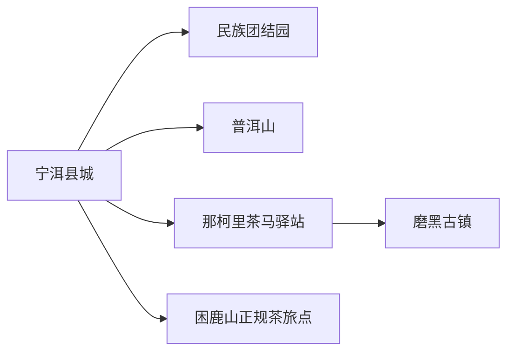
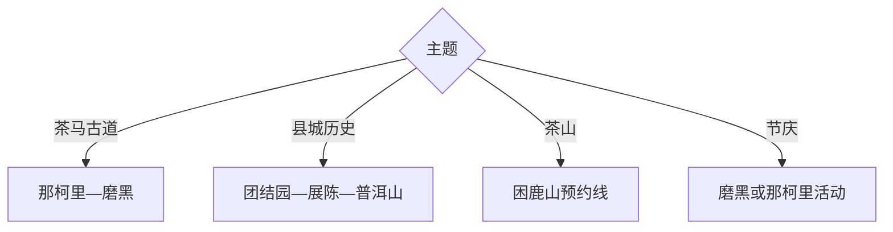

# 宁洱旅行指南

宁洱适合沿茶马古道理解普洱茶、盐业古镇与民族团结历史：县城的民族团结园和普洱山构成人文自然入口，那柯里是茶马驿站核心，磨黑古镇兼有盐业、红色文化与人物记忆，困鹿山适合预约制古茶山体验。

## 城市速览

| 项目 | 信息 |
|---|---|
| 主线 | 宁洱县城—民族团结园—普洱山—那柯里—磨黑古镇—困鹿山 |
| 停留 | 县城与那柯里1天；增加磨黑或茶山共2–3天 |
| 住宿 | 县城交通稳定，那柯里适合驿站慢住，磨黑适合古镇与红色线 |
| 交通 | 从普洱思茅或中老铁路站点进入，县内用公交、预约车或自驾 |
| 风险 | 雨季山路、茶山坡地、强紫外线、民族节庆客流与夜间乡道 |
| 边界 | 古茶树保护区、茶园生产线、文物本体、村民私域和森林封控段按许可进入 |

## 城市格局与游览区域

固定 `Ning’er / GeoNames 1799389` 对应宁洱县城，本页以法定宁洱哈尼族彝族自治县 `Q1339761` 组织。那柯里在县城以南，磨黑在北部，困鹿山为乡村茶山方向，适合分线而行。

## 主要景点

| 景点 | 区域 | 类型 | 核心体验 | 用时 | 环境 | 体力 | 预约风险 | 天气影响 | 优先级 |
|---|---|---|---|---:|---|---|---|---|---|
| 那柯里茶马驿站 | 同心镇 | 古道村落 | 茶马古道、驿站、非遗与村寨 | 3–6小时 | 室内外 | 中 | 高 | 高 | A |
| 磨黑古镇 | 磨黑镇 | 历史古镇 | 盐业、茶马古道、红色历史与民俗 | 半日至1天 | 室内外 | 中 | 高 | 高 | A |
| 普洱民族团结园 | 县城 | 纪念与历史 | 民族团结誓词碑及相关展陈 | 2–4小时 | 室内外 | 低 | 高 | 中 | A |
| 宁洱县博物馆或地方展陈 | 县城 | 地方文博 | 古普洱府、民族与茶盐历史 | 1.5–3小时 | 室内 | 低 | 很高 | 低 | A |
| 普洱山公开步道 | 县城周边 | 山地 | 城市近山、森林与俯瞰 | 3–5小时 | 室外 | 中高 | 中 | 很高 | B |
| 思普革命纪念馆 | 磨黑镇 | 红色文化 | 思普地区革命史与地方人物 | 1.5–3小时 | 室内 | 低 | 高 | 低 | B |
| 困鹿山正规茶文化接待点 | 宽宏方向 | 古茶山 | 古茶园、制茶与村落文化 | 半日至1天 | 室外 | 中高 | 极高 | 极高 | B |
| 磨黑—那柯里绿美旅游公路沿线 | 县域 | 交旅走廊 | 凤凰树景观、古道节点与乡村 | 半日 | 室外 | 低中 | 中 | 很高 | B |

## 美食与餐饮

可尝普洱茶、磨黑烧烤、米干、鸡豆腐、酸笋菜与哈尼彝族家常味。品茶先确认山头、季节、工艺和克价，按口感购买；茶山用餐提前约，野生菌选择正规餐馆并充分加工。

## 经典行程

### 一日经典线
**路线**：民族团结园—县级展陈—那柯里。**逻辑**：先建立历史背景，再进入茶马驿站。**预约锚点**：展馆、讲解与接驳。**休息**：那柯里。**删除条件**：闭馆时增加古道村落时间。

### 两日茶马线
**路线**：首日县城—那柯里；次日磨黑古镇—思普革命纪念馆。**逻辑**：茶马驿站与盐业红色古镇分日。**预约锚点**：纪念馆、住宿和车辆。**休息**：磨黑。**删除条件**：道路受雨影响时留县城。

### 茶山体验线
**路线**：正规接待点—困鹿山公开茶园—制茶或品茶。**逻辑**：由社区或经营者带领进入生产景观。**预约锚点**：茶季、车辆、费用与午餐。**休息**：村内接待点。**删除条件**：采制繁忙或雨天路滑时取消。

### 红色历史线
**路线**：民族团结园—磨黑思普革命纪念馆—古镇。**逻辑**：把民族团结与地方革命史放在同一历史线。**预约锚点**：讲解与场馆。**休息**：磨黑。**删除条件**：纪念馆闭馆时保留古镇公开点。

### 轻徒步线
**路线**：县城—普洱山公开入口—选定折返点—县城。**逻辑**：用近山步道补充自然视角。**预约锚点**：天气、开放和轨迹。**休息**：入口服务点。**删除条件**：雷雨、林火或湿滑时取消。

### 亲子非遗线
**路线**：县级展陈—那柯里—正规茶文化手作。**逻辑**：用古道故事和动手体验建立认知。**预约锚点**：年龄、材料和时长。**休息**：驿站。**删除条件**：活动不适龄时只走村落。

### 低体力线
**路线**：民族团结园—县级展陈—车辆到那柯里核心区。**逻辑**：以平路和落客点减少坡地。**预约锚点**：无障碍与座椅。**休息**：展馆。**删除条件**：乡道天气不佳时留县城。

## 住宿区域

宁洱县城适合铁路公路、餐饮与多方向换线；那柯里适合茶马驿站夜宿；磨黑适合古镇和红色文化；茶山住宿只选有明确经营与社区接待的点位，确认热水、消防、道路和退改。

## 市内交通

县城、那柯里、磨黑形成南北走廊，可按单向行程减少折返。茶山支路雨季条件变化大，预约熟悉路况的车辆；步行古道只选公开维护段，保存离线地图并在天黑前返程。

## 不同旅行者须知

历史旅行者优先团结园与磨黑；茶客先看展陈再访茶山；亲子家庭选那柯里；低体力者集中县城。古茶树保护范围、茶叶生产线、未开放古道、宗教祭祀空间和村民院落保留明确限制。

## 行前核对

- 核对团结园、纪念馆、那柯里、磨黑与茶山接待开放。
- 核对雨季道路、雷雨、林火、车辆、节庆客流和返程。
- 茶园按主人指定路线进入，购买茶叶保留产地、净重、价格与售后凭证。

## 来源与更新记录

| 来源 | 支持内容 | 核验日期 |
|---|---|---|
| [云南省民委：宁洱文旅线路](https://mz.yn.gov.cn/html/2026/difangdongtai_0609/4064109.html) | 磨黑、那柯里、民族团结园与思普革命纪念馆 | 2026-09-01 |
| [GeoNames 1799389](https://www.geonames.org/1799389/) | Ning’er 固定县城点 | 2026-09-01 |
| [Wikidata Q1339761](https://www.wikidata.org/wiki/Q1339761) | 宁洱县实体与跨库标识 | 2026-09-01 |

| 日期 | 更新 |
|---|---|
| 2026-09-01 | 首次完成宁洱旅行研究，按民族团结、茶马古道、磨黑古镇与茶山组织。 |
