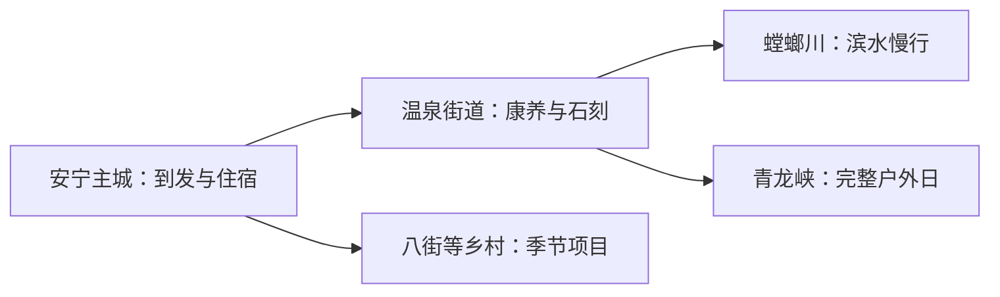
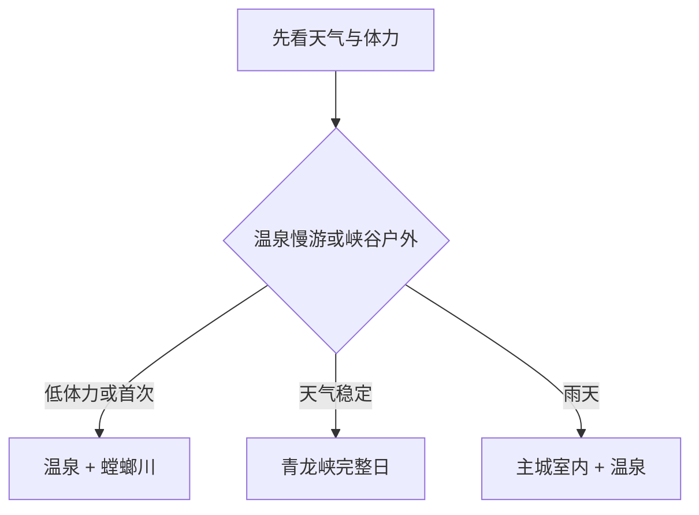

# 安宁旅行指南

安宁适合围绕温泉、螳螂川与青龙峡选择路线：主城提供住宿和补给，温泉街道适合慢游，青龙峡与茶园、花田等乡村项目则各占半日至一天。把温泉度假和峡谷户外分日，体验会比从昆明匆忙往返更完整。

> 建议停留：1–2 天 
> 旅行关键词：安宁温泉、螳螂川、曹溪寺、青龙峡、乡村花田、滇中山地 
> 主要体力：低至中等；峡谷路线较高 
> 最近研究：2026-08-13

## 城市速览

| 项目 | 旅行信息 |
|---|---|
| 主要旅行价值 | 用温泉—螳螂川理解安宁的康养传统，再选青龙峡或乡村方向 |
| 建议停留 | 1 天温泉片区；2 天增加青龙峡完整日 |
| 较舒适季节 | 春秋适合步道；雨季看预警，冬季早晚偏凉 |
| 预算特点 | 主城中低；温泉住宿、景区和车辆拉高预算 |
| 步行强度 | 温泉片区低至中，青龙峡中至高 |
| 主要天气风险 | 强降雨、山洪、雷暴、高温和山火 |
| 独行旅行 | 主城与温泉方便；远线先锁定返程 |
| 亲子旅行 | 温泉适龄设施、农事研学和青龙峡轻量线路可选 |
| 长者与低体力旅行 | 温泉街区和螳螂川短段更合适 |
| 无障碍信息 | 度假设施可逐家咨询；寺院、山地和乡村设施连续性需向官方确认 |

## 城市格局与游览区域

安宁市是昆明市代管的县级市，法定代码 `530181`。固定 GeoNames `1803886` 是安宁主城居民点；Wikidata `Q567193` 代表法定安宁市，`P1566` 连接较广记录 `1818007`。主城沿螳螂川展开，温泉街道在西北，青龙峡继续向西北，太平新城靠近昆明方向，八街等乡村片区需独立公路交通。

| 区域 | 主要内容 | 怎么安排 | 与其他区域的关系 |
|---|---|---|---|
| 安宁主城 | 到发、住宿、餐饮与公共文化 | 抵离日或半日 | 温泉和青龙峡的基地 |
| 温泉街道 | 温泉、摩崖石刻、曹溪寺与慢行 | 半日至一天 | 可与螳螂川组合 |
| 螳螂川开放滨水段 | 河谷、花田与公共步道 | 2–3 小时 | 花期和水情决定体验 |
| 青龙峡 | 峡谷、森林、溪流与正式项目 | 独立一天 | 与温泉分日更舒适 |
| 八街及乡村 | 玫瑰、农业和当期研学 | 有接待时半日至一天 | 先确认花期和交通 |

## 主要景点

### 温泉与主城

| 景点 | 区域 | 类型 | 主要看点 | 建议用时 | 室内外 | 体力 | 预约风险 | 天气影响 | 优先级 |
|---|---|---|---|---:|---|---|---|---|---|
| 安宁温泉旅游度假片区 | 温泉街道 | 温泉与康养 | 温泉文化、度假设施和螳螂川河谷 | 半日至一天 | 混合 | 低 | 高 | 中 | A |
| 曹溪寺与摩崖石刻公开区域 | 温泉街道 | 寺院与文物 | 历史建筑、石刻与山谷环境 | 2–3 小时 | 混合 | 中 | 高 | 高 | A |
| 金色螳川开放滨水段 | 温泉—青龙 | 河谷与季节景观 | 滨水慢行、花田和山谷景观 | 2–3 小时 | 室外 | 低至中 | 中 | 很高 | B |
| 安宁市公共文化场馆 | 主城 | 文博与公共文化 | 地方史、当期展览和雨天替代 | 1–2 小时 | 室内 | 低 | 高 | 低 | B |

### 峡谷与乡村

| 景点 | 区域 | 类型 | 主要看点 | 建议用时 | 室内外 | 体力 | 预约风险 | 天气影响 | 优先级 |
|---|---|---|---|---:|---|---|---|---|---|
| 青龙峡风景区 | 青龙街道 | 峡谷与森林 | 溪流、瀑布、森林和正式体验项目 | 5–7 小时 | 室外 | 中至高 | 高 | 很高 | A |
| 八街玫瑰与正式农旅项目 | 八街街道 | 花卉与农业 | 花期、农事与当期研学 | 半日至一天 | 混合 | 中 | 很高 | 高 | B |
| 正式工业文化或研学项目 | 市域工业片区 | 工业与城市转型 | 在运营方接待范围内理解工业城市 | 半日 | 室内为主 | 低 | 很高 | 低 | C |

温泉由不同经营主体运营，适合先选一家与自身需求匹配的场所。螳螂川兼具公共景观和河道治理功能，沿开放步道活动；青龙峡、矿山、磷化工园区、铁路专用线和在产厂区按各自管理范围参观。

## 美食与餐饮

| 菜品或餐饮类型 | 常见区域 | 一个人用餐与常见份量 | 风味、过敏原与饮食限制 | 排队风险与替代方法 |
|---|---|---|---|---|
| 云南米线与饵丝 | 主城、温泉 | 一碗一人份 | 汤底可能含肉、花生、芝麻和豆制品 | 早餐和午间可错峰 |
| 温泉片区家常滇菜 | 温泉街道 | 热菜多适合共享 | 辣椒、菌类、乳制品和坚果需确认 | 度假区满位时回主城 |
| 八街玫瑰食品 | 八街及主城 | 糕点、饮品易少量尝试 | 可能含糖、蜂蜜、小麦、蛋奶 | 选正规包装并看配料 |
| 山野菌与季节菜 | 主城和乡村 | 锅类适合多人 | 菌类须由正规餐饮充分烹熟 | 选择有资质餐馆，不自行采食 |

## 经典行程

### 一日经典路线

**路线**：温泉街道 → 曹溪寺或摩崖石刻公开区 → 午餐与休息 → 金色螳川短段 → 预约温泉

- **串联逻辑**：历史、河谷与温泉集中在同一方向。
- **预约锚点**：先锁定温泉场所和寺院开放。
- **休息安排**：午间和泡汤前各留一次长休。
- **时间不足时**：保留温泉与一处文化点。

### 两日城市路线

**第 1 天**：温泉—螳螂川慢游 
**第 2 天**：青龙峡完整日

- **串联逻辑**：低体力与高体力体验分日。
- **预约锚点**：青龙峡票务、交通与项目开放。
- **休息安排**：连续住主城或温泉片区，峡谷内按游客中心休息。
- **时间不足时**：第二天改为主城公共文化半日。

### 三日深度路线

**第 1 天**：安宁主城与公共文化 
**第 2 天**：温泉、曹溪寺与螳螂川 
**第 3 天**：青龙峡或八街农旅二选一

- **串联逻辑**：城市、康养和远郊分别成日。
- **预约锚点**：第三天按天气与接待二选一。
- **休息安排**：温泉日减负，远郊日预留返程缓冲。
- **时间不足时**：删第一天主城补充。

### 雨天路线

**路线**：安宁市公共文化场馆 → 主城午餐 → 已确认营业的温泉设施

- **适用条件**：普通降雨可行；强降雨与山洪预警时留在城区。
- **预约锚点**：场馆开放、温泉时段和道路状态。
- **休息安排**：全程以室内暖区衔接。
- **时间不足时**：保留温泉或一个室内场馆。

### 亲子或低体力路线

**亲子路线**：适龄公共文化活动 → 午餐 → 温泉片区亲子设施或农事研学 
**低体力路线**：车辆到曹溪寺近端 → 长休 → 螳螂川平缓短段 → 温泉

- **减负方式**：亲子线一次只选一个付费项目；低体力线减少峡谷、台阶和长距离步行。
- **预约锚点**：儿童规则、水温、电梯和入口距离。
- **休息安排**：午间至少一小时室内休息。
- **时间不足时**：两类路线都保留温泉片区。

### 远郊一日路线

**路线**：安宁主城 → 青龙峡 → 景区午餐与休息 → 原路返回

- **适用条件**：无强降雨、山洪和火险高风险，返程车辆已确定。
- **预约锚点**：景区门票、观光项目与当期专线。
- **休息安排**：只在游客中心和正规服务点休息补给。
- **时间不足时**：整段改期，选择温泉—螳螂川路线。

## 住宿区域

| 区域 | 优点 | 缺点 | 适合人群 | 交通特点 |
|---|---|---|---|---|
| 安宁主城 | 交通、餐饮和价格选择较多 | 泡汤需短途移动 | 首访、预算型与多日旅行 | 便于昆明往返和连接各街道 |
| 温泉街道 | 康养氛围和清晨慢游方便 | 价格与设施差异大 | 温泉主题、长者与低体力旅行 | 选好场所后减少当日移动 |
| 青龙或乡村接待点 | 靠近远郊体验 | 交通与供应波动较大 | 自驾或已预约活动者 | 先确认夜间交通和正式住宿资质 |

## 市内交通

从昆明到安宁可选城际公交、公路客运或自驾，具体到达点可能在主城、太平或温泉方向。市内景点分散，主城与温泉可用公交和短途车辆，青龙峡和八街方向以当期专线、自驾或合规预约车更稳妥。

| 场景 | 建议与取舍 | 行前需要重查的内容 |
|---|---|---|
| 昆明往返 | 先按住宿位置选到达点 | 站点、班次和施工 |
| 主城—温泉 | 公交或短途车辆 | 首末班、活动管制和返程 |
| 青龙峡 | 当期旅游专线或预约车辆 | 成团条件、集合点和退改 |
| 自驾 | 适合峡谷与乡村 | 山路、停车、雨季和充电 |

## 不同旅行者须知

| 旅行维度 | 可行条件 | 主要取舍 | 需额外核对 |
|---|---|---|---|
| 独行旅行 | 主城或温泉住宿已定 | 远郊选有公共接驳的一条 | 末班和夜间到达 |
| 亲子旅行 | 温泉和景区适龄项目明确 | 水上、峡谷和农事一次选一项 | 年龄身高、救生与退改 |
| 长者或低体力旅行 | 温泉、车辆和短段步道组合 | 青龙峡改为温泉文化线 | 台阶、电梯和休息座椅 |
| 无障碍需求 | 现代度假设施可逐家咨询 | 古寺、峡谷与乡村连续动线有限 | 设施连续性需向官方确认 |
| 摄影旅行 | 河谷、花田和峡谷题材丰富 | 花田与农地兼具生产属性 | 无人机、商业拍摄和花期 |
| 雨季旅行 | 主城室内与温泉可替换 | 山洪预警时减少山谷行程 | 预警、闭园和道路状态 |

## 行前核对

| 核对事项 | 为什么需要重查 | 建议核对时间 | 官方入口 |
|---|---|---|---|
| 温泉场所 | 水温、项目、价格和维护不同 | 预订前及当天 | [安宁市人民政府](https://www.ynan.gov.cn/) |
| 青龙峡 | 门票、专线和户外项目会调整 | 出发前一周及当天 | [昆明公交集团资讯](https://www.kunming.cn/) |
| 公共文化与寺院 | 开放时段和宗教活动会变化 | 到访前一日 | [安宁市人民政府](https://www.ynan.gov.cn/) |
| 天气、水情与火险 | 河谷和峡谷对强降雨敏感 | 出发前三日及当天 | [云南省气象局](http://yn.cma.gov.cn/) |

## 来源与更新记录

### 主要来源

| 来源 | 类型 | 支持内容 | 核验日期 |
|---|---|---|---|
| [昆明乡村旅游精品线路](https://kunming.yunnan.cn/system/2026/04/30/033989522.shtml) | 官方媒体转载 | 温泉、曹溪寺、摩崖石刻、螳螂川与青龙峡线路 | 2026-08-13 |
| [昆明公交青龙峡专线](https://www.kunming.cn/news/c/2026-06-02/14047435.shtml) | 公交信息 | 青龙峡属性、预约专线和往返方式 | 2026-08-13 |
| [云南省水利厅：螳螂川巡查](https://wcb.yn.gov.cn/html/2023/yewuzhuanlan_1124/57803.html) | 省水利厅 | 河道治理、青龙峡与水域边界 | 2026-08-13 |
| [云南省农业农村厅：金色螳川](https://nync.yn.gov.cn/html/2021/zhoushilianbo-new_0730/379636.html) | 省农业农村厅 | 温泉—青龙沿河季节景观 | 2026-08-13 |
| [云南省国资委：安宁温泉国际生态旅游康养小镇](https://gzw.yn.gov.cn/xwzx/ssqy/202503/t20250311_2948833.html) | 省国资委 | 温泉康养与文旅配套方向 | 2026-08-13 |
| [云南省水利厅：螳螂川水质治理](https://wcb.yn.gov.cn/html/2021/tjhhczymysjsynmlxfhh_0628/51598.html) | 省水利厅 | 河道与水环境管理 | 2026-08-13 |
| [GeoNames 1803886](https://www.geonames.org/1803886/anning.html) | 开放地名数据 | 固定主城点 | 2026-08-13 |
| [Wikidata Q567193](https://www.wikidata.org/wiki/Q567193) | 开放结构化数据 | 法定安宁市实体与P1566粒度 | 2026-08-13 |
| [中国铁路12306](https://www.12306.cn/) | 铁路运营方 | 当期城际铁路查询 | 2026-08-13 |

### 更新记录

| 日期 | 更新内容 |
|---|---|
| 2026-08-13 | 首次完成安宁温泉、螳螂川、青龙峡、乡村与工业边界研究 |
