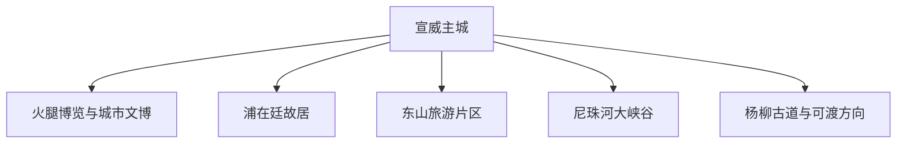
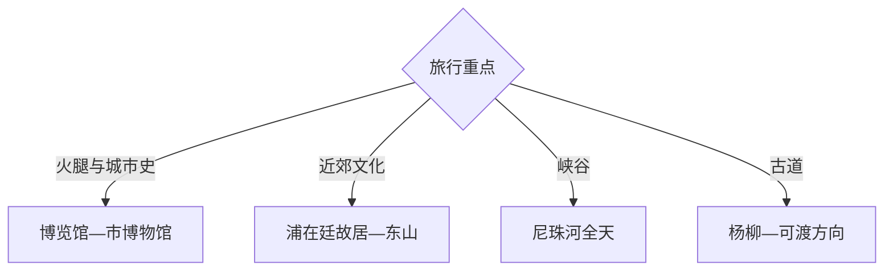

# 宣威旅行指南

宣威位于滇东北省际通道，以宣威火腿饮食与制作文化、城市文博、浦在廷故居、东山片区、尼珠河大峡谷和杨柳古道形成美食、人文与峡谷组合。固定快照中的 **Xuanwei / GeoNames 1797119** 对应宣威主城；尼珠河、杨柳古道等远线与主城距离较长，适合独立留日。

## 城市速览

| 项目 | 信息 |
|---|---|
| 主线 | 火腿文化—城市文博—浦在廷故居—东山—尼珠河 |
| 停留 | 主城1天；东山或尼珠河各另留1天 |
| 住宿 | 主城适合铁路换乘、美食体验和连续住宿 |
| 交通 | 铁路、公路进入，峡谷与乡镇远线需专门接驳 |
| 季节 | 夏季避暑、秋冬美食；雨季关注峡谷地灾 |
| 预算 | 远线车辆、景区交通和讲解增加预算 |

## 城市格局与游览区域

主城承担住宿、铁路和火腿文化体验；浦在廷故居与东山属于城市及近郊文化方向，尼珠河大峡谷位于更远乡镇，杨柳古道—可渡又是另一历史通道。峡谷、河谷、洞穴、索道建设区、煤矿与火腿加工生产线分别按照景区开放、地灾预警和企业接待边界进入。

## 主要景点

| 景点 | 区域 | 类型 | 核心体验 | 用时 | 环境 | 体力 | 研究价值 | 拥挤 | 优先级 |
|---|---|---|---|---:|---|---|---|---|---|
| 中国·宣威火腿博览馆开放区 | 主城 | 非遗与饮食 | 火腿历史、工艺和产业链 | 2–3小时 | 室内 | 低 | 很高 | 节假日中 | A |
| 宣威市博物馆 | 主城 | 城市史与文博 | 地方历史、交通与地域文化 | 2小时 | 室内 | 低 | 很高 | 低 | A |
| 浦在廷故居公开区 | 主城周边 | 名人与建筑 | 近代地方史、民居与实业文化 | 2小时 | 混合 | 低 | 高 | 节假日中 | A |
| 东山旅游景区公开区 | 东山方向 | 山地与文化 | 山林、眺望与近郊文化 | 半天 | 室外 | 中 | 高 | 周末中 | B |
| 芙蓉彝寨正规接待区 | 东山方向 | 村寨与民俗 | 彝族文化、乡村景观和火腿饮食 | 半天 | 混合 | 低中 | 高 | 节庆中 | B |
| 尼珠河大峡谷景区 | 普立方向 | 峡谷与桥梁 | 峡谷地貌、瀑布和高桥景观 | 1天 | 室外 | 高 | 很高 | 节假日高 | A |
| 杨柳古道雄关公开段 | 杨柳方向 | 古道与关隘 | 滇黔通道、关隘与边界历史 | 1天 | 室外 | 中高 | 很高 | 低 | B |

## 美食与餐饮

宣威火腿是核心体验，可比较蒸、炖、炒等地方吃法，并搭配荞麦、土豆、玉米和时令山地蔬菜。火腿博览与餐饮体验选择正规接待点；加工车间在企业开放、卫生与安全安排明确时参观。

## 经典行程

### 火腿文化线
**路线**：火腿博览馆开放区—正规工艺展示—地方餐饮。**逻辑**：从历史、制作到味觉建立完整认识。**预约锚点**：博览馆与企业接待。**休息**：主城。**删除条件**：生产参观暂停时保留博览与餐饮。

### 主城文博线
**路线**：宣威市博物馆—浦在廷故居—城市公园。**逻辑**：用一天串联地方史与近代实业记忆。**预约锚点**：场馆和故居开放。**休息**：主城。**删除条件**：闭馆时改火腿文化与城市漫步。

### 东山乡村线
**路线**：主城—东山景区公开段—芙蓉彝寨正规接待区—返城。**逻辑**：组合山地眺望与乡村文化。**预约锚点**：景区、村寨接待与防火。**休息**：正规服务点。**删除条件**：雷雨、大雾或防火封控时改主城。

### 尼珠河峡谷线
**路线**：主城—尼珠河景区正式入口—开放观景台与步道—返程。**逻辑**：独立一天容纳长距离接驳和峡谷游览。**预约锚点**：道路、景区交通与项目运行。**休息**：游客中心。**删除条件**：暴雨、山洪、落石或施工管制时取消。

### 杨柳古道线
**路线**：主城—杨柳方向—古道雄关公开段—可渡村正规接待点—返程。**逻辑**：以滇黔交通史组织北部远线。**预约锚点**：道路、文保点与村寨接待。**休息**：正规接待点。**删除条件**：雨雾、道路或文保维护时顺延。

### 美食轻松线
**路线**：主城早市—火腿主题餐饮—城市公园—地方晚餐。**逻辑**：用低体力方式集中体验饮食文化。**预约锚点**：正规餐厅和个人饮食需求。**休息**：主城多次安排。**删除条件**：无特别条件，可按到离时间压缩。

### 三日组合线
**路线**：首日火腿与主城文博；次日尼珠河；第三日东山或杨柳古道。**逻辑**：城市、峡谷和山地古道分日。**预约锚点**：远线道路与天气。**休息**：主城连续住宿。**删除条件**：两天时删第三日。

## 住宿区域

主城靠近公共交通和餐饮，适合作为各方向远线的连续住宿点；早班铁路出发时优先选择接驳明确的区域。乡镇住宿选择资质、消防、热水、停车与通信信息清晰的经营主体。

## 市内交通

宣威站等铁路节点与公路客运服务主城，具体车次和站点以出发日信息为准。东山、尼珠河、杨柳分属不同方向，按单线往返组织；雨季山路把落石、积水、雾和施工绕行纳入时间冗余。

## 不同旅行者须知

美食旅行者围绕博览馆、正规工艺展示和餐饮安排；历史旅行者组合市博物馆、浦在廷故居与杨柳古道；亲子与长者优先主城及东山低强度段；户外旅行者把尼珠河单列全天。活跃火腿工厂、煤矿和工业园区、峡谷未开放步道、河道、索道施工区、文保建筑内部和居民住宅保留明确限制。

## 行前核对

- 核对火腿博览馆、市博物馆、浦在廷故居与东山开放。
- 核对尼珠河景区交通、步道、项目运行和峡谷天气。
- 核对杨柳古道文保边界、乡镇道路与正规接待。
- 核对暴雨、山洪、滑坡、森林防火与铁路班次。

## 来源与更新记录

| 来源 | 支持内容 | 核验日期 |
|---|---|---|
| [曲靖市人民政府：宣威持续打造特色旅游品牌](https://www.qj.gov.cn/html/2024/bmdt2_0906/269139.html) | 火腿博览、城市文博、东山、尼珠河与杨柳线路 | 2026-09-03 |
| [曲靖市人民政府：宣威国土空间总体规划批复](https://www.qj.gov.cn/html/2024/ghjh_0527/266082.html) | 城市定位、空间关系、文保与安全韧性边界 | 2026-09-03 |
| [GeoNames 1797119](https://www.geonames.org/1797119/) | Xuanwei 固定人口点与宣威主城位置 | 2026-09-03 |
