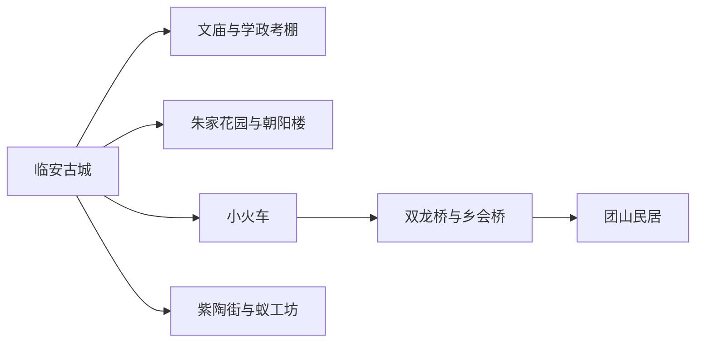
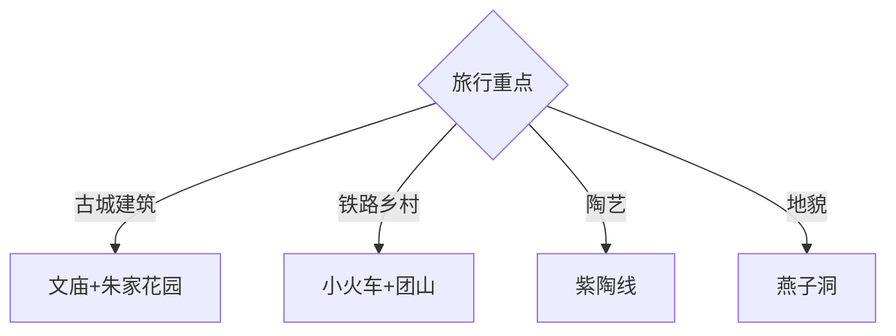

# 建水旅行指南

建水最适合围绕临安古城、小火车—双龙桥—团山和紫陶三条线展开。古城内的文庙、朝阳楼、朱家花园与学政考棚可步行组合；团山、燕子洞和乡村车站需要单独交通。把元阳梯田或石屏古城并入同一天，会牺牲建水本身的深度。

## 城市速览

| 项目 | 信息 |
|---|---|
| 主线 | 临安古城—建水文庙—朱家花园—小火车—双龙桥—团山—紫陶 |
| 停留 | 古城1–2天；团山小火车1天；燕子洞或陶艺另留1天 |
| 住宿 | 古城适合步行与夜间餐饮；车站周边便于小火车；乡村住宿适合慢游 |
| 交通 | 建水站接驳古城，古城步行加短途车辆，团山与燕子洞按专线或包车 |
| 风险 | 高原紫外线、夏季暴雨、古城石板湿滑、洞穴与乡村道路 |
| 边界 | 文物古建、古井、铁路运营区、紫陶窑炉、洞穴生态和居民院落按正式开放范围进入 |

## 城市格局与游览区域

固定 **Jianshui / GeoNames 9931406** 位于建水县城，本页以它定位临安古城入口，并用建水县实体 `Q1201028`、代码 `532524` 确定县域范围。古城核心适合步行，小火车沿米轨连接双龙桥、乡会桥和团山方向；燕子洞在更远郊。元阳、石屏和蒙自均为其他县市，联程时分配独立旅行日。

## 主要景点

| 景点 | 区域 | 类型 | 核心体验 | 用时 | 环境 | 体力 | 研究价值 | 拥挤 | 优先级 |
|---|---|---|---|---:|---|---|---|---|---|
| 建水文庙 | 临安古城 | 古建筑 | 礼制空间、泮池与地方教育史 | 2–3小时 | 混合 | 中 | 很高 | 高 | A |
| 朱家花园 | 临安古城 | 民居园林 | 清末宅院、家族史与滇南建筑 | 2–3小时 | 混合 | 中 | 很高 | 高 | A |
| 朝阳楼与古城公共街区 | 临安古城 | 城楼街区 | 城门、老街、井水文化与城市生活 | 2–4小时 | 混合 | 中 | 很高 | 高 | A |
| 云南提督学政考棚 | 临安古城 | 科举建筑 | 科举制度、考棚格局与地方教育 | 1.5–2.5小时 | 室内 | 低 | 高 | 中 | A |
| 建水古城小火车 | 古城至团山方向 | 遗产铁路 | 米轨车站、田园和铁路历史 | 半日至1天 | 混合 | 中 | 高 | 高 | A |
| 双龙桥 | 城西 | 古桥 | 十七孔桥、水田与交通遗产 | 1–2小时 | 室外 | 低至中 | 很高 | 中高 | B |
| 团山民居 | 西庄镇 | 传统村落 | 张氏民居、古村格局与装饰艺术 | 3–5小时 | 混合 | 中 | 很高 | 中 | A |
| 紫陶街—蚁工坊正式开放区 | 县城 | 工艺街区 | 建水紫陶、当代空间与夜间消费 | 2–4小时 | 混合 | 中 | 高 | 夜间高 | B |
| 燕子洞正式景区 | 面甸方向 | 洞穴景区 | 喀斯特洞穴、季节燕群与地貌 | 1天含往返 | 混合 | 高 | 高 | 旺季高 | C |

## 美食与餐饮

建水烧豆腐、草芽、汽锅鸡、过桥米线与烤鸭可在古城和紫陶街周边组合。豆制品关注大豆与蘸水中的花生芝麻，汽锅鸡与烤鸭适合多人共享；烧豆腐摊位按实际数量或份量计价，先确认计价方式。古井水体现地方生活文化，旅行饮水选择安全处理后的供应。

## 经典行程

### 两日基础线
**路线**：古城核心—小火车或车辆—双龙桥—团山。**逻辑**：一天城市、一天下乡。**预约锚点**：小火车与核心景点。**休息**：古城午休。**删除条件**：票务不足时以车辆完成团山线。

### 古城建筑线
**路线**：朝阳楼—文庙—学政考棚—朱家花园。**逻辑**：按城门、教育与宅院层次展开。**预约锚点**：联票、开放和讲解。**休息**：翰林街。**删除条件**：时间不足时保留文庙与朱家花园。

### 米轨乡村线
**路线**：临安站—双龙桥—乡会桥—团山。**逻辑**：以米轨连接车站、桥梁与村落。**预约锚点**：车票、座位和返程。**休息**：车站与团山服务点。**删除条件**：停运时改合规车辆。

### 紫陶工艺线
**路线**：紫陶博物或正式展陈—工坊体验—紫陶街。**逻辑**：先理解泥料与烧制，再选择消费。**预约锚点**：课程与窑炉开放。**休息**：紫陶街。**删除条件**：只有生产作业时只看展陈。

### 燕子洞地貌线
**路线**：县城—燕子洞正式入口—开放洞穴游线—返城。**逻辑**：把远郊洞穴完整成日。**预约锚点**：门票、交通与季节活动。**休息**：游客中心。**删除条件**：暴雨、洞内管控或道路异常时取消。

### 井水与小吃线
**路线**：古城公开古井—烧豆腐—草芽与市场—朝阳楼夜景。**逻辑**：以日常饮食理解城市生活。**预约锚点**：市场营业与食品安全。**休息**：古城茶馆。**删除条件**：高温时缩短市场段。

### 低体力线
**路线**：车辆到文庙—朱家花园—紫陶街平缓段。**逻辑**：用车辆与室内座席降低石板步行。**预约锚点**：无障碍入口。**休息**：每站院落或餐饮区。**删除条件**：雨天只留两处场馆。

## 住宿区域

临安古城内外适合夜游、餐饮和早晨进景点，选择时核对车辆是否能到门前及古建隔音；小火车临安站周边适合早班；新城与建水站方向适合铁路抵离；团山正规民宿适合村落慢游。元阳梯田早出需要另换宿，而非从建水当天强行往返。

## 市内交通

建水站到古城需公交、出租车或网约车；古城核心适合步行，石板路与烈日会增加负担。小火车是旅游运营项目，班次、停靠和票务需当次确认；团山、燕子洞和陶艺远点也可用合规包车。古城道路狭窄，落客点与住宿入口分开核对。

## 不同旅行者须知

建筑爱好者优先文庙、朱家花园和团山；铁路兴趣者提前锁定小火车；陶艺旅行者选择公开工坊课程；亲子家庭以短场馆和体验为主；长者采用古城住宿、车辆接驳和单日两站。古建木构、古井、铁路站场、窑炉与洞穴生态保持明确限制。

## 行前核对

- 核对文庙、朱家花园、学政考棚、团山、小火车、燕子洞和陶艺课程。
- 核对建水站接驳、乡村返程、暴雨道路、紫外线与古城大型活动。
- 文物院落按消防、摄影、承载量和修缮范围进入；铁路只在旅客区活动。

## 来源与更新记录

| 来源 | 支持内容 | 核验日期 |
|---|---|---|
| [建水县政府：景点咨询答复](https://www.hhjs.gov.cn/xjcontent.jsp?leadermailid=6729653A2A0F52B6490ACC4F468BC5EB&urltype=leadermail.LeaderMailContentUrl&wbtreeid=4161) | 文庙、朱家花园、考棚、团山、燕子洞、小火车与紫陶 | 2026-09-01 |
| [建水县政府：一湖两城线路](https://www.hhjs.gov.cn/info/2551/192981.htm) | 小火车、双龙桥、乡会桥、团山与跨县联程边界 | 2026-09-01 |
| [建水县政府：文旅市场建设](https://www.hhjs.gov.cn/info/2551/192961.htm) | 古城、朝阳楼、紫陶街与景区结构 | 2026-09-01 |
| [建水县国土空间总体规划](https://www.hhjs.gov.cn/info/2271/398591.htm) | 文庙、朱家花园、考棚、燕子洞、团山、小火车与紫陶景区结构 | 2026-09-01 |
| [GeoNames 9931406](https://www.geonames.org/9931406/) | Jianshui 固定人口点 | 2026-09-01 |
| [Wikidata Q1201028](https://www.wikidata.org/wiki/Q1201028) | 建水县实体与跨库标识 | 2026-09-01 |

| 日期 | 更新 |
|---|---|
| 2026-09-01 | 首次完成建水旅行研究；分开古城、米轨乡村、紫陶与燕子洞，并明确跨县边界。 |
