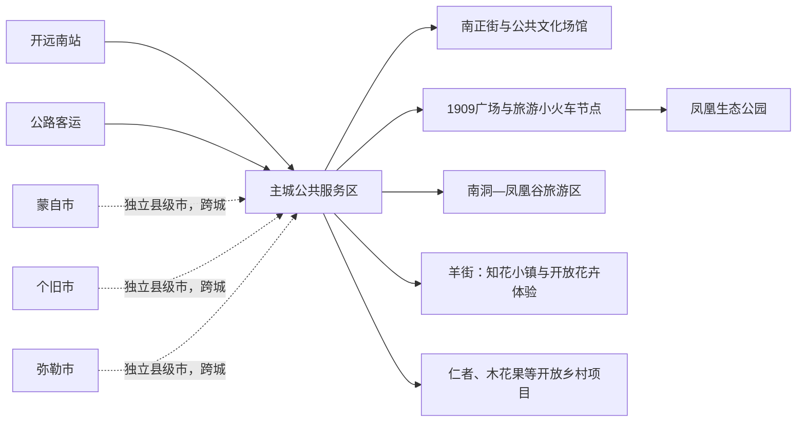
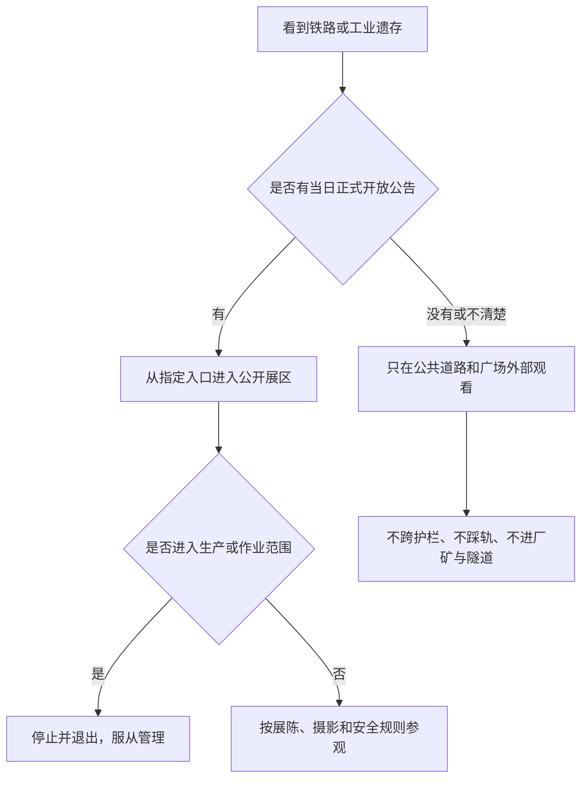

# 开远旅行指南

开远是红河哈尼族彝族自治州内的独立县级市，不是蒙自的城区，也不是个旧的附属景点。它适合用两三天慢慢阅读：主城有滇越铁路留下的城市骨架和当代公共文化空间，凤凰湖—凤凰山形成生态公园片区，南洞—凤凰谷把喀斯特洞穴、水体和经营游乐组合在一起，羊街方向则连接花卉产业与乡村旅游。工业和铁路塑造了开远，却不意味着厂区、矿区、铁路作业区都能参观。

> **建议停留**：主城 1 天；加入南洞—凤凰谷 2 天；再加知花小镇或一条经确认的乡村线 3 天。 
> **旅行关键词**：滇越铁路、工业遗产、凤凰湖、喀斯特、花卉产业。 
> **主要体力**：中等；凤凰山、南洞洞内步道与乡镇线路会增加坡度和换乘。 
> **最近研究**：2026-08-12。

## 城市速览

| 旅行问题 | 直接判断 |
|---|---|
| 开远与蒙自、个旧是什么关系 | 都是红河州内彼此独立的县级行政区。开远法定代码 532502；跨到蒙自、个旧、弥勒或建水就是跨县市行程 |
| 第一次来住哪里 | 主城灵泉、乐白道公共服务区较稳妥；若乘高铁早晚抵离，可比较开远南站接驳后再决定 |
| 只有一天怎么办 | 做南正街—城市午休—1909 广场—凤凰生态公园，不把南洞或乡村硬塞进下午 |
| 工业遗产都开放吗 | 不是。开远工业博物馆、发电厂旧址处于建设、展陈与开放逐步转换期；只在官方公告的区域和时段进入 |
| 还能坐米轨小火车吗 | 官方 2026 线路推介和 2025 假日数据表明旅游小火车当期运营过，但班次、站点、检修和票制必须临行重查 |
| 南洞适合雨天吗 | 不把“洞内”误判成全天候。强降雨可能影响洞内浮桥、水位、地灾、漂流与道路，普通雨天也先看景区公告 |
| 凤凰生态公园能不能全程低体力 | 湖边与主路可缩短，登凤凰山、凤凰楼和湿地长线会增加体力；轮椅连续通行仍需向景区确认 |
| 花田能否自由进入 | 不能。知花小镇公开游览区与花卉大棚、育种区、冷链仓库、农机道路是不同空间，只进明确开放区域 |
| 能否探访铁路和工厂 | 不能进入铁路线路、车站作业区、编组场、隧道、桥梁、厂区、化工园、矿区或废弃建筑；拍摄也应服从管理 |
| 主要天气风险 | 干湿季分明；高温、干旱、雷电、大风、强降雨、城市积水与山地地灾都可能出现，需看短临预警而不是只看月均值 |

[开远市人民政府概况目录](https://www.hhky.gov.cn/kygk.htm)说明开远于 1981 年撤县设市，隶属红河州。GeoNames **1804850** 记录的是用于定位开远主城的 PPL 级居民点，Wikidata **Q1359454** 与行政区划代码 **532502** 则对应法定县级开远市；Q1359454 的 P1566 连接到 1804850，可交叉核对名称和主城位置，但居民点坐标不能代替法定市域边界。城市旅行边界只覆盖开远所辖范围，不把红河州州府蒙自或周边县市并入。

## 城市格局与游览区域

开远主城可理解成三个相邻但不宜一次走完的单元：人民路—南正街一带是老城生活与商业文化区；泸江河与 1909 广场承接铁路叙事；凤凰湖—凤凰山—凤凰湿地构成较大的生态公园。南洞在主城南向，适合作为独立目的地；羊街知花小镇和花卉社区在另一方向，也应留出往返与生产边界。

| 区域 | 主要内容 | 游览特点 | 关键边界 |
|---|---|---|---|
| 老城—南正街 | 主题街区、餐饮、日常生活与公共文化 | 适合半天低强度串联 | 主题街区是当代活化商业空间，不把复建场景当成全部原真遗存 |
| 泸江—1909 广场 | 河岸公园、铁路主题公共空间、旅游列车节点 | 可与凤凰湖同日，仍需车辆或较长步行 | 公共广场与铁路站场、轨道、隧道、桥梁和作业区分开 |
| 凤凰生态公园 | 凤凰山、凤凰湖、凤凰湿地与步道 | 半天至 1 天，可按体力截短 | 湖岸、湿地保育区、山地支路和水面设施不等于全部开放 |
| 南洞—凤凰谷 | 喀斯特洞穴、山水与经营游乐项目 | 独立半天至 1 天 | 门票、洞内游线与二次项目可能分开；强降雨和检修可停运 |
| 羊街—知花小镇 | 花卉产业、农文旅小镇与开放社区项目 | 花期、接待和生产节奏明显 | 游客区与育种大棚、生产车间、仓储、农田和农机路分开 |
| 小龙潭与工业片区 | 能源、化工、矿业和铁路生产空间 | 用于理解城市产业背景，不作为自由景区 | 活跃厂矿、露天采区、排土场、采空地、输电设施和园区一律不擅入 |
| 蒙自、个旧等周边城市 | 红河州公共服务、矿业历史或其他城市体验 | 需跨城交通，宜另页规划 | 不以“蒙个开城市圈”概念抹去行政边界和换宿成本 |

开远 2026 年政府工作报告显示，煤炭、电力、化工、建材仍是重要产业，旧厂房修缮和工业博物馆建设也在推进。工业历史可以从公开展览与城市空间理解；生产企业、矿山、化工园和铁路设施则有独立安全管理，不因“工业旅游”标签自动开放。

## 主要景点

优先级用于安排时间：**A** 为首次到访核心，**B** 为按兴趣补充，**C** 为季节、运营或预约不确定性较高的目的地。“路线节点”不计入景点完成率。

| 景点 | 区域 | 类型 | 主要看点 | 建议用时 | 室内外 | 体力 | 预约风险 | 天气影响 | 优先级 |
|---|---|---|---|---:|---|---|---|---|---|
| 凤凰生态公园 | 凤凰湖片区 | 城市生态公园 | 凤凰山、凤凰湖、凤凰湿地与城市转型景观 | 半天至 1 天 | 户外 | 中至高 | 活动、内部设施和局部封闭须重查 | 高温、雷暴、强风影响大 | A |
| 1909 广场 | 凤凰山下 | 铁路主题公共空间 | 滇越铁路城市记忆、公共艺术与城市视角 | 1—2 小时 | 户外 | 低至中 | 大型活动和旅游列车时刻须重查 | 高温、强降雨影响 | A |
| 开远旅游小火车公开线路 | 主城—南洞方向 | 旅游交通、铁路文化 | 低速米轨体验与沿线城市景观 | 约半天 | 混合 | 低 | 班次、票制、检修、起讫站和儿童规则变化快 | 暴雨、设备与线路状态影响大 | B |
| 南正街主题街区 | 老城 | 当代活化街区 | 地方生活、商业与历史主题展示 | 1—3 小时 | 混合 | 低 | 活动、商户和夜间开放变化 | 普通雨天影响中等 | B |
| 开远市文化馆、图书馆公共文化片区 | 主城 | 公共文化场馆 | 地方展览、阅读、非遗与临时活动 | 1—3 小时 | 室内为主 | 低 | 闭馆、临展和团体活动须重查 | 低 | B |
| 开远工业博物馆一期 | 发电厂旧址相关片区 | 工业遗产、博物馆 | 开远工业与能源城市史；仅限正式公告开放部分 | 2—3 小时 | 室内为主 | 低至中 | 建设转运营阶段，开放范围与预约风险高 | 低 | C |
| 南洞—凤凰谷旅游区 | 主城南向 | 喀斯特、经营景区 | 桃源洞、山水游线与经营体验 | 半天至 1 天 | 混合 | 中至高 | 洞内游线、票制与二次项目须重查 | 强降雨、水位、地灾影响大 | A |
| 南洞河湿地公开步道 | 南洞方向 | 湿地、城市生态 | 河流湿地与生态修复景观 | 1—2 小时 | 户外 | 低至中 | 水位、养护与局部封闭须重查 | 暴雨和积水影响大 | B |
| 知花小镇 | 羊街乡 | 农文旅、花卉产业 | 花卉景观、公开接待与产业融合展示 | 半天至 1 天 | 混合 | 中 | 花期、展区、住宿与体验项目须重查 | 高温、暴雨影响大 | B |
| 黑泥地社区公开旅游区 | 羊街乡 | 社区、花卉与乡村旅游 | 季节花景、村史与公开文化空间 | 半天 | 户外为主 | 中 | 花期、交通组织和接待时段须重查 | 风雨、高温影响大 | C |
| 泸江公园 | 主城 | 城市公园 | 河岸日常生活与短时休息 | 1—2 小时 | 户外 | 低 | 养护或活动管制 | 暴雨、积水和高温影响 | 路线节点 |
| 仁者村、木花果等官方开放乡村项目 | 乐白道方向 | 乡村旅游 | 田园、社区生活和当期文旅项目 | 半天 | 户外为主 | 中 | 接待主体、活动和道路须先确认 | 暴雨、高温和乡道影响 | C |

[开远市文化和旅游概况入口](https://www.hhky.gov.cn/kygk.htm)列出凤凰生态公园、南洞—凤凰谷为 4A 景区，知花小镇、南正街为 3A 景区；[2026 年官方路线](https://www.hhky.gov.cn/info/1051/767202.htm)可交叉确认旅游小火车、凤凰生态公园、南洞河湿地和南洞等当期产品。景区等级和宣传线路都不替代当日开放公告。

## 美食与餐饮

开远饮食带有滇南米食、烧烤、乳制品与多民族风味。主城更容易比较价格、卫生和过敏原；大庄等乡镇的清真饮食和村寨餐应在尊重经营边界的前提下专程安排，不把宗教场所或居民厨房当餐饮后场。任何“工业城市”主题也不构成进入厂区食堂或生产车间的理由。

| 菜品或餐饮类型 | 常见区域 | 一个人用餐与份量 | 风味、过敏原与饮食限制 | 排队风险与替代方法 |
|---|---|---|---|---|
| 开远小卷粉 | 主城早餐店与小吃店 | 可按份点，适合独行 | 米皮配酱汁、肉末、花生或辣椒；米制不自动等于无麸质 | 选现卷、调料分放的社区店，不必追单店 |
| 米线、米干与凉米线 | 主城和乡镇 | 通常一人一碗 | 汤底、肉臊、花生、腌菜与辣椒须确认；凉拌注意温控 | 无法判断凉食保存时改点现煮汤粉 |
| 烧烤 | 主城夜间餐饮区 | 小串便于单点 | 看生熟分开和彻底加热；内脏、海鲜、蛋、花生过敏者逐项问 | 夜市拥挤时换固定餐馆，不购买久置食材 |
| 开远山羊乳饼及乳制菜 | 正规餐馆和特产销售点 | 可小份试食或共享 | 含乳；盐度和烹饪油脂因店而异，乳过敏者避免 | 买包装产品看厂名、日期和储存条件 |
| 大庄清真牛羊肉餐 | 大庄乡或主城清真餐馆 | 汤锅多适合共享，先问小份 | 尊重清真规范；非清真食物和酒水不带入，确认辣度和内脏 | 先核营业和接待，不为用餐闯入宗教活动区 |
| 木瓜水与地方凉品 | 主城小吃店 | 一杯适合独行 | 糖分高，可能含冰、芝麻、花生或乳制品 | 肠胃敏感者选瓶装饮水或热饮 |
| 花卉、果蔬主题餐 | 羊街正规接待点 | 常为多人套餐 | “可食用花”必须来自合规食材，不采摘观赏花；提前说清过敏和素食 | 先问菜单、最低人数、生产许可和退改 |
| 腌菜、凉拌与蘸水菜 | 主城正规餐馆 | 多为配菜 | 酸辣、盐分较高，可能含花生、芝麻、鱼露或生鲜配料 | 无法说明冷链与原料时换熟菜 |
| 野生菌菜肴 | 雨季正规餐馆 | 多为共享 | 不自行采食或加工不明菌种，必须充分加热 | 无法确认菌种与加工时直接换人工菌或普通蔬菜 |
| 茶、咖啡与甜点 | 主城和知花小镇接待区 | 单杯适合独行 | 含咖啡因、乳、蛋或坚果；不接受医疗功效承诺 | 先看明码标价，不为品鉴承担强制购物 |

## 经典行程

以下每条路线都把适用条件、顺序、预约、休息和删减写清。开远的远点并不算极远，但南洞、羊街和工业铁路主题朝不同方向，仍应按“一天一个主轴”安排。

### 一日城市经典路线

**适用条件**：第一次到开远、有完整白天、能完成平地和缓坡步行的人；高温或强风时减少凤凰山段。 
**路线**：南正街主题街区 → 主城午餐与午休 → 1909 广场 → 凤凰生态公园湖区短线 → 主城。

- **串联逻辑**：上午从老城生活与商业空间入手，下午沿铁路记忆转到城市生态转型；只做主城，不临时去南洞。
- **预约锚点**：南正街活动、凤凰生态公园局部设施通常风险不高；若加入旅游小火车，应以其班次作为全日首要锚点并重排路线。
- **休息安排**：正午在主城室内休息 1—2 小时；凤凰湖只走可随时退出的主路，不以登顶为完成标准。
- **时间不足时**：保留 1909 广场和凤凰湖短线，删南正街或登山段；不压缩午休去追南洞。

### 两日主城与南洞路线

**适用条件**：对铁路城市史和喀斯特景观均感兴趣、可接受第二天半日以上户外的人；雨季需有取消南洞的弹性。 
**第 1 天**：南正街 → 午休 → 1909 广场 → 凤凰生态公园。 
**第 2 天**：主城 → 南洞—凤凰谷旅游区公开游线 → 南洞河湿地可开放短段 → 主城。

- **串联逻辑**：先认识城市，再用一整天处理洞穴、湿地与往返；不把洞内、水上和高空二次项目视为必须全部完成。
- **预约锚点**：先核南洞当日开放、桃源洞游线、二次项目、返程和天气；旅游小火车只在班次与第 2 天方向吻合时替代一段交通。
- **休息安排**：第 1 天午休；第 2 天在游客中心和正式服务区休息，洞内注意低矮处、湿滑与温差。
- **时间不足时**：保留桃源洞主游线，删湿地或游乐项目；若强降雨、水位或地灾信息不清，删除第 2 天整段。

### 三日城市、南洞与羊街路线

**适用条件**：有三个完整白天、对花卉产业和乡村转型感兴趣并能遵守生产边界的人；并非追求三城联游者。 
**第 1 天**：南正街 → 1909 广场 → 凤凰生态公园。 
**第 2 天**：南洞—凤凰谷一日。 
**第 3 天**：主城 → 知花小镇公开游览区 → 黑泥地社区或一个经确认的花卉体验二选一 → 主城。

- **串联逻辑**：三天分别理解老城与铁路、喀斯特生态、花卉生产与乡村生活；不把蒙自、个旧附加为同日“顺路”。
- **预约锚点**：南洞开放和第 3 天接待主体、花期、体验时段、交通是主要锚点；生产大棚与车间必须由经营者确认开放。
- **休息安排**：每日正午安排室内休息；羊街日在小镇或社区正式接待点用餐，不进入种植户后院或仓库。
- **时间不足时**：先删第 3 天整段；若仍需压缩，主城与南洞二选一，不把三日线路塞进两天。

### 普通雨天与极端天气路线

**适用条件**：仅适用于普通降雨且交通、场馆正常；暴雨、雷电、地灾、内涝或大风预警时应减少出行。 
**路线**：开远市文化馆或图书馆当期展览 → 主城午餐与长休 → 南正街有遮蔽的公开部分 → 住宿区。

- **串联逻辑**：先使用官方公共文化场馆，再在雨势稳定时短走主城；不开启洞穴、湿地、山地、矿区外围或乡道“雨景线”。
- **预约锚点**：核文化馆、图书馆闭馆与临展；工业博物馆只有正式公告当日开放范围明确时才可替换，不能据规划自行前往。
- **休息安排**：午后在固定室内空间等短临预警更新，鞋袜湿透及时更换；不在铁路桥洞或厂房檐下避雨。
- **时间不足时**：只留一处公共文化场馆；极端天气时整段取消，遵从停运、封控和转移指引。

### 亲子与低体力路线

**亲子适用条件**：学龄儿童、能遵守铁路与水边安全规则的家庭；幼童先核推车、儿童设施与活动年龄。 
**亲子路线**：文化馆或图书馆 → 午休 → 1909 广场短停 → 凤凰生态公园湖区主路 → 住宿区。

- **亲子串联逻辑**：用室内展览解释铁路与工业，再到公共广场和湖区观察；不让儿童上轨、钻车底、翻护栏或靠近水面。
- **亲子预约锚点**：核场馆儿童活动和凤凰公园游乐设施；若乘旅游小火车，班次、儿童票、上下车和推车规则最先确认。
- **亲子休息安排**：午休至少 1.5 小时；湖区每 45—60 分钟补水，避开正午登山。
- **亲子时间不足时**：保留公共文化场馆和 1909 广场，删凤凰山；不追加南洞二次游乐。

**低体力适用条件**：长者、关节或心肺耐力有限但能短距离行走者；轮椅使用者须逐点确认连续无障碍。 
**低体力路线**：南正街平缓段 → 午休 → 点到点车辆至 1909 广场 → 凤凰湖入口附近短段 → 住宿区。

- **低体力串联逻辑**：全天只做可随时撤出的城市公共空间，避开凤凰山登顶、南洞湿滑洞道和长距离换乘。
- **低体力预约锚点**：向场所核落客点、坡道、卫生间、轮椅通行和座椅；住宿接送比景点票更重要。
- **低体力休息安排**：正午休息 2 小时，户外放到体感较低时段；自带饮水与常用药。
- **低体力时间不足时**：保留 1909 广场单点，删其余户外；高温、强风或降雨时只留室内。

### 远郊一日路线

#### 方向一：南洞—凤凰谷

**适用条件**：能走湿滑、起伏路面并接受洞内环境的人；强降雨、水位异常、地灾或景区检修时取消。 
**顺序与串联**：主城 → 景区游客中心 → 桃源洞及当日公开主游线 → 服务区休息 → 原路返回；不跨入未开放洞段。 
**预约锚点**：门票包含范围、洞内开放、二次项目、接驳、返程和天气。 
**休息安排**：只在正式服务点停留；戴防滑鞋，听从浮桥、低矮洞体和水边安全提示。 
**时间不足时**：保留主游线、删除漂流或高空项目；返程不稳时整段删除。

#### 方向二：羊街知花小镇与公开花卉体验

**适用条件**：对花卉和农文旅感兴趣、能接受花期差异的人；生产区不开放时仍愿意只看公共接待区。 
**顺序与串联**：主城 → 知花小镇游客区 → 午休 → 一个经营主体明确开放的花卉或社区项目 → 主城。 
**预约锚点**：花期、开放展区、讲解、生产参观许可、餐饮和返程车辆。 
**休息安排**：正午在小镇正式室内空间休息；不在大棚作业通道、冷库或农机路停留。 
**时间不足时**：只保留知花小镇，删社区加点；不追逐导航上的私人花田。

#### 方向三：旅游小火车与铁路文化

**适用条件**：以铁路史为主、能接受班次波动的人；只在运营方售票和公告正常时执行。 
**顺序与串联**：指定乘车站 → 旅游小火车公开线路 → 指定站点短停 → 按票面返程；车外只使用开放站台和公共道路。 
**预约锚点**：运营日期、起讫站、往返班次、停留方式、实名或儿童规则、退改与设备检修。 
**休息安排**：在开放候车区与指定停靠点休息；不沿轨道步行，不进铁路隧道、桥梁和站场补拍。 
**时间不足时**：整段删除，改为 1909 广场静态参观；不搭乘无票或非客运车辆。

## 住宿区域

| 区域 | 优点 | 缺点 | 适合人群 | 交通特点 |
|---|---|---|---|---|
| 老城—人民路—南正街 | 餐饮和日常服务集中，适合步行看城市生活 | 部分道路较老、停车和夜间噪声需比较 | 首次到访、预算有限、重视烟火气者 | 到 1909 广场和凤凰湖仍可能需要短途车 |
| 城市公共服务中心片区 | 酒店、医院和跨片区出行相对均衡 | 历史氛围较弱 | 家庭、独行和需要稳定补给者 | 适合作为南洞、羊街等不同方向的共同基点 |
| 凤凰湖片区 | 近公园、环境开阔，适合晨昏散步 | 离老城餐饮可能更远，活动日会拥堵 | 低节奏、康养或自驾者 | 去开远南站和南洞先核实际车程 |
| 开远南站周边 | 高铁抵离方便 | 城市体验与餐饮密度可能不如中心区 | 早晚车、短住和跨城者 | 先确认酒店是否真可步行、公交末班和网约车上客点 |
| 南洞—凤凰谷正规住宿 | 可减少景区往返 | 选择与夜间公共服务较少 | 已锁定景区或康养项目者 | 先核住宿资质、接送、餐饮与次日返程 |
| 知花小镇正规住宿 | 适合花卉和乡村慢游 | 季节与运营波动较大，离主城较远 | 有明确体验项目的长住者 | 订房前确认开业状态、接送和夜间用车 |

## 市内交通

开远没有民用机场型城市抵达枢纽，跨城铁路主要使用开远南站。市政府[交通与旅游概况入口](https://www.hhky.gov.cn/kygk.htm)确认弥蒙铁路开远段及开远南站于 2022 年通车，城区以公交、出租为主。老滇越铁路、旅游小火车和现代高铁不是同一系统，购票入口、车站和运行规则应分别核对。

| 场景 | 建议与取舍 | 行前需要重查的内容 |
|---|---|---|
| 从开远南站抵达 | 正规公交、出租或网约车进主城；晚到不再追小火车或南洞 | 12306 时刻、公交末班、出租上客点和酒店接送 |
| 从蒙自、个旧或弥勒转入 | 高铁、城际公交、定制客运或正规班线按当天可售服务选择 | 车站是否同名、上下客点、行李规则、末班与跨城距离 |
| 主城移动 | 公交与短途车辆为主；高温时不以地图步行分钟数估体力 | 线路调整、节庆封路、凤凰湖活动与施工 |
| 前往南洞 | 正规公交、景区交通、旅游小火车或合法车辆四者不可互相假定 | 景区开放、列车运营、返程末班、道路和停车 |
| 前往羊街与乡村 | 正规城乡公交或合法车辆；去程即确认返程 | 班次、接待点位置、乡道路况和通信 |
| 旅游小火车 | 把它当需预约的旅游产品，不当城市通勤兜底 | 当日运营、票价、站点、检修和天气停运 |
| 自驾 | 主城非必需；远郊可增加弹性，但不能进入厂矿、铁路或生产便道 | 停车、道路、雨季地灾、矿区车辆与疲劳驾驶 |

跨越铁路必须走合法道口、桥梁或地下通道。不可沿轨道步行、在桥隧内停留、攀爬车辆，或将看似停用的支线判断为“废线”。工业园和矿区周边有重型车辆，旅游车辆不在厂门、铁路道口或货运道路临停拍照。

## 不同旅行者须知

| 旅行维度 | 可行条件 | 主要取舍 | 需额外核对 |
|---|---|---|---|
| 独行旅行 | 主城点餐和短途车辆便利 | 乡村返程、旅游小火车和夜间远点不宜临时起意 | 返程车辆、活动最低人数、住宿前台和紧急联系人 |
| 亲子旅行 | 公共文化、铁路主题广场和凤凰湖可做短线 | 铁轨、水边、洞穴、游乐设备和高温需持续看护 | 儿童票、身高年龄、推车、救生和设施检修 |
| 长者或低体力 | 主城可用点到点车辆压缩步行 | 凤凰山和南洞洞道不适合勉强完成 | 落客点、坡道、座椅、卫生间与紧急撤出 |
| 无障碍需求 | 高铁站和部分新建公共空间可能有设施 | 历史街区、山地、洞穴和乡村的连续通行资料不足 | 电梯、坡道、轮椅固定、无障碍卫生间和陪同规则 |
| 摄影旅行 | 公共广场、公园和开放街区题材清晰 | 铁路、厂矿、输电、化工和生产人员拍摄受限 | 无人机空域、三脚架、商业拍摄和肖像许可 |
| 工业与铁路爱好者 | 正式开放的博物馆、展览、广场和旅游列车可用 | 不以“考据”名义进厂、钻洞、踩轨或翻墙 | 开放公告、运营方、文物修缮区和摄影规则 |
| 预算有限 | 公园、广场和公共文化可组合 | 远点接驳与二次项目会抬高总成本 | 门票包含范围、优惠资格、公交末班和退改 |
| 特殊天气 | 普通小雨可转公共文化场馆 | 高温、强风、雷电、暴雨、积水和地灾时取消山地、洞穴、水边与乡道 | 中央气象台、地方应急信息、景区和铁路公告 |

开远的城市安全资料将暴雨、干旱、雷电、高温、大风、山体滑坡、泥石流和地面塌陷等列为需防范风险。旧资料用于认识风险类型，不用于判断某一天安全；实际旅行应服从当期气象、自然资源、应急、交通和景区信息。

## 行前核对

| 核对事项 | 为什么需要重查 | 建议核对时间 | 官方入口 |
|---|---|---|---|
| 凤凰生态公园和南正街活动 | 节庆、赛事、维修和商户调整会改变体验 | 出发前一周及到访前一日 | [开远市人民政府旅游信息](https://www.hhky.gov.cn/kygk/kyly/lyxx.htm) |
| 南洞—凤凰谷开放与票制 | 洞内浮桥、水位、地灾、设备和二次项目具有时效性 | 订票前及出发当日 | [开远市文化和旅游概况入口](https://www.hhky.gov.cn/kygk.htm)、景区当日公告 |
| 旅游小火车 | 班次、起讫站、检修和包场会变化 | 计划线路前、出发前一日 | [开远市 2026 旅游线路](https://www.hhky.gov.cn/info/1051/767202.htm)、运营方当日公告 |
| 工业博物馆与发电厂旧址 | 建设、修缮、试运行和正式开放范围不同 | 排入路线前及到访前一日 | [开远市人民政府](https://www.hhky.gov.cn/)、[修缮终验信息](https://www.hhky.gov.cn/info/1091/767222.htm) |
| 知花小镇与社区项目 | 花期、生产安排、接待和交通变化 | 预约前及出发前一日 | [开远市人民政府相关信息](https://www.hhky.gov.cn/info/5191/757982.htm) |
| 高铁与开远南站接驳 | 时刻、站内服务和公交末班会变 | 购票前、出发前一日 | [中国铁路 12306](https://www.12306.cn/) |
| 城乡公交和跨城交通 | 班线、上下客点、施工和末班会变 | 出发前一周及当日 | [开远市交通概况入口](https://www.hhky.gov.cn/kygk.htm) |
| 高温、暴雨、地灾与道路 | 山地、洞穴、湿地、乡道和矿区外围风险随天气变化 | 出发前三日、前一日及当日 | [中央气象台](https://www.nmc.cn/)、[开远市人民政府](https://www.hhky.gov.cn/) |
| 无障碍和儿童设施 | 页面存在“无障碍浏览”不代表景点全程无障碍 | 订票和订房前 | 具体场馆、景区、车站与酒店官方客服 |
| 旅游投诉与经营资质 | 远郊、康养、包车和体验产品需留凭证 | 付款前及旅行中 | [全国文化和旅游市场网上举报投诉平台](https://jbts.mct.gov.cn/) |

## 来源与更新记录

### 主要来源

| 来源 | 类型 | 支持内容 | 核验日期 |
|---|---|---|---|
| [开远概况与市情目录](https://www.hhky.gov.cn/kygk.htm) | 市政府 | 县级市身份、A级景区、交通结构及相关官方专题入口 | 2026-08-12 |
| [2026 年开远精品旅游线路](https://www.hhky.gov.cn/info/1051/767202.htm) | 市文旅部门 | 旅游小火车、凤凰公园、南洞与当期线路 | 2026-08-12 |
| [2026 年开远市政府工作报告](https://www.hhky.gov.cn/info/5511/779352.htm) | 市政府 | 工业结构、城市发展与工业博物馆阶段信息 | 2026-08-12 |
| [开远发电厂旧址修缮终验](https://www.hhky.gov.cn/info/1091/767222.htm) | 市文旅部门 | 文物修缮与博物馆建设阶段，不代表全址自由开放 | 2026-08-12 |
| [2026 年旅游日与博物馆日活动](https://www.hhky.gov.cn/info/1121/787932.htm) | 市文旅部门 | 文化馆工业遗产展、南正街和凤凰湖当期公共活动 | 2026-08-12 |
| [开远市城市安全风险白皮书](https://www.hhky.gov.cn/info/5631/411362.htm) | 市政府 | 高温、暴雨、干旱、地灾、工矿和交通风险类型 | 2026-08-12 |
| [GeoNames 1804850](https://www.geonames.org/1804850/) | 开放地理数据 | 固定地点标识 | 2026-08-12 |
| [Wikidata Q1359454](https://www.wikidata.org/wiki/Q1359454) | 开放知识图谱 | 法定开远市实体与 P1566=1804850 交叉核对 | 2026-08-12 |

### 更新记录

| 日期 | 更新内容 |
|---|---|
| 2026-08-12 | 首次完成资料研究；核准 GeoNames 1804850、Wikidata Q1359454 与行政区划代码 532502；明确开远与蒙自、个旧等县级市边界，区分公共铁路文化、工业遗产开放区与生产厂矿铁路，并补齐分众路线和动态核对项 |
