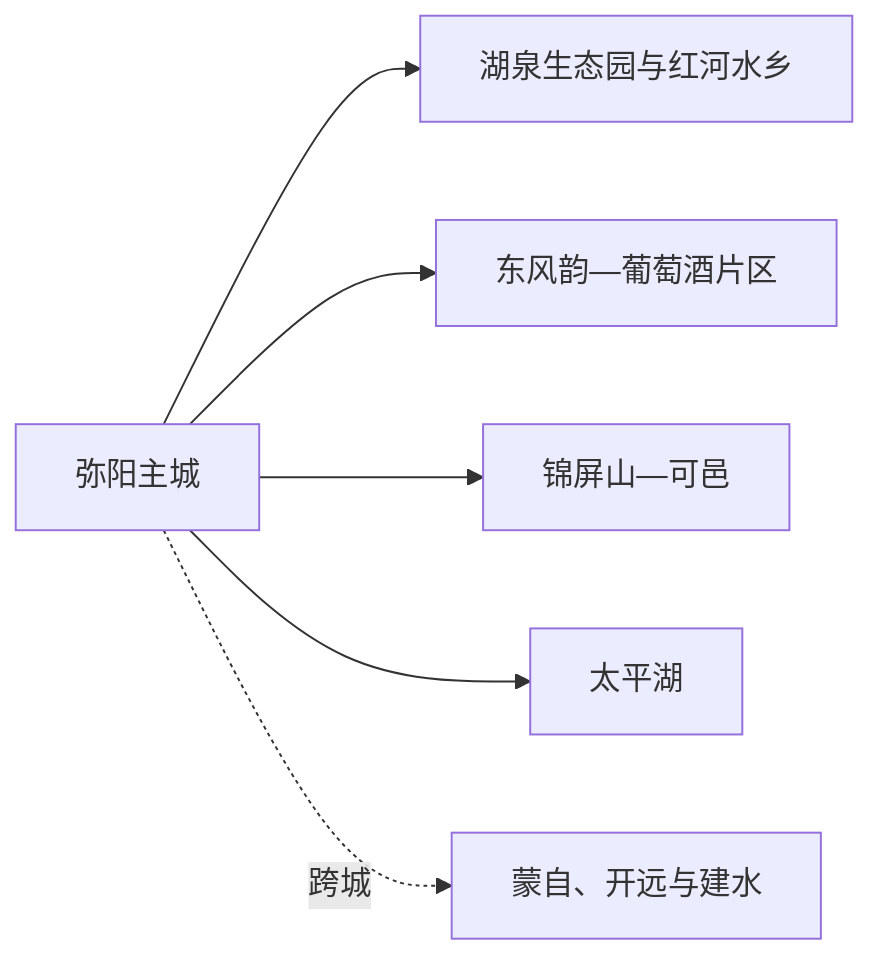
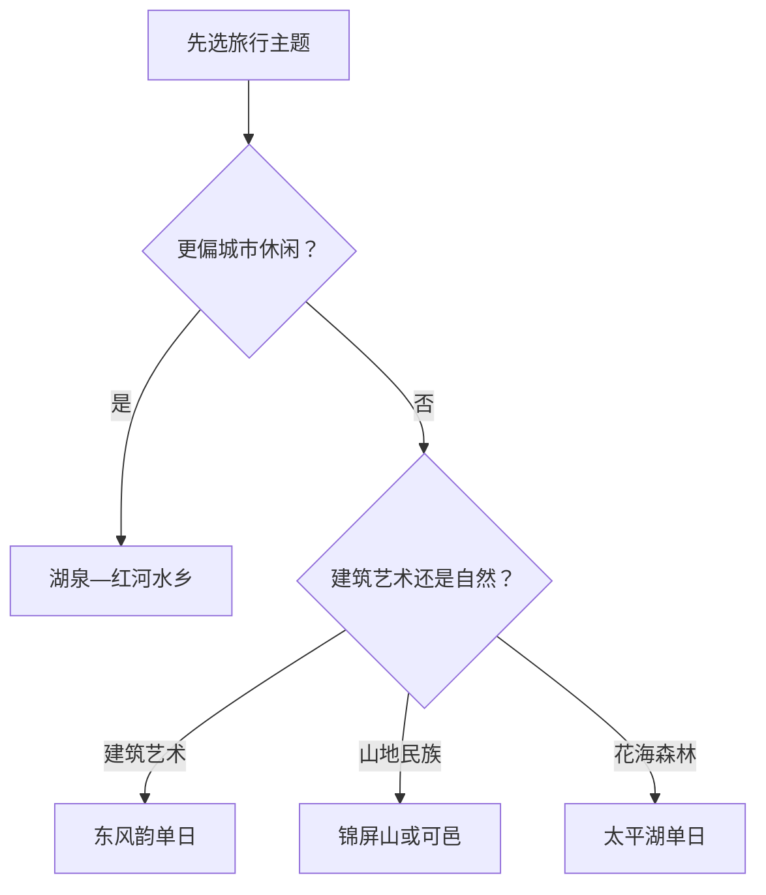

# 弥勒旅行指南

弥勒适合用“主城温泉与湖区、东风艺术与葡萄、锦屏山—可邑民族文化、太平湖花海”四个模块来选择。各模块之间主要依靠车辆，完整体验通常需要两至三天。先确定想要的是城市休闲、建筑艺术、山地文化还是季节花海，再决定住宿片区和车辆，能明显减少折返。

## 城市速览

| 项目 | 信息 |
|---|---|
| 旅行主线 | 湖泉生态园、红河水乡、东风韵、太平湖、锦屏山、可邑小镇与葡萄酒文化 |
| 建议停留 | 1 天主城；2 天加入东风片区；3 天再选锦屏—可邑或太平湖 |
| 住宿基地 | 弥阳主城最均衡；度假型停留可选湖泉或经核验的景区住宿 |
| 步行强度 | 主城低至中；东风韵、太平湖和锦屏山内部为中高 |
| 主要天气 | 高原强紫外线、雷暴、短时强降雨、高温、山洪与冬春大风 |
| 温泉提示 | 只选择证照、卫生和水温管理清楚的经营项目，按自身健康状况控制时长 |
| 亲子 | 湖泉短线、正规展馆、太平湖或东风韵中选择一个大项目 |
| 低体力 | 主城湖区、红河水乡和车辆可近达的单一景区更合适 |
| 生产边界 | 葡萄园、酒厂、风电光伏、煤矿与农业田块按预约或生产管理进入 |
| 无障碍 | 设施连续性需向官方确认，重点核对景区车、坡道、卫生间和住宿电梯 |

## 城市格局与游览区域

弥勒市是红河哈尼族彝族自治州所辖县级市，代码 `532504`。固定 GeoNames `1800430` 名为 Miyang，对应弥阳街道实体 `Q11067843`；法定弥勒市实体为 `Q1200896`，其 `P1566=1800535` 连接另一行政记录。本页以固定驻地点建页，以法定代码界定完整市域，明确区分主城居民点、街道与县级市。

| 区域 | 旅行价值 | 怎么安排 |
|---|---|---|
| 弥阳主城 | 湖泉、红河水乡、城市餐饮与住宿 | 首日、雨天和连续住宿基地 |
| 东风片区 | 东风韵建筑艺术、葡萄园与预约工业旅游 | 完整半日至一日，按开放项目取舍 |
| 锦屏山—可邑 | 山地、弥勒文化与彝族阿细文化 | 两处可同方向分日或择一，确认景区交通 |
| 太平湖方向 | 花海、森林与度假项目 | 季节景观明显，完整一日 |
| 西部与乡村片区 | 旅居村、农业和山地道路 | 只选公开接待项目，提前安排车辆与返程 |

## 主要景点

### 主城与东风片区

| 景点 | 所在区域 | 类型 | 核心看点 | 建议用时 | 室内/室外 | 体力 | 预约难度 | 天气敏感度 | 适合旅程 |
|---|---|---|---|---|---|---|---|---|---|
| 湖泉生态园 | 弥阳主城 | 城市湖区、4A | 湖岸绿地、城市休闲与温泉度假背景 | 2–4 小时 | 室外 | 低至中 | 低 | 高 | A |
| 红河水乡旅游景区 | 主城 | 水乡街区、3A | 城市夜游、餐饮、公共活动与水景 | 2–3 小时 | 混合 | 低 | 中 | 中 | B |
| 东风韵旅游景区 | 东风片区 | 建筑艺术、4A | 独特建筑群、艺术展陈与摄影空间 | 4–6 小时 | 混合 | 中 | 高 | 高 | A |
| 云南红酒庄预约参观 | 东风片区 | 葡萄酒与工业旅游 | 葡萄种植、酿造文化与经确认开放的展示 | 2–3 小时 | 混合 | 低至中 | 高 | 中 | B |

### 山地、民族文化与花海

| 景点 | 所在区域 | 类型 | 核心看点 | 建议用时 | 室内/室外 | 体力 | 预约难度 | 天气敏感度 | 适合旅程 |
|---|---|---|---|---|---|---|---|---|---|
| 锦屏山风景区 | 主城北部 | 山地与宗教文化、4A | 山林、弥勒文化展示与登高视野 | 4–6 小时 | 室外为主 | 中高 | 高 | 高 | B |
| 可邑小镇 | 西三镇 | 彝族阿细文化、4A | 村落、阿细文化与正式演艺体验 | 4–6 小时 | 混合 | 中 | 高 | 高 | B |
| 太平湖森林小镇旅游景区 | 太平湖方向 | 花海、森林与度假、4A | 季节花海、园林艺术和户外休闲 | 5–7 小时 | 室外 | 中 | 高 | 极高 | B |
| 白龙洞风景区 | 虹溪方向 | 喀斯特洞穴、2A | 洞穴景观与地质环境 | 3–5 小时 | 混合 | 中 | 高 | 中 | C |

东风韵、太平湖、锦屏山和可邑各自都是大尺度景区，一天安排一个主项最稳妥。葡萄园、酒厂和农业项目只有在运营方公布接待、集合点与参观范围时进入；温泉、洞穴和山地也按各自健康与天气条件选择。

## 美食与餐饮

| 类型 | 适合场景 | 份量 | 过敏与饮食提示 | 选择方法 |
|---|---|---|---|---|
| 卤鸡与鸡米线 | 早餐或正餐 | 米线一人份，整鸡适合分享 | 禽肉、花生、芝麻、辣椒和汤底 | 一人选米线或小份切盘，多人再点整鸡 |
| 传统米线与卷粉 | 早餐、简餐 | 一人份 | 汤底可能含肉、蛋、大豆；素食需问清 | 在主城居民区比较汤底、配料和卫生 |
| 彝族风味合菜 | 可邑或乡村正餐 | 多为多人分享 | 腌肉、乳制品、坚果、酒和辛辣调味 | 先问份量、食材与是否含酒 |
| 葡萄、葡萄酒与果品 | 东风片区、伴手礼 | 鲜果按重量，酒按杯或瓶 | 酒精、亚硫酸盐和高糖 | 看标签与生产者；驾驶者当天不饮酒 |
| 温泉度假餐饮 | 湖泉与正规度假区 | 套餐或合菜 | 菌类、酒、肉汤和隐藏调味料 | 优先菜单清楚、能提供小份的经营点 |

## 经典行程

### 一日经典路线

**路线**：湖泉生态园 → 主城午餐 → 红河水乡 → 主城住宿

- **串联逻辑**：用同一城市片区完成湖区、日常餐饮和晚间公共空间。
- **预约锚点**：红河水乡活动、湖区项目和温泉项目的独立预约。
- **休息安排**：午间回餐馆或住宿，高温时把湖岸步行放在早晚。
- **时间不足时**：保留湖泉短段和主城餐饮，红河水乡改为晚间短访。

### 两日城市与东风路线

**第 1 天**：湖泉生态园 → 红河水乡 
**第 2 天**：东风韵 → 预约酒庄或东风片区餐饮 → 返回主城

- **串联逻辑**：第一天城市慢游，第二天集中处理建筑艺术和葡萄产业。
- **预约锚点**：东风韵票务、展览、景区车和酒庄接待。
- **休息安排**：景区游客中心与主城住宿承担恢复，第二天不再叠加太平湖。
- **时间不足时**：第二天只保留东风韵，酒庄作为预约成功后的补充。

### 三日深度路线

**第 1 天**：主城湖区 
**第 2 天**：东风韵 
**第 3 天**：锦屏山—可邑方向 **或** 太平湖

- **串联逻辑**：前两天覆盖城市与艺术，第三天按民族文化或花海森林二选一。
- **预约锚点**：第三天景区票务、演艺、交通、花期与天气。
- **休息安排**：每天只设一个大型主项，午后保留一段室内或车辆休息。
- **时间不足时**：第三天删去，保留两天核心组合。

### 雨天路线

**路线**：主城公共文化活动 → 室内午餐 → 红河水乡室内段或经确认开放的展馆 → 湖泉住宿休息

- **适用条件**：普通降雨且道路、场馆和城市排水正常。
- **串联逻辑**：把移动压缩在主城，山地、洞穴和花海留到天气稳定日。
- **预约锚点**：当期展览、活动和景区临时关闭公告。
- **休息安排**：使用商场、餐馆、场馆和住宿，不把湖岸当雨天休息区。
- **时间不足时**：只完成一座室内场馆与一顿本地餐。

### 亲子路线

**路线**：湖泉短段 → 午间长休 → 东风韵亲子可达区域 **或** 太平湖当期亲子项目

- **适用条件**：两个大型项目中只选一个，活动年龄和身高规则已确认。
- **串联逻辑**：上午低强度，下午集中一个主项目，减少跨片区。
- **预约锚点**：儿童票、推车、景区车、卫生间和亲子活动名额。
- **休息安排**：正午回住宿或有空调餐饮，户外段安排在早晚。
- **时间不足时**：只保留湖泉与主城活动。

### 低体力路线

**路线**：湖泉近入口短段 → 主城午餐 → 红河水乡平缓区域 → 住宿

- **适用条件**：落客点、坡度、座椅、电梯和卫生间逐处确认。
- **串联逻辑**：始终留在主城，使用车辆连接两个低强度片区。
- **预约锚点**：轮椅借用、温泉健康要求和最近落客位置。
- **休息安排**：午间两小时以上，晚间活动随体力结束。
- **时间不足时**：只选湖泉或红河水乡其中一个片区。

### 山地或花海主题路线

**路线**：弥阳主城 → 锦屏山—可邑方向 **或** 太平湖 → 原路返回

- **适用条件**：依据兴趣、花期、体力和天气只选一个方向。
- **串联逻辑**：同一天保持同一公路走廊，减少景区之间折返。
- **预约锚点**：票务、景区车、演艺、道路、防火与最晚返程。
- **休息安排**：游客中心、正规餐饮和车辆是主要休息点。
- **时间不足时**：缩短景区内部项目，不临时跨到另一个大型景区。

## 住宿区域

| 区域 | 优点 | 取舍 | 适合人群 | 交通提示 |
|---|---|---|---|---|
| 弥阳主城 | 餐饮、铁路接驳和多方向车辆方便 | 去远景区仍需专程乘车 | 首访、两三日、多方向旅行 | 订房时确认到弥勒站的接送与停车 |
| 湖泉周边 | 湖区慢游、休息和温泉项目集中 | 节假日价格高，温泉规则各自独立 | 度假、低体力与长住 | 核对房型、电梯、温泉票与退改 |
| 东风片区正规住宿 | 便于建筑、葡萄与早晚摄影 | 与主城服务分开 | 东风韵为核心、摄影或旅居 | 确认夜间餐饮、接送和返程 |
| 太平湖或可邑正规接待 | 减少远线早出晚归 | 运营季节与服务差异大 | 单一主题慢游 | 只预订能说明地址、消防和接驳的项目 |

## 市内交通

弥勒站位于主城外，抵达后需地面交通进入弥阳或各景区。湖泉和红河水乡相对集中，东风韵、太平湖、锦屏山、可邑与白龙洞分处不同方向，公交、景区交通、出租或正规预约车辆按当天信息组合。跨到蒙自、开远或建水属于换城行程。

| 场景 | 怎么走 | 出发前确认 |
|---|---|---|
| 弥勒站抵达 | 公交、出租或住宿接站进入主城 | 车次、出站口、末班与夜间车辆 |
| 主城湖区 | 步行加短程车辆 | 高温、雷雨、活动封控与步道连续性 |
| 东风韵与太平湖 | 景区交通、出租、正规包车或自驾 | 入口、停车、景区车、返程与道路施工 |
| 锦屏山—可邑 | 同方向分日或择一，按票务与车辆安排 | 山路、演艺、最晚入场、防火和天气 |
| 跨城联程 | 铁路或道路转蒙自、开远等独立城市 | 票面站名、住宿切换和末端接驳 |

## 不同旅行者须知

| 旅行者 | 更合适的安排 | 重点核对 |
|---|---|---|
| 亲子家庭 | 主城加一个大型景区 | 儿童票、推车、卫生间、景区车与午休 |
| 长者或低体力 | 湖泉—红河水乡一日，远线另选车辆可近达区域 | 坡道、落客、座椅、电梯与温泉健康要求 |
| 摄影旅行 | 东风韵、太平湖和湖区分日 | 开闭园、三脚架、商业拍摄、强光与雷雨 |
| 自驾旅行 | 每天一个方向，主城连住 | 停车、酒后驾驶、山路、充电和夜间返程 |
| 高原敏感者 | 前两天低强度，多补水、避正午 | 海拔变化、紫外线、睡眠与既往疾病用药 |

## 行前核对

| 项目 | 为什么会变 | 何时核对 | 官方入口 |
|---|---|---|---|
| 景区等级与开放 | 票务、检修、演艺和项目分别调整 | 订房前、前一日、当天 | [弥勒旅游栏目](https://www.hhml.gov.cn/mlml/mlly/mlly/6.htm) |
| 东风韵、湖泉与太平湖 | 建设、活动和交通会改变游览范围 | 购票和出发前 | [弥勒市人民政府](https://www.hhml.gov.cn/)及各景区官方渠道 |
| 温泉 | 水温、卫生、儿童和健康规则由运营者执行 | 预订前、入池前 | 所选经营项目官方公告 |
| 铁路 | 车次与停靠动态变化 | 购票时及出发前一日 | [中国铁路 12306](https://www.12306.cn/) |
| 天气与地灾 | 雷暴、强降雨和山路风险影响远线 | 出发前三日滚动查看 | [中国气象局](https://www.cma.gov.cn/)及云南应急、自然资源部门 |

## 来源与更新记录

| 来源 | 支持内容 | 核验日期 |
|---|---|---|
| [弥勒市人民政府](https://www.hhml.gov.cn/) | 市情、公共服务与动态入口 | 2026-08-13 |
| [弥勒旅游栏目](https://www.hhml.gov.cn/mlml/mlly/mlly/6.htm) | 景区、活动和文旅动态 | 2026-08-13 |
| [弥勒市 2026 年政府工作报告](https://www.hhml.gov.cn/info/2571/906152.htm) | 东风韵、湖泉、太平湖、旅居与当期建设状态 | 2026-08-13 |
| [弥勒市文旅局 2026 年预算公开](https://www.hhml.gov.cn/info/49121/909232.htm) | 景区体系、线路串联和文旅管理方向 | 2026-08-13 |
| [弥勒旅游品牌资料](https://www.hhml.gov.cn/info/3481/897632.htm) | 东风韵、太平湖、阿细文化与城市旅游品牌 | 2026-08-13 |
| [弥勒市景区与门票答复](https://hhml.gov.cn/info/3141/126751.htm) | 湖泉、可邑、锦屏山、东风韵、太平湖等景区身份；票价仍需动态核对 | 2026-08-13 |
| [民政部行政区划代码服务](https://dmfw.mca.gov.cn/xzqh/getList?code=53&trimCode=true&maxLevel=3) | 弥勒市法定层级与代码 `532504` | 2026-08-13 |
| [GeoNames 1800430](https://www.geonames.org/1800430/miyang.html) | 固定驻地点名称、坐标和弥阳旧称 | 2026-08-13 |
| [Wikidata Q1200896](https://www.wikidata.org/wiki/Q1200896) | 法定弥勒市实体、P1566 与代码交叉核对 | 2026-08-13 |
| [中国铁路 12306](https://www.12306.cn/) | 实时铁路车次 | 2026-08-13 |
| [中国气象局](https://www.cma.gov.cn/) | 天气预警入口 | 2026-08-13 |

| 日期 | 更新 |
|---|---|
| 2026-08-13 | 首次完成弥勒公众旅行指南；按主城、东风、锦屏—可邑和太平湖分区，并说明温泉、农业生产、跨城和标识符粒度。 |
