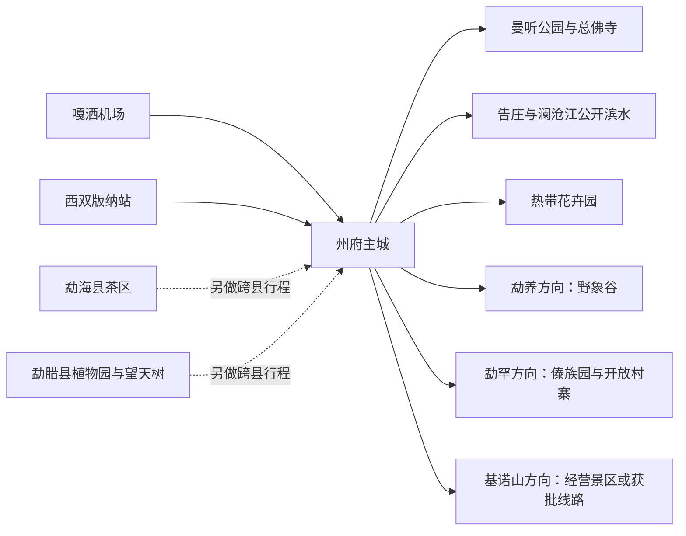
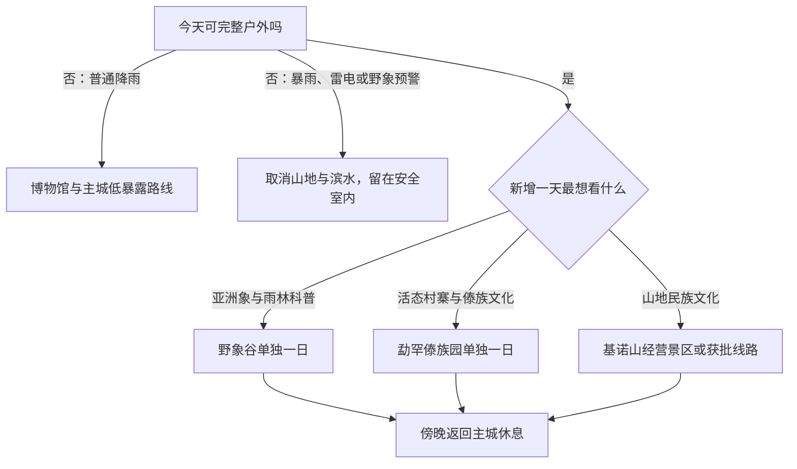

# 景洪旅行指南

景洪是西双版纳傣族自治州州府，也是一个法定县级市。旅行者在这里遇到的是州府主城、澜沧江两岸、勐养雨林方向、勐罕傣族村寨方向以及若干山地乡镇，而不是整个西双版纳州的缩影。最稳妥的安排是先在主城理解地方历史、宗教与植物，再从野象谷、傣族园或一条获批雨林体验中挑一个远点；勐海茶区和勐腊植物园应另做跨县行程。

> **建议停留**：主城 1 天；主城加一个远点 2 天；再加勐罕或另一条独立主题线 3 天。 
> **旅行关键词**：热带植物、傣族文化、亚洲象保护、澜沧江、夜间消费。 
> **主要体力**：中等；高温高湿会放大户外步行负担，雨林和山地线路更高。 
> **最近研究**：2026-08-12。

## 城市速览

| 旅行问题 | 直接判断 |
|---|---|
| 景洪是不是整个西双版纳 | 不是。景洪是州府所在的县级市；勐海县、勐腊县与景洪平级，不能把两县景点写入“景洪市内” |
| 第一次来住哪里 | 优先住州府主城或西双版纳站—告庄之间交通清楚的片区，便于抵离、补给和调整天气方案 |
| 只有一天怎么办 | 做西双版纳民族博物馆—主城午休—曼听公园—西双版纳总佛寺，不追远郊 |
| 最值得加的一天 | 对生态科普感兴趣选野象谷；对活态村寨与傣族文化感兴趣选勐罕傣族园，二者不宜同日硬拼 |
| 什么时候体感较难 | 高温高湿、强对流和连续降雨都会降低户外效率；当地公布的雨季与年度雨量只能作背景，出发仍看短临预警 |
| 能不能自己进雨林 | 不能把林道、巡护道或生产路当步道。只走景区公开游线，深度雨林徒步只选依法经营主体及经审核线路 |
| 能不能追野象 | 不能。野象谷门票不保证看到野象；在公路、农地或村寨附近遇预警时应绕行、撤离，不停车围观或放飞无人机 |
| 村寨能否随意参观 | 只使用景区、社区明确开放的道路和接待点；住宅、厨房、宗教与仪式空间须经主人或管理者同意 |
| 茶园和胶林能否自由进入 | 不能。茶园、胶林、割胶区、加工车间、仓库与农场道路首先是生产空间，仅参加经营主体明确开放的项目 |
| 无障碍条件如何 | 枢纽和大型景区可能有无障碍设施，但热带园林、寺院、村寨和雨林游线的连续通行资料不完整，须逐点确认入口、坡道、卫生间与接驳 |

景洪市政府的[基本概况](https://www.jhs.gov.cn/226.news.detail.dhtml?news_id=142391)明确其州府和县级市身份，并列出与勐海、勐腊及普洱等周边地区的边界。行政区划代码为 **532801**；GeoNames **1785710** 记录的是用于定位景洪主城的 PPLA3 级州府居民点，Wikidata **Q1012620** 则对应法定县级景洪市。Q1012620 的 P1566 连接到 1785710，可用于交叉核对名称和主城位置，但居民点坐标不能代替法定市域边界。州府功能也不会把勐海县或勐腊县并入景洪。

## 城市格局与游览区域

景洪的常规旅行可分成四个尺度：州府主城与澜沧江两岸适合连续步行和短途乘车；嘎洒机场、西双版纳站是抵离枢纽；勐养方向连接野象谷等生态旅游区；勐罕与基诺山方向分别承载村寨文化和山地体验。南部边境乡镇、保护区深处、港口作业区与农林生产区不因“在景洪市内”而成为自由游览区域。

| 区域 | 主要内容 | 游览尺度 | 关键边界 |
|---|---|---|---|
| 州府主城 | 民族博物馆、曼听公园、总佛寺、热带花卉园、餐饮与公共服务 | 1 天可完成核心组合 | 曼听公园与总佛寺相邻但管理、票制和宗教礼仪可能不同 |
| 告庄—澜沧江两岸 | 商业街区、星光夜市、公共滨水与夜间消费 | 适合作为傍晚补充 | 夜市不是传统村寨；码头、泊位、船舶、航道和港区不是公共步行区 |
| 勐养方向 | 野象谷、铁路站点与雨林生态教育 | 独立 1 天 | 可游的是生态旅游区公开游线，不是整个勐养子保护区；野象活动须服从实时预警 |
| 勐罕方向 | 傣族园、生活村寨与农文旅接待点 | 独立 1 天 | 村寨仍有居民生活；泼水活动、演出、住宅与宗教空间分开对待 |
| 基诺山及其他山地方向 | 经营景区、经审批雨林体验和开放社区项目 | 独立半天至 1 天 | 不自行进林、不跟导航走林道或胶园生产路；先核经营资质与线路审批 |
| 勐海、勐腊 | 茶区、中科院西双版纳热带植物园、望天树等 | 另换宿或单独长日 | 是两个独立县；不纳入景洪市景点完成率，也不与景洪远点混成一日多站 |

西双版纳国家级自然保护区由多个不相连片区构成，并跨景洪、勐海、勐腊。[云南省林业和草原局](https://lcj.yn.gov.cn/special/2025/0312/6393.html)公布的是保护区范围和保护对象，不是公众自由穿越清单。野象谷等生态旅游区的公开游线与保护区其他功能区必须分开理解。

## 主要景点

优先级用于安排时间：**A** 为首次到访的核心选择，**B** 为按兴趣补充，**C** 为通常需要单独半天以上或开放波动较大的目的地。“路线节点”不计入景点完成率。

| 景点 | 区域 | 类型 | 主要看点 | 建议用时 | 室内外 | 体力 | 预约风险 | 天气影响 | 优先级 |
|---|---|---|---|---:|---|---|---|---|---|
| 西双版纳民族博物馆 | 主城 | 博物馆 | 州域历史、民族文化与自然背景；先建立“景洪不等于全州”的空间认识 | 2—3 小时 | 室内为主 | 低 | 闭馆日、临展和团队讲解须重查 | 低 | A |
| 曼听公园 | 主城 | 历史园林、文化景区 | 热带园林、地方历史叙事与经营演出 | 2—4 小时 | 户外为主 | 中 | 日夜场、演出与票制可能分开 | 高温、暴雨影响大 | A |
| 西双版纳总佛寺 | 主城 | 活跃宗教场所 | 傣传佛教建筑与正在使用的宗教空间 | 1—1.5 小时 | 混合 | 中低 | 法会、礼仪和临时管控须服从现场 | 高温和降雨有影响 | B |
| 西双版纳热带花卉园 | 主城 | 植物园、热作科普 | 热带植物、热带作物科研与橡胶业历史展示 | 2—4 小时 | 户外为主 | 中 | 夜游、演出和专项体验另核 | 高温、雷雨影响大 | A |
| 告庄西双景与星光夜市 | 澜沧江北岸 | 当代商业文旅街区 | 夜间餐饮、集市和文旅活动；不等同于传统傣寨 | 2—3 小时 | 户外为主 | 中 | 节庆活动、摊位与交通管制变化快 | 暴雨、拥挤影响大 | B |
| 澜沧江公开滨水空间 | 主城两岸 | 城市公共空间 | 河岸散步与城市尺度观察 | 1—2 小时 | 户外 | 低至中 | 大型活动和水位管理可能封控 | 强降雨、水位和湿滑影响大 | 路线节点 |
| 野象谷生态旅游区 | 勐养方向 | 生态旅游、自然教育 | 亚洲象与热带雨林科普；观察结果不保证 | 1 天 | 户外为主 | 中至高 | 门票、接驳、索道或课程须重查 | 雷雨、野象活动和道路影响大 | A |
| 西双版纳原始森林公园 | 主城东郊 | 森林景区、经营演艺 | 经营景区公开森林游线与文化活动 | 半天至 1 天 | 户外为主 | 中至高 | 演出、接驳和开放游线须重查 | 雷雨、高温和湿滑影响大 | B |
| 西双版纳傣族园 | 勐罕镇 | 活态村寨、经营景区 | 傣族村寨、建筑、非遗与经营性泼水活动 | 1 天 | 户外为主 | 中 | 演出、泼水活动、接驳与村寨项目须重查 | 高温、暴雨影响大 | A |
| 基诺山寨 | 基诺山乡方向 | 民族文化经营景区 | 基诺族文化展示与山地景观 | 半天至 1 天 | 户外为主 | 中至高 | 演出、体验、接驳和开放状态须重查 | 山雨、落石和湿滑影响大 | B |
| 勐泐文化旅游区 | 主城南部 | 文化旅游景区 | 当代文化展示、山地视野和大型经营项目 | 半天 | 户外为主 | 中至高 | 表演、内部交通和票制变化较快 | 高温、雷雨影响大 | C |
| 经审批的雨林体验线路 | 景洪山地乡镇 | 自然教育、户外活动 | 在专业带领下理解雨林生态，不等于自由穿越保护区 | 半天至 1 天 | 户外 | 高 | 经营主体资质、线路审批、保险与天气均须先锁定 | 强对流、暴雨和野生动物影响极大 | C |

[云南宣传网转载的西双版纳属地报道](https://www.ynxc.gov.cn/html/2026/ggzslm_0506/3033690.html)可交叉确认傣族园、基诺山寨、原始森林公园、热带花卉园与告庄当期运营活动；[景洪市雨林徒步管理说明](https://www.jhs.gov.cn/137.news.detail.dhtml?news_id=145302)要求经营主体、线路和安全条件接受审核。临时活动不是永久开放承诺，仍应在行前重查。

## 美食与餐饮

景洪适合用主城正规餐馆理解傣味与多民族饮食，再把夜市当作补充。酸、辣、香草、烧烤和糯米常见，但“当地特色”不等于可以忽略生熟分开、冷链和过敏原。雨季不自行采食野生菌，也不要以进入村民厨房或生产后场换取所谓“原生态”。

| 菜品或餐饮类型 | 常见区域 | 一个人用餐与份量 | 风味、过敏原与饮食限制 | 排队风险与替代方法 |
|---|---|---|---|---|
| 傣味拼盘与手抓饭 | 主城、勐罕正规餐馆 | 多为多人份，独行先问小份 | 常含糯米、烤肉、香茅草、花生、辣椒和鱼露；逐项确认坚果与海鲜 | 热门店晚餐排队，改选同类明码标价餐馆 |
| 香茅草烤鱼或烤肉 | 主城与夜间餐饮区 | 可按条或份售卖，先问重量 | 鱼刺、辣椒、香草和腌料较多；确认是否彻底熟制 | 夜市高峰等待长，可在固定餐馆用餐 |
| 菠萝紫米饭与糯米制品 | 主城、景区餐饮点 | 适合小份共享 | 甜度高，可能含椰浆、乳制品或坚果；糯米不等于低糖 | 选择现制并能说明配料的商户 |
| 撒撇、舂菜与酸辣凉拌 | 正规傣味餐馆 | 多为配菜，适合共享 | 可能含生鲜肉、内脏、鱼露、花生和大量辣椒；肠胃敏感者选熟制替代 | 无法说明原料和温控时不点 |
| 米线、米干与汤粉 | 主城早餐和社区餐馆 | 通常一人一碗 | 汤底、肉臊、花生、腌菜和辣油须确认；米制主食不自动等于无麸质 | 选现煮、配料可分放的店 |
| 热带水果 | 市场、商店与正规摊位 | 先少量购买 | 高糖；菠萝、芒果、菠萝蜜等可能引发过敏或刺激 | 选择完整果实或现场清洁切配，拒绝久置果盘 |
| 普洱茶、滇红与本地咖啡 | 主城茶馆、咖啡馆 | 单杯或小壶适合独行 | 含咖啡因；不接受排毒、治病等功效承诺 | 先问价格、克重和是否另收服务费，不因品鉴被迫购物 |
| 夜市烧烤与小吃 | 告庄等夜间消费区 | 便于少量多样 | 看生熟分开、冷藏与彻底加热；海鲜、蛋、坚果过敏者逐项问 | 过度拥挤或卫生不清时转固定餐馆 |
| 清真或素食需求 | 主城相应餐馆 | 预先沟通更稳妥 | 素菜可能使用动物油、鱼露或共锅；清真需求须确认厨房与原料 | 不能确认交叉接触时选择包装食品并查看标签 |
| 野生菌菜肴 | 雨季正规餐馆 | 多为共享菜 | 不自行采食、购买或加工不明菌种，必须彻底熟制 | 商家无法说明菌种与加工时直接换普通蔬菜 |

## 经典行程

以下路线以“每个远点只占一个主题日”为原则。先根据天气、体力和兴趣选骨架，再锁定最难替换的预约。

### 一日主城经典路线

**适用条件**：第一次到景洪、拥有一个完整白天、能完成约半日户外步行的人；高温预警或强对流时缩短户外段。 
**路线**：西双版纳民族博物馆 → 主城午餐与午休 → 曼听公园 → 西双版纳总佛寺 → 返回住宿区。

- **串联逻辑**：上午先建立州域与民族背景，午后只移动到相邻的园林和宗教空间，避免把认知尚未建立时的商业表演当成全部地方文化。
- **预约锚点**：先核博物馆闭馆日与入馆规则，再核曼听公园日场、夜场和演出是否分票；总佛寺以当日宗教活动和现场礼仪为准。
- **休息安排**：正午在主城空调餐馆或住宿点休息 1—2 小时；曼听公园内按公开服务点补水，不在佛寺殿堂内饮食。
- **时间不足时**：保留博物馆和曼听公园，删总佛寺或只在相邻公开区域短停；不临时追加告庄夜市。

### 两日主城与野象谷路线

**适用条件**：希望了解亚洲象保护、能接受早出晚归和中等户外步行的旅行者；幼童、行动不便者须先核内部接驳和连续无障碍条件。 
**第 1 天**：民族博物馆 → 午休 → 曼听公园与总佛寺。 
**第 2 天**：主城 → 野象谷公开游线与自然教育内容 → 主城。

- **串联逻辑**：第一天理解州域生态与文化，第二天只做勐养方向一个远点；不以“没看到野象”为理由追车、追踪或进入农地。
- **预约锚点**：第 2 天交通、景区票、内部接驳或自然教育课程最先锁定，并查看景洪市最新[野象活动预警](https://www.jhs.gov.cn/131.news.detail.dhtml?news_id=145787)。
- **休息安排**：第 1 天午休；第 2 天在游客中心和公开服务点分段休息，携水、防晒、防虫用品，不在林缘野餐。
- **时间不足时**：整段删除野象谷，退回一日主城线；不要压缩成半天往返后再加原始森林公园。

### 三日主城、野象谷与勐罕路线

**适用条件**：有三个完整白天、愿意分别理解生态保护和活态村寨的旅行者；不适合把夜市、演出和长途接驳连续堆满的人。 
**第 1 天**：民族博物馆 → 曼听公园 → 总佛寺。 
**第 2 天**：野象谷一日。 
**第 3 天**：主城 → 勐罕镇西双版纳傣族园 → 只在明确开放的村寨接待区停留 → 主城。

- **串联逻辑**：三天分别回答“州府是什么”“雨林和亚洲象如何被保护”“村寨文化如何继续生活”，不把勐海茶山或勐腊植物园塞入第三天。
- **预约锚点**：先锁野象谷与勐罕往返交通，再核傣族园票制、演出或泼水活动；如选择社区体验，还要确认接待主体、时间和拍摄规则。
- **休息安排**：每天正午留室内休息；勐罕日在景区正式服务区用餐补水，不进居民后院寻找餐食。
- **时间不足时**：优先删第 3 天整段；若只有两天，保留主城和兴趣更强的一个远点。

### 普通雨天与极端天气路线

**适用条件**：仅适用于普通、短时降雨且城市交通正常；暴雨、雷电、大风、洪水或野象预警时不执行户外替代线。 
**路线**：民族博物馆 → 主城午餐与长休 → 热带花卉园当期开放的室内展陈或主城公共文化空间二选一 → 住宿区。

- **串联逻辑**：把可靠室内场馆放在首位，雨停后才使用园区主路；不进入滨水、山地、林地和临时积水路段。
- **预约锚点**：核博物馆和花卉园当日开放、展陈是否真正位于室内，并查气象、道路与景区停运通知。
- **休息安排**：午后不追赶临时放晴，在主城固定室内空间等待预警解除；鞋袜湿透及时更换。
- **时间不足时**：只保留民族博物馆；若发布停课、停运、地灾或洪水类警报，整段取消并遵从属地指引。

### 亲子与低体力路线

**亲子适用条件**：学龄儿童、能够遵守动物距离和不离队规则的家庭；婴幼儿先核推车连续通行、母婴与防蚊条件。 
**亲子路线**：民族博物馆 → 午休 → 热带花卉园短环线与科普内容 → 住宿区。

- **亲子串联逻辑**：先用室内展陈建立背景，再用可控的植物园主路观察实物；不把野象谷“见象”作为对儿童的承诺。
- **亲子预约锚点**：核两处场馆的儿童票、课程年龄、推车和当日活动；如改去野象谷，交通和自然教育课程须另锁。
- **亲子休息安排**：正午回住宿点或空调空间；每 45—60 分钟补水休息，不让儿童触摸、喂食动物或采摘植物。
- **亲子时间不足时**：保留民族博物馆，花卉园缩成主路；不追加夜市或山地活动。

**低体力适用条件**：长者、关节或心肺耐力有限但可短距离行走者；轮椅使用者须逐点确认连续无障碍。 
**低体力路线**：民族博物馆 → 住宿点午休 → 曼听公园入口附近主路短段或澜沧江公开滨水平缓段二选一 → 住宿区。

- **低体力串联逻辑**：全天只保留一个室内主点和一个可随时撤出的平缓户外段，使用点到点车辆，避开寺院台阶和园林支路。
- **低体力预约锚点**：向场馆确认无障碍入口、电梯、卫生间和落客点；向酒店确认接驳，不能只依据地图的“无障碍”标签。
- **低体力休息安排**：午休至少 2 小时，户外段安排在体感较低时段；携常用药和饮水。
- **低体力时间不足时**：只留民族博物馆；若热应激或降雨加重，取消全部户外段。

### 远郊一日路线

#### 方向一：野象谷

**适用条件**：生态科普优先、可接受全天户外和观察结果不确定的人；野象预警、雷暴或道路受阻时取消。 
**顺序与串联**：主城 → 野象谷游客中心 → 当日公开游线与课程 → 原路返回；全日只做一个生态旅游区。 
**预约锚点**：合法交通、门票、内部接驳、课程与最新野象活动信息。 
**休息安排**：只在游客中心和指定服务点休息，不离开公开游线，不在林缘停留等象。 
**时间不足时**：整段删除，改主城博物馆；不砍掉安全说明和休息去换第二个森林景区。

#### 方向二：勐罕傣族园

**适用条件**：对村寨、建筑与非遗感兴趣，能尊重居民生活边界并承受高温步行的人。 
**顺序与串联**：主城 → 傣族园游客入口 → 公开村寨道路与展演 → 正式服务区休息 → 主城。 
**预约锚点**：往返交通、票制、泼水或演出时间、社区体验与摄影许可。 
**休息安排**：正午在正式餐饮或游客服务空间停留；换干衣，不以民居、佛寺或工作间作为更衣和休息处。 
**时间不足时**：只做景区公开主线，删额外村寨体验；若返程不稳则整段取消。

#### 方向三：基诺山或获批雨林体验

**适用条件**：有山地经验、能接受湿滑和经营项目差异的人；两者二选一，不适合把“雨林穿越”理解为自行探路。 
**顺序与串联**：主城 → 合法经营主体接待点 → 经确认的景区或审核线路 → 主城；全程跟随管理人员。 
**预约锚点**：企业营业资质、具体线路审批、领队、保险、接送、装备和退改，比门票更重要。 
**休息安排**：按领队指定节点休息和补水；不进入胶林、茶园、科研区、巡护道或生产便道。 
**时间不足时**：整段删除；不另找低价临时向导，不在傍晚进山。

## 住宿区域

| 区域 | 优点 | 缺点 | 适合人群 | 交通特点 |
|---|---|---|---|---|
| 州府主城公共服务区 | 餐饮、医院、博物馆与日常补给集中，天气变化时最易调整 | 夜游氛围不如告庄，部分道路高峰拥堵 | 首次到访、家庭、低体力和重视稳定性者 | 到机场、车站和主要景区均需按时段核车程 |
| 曼听公园周边 | 接近园林、总佛寺和主城餐饮 | 节庆、演出和旅游旺季可能嘈杂 | 以主城文化线为主者 | 多数主城点可短途乘车，步行仍受高温影响 |
| 告庄—澜沧江北岸 | 夜市、餐饮和夜间活动集中 | 噪声、拥挤、网约车上客点与节庆管制变化大 | 重视夜生活且能接受热闹者 | 到西双版纳站相对清楚，但不能默认任何时段都快速通行 |
| 西双版纳站周边 | 铁路抵离方便，适合早晚车 | 城市体验和餐饮密度不一定优于中心区 | 短住、赶车或跨县接驳者 | 先确认酒店是否真可步行、落客点与夜间接驳 |
| 嘎洒机场方向 | 早班机或晚到更从容 | 离主城核心体验较远 | 过境一晚和航班优先者 | 航班日使用，不能同时兼顾夜市和清晨远郊 |
| 勐罕或远郊正规住宿 | 可减少单日往返，理解乡镇清晨与夜间节奏 | 选择、医疗、餐饮与返程弹性较小 | 已确认社区或景区项目的慢游者 | 只选合法登记住宿，先核接送、网络、消防和夜间车辆 |

## 市内交通

景洪的外来抵达主要依靠西双版纳嘎洒国际机场和西双版纳站。云南省交通运输厅的[多式联运信息](https://jtyst.yn.gov.cn/html/2026/xingyexinwen_0626/3137298.html)可确认航空、铁路、水运与公路枢纽结构，但实时航点、列车、公交和港航业务会变化。车站旁综合交通中心承担长途、城市公交和旅游集散功能；具体线路号不写成永久事实。

| 场景 | 建议与取舍 | 行前需要重查的内容 |
|---|---|---|
| 从机场抵达 | 正规出租车、网约车或已确认酒店接送；晚到不再追夜市 | 航站楼落客点、夜间车辆、酒店接机范围与价格 |
| 从西双版纳站抵达 | 先按住宿片区选择公交、出租或网约车，不在站外接受无资质揽客 | 列车时刻、公交末班、综合交通中心上客位置 |
| 主城跨片区 | 高温或降雨时优先短途车辆，步行用于单一园区内部 | 公交临时调整、节庆封路、网约车上下客限制 |
| 野象谷 | 铁路、正规旅游交通或合法包车均须以当日可售服务为准 | 野象谷站列车、景区接驳、返程末班和预警 |
| 勐罕、基诺山及乡镇 | 选正规班线、景区接驳或合法车辆；去程即确认返程 | 道路、接送主体、返程时间、雨季地灾与通信 |
| 澜沧江与港航 | 只使用依法运营且当日公告正常的客运或旅游船；普通滨水游不进入作业区 | 船舶证照、天气、水位、停航、救生与退改 |
| 自驾 | 主城非必需；远郊也不因有车就能进入保护区、边境或生产路 | 停车、临时管制、道路塌方、野象预警和驾驶疲劳 |

景洪港中央港区等作业水域承担港航功能。公共滨水、合法客运码头、泊位和航道是不同空间；不跨护栏、不走装卸通道、不靠近作业船舶，也不在洪水或强对流时停留江边。

## 不同旅行者须知

| 旅行维度 | 可行条件 | 主要取舍 | 需额外核对 |
|---|---|---|---|
| 独行旅行 | 主城点餐、打车和公共场馆便利 | 夜市散场与远郊返程不稳定，不接受无资质拼车或临时进山邀约 | 返程车辆、住宿前台、活动最低人数和紧急联系人 |
| 亲子旅行 | 博物馆、热带植物与正规自然教育适合分龄安排 | 高温、蚊虫、泼水湿滑和长接驳会快速消耗体力 | 课程年龄、儿童票、推车、母婴设施和防蚊用品限制 |
| 长者或低体力 | 主城可做点到点短线 | 园林、寺院、山地与雨林连续通行负担大 | 落客点、坡道、电梯、卫生间和紧急撤出路线 |
| 无障碍需求 | 枢纽与大型景区可能提供局部设施 | “有无障碍设施”不等于全程无台阶或接驳无障碍 | 逐点询问入口、轮椅借用、坡度、车辆固定和陪同规则 |
| 摄影旅行 | 公共园林、城市滨水和经营景区有丰富题材 | 不拍边境、港航、军事警务等敏感设施；不贴近居民、僧侣和仪式 | 无人机空域、三脚架、商业拍摄、肖像和宗教场所规则 |
| 生态旅行 | 合规景区和获批自然教育项目可学习雨林与亚洲象 | 不以接近、投喂、追踪或采集证明“深度” | 野象预警、保护区规定、领队资质和线路审批 |
| 预算有限 | 主城公共文化和公共空间可组合 | 远郊交通、接驳和课程是主要成本，不为低价转向无资质经营 | 票制、交通总价、最低成团、购物和退改 |
| 特殊天气 | 普通小雨可转博物馆和室内公共文化空间 | 雷暴、暴雨、洪水、地灾或高温预警时取消林地、滨水和长线 | 中国天气、地方预警、景区公告、道路与列车航班 |

健康方面，防晒、防蚊、补水和防热应激比“打卡数量”重要。防虫产品按说明使用；不触碰、捕捉或带走昆虫、植物和动物制品。需要接种、用药或有基础病者，应在出发前向专业医疗人员咨询，不用旅行指南替代诊疗。

## 行前核对

| 核对事项 | 为什么需要重查 | 建议核对时间 | 官方入口 |
|---|---|---|---|
| 博物馆、曼听公园与总佛寺开放 | 闭馆、法会、演出、日夜场和票制可能变化 | 预约前及到访前一日 | [云南宣传网转载的属地资料](https://www.ynxc.gov.cn/html/2024/dianbanjingpin_1028/3016431.html)、各场所当日公告 |
| 野象谷、原始森林公园与傣族园运营 | 接驳、课程、演出与维修会改变可用时间 | 定下远点前及出发当日 | [云南宣传网转载的西双版纳属地报道](https://www.ynxc.gov.cn/html/2026/ggzslm_0506/3033690.html) |
| 雨林徒步经营资质与线路 | 只有依法经营主体和审核线路才可使用 | 付款前、出发前一日 | [景洪市人民政府政策说明](https://www.jhs.gov.cn/137.news.detail.dhtml?news_id=145302) |
| 野象活动 | 象群位置会影响道路、村寨和景区管理 | 远点前一日及当日 | [景洪市人民政府预警示例](https://www.jhs.gov.cn/131.news.detail.dhtml?news_id=145787) |
| 航班与机场服务 | 航线、值机、天气和夜间交通会变化 | 购票前、出发前 24 小时 | [云南机场集团](https://www.ynairport.com/) |
| 列车与车站接驳 | 车次、野象谷站停靠和公交末班会变化 | 购票前、出发前一日 | [中国铁路 12306](https://www.12306.cn/) |
| 天气、水位和地质风险 | 强对流、暴雨、高温、江水和山路风险具有时效性 | 出发前三日、前一日及当日 | [中央气象台](https://www.nmc.cn/)、[景洪市人民政府](https://www.jhs.gov.cn/) |
| 无障碍与儿童设施 | 公开资料不足以证明连续通行 | 订票和订房前 | 具体场馆、景区与酒店官方客服 |
| 勐海或勐腊跨县行程 | 交通、住宿和行政边界独立，不是景洪市内接驳 | 纳入行程前 | [勐海县人民政府](https://www.ynmh.gov.cn/)、[勐腊县人民政府](https://www.ynml.gov.cn/) |
| 旅游投诉与紧急服务 | 旺季经营项目多，保存合同和付款凭证便于处理 | 付款前及旅行中 | [全国文化和旅游市场网上举报投诉平台](https://jbts.mct.gov.cn/) |

## 来源与更新记录

### 主要来源

| 来源 | 类型 | 支持内容 | 核验日期 |
|---|---|---|---|
| [景洪市基本概况](https://www.jhs.gov.cn/226.news.detail.dhtml?news_id=142391) | 市政府 | 州府、县级市、行政区划、地理边界与气候背景 | 2026-08-12 |
| [景洪市雨林徒步管理政策说明](https://www.jhs.gov.cn/137.news.detail.dhtml?news_id=145302) | 市政府 | 经营主体、线路审核和安全准入 | 2026-08-12 |
| [云南西双版纳国家级自然保护区](https://lcj.yn.gov.cn/special/2025/0312/6393.html) | 省林草部门 | 保护区跨县市范围、分片与保护目标 | 2026-08-12 |
| [自然保护区生态旅游转型升级](https://lcj.yn.gov.cn/html/2026/mainnews_0303/76207.html) | 省林草部门 | 野象谷等生态旅游区的自然教育属性 | 2026-08-12 |
| [景洪文旅体验与景区运营](https://www.ynxc.gov.cn/html/2026/whxdfocus_0320/3032949.html) | 云南宣传网转载属地资料 | 傣族园、热带花卉园当期运营 | 2026-08-12 |
| [西双版纳假日文旅运营](https://www.ynxc.gov.cn/html/2026/ggzslm_0506/3033690.html) | 云南宣传网转载属地资料 | 告庄、傣族园、基诺山寨、原始森林公园等当期活动 | 2026-08-12 |
| [西双版纳多式联运](https://jtyst.yn.gov.cn/html/2026/xingyexinwen_0626/3137298.html) | 省交通部门 | 机场、铁路、公路、水运与港口结构 | 2026-08-12 |
| [中国科学院西双版纳热带植物园](https://www.xtbg.ac.cn/) | 科研机构 | 植物园官方入口及其独立目的地属性 | 2026-08-12 |
| [GeoNames 1785710](https://www.geonames.org/1785710/) | 开放地理数据 | 固定地点标识 | 2026-08-12 |
| [Wikidata Q1012620](https://www.wikidata.org/wiki/Q1012620) | 开放知识图谱 | 法定景洪市实体与 P1566=1785710 交叉核对 | 2026-08-12 |

### 更新记录

| 日期 | 更新内容 |
|---|---|
| 2026-08-12 | 首次完成资料研究；核准 GeoNames 1785710、Wikidata Q1012620 与行政区划代码 532801；建立州府与全州、保护区与经营景区、村寨生活与农林生产边界，并补齐分众路线和动态核对项 |
