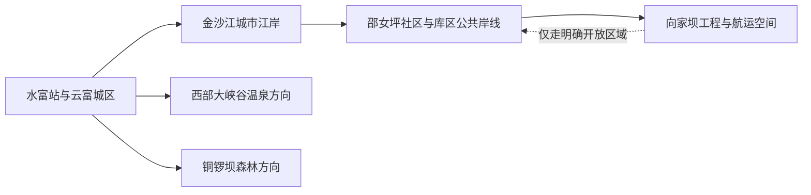
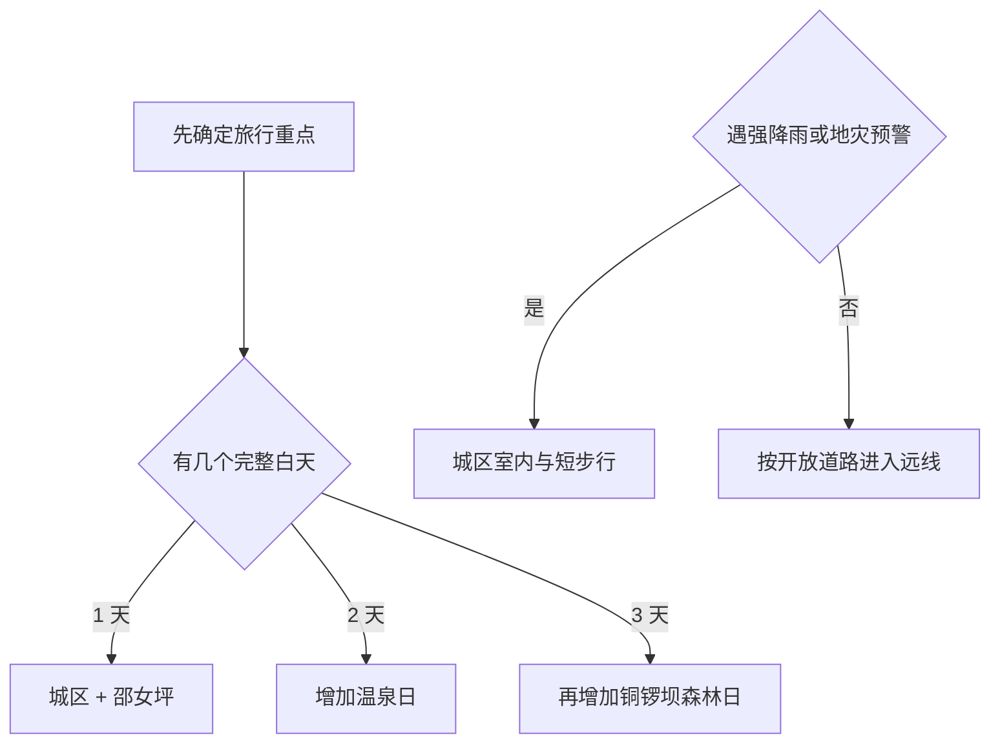

# 水富旅行指南

水富位于金沙江与横江交汇附近，是云南北端连接四川宜宾的港口小城。旅行最容易理解成三层：云富街道承担抵离、餐饮和城市江岸散步；邵女坪与向家坝库区适合看移民新社区、高峡平湖和水运；西部大峡谷、铜锣坝国家森林公园则各自需要单独安排车辆和半日至整日。城市体量不大，但山路、水域与景点入口分散，先选一个方向比把所有点串成环线更从容。

> 建议停留：城区与邵女坪 1 天；增加西部大峡谷或铜锣坝各再留 1 天 
> 旅行关键词：金沙江港城、向家坝高峡平湖、邵女坪移民社区、温泉、森林、滇川交界 
> 主要体力：城区低至中等；森林山路和温泉园区为中等，汛期与高温会明显增加负担 
> 最近研究：2026-08-13

## 城市速览

| 项目 | 旅行信息 |
|---|---|
| 主要旅行价值 | 用一座紧凑港城理解金沙江航运、向家坝工程移民与滇川交界生活，再从温泉或森林中选择一条自然远线 |
| 建议停留 | 1 天安排城区—邵女坪；2 天增加西部大峡谷；3 天再增加铜锣坝森林方向 |
| 最佳节奏 | 上午看城市与江岸，午后转邵女坪；森林日早出，温泉日把更衣、休息和返程时间留足 |
| 主要交通 | 水富站、宜宾方向铁路与公路承担抵离；市内和远线以公交、出租车、网约车或正规包车衔接 |
| 气候与季节 | 夏季湿热且强降雨集中，冬季较温和；汛期先看降雨、地灾、航运和沿江设施公告 |
| 预算特征 | 城区餐饮住宿较平实；温泉票、远线车辆与森林住宿是主要增量支出 |
| 步行强度 | 城区江岸可分段慢走；铜锣坝有坡路和湿滑林道，温泉园区内部也可能需要较多步行 |
| 无障碍 | 城区新建公共空间通常较平缓，景区内部坡度、接驳车、无障碍卫生间和客房仍需逐点确认；设施连续性需向官方确认 |
| 亲子旅行 | 邵女坪、城市公园和合规温泉更容易安排；森林日按儿童耐力缩短步道 |
| 行前核心 | 先确认目标入口、返程车辆、汛期预警和温泉/森林当日营业，再订远线住宿 |

## 城市格局与游览区域

水富市法定代码为 `530681`，由昭通市代管。固定 GeoNames `6648023` 是人口清单中的水富城市驻地点；Wikidata 法定实体 `Q582534` 当前 `P1566` 连接另一条行政记录 `1794488`。两套标识可交叉核对名称与位置，但城市点坐标不代替县级市边界。

| 区域 | 适合体验 | 安排方式 | 关键条件 |
|---|---|---|---|
| 云富城区 | 车站、城市广场、江岸、地方餐饮与日常生活 | 作为住宿和换乘基地，半日至 1 天 | 沿江步道分段开放，汛期看水位与临时管制 |
| 邵女坪—向家坝库区 | 移民新社区、高峡平湖、水运与江湾景观 | 与城区组成一日线，按公共交通或车辆往返 | 码头、航线和亲水设施以交通主管部门公告为准 |
| 西部大峡谷 | 温泉度假、峡谷环境与休息 | 预留半日至整日，入住时更从容 | 核对营业、票制、温泉池开放、儿童和健康规则 |
| 铜锣坝方向 | 森林、溪谷和山地避暑 | 独立整日，宜早出并预留返程 | 核对防火、降雨、道路、步道和接待设施 |
| 两碗—太平方向 | 山地村落、地方文物和季节乡村 | 只选已有正式接待信息的一处 | 村路与服务季节性强，先确认停车、餐饮和返程 |

向家坝水电站、港区、航道和码头作业面属于生产与水运管理空间。旅行可选择官方开放的观景、社区和公共岸线；工程设施、库岸消落带、装卸区和航标水域按现场管理范围进入。铜锣坝国家森林公园以内的防火、生态保护和步道规则同样优先于地图上的近路。

## 主要景点

### 城区与江岸

| 名称 | 区域 | 类型 | 旅行价值 | 建议时长 | 室内外 | 体力 | 无障碍 | 预约 | 优先级 |
|---|---|---|---|---:|---|---|---|---|---|
| 水富城市江岸与万里长江第一港广场 | 云富城区 | 城市公共空间 | 看金沙江港城尺度、城市更新与滇川交界日常 | 1–2 小时 | 室外 | 低至中 | 中 | 通常无需 | A |
| 天桥巷—糖房巷城市街区 | 云富城区 | 街巷、城市生活 | 用短步行连接地方餐饮、旧城记忆和新公共空间 | 1–2 小时 | 混合 | 低 | 中 | 通常无需 | B |
| 北大门公园及城市公园带 | 云富城区 | 公园 | 适合作为抵达日、亲子或低体力缓冲 | 1–2 小时 | 室外 | 低 | 中 | 通常无需 | B |
| 邵女坪社区与公共观景带 | 邵女坪 | 移民社区、江湾 | 理解向家坝工程移民、高峡平湖与社区旅游 | 2–4 小时 | 室外 | 低至中 | 中 | 航船另核 | A |

### 温泉与森林远线

| 名称 | 区域 | 类型 | 旅行价值 | 建议时长 | 室内外 | 体力 | 无障碍 | 预约 | 优先级 |
|---|---|---|---|---:|---|---|---|---|---|
| 西部大峡谷温泉旅游区 | 温泉片区 | 温泉、度假 | 以温泉休息为主，适合与城区文化线分日 | 4–8 小时 | 混合 | 低至中 | 逐项确认 | 建议 | A |
| 铜锣坝国家森林公园 | 太平镇方向 | 森林、溪谷 | 山地森林与避暑环境，是城市之外最完整的自然日 | 5–8 小时 | 室外 | 中至高 | 低至中 | 建议 | A |
| 楼坝古渡及周边乡村文物线索 | 向家坝镇方向 | 古渡、地方史 | 补充金沙江交通与地方聚落历史 | 1–3 小时 | 室外 | 中 | 低 | 先核开放 | C |
| 两碗三角坪头苗寨等乡村节点 | 两碗镇方向 | 乡村、民族文化 | 适合遇到正式活动或接待时增加地方文化体验 | 半日至 1 天 | 混合 | 中 | 低 | 需要确认 | C |

西部大峡谷的温泉池、游乐设施和住宿产品会随运营调整；名称相近的露营、温泉或地产项目也可能使用同一片区品牌。订购时看清实际场馆、包含项目和退改。铜锣坝的森林公园身份不等于所有林道都开放，行程以游客入口和当日开放步道为准。

## 美食与餐饮

水富饮食同时受滇东北、川南和江河交通影响，城区适合寻找燃面、面点、江鲜替代菜、烧烤和家常炒菜。长江流域重点水域实行禁捕管理，菜单上的“野生江鱼”宣传需要谨慎辨别，优先选择来源清楚的合法养殖水产品。

| 类型 | 适合区域 | 份量与点法 | 过敏原与替代 |
|---|---|---|---|
| 燃面、面条与抄手 | 车站、人民路及生活街区 | 一人一份，适合抵达日 | 常含小麦、花生、芝麻、大豆和辣椒；可要求少辣、去花生碎 |
| 云南米线与饵丝 | 城区早餐店 | 一人一碗，可另加肉帽 | 汤底可能含骨汤、花生和大豆；素食需确认汤底 |
| 合法养殖鱼与家常江鲜做法 | 城区正规餐馆 | 通常按重量，2–4 人更合适 | 先确认品种、来源、计价和做法；鱼类过敏者换家常肉菜 |
| 腊肉、香肠与山地家常菜 | 城区及乡镇餐馆 | 咸度高，先点小份配蔬菜 | 腌制品含盐高，可能含酒、花椒或亚硝酸盐；可换清炒时蔬 |
| 烧烤与夜间小吃 | 城区街巷 | 少量多样，适合分享 | 腌料常含大豆、小麦、芝麻；海鲜与肉类可能共用烤架 |

## 经典行程

### 一日经典：港城与邵女坪

**路线**：水富站或城区住宿 → 城市江岸与广场 → 城区午餐 → 邵女坪社区公共观景带 → 返回城区

- **串联逻辑**：上午从港城公共空间认识水富，下午沿同一江河主题进入移民社区和高峡平湖，避免跨向森林山路。
- **预约锚点**：如计划游船，先锁定主管部门公布的航线、码头、票务和返航；纯陆上公共空间通常无需预约。
- **休息安排**：午餐在城区，邵女坪留一次室内或遮阴休息；夏季避开正午长时间暴晒。
- **时间不足时**：保留城区江岸和邵女坪二选一；抵达较晚时只走城区短线。

### 两日：港城加温泉

**第 1 天**：城区 → 邵女坪 → 城区住宿 
**第 2 天**：西部大峡谷温泉 → 园区休息 → 返回或园区住宿

- **串联逻辑**：第一天看江河与城市，第二天把温泉作为单一度假项目，换衣、泡池和休息都不被压缩。
- **预约锚点**：预订温泉票或客房时确认实际营业场馆、池区、二次消费、儿童身高和退改。
- **休息安排**：泡浴分段进行，补水并避免空腹、饮酒后或身体不适时入池。
- **时间不足时**：第二天只保留温泉主池区，不叠加森林或乡村远点。

### 三日：增加铜锣坝森林

**第 3 天路线**：城区早出 → 铜锣坝正式游客入口 → 选择一条开放步道 → 服务区午餐与长休息 → 原路返回

- **适用条件**：道路、防火、降雨和步道开放信息清楚，且能在天黑前返城。
- **串联逻辑**：森林方向与江岸、温泉分日，车辆与步行时间都更可控。
- **预约锚点**：确认门票、停车、接驳、餐饮和当日可走步道；团队活动按运营方要求预约。
- **休息安排**：中午在正式服务区长休，携带饮水和防雨层；下坡前再次评估体力。
- **时间不足时**：缩短为游客中心附近短步道；没有可靠返程时改走城区公园。

### 雨天：城区短线

**路线**：住宿地 → 就近公共文化或商业空间 → 午餐 → 雨势减弱后走一段城市街巷

- **适用条件**：普通降雨且城市交通正常；强降雨、地灾或沿江管制时按预警减少移动。
- **串联逻辑**：全程留在云富城区，减少山路、库岸与码头暴露。
- **预约锚点**：先确认拟去室内场所当日开放；温泉仅在道路和场馆均正常时保留。
- **休息安排**：每段步行控制在短距离，鞋袜湿透后先回住宿更换。
- **时间不足时**：保留一顿地方餐和一处室内空间即可。

### 亲子：社区观察与公园

**路线**：城市公园 → 城区午餐 → 邵女坪公共活动空间 → 提前返城

- **适用条件**：天气温和、公共区域开放且儿童能适应车辆往返；游船和泡池分别核年龄规则。
- **串联逻辑**：用平缓公共空间替代长山路，把江河、城市和移民社区作为观察主题。
- **预约锚点**：涉及游船、温泉或活动课程时提前确认年龄、救生设备和陪同要求。
- **休息安排**：午后安排室内休息，携带防晒、防蚊和替换衣物。
- **时间不足时**：只保留城区公园和短江岸。

### 长者与低体力：城区分段慢游

**路线**：住宿地车辆抵达江岸一处 → 平缓短步行 → 午餐长休 → 车辆到邵女坪一处观景点 → 返回

- **适用条件**：可落实点到点车辆、电梯或无台阶入口，并避开高温与强降雨。
- **串联逻辑**：每次只走一个短段，用车辆连接，不追求连续江岸里程。
- **预约锚点**：向酒店和景点确认无障碍入口、卫生间、轮椅借用和上下车点。
- **休息安排**：午间至少休息 1 小时，温泉体验先征询健康建议并缩短泡浴。
- **时间不足时**：保留城区一个平缓观景点和午餐。

## 住宿区域

| 区域 | 优势 | 取舍 | 适合人群 | 交通提示 |
|---|---|---|---|---|
| 水富站—云富城区 | 抵离、餐饮、叫车和日常服务最稳定 | 去森林和温泉仍需车辆 | 首访、铁路抵达、短停 | 核对与水富站、实际上车点的距离 |
| 城区江岸附近 | 晚间散步方便，接近城市公共空间 | 汛期景观和沿江交通可能调整 | 城市慢游、摄影 | 订房时问清临江房噪声、停车和防洪通道 |
| 西部大峡谷温泉片区 | 方便完整泡浴和休息 | 餐饮选择、往返城班次和二次消费受园区影响 | 温泉度假、亲子 | 确认是否含温泉、接送及退改 |
| 邵女坪或乡村接待点 | 适合看江湾早晚与社区生活 | 房源和夜间交通较少 | 自驾、慢游 | 先落实持证住宿、停车、餐饮和返程 |

## 市内交通

水富处在滇川交界，宜宾方向的铁路、公路联系对实际旅行很重要。购买跨省车票时按票面站名安排行程，水富站、宜宾站与宜宾西站并非同一处。景点间多靠道路连接，地图上的直线距离常低估山路、库岸和跨江绕行。

| 场景 | 推荐做法 | 出发前核对 |
|---|---|---|
| 铁路抵达 | 以水富站为本地门户，按住宿位置选择公交或出租车 | 车次、到站、末班与站前施工 |
| 从宜宾衔接 | 比较铁路与正规公路客运的总耗时，再决定是否跨省换乘 | 实际到发站、班次、行李与夜间接驳 |
| 城区—邵女坪 | 公交、出租车、网约车或正规包车均可，返程先留联系方式 | 班次、停车、道路和活动管制 |
| 城区—温泉 | 使用场馆公布的接驳或合规车辆 | 营业、接送范围、末班、票制 |
| 城区—铜锣坝 | 自驾或正规包车更便于控制时间 | 山路、天气、防火、停车和返程 |
| 水上交通 | 只使用主管部门公布码头和持证客船 | 航线、实名、救生设备、风浪、返航与停航 |

## 不同旅行者须知

| 旅行者 | 更合适的选择 | 重点准备 |
|---|---|---|
| 独行旅行 | 城区住宿、江岸短线和运营明确的温泉 | 远线返程、夜间叫车和通信；山林不单独走非开放支路 |
| 亲子家庭 | 城市公园、邵女坪公共空间、符合年龄规则的温泉 | 防晒、防蚊、救生与泡池年龄规则 |
| 长者或低体力 | 以城区为基地，车辆连接单点观景 | 电梯、无台阶入口、座椅、卫生间和高温时段 |
| 摄影旅行 | 江岸、社区公共观景点和正式森林步道 | 水位、晨雾、降雨、无人机与工程设施拍摄规则 |
| 自驾旅行 | 温泉和铜锣坝分日，提前下载离线地图 | 山路落石、积水、停车、充电和司机休息 |
| 预算有限 | 城区住宿、公共江岸和城市公园 | 远线车辆拼车合法性、温泉包含项和退改 |

安全边界集中在三类空间：金沙江与库区按航运、水利和防洪管理；森林按防火和生态保护管理；港口、水电站与施工区按生产管理。进入这些方向时，以公开游客入口和现场标识选择路线。

## 行前核对

| 项目 | 为什么会变 | 何时核对 | 官方入口 |
|---|---|---|---|
| 温泉营业与票制 | 池区维护、活动、季节产品和住宿套餐会调整 | 订房前、到访前一日 | [水富市政府入口](https://www.shuifu.gov.cn/) |
| 铜锣坝道路与防火 | 降雨、林火等级、步道维护会影响开放 | 出发前三日、当天早晨 | [云南省林业和草原局](https://lcj.yn.gov.cn/) |
| 邵女坪水运 | 水位、风浪、节庆客流和航道管理会改变班次 | 购票时、出发当天 | [云南省交通运输厅](https://jtyst.yn.gov.cn/) |
| 地灾与强降雨 | 山地道路可能受滑坡、泥石流和积水影响 | 出发前三日及当天 | [云南省自然资源厅](https://dnr.yn.gov.cn/)；[云南气象](https://yn.cma.gov.cn/) |
| 铁路车次 | 水富与宜宾各站停靠会调整 | 购票时、出发前一日 | [中国铁路 12306](https://www.12306.cn/) |
| 行政与景点归属 | 昭通市域、水富县级市和四川宜宾跨省关系不同 | 规划跨城路线时 | [民政部行政区划查询](https://dmfw.mca.gov.cn/xzqh/getList?code=530600&trimCode=false&maxLevel=3) |

## 来源与更新记录

### 主要来源

| 来源 | 机构 | 支持内容 | 核验日期 |
|---|---|---|---|
| [水富春节水上客运保障](https://jtyst.yn.gov.cn/html/2026/xingyexinwen_0304/3136594.html) | 云南省交通运输厅 | 邵女坪水上客流、正规客运与节假日保障 | 2026-08-13 |
| [“港园城”融合发展](https://jtyst.yn.gov.cn/html/2023/xingyexinwen_1102/130315.html) | 云南省交通运输厅 | 港城格局、城市公共空间、邵女坪、西部大峡谷与铜锣坝 | 2026-08-13 |
| [水富移民社区建设](https://mzzj.yn.gov.cn/html/2024/hemurongrongshouwangxiangzhu_0829/4055468.html) | 云南省民族宗教事务委员会 | 向家坝移民、邵女坪社区与高峡平湖背景 | 2026-08-13 |
| [水富旅游促进交往交流](https://mzzj.yn.gov.cn/html/2023/difangdongtai_0928/50472.html) | 云南省民族宗教事务委员会 | 西部大峡谷、铜锣坝及乡村文物线索 | 2026-08-13 |
| [溪洛渡至水富航道设计变更](https://jtyst.yn.gov.cn/html/2024/zhongdajianshexiangmu_0223/131304.html) | 云南省交通运输厅 | 航道、码头属于水运工程管理空间 | 2026-08-13 |
| [云南自然保护地资料](https://lcj.yn.gov.cn/uploadfile/s37/2024/0711/20240711062643569.pdf) | 云南省林业和草原局 | 铜锣坝国家森林公园身份与规划状态 | 2026-08-13 |
| [云南地质灾害风险预警样例](https://dnr.yn.gov.cn/html/2025/shengtingdongtai_0828/4050476.html) | 云南省自然资源厅 | 水富强降雨期滑坡泥石流风险与动态核对必要性 | 2026-08-13 |
| [GeoNames 6648023](https://www.geonames.org/6648023/) | GeoNames | 固定城市驻地点标识 | 2026-08-13 |
| [Wikidata Q582534](https://www.wikidata.org/wiki/Q582534) | Wikidata | 水富市实体及 `P1566` 行政记录差异 | 2026-08-13 |
| [民政部行政区划查询：530600](https://dmfw.mca.gov.cn/xzqh/getList?code=530600&trimCode=false&maxLevel=3) | 民政部 | 水富市 `530681` 与昭通市代管关系 | 2026-08-13 |

### 更新记录

| 日期 | 更新 |
|---|---|
| 2026-08-13 | 首次完成水富市公众旅行研究；区分城市点、法定县级市与行政记录，建立云富城区、邵女坪、温泉和铜锣坝分线，并补充水域、港区、森林、汛期与无障碍核对 |
