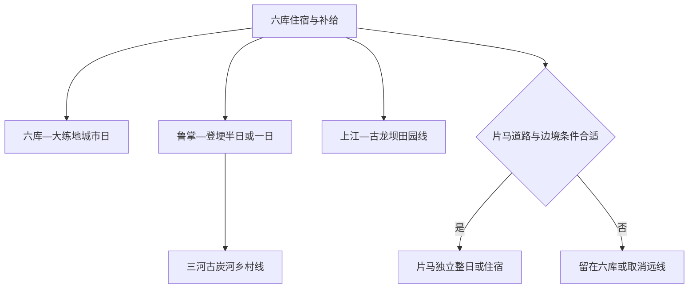
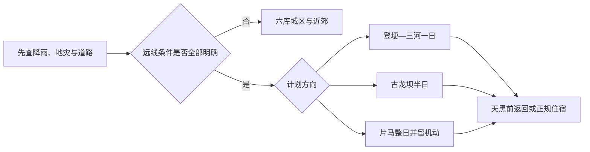

# 泸水旅行指南

> **适合谁**：希望以六库为补给和住宿基地，理解怒江峡谷、傈僳文化、登埂温泉文化与片马边境史，并愿意为山地公路、汛期和边境规则留足余量的旅行者。 
> **建议停留**：六库城区与近郊 1—2 天；加入鲁掌—登埂或古炭河再加 1 天；片马须作为独立长线，通常再留 1—2 天。 
> **核心取舍**：泸水不是“把怒江州所有景点串成一条路”的代称。六库是州府门户，登埂、三河与片马分处不同山谷和海拔；福贡、贡山、兰坪及丙中洛、独龙江不属于泸水市，不能用一趟城市包车替代分县行程。

## 城市速览

泸水市是怒江傈僳族自治州辖县级市和州府所在地，法定行政代码为 `533301`。六库街道与大练地街道构成主要城市服务区，住宿、餐饮、客运和医疗资源相对集中；鲁掌、登埂、片马、上江、大兴地、称杆等方向沿怒江干流或翻越高黎贡山展开，旅行时间由道路、落石、泥石流、边境管理和天气共同决定。

| 旅行问题 | 直接判断 |
|---|---|
| 第一次到泸水住哪里 | 住六库或大练地的正规住宿，优先选择步行可达餐饮、能确认停车或客运接驳的位置 |
| 只有一天 | 做六库滨江公共空间、公开文化点与阳坡村近郊线，不赶片马，也不把福贡方向算进来 |
| 想体验登埂温泉文化 | 先核对道路、节庆、公共开放边界和水质安全；传统节庆信息不等于全年可随意泡浴 |
| 想去片马 | 至少按整日山路安排；先确认边境、道路、场馆开放和返程，恶劣天气直接取消 |
| 想继续到丙中洛或独龙江 | 这是贡山县长线，应另建住宿与交通计划；泸水页只负责六库出发与换乘边界 |
| 雨季能否照常走峡谷公路 | 不能预设。强降雨可触发滑坡、泥石流、山洪和道路临时管制，必须按当天官方信息缩线 |
| 是否适合无车旅行 | 六库城区可以；村寨、登埂、古炭河和片马需要核实正规客运、合规包车或接待方接驳 |
| 能否进入边境、保护区或生产便道 | 只能进入公告允许的公共道路和接待区域；界碑、巡护路、保护区核心地、矿区与施工便道都不默认开放 |

固定 GeoNames `13512503` 是 2025 年新增的 `PPLA2` 城市点，用于定位六库—泸水的主要门户；Wikidata `Q1200817` 表达现行法定泸水市，但其 `P1566=1280661` 仍指向旧泸水县行政记录。固定点、旧行政记录与县级市行政面粒度不同：本页保留固定候选点作为入口，不把点坐标当成完整市界，也不擅自改写 Wikidata 的历史关联。

## 城市格局与游览区域

### 六库—大练地：州府服务与峡谷门户

六库是抵离、住宿、补给和城市漫步的首选基地。怒江两岸的公共滨江道路、桥梁、城市广场与社区生活构成城区体验；这些空间同时承担防洪、交通和居民日常功能，不是一座封闭收费景区。大练地与怒江新城承接部分州、市公共服务，地图上的“六库”“泸水”和“怒江州府”可能指向相邻但不完全相同的点位，订房与叫车应以门牌和桥梁所在岸为准。

阳坡村等近郊农文旅点可在明确接待时加入半日行程。村寨是居民生活与生产空间，餐饮、演出、服饰体验和民宿需要由经营者明确提供；普通院落、耕地、咖啡园和林地不能因“民族村寨”标签而默认开放。

### 鲁掌—登埂—三河：温泉文化与山谷村寨

鲁掌镇、登埂一带连接传统澡塘文化、峡谷道路与高黎贡山东坡村寨。登埂“澡塘会”等活动具有明确季节和组织条件，天然热水、河岸、临时摊点与节庆场地不等于全年稳定运营的温泉度假区；出发前需核对活动日期、入水边界、水温水质、卫生条件和河流水情。

三河村古炭河方向发展观鸟、森林体验和乡村接待，但村道、鸟塘、林缘步道与保护地边界会随天气、接待能力和森林防火变化。只使用接待方确认的路径，不追逐野生动物、不播放鸟鸣诱拍，不越过围栏进入林地或农田。

### 上江—古龙坝：河谷田园与生产空间

上江镇古龙坝等村落以稻田、鱼塘、农家乐和农事体验为线索。这里首先是农业生产与居民生活空间，稻田抓鱼、垂钓、采摘和用餐只能参加经营者当期明确组织的项目；水渠、鱼塘、机耕路和仓储区不作为自由步道。强降雨或灌溉期应取消涉水活动。

### 片马：高黎贡山西坡的边境长线

片马镇位于高黎贡山深处的中缅边境方向，官方资料给出的六库至片马距离约 93 公里，但山路时间不能按平原公路估算。片马抗英纪念馆、怒江驼峰航线纪念馆与纪念碑可作为一个红色历史片区理解；场馆、口岸、边境村寨、风雪丫口与公路观景点分别受文博、边境、道路和自然保护规则管理，不能因处在同一方向就推定一次通行全部开放。

片马公路穿越高山峡谷并邻近高黎贡山保护地。只在正式道路、公告观景台和场馆开放区域停留；不进入边境便道、巡护路、原始林、施工区或无标识岔路，不以无人机、越野车或徒步绕开检查与管制。

图中分支表示不同旅行尺度，不表示存在一张通票或一班公交把所有点连续串起。鲁掌、三河、古龙坝与片马也不适合在同一天叠加。

### 行政、保护、边境与生产边界

泸水市北接福贡县，东北邻兰坪县，南接保山市隆阳区，西南邻腾冲市，西侧为国境线。福贡的老姆登、知子罗，贡山的丙中洛、独龙江，兰坪的县域景点以及腾冲的高黎贡山入口均不属于本页。怒江大峡谷是一条跨县地理与文旅走廊，不是没有行政边界的单一景区。

高黎贡山自然保护地、怒江干流及支流、森林防火区、边境管理区、水电设施、矿业和林草生产空间各有不同规则。开放公路穿过或邻近这些空间，不代表两侧均可进入；河岸也不默认允许游泳、漂流、垂钓、露营、生火或无人机飞行。

## 主要景点

### 六库城区与近郊

| 景点 | 区域 | 类型 | 主要看点 | 建议用时 | 室内外 | 体力 | 预约风险 | 天气影响 | 优先级 |
|---|---|---|---|---:|---|---|---|---|---|
| 六库怒江滨江公共空间 | 六库—大练地 | 城市公共空间、峡谷景观 | 城市与怒江河谷关系、桥梁和公共岸线；仅走开放步道 | 1—2 小时 | 室外 | 低至中 | 大型活动、施工和水情需核对 | 暴雨、洪水、暴晒影响高 | A |
| 阳坡村公开接待区 | 六库街道近郊 | 农文旅村寨 | 合规农家乐、傈僳文化展示与村落山景；以当期接待项目为准 | 半天 | 混合 | 中 | 餐饮、演出和接驳宜提前确认 | 强雨、山路影响高 | B |
| 六库土司府文保点 | 六库片区 | 历史建筑、文保点 | 地方土司历史线索；只在明确开放范围参观或外观 | 1 小时 | 混合 | 低至中 | 内部开放与讲解不稳定 | 雨天石阶湿滑 | C |

### 鲁掌、登埂与河谷村寨

| 景点 | 区域 | 类型 | 主要看点 | 建议用时 | 室内外 | 体力 | 预约风险 | 天气影响 | 优先级 |
|---|---|---|---|---:|---|---|---|---|---|
| 登埂温泉文化片区 | 鲁掌—登埂 | 地热、节庆文化 | 澡塘文化、峡谷地热与当期公共活动；不把天然水体当标准泳池 | 2—3 小时 | 室外为主 | 中 | 节庆、入水和卫生条件须核对 | 水情、暴雨与高温影响极高 | B |
| 三河村古炭河公开接待区 | 鲁掌镇 | 乡村、观鸟与森林体验 | 观鸟、草果与村寨接待；只走经营者或村方确认路径 | 半天至 1 天 | 室外为主 | 中至高 | 鸟塘、步道、餐饮和民宿需预约 | 雨雾、落石、防火影响高 | B |
| 古龙坝公开农文旅区 | 上江镇 | 田园、农事体验 | 稻田鱼、河谷田园与当期农事项目 | 半天 | 室外为主 | 中 | 农事、用餐和垂钓须由经营者确认 | 暴雨、灌溉和高温影响高 | C |

### 片马边境长线

| 景点 | 区域 | 类型 | 主要看点 | 建议用时 | 室内外 | 体力 | 预约风险 | 天气影响 | 优先级 |
|---|---|---|---|---:|---|---|---|---|---|
| 片马红色旅游片区（两馆一碑） | 片马镇 | 纪念馆、近现代史 | 片马抗英纪念馆、怒江驼峰航线纪念馆与胜利纪念碑；整体按一个片区计 | 3—4 小时 | 混合 | 中 | 场馆开放、证件与讲解需核对 | 山路天气影响高 | A |
| 片马镇公共街区与正式观景点 | 片马镇 | 边境城镇、山地景观 | 边城生活与高黎贡山西坡景观；仅限公共道路和公告区域 | 1—2 小时 | 室外 | 中 | 口岸、边境线和观景点准入会变化 | 雨雾、低温、落石影响极高 | B |
| 片马红色旅游公路公告观景台 | 六库—片马公路 | 山地公路、交通景观 | 丫口、峡谷与交通工程；只在正式停车和开放平台短停 | 随车分段 | 室外 | 中 | 道路管制、施工与停车条件须核对 | 强雨、浓雾、低温影响极高 | C |

片马“两馆一碑”是同一红色旅游片区的内部节点，不拆成三个“已完成景点”。登埂天然温泉、古炭河鸟塘、古龙坝鱼塘和片马公路也只有在当期明确开放、道路可达且接待方确认时才进入行程。

## 美食与餐饮

泸水餐饮连接傈僳、怒、白、汉等多种饮食传统，也受峡谷农业、草果、咖啡、蜂蜜、火腿和山地运输影响。地方名称不能替代食品安全判断；野生菌、腌制品、天然蜂蜜、酒和不明草药都应谨慎。

| 菜品或餐饮类型 | 常见区域 | 一个人用餐与份量 | 风味、过敏原与限制 | 排队风险与替代方法 |
|---|---|---|---|---|
| 傈僳手抓饭 | 六库、阳坡及明确接待的村寨 | 多为多人分享，独行先问小份或套餐 | 常含米饭、肉类、蛋、花生、豆类、腌菜和辣椒；直接用手进食前确认卫生与独立餐具 | 村寨宴席宜预约；可在六库正规餐馆选分盘套餐 |
| 漆油鸡 | 六库及泸水餐馆 | 常按锅或半只计，适合分享 | 漆油属于特殊油脂，鸡汤可能较油；对漆树科、坚果或不明油脂敏感者先询问并少量尝试 | 无法说明用油时改点清炖鸡或普通热菜 |
| 老窝火腿与农家菜 | 六库、老窝及乡村接待点 | 火腿偏咸，适合作配菜分享 | 腌制肉钠含量高，可能与辣椒、菌类同炒；高血压或需低盐者主动要求少盐 | 不必专程追单店，优先选明码标价、现制热食 |
| 怒江草果宴或草果风味菜 | 六库及预约宴席 | 多菜组合，适合多人 | 草果是香辛料而非“药膳保证”；汤底可能含酒、辣椒、花生和多种肉类 | 人少可点单道草果风味菜，不为凑宴席加量 |
| 烤鱼、稻花鱼与河谷鱼菜 | 六库、阳坡、古龙坝 | 多按重量计价，独行先确认最小份 | 注意鱼刺、计价单位和来源；不食来源不明野生鱼或未熟鱼 | 先问称重、加工费和是否活鱼；替代为明码标价鱼片或家常热菜 |
| 泸水咖啡与蜂蜜产品 | 六库咖啡馆、正规农产品店 | 咖啡按杯，蜂蜜按瓶；适合独行 | 咖啡因、糖和蜂产品过敏需留意；天然蜂蜜不适合一岁以下婴儿 | 购买预包装产品看生产信息，不把展销活动当永久门店 |
| 野生菌与山野菜 | 雨季正规餐馆 | 通常为共享菜 | 不自行采食，不混食不明菌种，必须充分加热；饮酒会增加风险判断难度 | 餐馆无法说明菌种与加工流程时改点人工菌或普通蔬菜 |

对素食、清真、无麸质或严重过敏者，应同时询问汤底、用油、腌料、共享锅具和交叉接触。片马、三河等远线餐饮选择有限，携带有完整标签的饮水和耐储能量补给，不采食路边植物或居民生产作物。

## 经典行程

### 一日六库城市与近郊线

**路线**：六库滨江开放步道 → 城区公共文化或土司府外观 → 午餐与休息 → 阳坡村当期公开接待项目 → 返回六库

- **适用人群**：初到泸水、无自驾或只留一天的旅行者。
- **串联逻辑**：先在州府服务区理解怒江与城市关系，再用半日近郊接触村寨餐饮和文化，始终留在六库补给圈。
- **预约锚点**：阳坡村餐饮、演出或接驳是当天锚点；城区文保点内部开放须另查。
- **休息安排**：午间回六库室内用餐并避开强日照，下午村寨活动之间安排坐休和补水。
- **时间不足时**：保留滨江公共空间和六库用餐，删除阳坡；不以夜间赶登埂补点。

### 两日六库与登埂线

**路线**：第 1 天六库城市线 → 第 2 天鲁掌—登埂温泉文化片区 → 午间休息 → 三河村或古炭河公开接待区二选一 → 返回六库

- **适用人群**：有合规车辆、愿意核对乡村接待和天气，并能接受山路的人。
- **串联逻辑**：登埂与三河位于同一西侧山谷方向，分日后可避免与六库城区反复跨河、跨山赶路。
- **预约锚点**：登埂活动或入水规则、三河村接待、车辆返程和森林防火状态必须前一日确认。
- **休息安排**：登埂停留后先吃热食和更换干衣；三河仅做短线时在村方指定区域休息。
- **时间不足时**：只保留登埂公共文化观察并取消入水与三河；道路或天气异常时整日留在六库。

### 三日加入片马的长线

**路线**：第 1 天六库适应与补给 → 第 2 天六库—鲁掌—正式观景台—片马镇 → 两馆一碑 → 片马正规住宿或按确认车程返程 → 第 3 天机动返六库

- **适用人群**：已核对边境与道路条件、能够承受长时间盘山车程，并预留机动日的人。
- **串联逻辑**：把片马作为独立山地目的地而不是六库半日郊区，用第三天吸收天气、场馆与返程波动。
- **预约锚点**：片马场馆开放、边境证件要求、正规车辆、住宿和道路通告共同构成锚点，任一关键项不明就不出发。
- **休息安排**：每 1.5—2 小时只在安全停车点休息；抵达后先用餐和补水，再进入场馆。
- **时间不足时**：保留两馆一碑并删除丫口短停和街区延伸；不能保证天黑前安全抵达时取消片马。

### 上江古龙坝田园半日线

**路线**：六库 → 上江镇古龙坝公开接待区 → 预约农事或稻花鱼午餐 → 村内公共道路短行 → 返回六库

- **适用人群**：希望轻量体验河谷农业、接受活动受季节影响的家庭或小团体。
- **串联逻辑**：把农事、用餐和村落短行放在一个经营片区，避免将鱼塘、稻田和附近村组拼成无边界“景区”。
- **预约锚点**：农家乐营业、农事项目、鱼塘安全和车辆接送是锚点；未经确认不下田、不垂钓。
- **休息安排**：午餐时完成主要坐休，户外活动避开正午和雷雨时段。
- **时间不足时**：只保留预约午餐和公共村道短行；删掉所有涉水、采摘和延伸村路。

### 雨天城区替代线

**路线**：六库正规咖啡馆或公共文化空间 → 午餐 → 城区短距离公共空间 → 提前回住宿

- **适用条件**：普通降雨且城区道路、桥梁和公共场所均确认开放；暴雨、山洪或地灾预警时不外出。
- **串联逻辑**：活动全部压缩在六库服务密集区，以室内停留替代临江、村道和翻山远线。
- **预约锚点**：当天开放的公共文化空间和返程车辆为锚点；没有稳定室内场馆时以住宿休息为主。
- **休息安排**：每段步行后进入室内休息，湿鞋及时更换，避免靠近江堤施工和积水边坡。
- **时间不足时**：只保留一处室内空间和就近用餐；地灾风险升级时整条路线取消。

### 亲子路线

**路线**：六库滨江平缓开放段 → 午休 → 阳坡村预约餐饮或古龙坝预约农事二选一 → 返回六库

- **适用人群**：学龄儿童家庭，且孩子能遵守临水、动物和村寨边界。
- **串联逻辑**：上午用可随时退出的城市步行建立峡谷认识，下午只选一个有明确接待人的近郊点。
- **预约锚点**：儿童餐食、洗手间、车辆儿童座椅和接待项目年龄限制需提前确认。
- **休息安排**：正午回室内午休，随身带饮水、防晒、防蚊和备用衣物，不安排天然温泉入水。
- **时间不足时**：删除近郊，只做滨江短行和城市用餐；不以片马长车程替代亲子活动。

### 长者与低体力路线

**路线**：车辆抵达六库滨江平缓入口 → 短行与坐休 → 城区午餐 → 车辆接送至公开观景点 → 回住宿

- **减负方式**：全日不跨山、不走村道、不进入天然河滩；每段步行控制在个人舒适范围，并确认卫生间和上下车点。
- **串联逻辑**：围绕六库同一住宿基地安排低坡度、可随时撤回的节点，避免以“坐车为主”为由加入片马或登埂。
- **预约锚点**：无障碍客房、车辆上下车空间、餐厅座位和公共步道维护状态需逐项确认。
- **休息安排**：上午、午后各只安排一个活动，午间至少休息 1.5 小时；炎热或血氧不适时立即返住处。
- **时间不足时**：只保留一段滨江观察和午餐；任何临时台阶、湿滑或高温都作为删减理由。

## 住宿区域

| 区域 | 适合谁 | 优点 | 主要限制 | 预订时核对 |
|---|---|---|---|---|
| 六库核心区 | 首访、无车、需餐饮与客运便利者 | 服务密集，适合作为各方向出发基地 | 不同桥梁两岸步行距离可能被地图低估 | 门牌所在岸、停车、电梯、空调、热水、取消政策 |
| 大练地—怒江新城 | 自驾、需要较新住宿或公共服务者 | 道路与部分新城配套较集中 | 夜间餐饮与步行便利度不一定等同老六库 | 与客运站、桥梁和实际出发点距离；叫车覆盖 |
| 鲁掌或三河正规民宿 | 已预约村寨体验、愿意早起观鸟者 | 减少当天往返，可贴近山谷环境 | 房量、餐饮、通信、医疗和雨季道路波动大 | 合法经营、独立卫浴、供电、餐食、接驳和夜间应急 |
| 片马正规住宿 | 两馆一碑深度线或需避开夜间山路者 | 避免当天超长往返 | 边境、道路、房量和服务受当期条件影响 | 实名入住、证件、停车、供暖、餐饮、次日返程和取消条件 |

住宿宣传中的“江景”“温泉”“雨林”不能替代安全核验。临江房要确认防洪与逃生通道；所谓温泉房需确认正规供水和卫生；乡村与片马住宿若不能说明合法经营、夜间联络和返程方案，不以低价替代六库基地。

## 市内交通

泸水当前旅行交通以公路为主。保泸高速连接保山方向并进入六库，但“高速通车”不代表泸水各乡镇均有高速或全天公共交通。六库至福贡、贡山的 G219 美丽公路是一条跨县走廊；六库至片马则需翻越高黎贡山方向，不能拿地图直线距离估算。

| 场景 | 推荐方式 | 核对重点 | 不建议做法 |
|---|---|---|---|
| 抵达六库 | 正规客运、合规网约车或住宿接驳 | 到站点、抵达岸别、末班接驳、行李和夜间叫车 | 依据在建铁路或高速项目规划购买不存在的车票 |
| 六库城区 | 步行、公交、合规网约车 | 桥梁、坡度、施工、活动管制和夜间运营 | 沿江翻越护栏、走施工便道或在车流桥面停拍 |
| 鲁掌—登埂 | 正规客运、合规包车或接待方接驳 | 雨情、落石、返程时间、天然水体开放和停车 | 临时拼无资质车辆、夜间赶山路 |
| 三河与古炭河 | 预约接驳或合规车辆 | 村道会车、森林防火、通信和接待方定位 | 自行驶入林区岔路或用离线轨迹绕行 |
| 上江—古龙坝 | 合规车辆或确认班次的客运 | 农事活动时段、停车、返程和涉水安全 | 把机耕路、河堤或鱼塘边当公共停车区 |
| 片马 | 提前确认的正规车辆，必要时当地住宿 | 边境证件、道路通告、场馆开放、司机工时和天黑时间 | 当天临时往返、雨夜翻山、搭乘无资质揽客车 |
| 继续福贡、贡山 | 正规州内客运或合规包车，按县分段住宿 | 班次、施工、地灾、沿途补给和目的县住宿 | 从六库当天往返丙中洛或独龙江 |

2024 年强降雨后，官方答复仍指出泸水部分农村公路只能维持保通，水毁坍方与路基缺口会动态存在。遇暴雨、地灾预警或道路阻断，以交通、交警、应急和客运经营者信息为准；不要要求司机绕行未核实村道。

## 不同旅行者须知

| 旅行者 | 重点安排 | 需要主动避开的风险 |
|---|---|---|
| 亲子家庭 | 六库短行、正规村寨接待、充分午休；提前确认儿童座椅和洗手间 | 天然温泉入水、临江无护栏段、野生动物追拍、长时间片马车程 |
| 长者与低体力者 | 住六库电梯酒店，车辆点到点，活动集中在平缓公共空间 | 村道长坡、湿滑石阶、丫口低温、以“全程坐车”掩盖超长山路 |
| 轮椅使用者 | 逐一询问客房、入口坡度、卫生间、车辆和场馆电梯 | 把城市“共享轮椅”或公路服务区设施外推为景点连续无障碍 |
| 自驾者 | 每天出发前查道路、油量、轮胎、停车和返程；片马另留机动 | 夜间山路、落石区停留、无标识岔路、疲劳驾驶和越野穿越 |
| 徒步与观鸟者 | 只走接待方或主管部门确认路线，控制音量和距离 | 诱拍、追踪野生动物、进入保护区核心地、单人进山、野外生火 |
| 边境旅行者 | 随身带有效证件，服从检查，先问摄影与无人机规则 | 接近界碑或巡护设施、拍摄敏感设施、越过封控、使用非正式边境便道 |
| 雨季旅行者 | 每天留城区替代方案，行李防水，接受临时取消 | 河滩露营、峡谷漂流、强降雨后立即进山、绕过交通管制 |
| 饮食受限者 | 在六库补充有标签食品，提前写清过敏原和素食要求 | 不明野生菌、草药酒、共享锅具、来源不明蜂蜜和未熟河鲜 |

自然温泉并非医疗服务。心血管疾病、孕期、皮肤破损、酒后或对高温敏感者应先咨询专业人员；任何人出现头晕、心悸或呼吸不适都应立即离水。峡谷日照、温差与湿度变化明显，防晒、补水、防雨和保暖应同时准备。

## 行前核对

出发前 72 小时、24 小时和当天早晨分别做一次核对：

- **天气与地灾**：查看云南气象、自然资源和应急部门预警；泸水或怒江出现橙色、红色地灾风险时取消山地与沿江远线。
- **道路**：向交通、交警、客运站、住宿或接待方确认保泸高速、G219、鲁掌—片马和村道是否通行，不引用旧攻略的固定车程。
- **场馆**：确认片马两馆、六库文保点及乡村接待项目的开放日、实名要求、讲解与最晚进入时间。
- **边境**：确认有效证件、边境管理、摄影和无人机要求；口岸存在不等于游客可出入境或进入作业区。
- **水域与温泉**：查水情、活动公告、水温水质和入水边界；无明确组织和救援条件时只观察、不入水。
- **保护与防火**：查高黎贡山相关保护地、森林防火和步道公告；不把赛事轨迹、村民生产路或历史线路当日常开放线路。
- **交通与住宿**：确认车辆资质、司机工时、返程、儿童座椅、行李和取消政策；片马线没有可靠返程就先订合规住宿或取消。
- **餐饮与健康**：携带常用药和有标签补给，说明过敏原；不以偏方、天然温泉或所谓高山食材替代医疗建议。

动态核对入口包括[云南省交通运输厅](https://jtyst.yn.gov.cn/)、[云南省自然资源厅](https://dnr.yn.gov.cn/)、[云南省应急管理厅](https://yjglt.yn.gov.cn/)、[云南省气象局](http://yn.cma.gov.cn/)和正规客运渠道。页面所列活动、节庆和接待案例只证明其在来源发布日期存在，不保证 2026 年 8 月以后持续运营。

## 来源与更新记录

### 主要来源

| 来源 | 类型 | 支持内容 | 核验日期 |
|---|---|---|---|
| [云南省民政厅：行政区划代码](https://ynmz.yn.gov.cn/cms/quhuadaima.html) | 省级民政 | 泸水市 `533301`、怒江州层级与乡镇街道代码 | 2026-08-12 |
| [GeoNames：Lushui](https://www.geonames.org/13512503/lushui.html) | 开放地名数据 | 固定城市点 `13512503`、`PPLA2`、坐标与修改日期 | 2026-08-12 |
| [Wikidata：泸水市 Q1200817](https://www.wikidata.org/wiki/Q1200817) | 开放结构化数据 | 法定实体及其 `P1566=1280661` 旧行政记录差异 | 2026-08-12 |
| [云南省公园体系建设规划](https://zfcxjst.yn.gov.cn/ewebeditor/uploadfile/20240528103414198.pdf) | 省级规划 | 泸水作为怒江大峡谷门户、峡谷城市与傈僳文化保护定位 | 2026-08-12 |
| [云南省交通运输厅：保泸高速建成通车](https://jtyst.yn.gov.cn/html/2020/jiaotongyaowen_1231/113959.html) | 省级交通 | 瓦房至六库段通车与泸水公路门户 | 2026-08-12 |
| [云南省交通运输厅：怒江美丽公路](https://jtyst.yn.gov.cn/html/2024/xingyexinwen_0407/131629.html) | 省级交通 | G219 六库至丙中洛跨县走廊、乡村接待与户外项目边界 | 2026-08-12 |
| [云南省交通运输厅：片马红色旅游公路](https://jtyst.yn.gov.cn/html/2018/jiaotongyaowen_0126/80986.html) | 省级交通 | 六库—鲁掌—片马道路走向、观景设施与红色资源 | 2026-08-12 |
| [云南省交通运输厅：泸水道路灾后重建答复](https://jtyst.yn.gov.cn/html/2025/rdjy2025_1110/3135582.html) | 省级交通 | 强降雨后农村道路保通、水毁与安全隐患的动态性 | 2026-08-12 |
| [云南省自然资源厅：怒江地灾预警联动](https://dnr.yn.gov.cn/html/2025/shengtingdongtai_0610/4049773.html) | 省级自然资源 | 泸水滑坡泥石流红色预警、电子围栏与动态避险 | 2026-08-12 |
| [云南省水利厅：泸水防汛巡查](https://wcb.yn.gov.cn/html/2025/yewuzhuanlan_0605/3061285.html) | 省级水利 | 江堤、水电站、河流、山洪点和水库汛期边界 | 2026-08-12 |
| [云南省民族宗教事务委员会：泸水文旅融合](https://mzzj.yn.gov.cn/html/2024/difangdongtai_0111/52189.html) | 省级民族事务 | 六库土司府、三河—片马线路、节庆与地方餐饮线索 | 2026-08-12 |
| [云南省民族宗教事务委员会：六库农文旅](https://mzzj.yn.gov.cn/html/2024/chanyexing_1101/4056462.html) | 省级民族事务 | 阳坡村接待、傈僳手抓饭与六库近郊农文旅 | 2026-08-12 |
| [文化和旅游部：怒江峡谷乡村旅游线路](https://zhuanti.mct.gov.cn/xcss2024_nlhwzzxc/yunnan/detail/8180.html) | 国家文旅主管部门专题 | 登埂澡塘的位置、节庆季节及线路跨越泸水、福贡、贡山的边界 | 2026-08-12 |
| [云南省农业农村厅：三河村古炭河](https://nync.yn.gov.cn/html/2023/zhoushilianbo-new_1007/401021.html) | 省级农业农村 | 观鸟、森林体验、乡村接待与生产空间 | 2026-08-12 |
| [云南省民族宗教事务委员会：古龙坝](https://mzzj.yn.gov.cn/html/2025/xbfm1_0225/4058260.html) | 省级民族事务 | 上江古龙坝稻田鱼、农事体验与经营边界 | 2026-08-12 |
| [云南省民族宗教事务委员会：片马边境村](https://mzzj.yn.gov.cn/html/2024/bianjiangwen_1009/4056005.html) | 省级民族事务 | 片马距州府约 93 公里、口岸与边境村寨尺度 | 2026-08-12 |
| [云南省民族宗教事务委员会：片马两馆一碑](https://mzzj.yn.gov.cn/html/2018/difangdongtai_1114/30154.html) | 省级民族事务 | 片马红色旅游片区及其内部节点 | 2026-08-12 |
| [国家文物局：全国博物馆名录](https://www.gov.cn/zhengce/zhengceku/2020-05/22/5513734/files/1b6a0d01bf584c20bf17d5801a3e3e6f.pdf) | 国家级名录 | 怒江驼峰航线纪念馆与片马抗英纪念馆的博物馆记录 | 2026-08-12 |
| [云南省民族宗教事务委员会：泸水餐饮](https://mzzj.yn.gov.cn/html/2024/difangdongtai_0111/52189.html) | 省级民族事务 | 草果宴、老窝农家菜、傈僳手抓饭 | 2026-08-12 |
| [云南省农业农村厅：阿克鸡与漆油鸡产业](https://nync.yn.gov.cn/html/2022/yunnongkuanxun-new_0725/388684.html) | 省级农业农村 | 漆油鸡的地方饮食与产业背景；不据此推荐单店 | 2026-08-12 |
| [云南省绿色云品 2025 年新入选目录](https://nync.yn.gov.cn/uploadfile/s38/2025/0928/20250928114327486.pdf) | 省级农业农村名录 | 泸水咖啡、油料与坚果等有标签农产品；不证明展销活动长期营业 | 2026-08-12 |

### 标识符与证据边界

- 固定 GeoNames `13512503` 保留人口排序所用的城市点；法定实体采用 Wikidata `Q1200817` 与代码 `533301`。
- `Q1200817` 的 `P1566=1280661` 仍对应旧泸水县行政记录，不与固定点精确一致；本页不据此改写任一外部数据库。
- 来源中的“怒江大峡谷”“美丽公路”和“世界级旅游胜地”均可能跨越泸水、福贡与贡山；本页只收录泸水市内节点和从六库出发的换乘边界。
- 规划、项目推介、赛事和村寨案例只能支持来源日期的定位与活动存在，不能证明今天营业、道路通行、票价、连续无障碍或可自由进入。

### 更新记录

- **2026-08-12**：创建泸水独立指南；采用固定 GeoNames `13512503`、Wikidata `Q1200817` 和法定代码 `533301`，记录旧行政 `P1566` 差异；建立六库、登埂—三河、古龙坝和片马四级旅行尺度，并补充汛期、边境、保护地、交通和餐饮核对。
