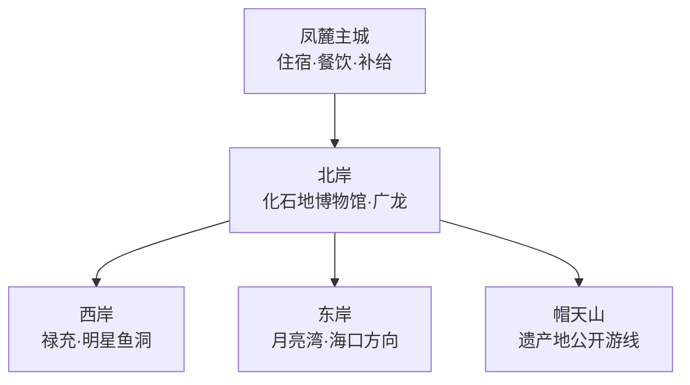
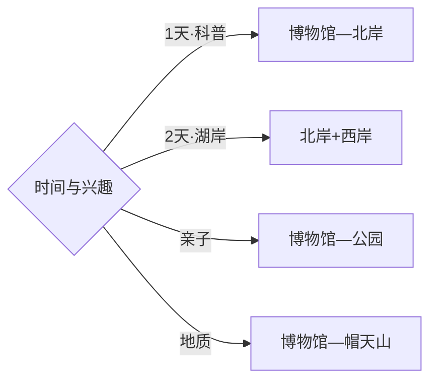

# 澄江旅行指南

澄江的旅行重点很集中：凤麓主城适合补给和住宿，抚仙湖北岸串联化石地博物馆与湖滨公共空间，东西两岸则适合各用一天慢游。首访先用博物馆理解寒武纪生命演化，再按风向、天气和交通选择一段湖岸。固定快照中的 **Fenglu / GeoNames 1811281** 带有 Chengjiang、澄江与凤麓等别名，可直接锚定澄江主城。

> 建议停留：2–4 天\
> 旅行关键词：抚仙湖、澄江化石地、寒武纪、禄充、湖滨慢游\
> 主要体力：低至中等；帽天山与部分湖岸步道较高\
> 最近研究：2026-09-03

## 城市速览

| 项目 | 旅行信息 |
|---|---|
| 主要旅行价值 | 用世界自然遗产博物馆建立科学主线，再体验抚仙湖高原湖泊景观与村镇生活 |
| 建议停留 | 2天覆盖博物馆和一段湖岸；3–4天可分走东西岸并增加禄充或帽天山 |
| 较舒适季节 | 春秋温和；夏季注意强紫外线、雷雨与湖面风；冬季早晚温差明显 |
| 预算特点 | 主城住宿较稳，湖景房、跨岸车辆和节假日价格是主要变量 |
| 步行强度 | 博物馆和主城较低，湖岸步道中等，帽天山按开放路线有连续坡路 |
| 主要天气风险 | 强紫外线、雷暴、大风、短时强降雨与高原温差 |
| 独行旅行 | 主城与北岸较易安排，远岸先落实返程与接驳 |
| 亲子旅行 | 化石地博物馆和正规湖滨公园适配度高，湖边活动以安全护栏和服务设施为先 |
| 长者与低体力旅行 | 选择博物馆—主城—北岸短线，减少跨岸和爬坡 |
| 无障碍信息 | 博物馆与新建公共空间相对友好，古村、岸线和山地连续性需逐点确认 |

## 城市格局与游览区域

| 区域 | 主要内容 | 游览特点 | 与其他区域的关系 |
|---|---|---|---|
| 凤麓主城 | 城市服务、餐饮、凤山公园 | 适合抵达日与夜间补给 | 作为北岸及环湖线路共同基地 |
| 北岸 | 澄江化石地世界自然遗产博物馆、广龙小镇、公共湖滨空间 | 科普与休闲结合，公共交通相对集中 | 与主城最易组合成一日 |
| 西岸 | 禄充、笔架山、明星鱼洞等正式开放点 | 村镇与湖岸交替，周末客流集中 | 宜单独成日，按开放点取舍 |
| 东岸 | 月亮湾、海口方向公共游览区 | 湖景开阔，点位间距离较长 | 适合自驾或落实接驳后安排 |
| 帽天山 | 世界遗产地及批准展示范围 | 以科学价值和地层遗迹为主 | 与博物馆构成“先看展、后看遗址”顺序 |

## 主要景点

| 景点 | 区域 | 类型 | 主要看点 | 建议用时 | 室内外 | 体力 | 预约风险 | 天气影响 | 优先级 |
|---|---|---|---|---:|---|---|---|---|---|
| 澄江化石地世界自然遗产博物馆 | 北岸 | 自然博物馆 | 寒武纪生命大爆发、化石标本与演化叙事 | 2–3小时 | 室内 | 低 | 中高 | 低 | A |
| 帽天山世界自然遗产旅游区 | 帽天山 | 地质遗产 | 化石地环境、地层与遗产价值 | 半天 | 室外 | 中高 | 中高 | 高 | A |
| 禄充风景区正式开放区 | 西岸 | 湖滨与村镇 | 抚仙湖、笔架山与湖岸聚落 | 半天–1天 | 混合 | 中 | 节假日高 | 高 | A |
| 广龙小镇公共游览区 | 北岸 | 街区与湖滨 | 餐饮、夜游与湖滨休闲 | 2–3小时 | 混合 | 低 | 低 | 中 | B |
| 月亮湾湿地公园开放区 | 东岸 | 湖滨公园 | 沙滩感湖岸、湿地景观与亲子休闲 | 2–3小时 | 室外 | 低 | 中 | 高 | B |
| 明星鱼洞正式经营区 | 西岸 | 湖滨与地质 | 湖岸泉眼、渔村景观与休闲设施 | 2–3小时 | 室外 | 低中 | 中 | 高 | B |
| 凤山公园 | 凤麓主城 | 城市公园 | 城区散步与地方生活 | 1–2小时 | 室外 | 低中 | 低 | 中 | B |
| 碧云寺及公开区域 | 西南岸 | 宗教与山水 | 湖岸人文、山体视野 | 1–2小时 | 混合 | 中 | 中 | 高 | C |

## 美食与餐饮

| 菜品或餐饮类型 | 常见区域 | 一个人用餐与常见份量 | 风味、过敏原与饮食限制 | 排队风险与替代方法 |
|---|---|---|---|---|
| 铜锅鱼 | 湖岸村镇、主城 | 多按鱼计价，适合多人；独行先问小份或改点鱼片 | 淡水鱼有鱼刺，汤底和蘸水常含辣椒 | 选明码标价正规餐馆，先确认称重与做法 |
| 铜锅洋芋饭 | 主城与湖岸 | 可作共享主食，小份较易搭配 | 常含油脂、火腿或腊肉，素食先说明 | 热门湖景店排队时转主城家常菜 |
| 藕粉、凉米线与小吃 | 凤麓、市场周边 | 单份友好，适合早餐或加餐 | 花生、芝麻、辣椒和糖按配料选择 | 上午选择多，晚间以实际营业为准 |
| 抗浪鱼等地方水产 | 正规餐饮店 | 稀缺且价格波动，先看来源与标价 | 关注鱼刺和合法来源 | 以合法供应为前提，也可选常见养殖鱼 |
| 云南家常菜与菌类 | 主城 | 独行可点小份或套餐 | 野生菌只选正规餐饮并充分加工 | 雨季热门菌店提前到，避免自行采食 |

## 经典行程

### 一日经典路线

**路线**：澄江化石地世界自然遗产博物馆 → 北岸午餐 → 广龙或北岸公共湖滨空间 → 凤麓主城

- **串联逻辑**：上午建立科学背景，下午把知识落到湖盆与城市环境。
- **预约锚点**：博物馆预约、闭馆日与最晚入馆。
- **休息安排**：博物馆公共区和北岸正规商业点。
- **时间不足时**：保留博物馆，湖岸只选一个公共观景点。

### 两日城市路线

**第 1 天**：博物馆 → 广龙 → 凤麓主城。\
**第 2 天**：禄充正式开放区 → 明星鱼洞或西岸另一单点。

- **串联逻辑**：科普北岸与村镇西岸分日，减少跨岸折返。
- **预约锚点**：博物馆、西岸景区票务与车辆。
- **休息安排**：主城连住；西岸在正规游客服务区午休。
- **时间不足时**：第二日只保留禄充，取消额外湖岸点。

### 三日深度路线

**第 1 天**：凤麓—博物馆—北岸。\
**第 2 天**：西岸禄充与明星鱼洞。\
**第 3 天**：帽天山公开游线，或按天气选择东岸公园。

- **串联逻辑**：城市科普、湖岸生活和遗产地现场各占一天。
- **预约锚点**：帽天山开放范围、讲解与接驳。
- **休息安排**：前两晚住主城，第三日带足饮水并预留返程。
- **时间不足时**：先删第三日，再压缩西岸为单点。

### 雨天路线

**路线**：化石地博物馆深度参观 → 主城午餐 → 规划馆或主城公共文化空间

- **适用条件**：普通降雨采用室内线；雷暴、大风和强降雨预警时减少湖岸移动。
- **预约锚点**：场馆临时闭馆与活动安排。
- **休息安排**：馆内公共区和主城商业区。
- **时间不足时**：完整保留博物馆，其他内容顺延。

### 亲子或低体力路线

**亲子路线**：化石地博物馆 → 北岸午餐 → 月亮湾或北岸平缓公园。\
**低体力路线**：博物馆 → 广龙短线 → 凤麓主城。

- **减负方式**：用车辆连接各点，湖岸只走有护栏、卫生间和服务设施的短段。
- **预约锚点**：儿童活动、无障碍入口和停车信息。
- **休息安排**：博物馆、游客中心与正规商业点。
- **时间不足时**：保留博物馆与一处湖滨公园。

### 西岸一日路线

**路线**：主城出发 → 禄充正式开放区 → 笔架山可执行段 → 明星鱼洞 → 返回主城

- **适用条件**：适合天气稳定且已落实车辆的日期。
- **预约锚点**：景区运营、停车与湖岸临时管控。
- **休息安排**：禄充游客区与正规餐饮点。
- **时间不足时**：保留禄充，明星鱼洞作为弹性项。

### 地质遗产路线

**路线**：化石地博物馆 → 午餐 → 帽天山世界遗产地批准开放区

- **串联逻辑**：先用展陈识别化石和演化脉络，再到遗产地理解地层环境。
- **预约锚点**：遗产地开放、讲解、道路与防火公告。
- **休息安排**：博物馆和遗产地正式服务点。
- **时间不足时**：保留博物馆，把帽天山留给天气更稳的一天。

## 住宿区域

| 区域 | 优点 | 缺点 | 适合人群 | 交通特点 |
|---|---|---|---|---|
| 凤麓主城 | 餐饮、补给与日常交通稳定 | 湖景体验较弱 | 首访、独行、公共交通旅行者 | 适合连接北岸和两侧湖岸 |
| 北岸—广龙 | 靠近博物馆和公共湖滨空间 | 节假日车流与价格波动 | 亲子、科普和短途度假 | 抵达昆明方向相对便利 |
| 西岸禄充 | 便于早晚湖景与村镇慢游 | 与主城和东岸往返较长 | 湖滨度假、自驾旅行者 | 依赖环湖公路和景区停车 |
| 东岸正规住宿点 | 景观开阔、适合慢住 | 点位分散、餐饮选择较少 | 自驾、安静度假 | 订房前核对具体村镇与合法经营信息 |

## 市内交通

| 场景 | 建议与取舍 | 行前需要重查的内容 |
|---|---|---|
| 从昆明或玉溪抵达 | 先确定到凤麓主城、北岸还是具体湖岸住宿点，再选公路客运或车辆 | 客运班次、上下车点与末班 |
| 环湖移动 | 每天只选同一侧一至两个点，公共交通不足的远段提前落实正规车辆 | 道路施工、节假日管控与返程 |
| 片区内步行 | 博物馆、主城和公园适合短步行，湖岸按公开步道连接 | 岸线封闭、风浪、卫生间与补给 |
| 自驾 | 跨岸更灵活，节假日预留拥堵和停车时间 | 停车、临时交通组织与充电条件 |

## 不同旅行者须知

| 旅行维度 | 可行条件 | 主要取舍 | 需额外核对 |
|---|---|---|---|
| 独行旅行 | 主城与北岸服务集中 | 远岸返程选择较少 | 末班、叫车覆盖与住宿位置 |
| 亲子旅行 | 博物馆与平缓湖滨公园组合成熟 | 湖边风晒和车程影响体验 | 儿童预约、防晒与护栏条件 |
| 长者或低体力旅行 | 博物馆—北岸—主城负担较低 | 帽天山和笔架山坡路较多 | 无障碍入口、休息点与接驳 |
| 无障碍需求 | 新建场馆和公园优先 | 村镇石阶及自然岸线连续性有限 | 电梯、坡道和无障碍卫生间 |
| 摄影旅行 | 清晨与傍晚湖面层次丰富 | 风浪、逆光和湖岸管控改变机位 | 三脚架、航拍与日出时段开放 |
| 预算有限 | 主城住宿和公共文化成本较稳 | 跨岸车辆会抬高支出 | 拼车、退改与景区票务 |
| 晚出发或紧凑行程 | 博物馆或北岸可做半日单点 | 环湖不适合压缩 | 最晚入馆与返程班次 |
| 特殊天气或自然条件 | 普通小雨适合博物馆 | 雷暴、大风、强降雨影响湖岸和山地 | 气象、景区与道路公告 |

抚仙湖水体、岸线、湿地和饮用水源保护范围按现行保护制度使用；旅行活动选择正式开放景区、公共步道和合法经营水上项目。化石地、地层剖面、科研监测区与保护地按批准范围参观，化石、岩石和生物样本留在原处，村落、农田、渔业及餐饮后场保持生产与生活边界。

## 行前核对

| 核对事项 | 为什么需要重查 | 建议核对时间 | 官方入口 |
|---|---|---|---|
| 博物馆预约与开放 | 闭馆日、展厅维护和团队活动会变化 | 排入行程前及到访前一日 | [澄江市人民政府](https://www.yncj.gov.cn/) |
| 帽天山开放范围 | 遗产保护、天气与防火会改变可走路线 | 出发前一周及当天 | [云南省林业和草原局](https://lcj.yn.gov.cn/) |
| 湖岸景区与公共空间 | 运营、节假日容量和岸线治理会调整 | 出发前一周及当天 | [云南省文化和旅游厅](https://dct.yn.gov.cn/) |
| 风浪、雷雨与紫外线 | 湖上与岸线体验直接受天气影响 | 出发前三日及当天 | [云南省气象局](https://yn.cma.gov.cn/) |
| 公路客运与环湖接驳 | 班次、站点和临时交通组织易变化 | 购票前及当天 | [云南省交通运输厅](https://jtyst.yn.gov.cn/) |

## 来源与更新记录

### 主要来源

| 来源 | 类型 | 支持内容 | 核验日期 |
|---|---|---|---|
| [澄江市人民政府](https://www.yncj.gov.cn/) | 政府 | 市域管理、公共服务与动态公告入口 | 2026-09-03 |
| [云南省林业和草原局：澄江化石地世界自然遗产](https://lcj.yn.gov.cn/special/2025/0512/6617.html) | 政府部门 | 化石地、世界遗产价值与博物馆 | 2026-09-03 |
| [云南省民族宗教事务委员会：澄江文旅资源](https://mz.yn.gov.cn/html/2024/difangdongtai_1016/4056185.html) | 政府部门 | 博物馆、帽天山、湖岸景区和研学资源 | 2026-09-03 |
| [GeoNames 1811281](https://www.geonames.org/1811281/) | 开放数据 | Fenglu 固定人口点、澄江别名与行政代码 | 2026-09-03 |

### 更新记录

| 日期 | 更新内容 |
|---|---|
| 2026-09-03 | 首次完成资料研究、空间拆分、七条路线与县级市映射 |
