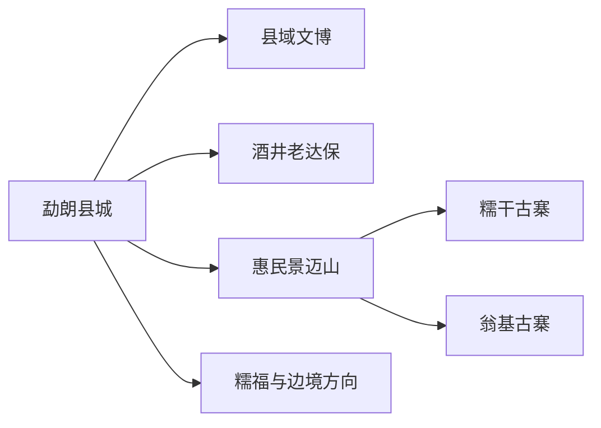
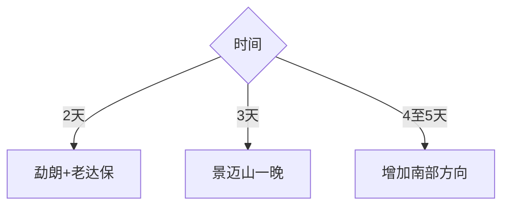

# 澜沧旅行指南

澜沧的旅行由勐朗县城、景迈山世界遗产、老达保拉祜文化和南部边境乡镇组成。县域跨度很大，景迈山值得至少一晚；村寨、古茶林与生产茶园共同构成活态文化景观，按遗产保护、社区生活和预约接待规则体验。

## 城市速览

| 项目 | 信息 |
|---|---|
| 主线 | 勐朗县城—老达保—景迈山 |
| 停留 | 县城1天；景迈山2天；边境方向另留1–2天 |
| 住宿 | 勐朗便于交通；惠民与景迈村寨适合茶山过夜 |
| 交通 | 澜沧机场、公路、县域客运与合规车辆 |
| 风险 | 山路雾雨、滑坡、夜间驾驶、边境管理和森林防火 |
| 边界 | 世界遗产、传统村落、古茶林、水源林、茶园和边境分别管理 |

## 城市格局与游览区域

勐朗承担机场、住宿和补给，老达保位于酒井方向，景迈山从惠民进入，糯福等南部线路需重新核对边境与山路。固定清单以发展河乡记录 **GeoNames 12358503** 建页；同档后续东回等记录按县域承接审计。Wikidata `Q1200512` 的 P1566 指向行政记录 `1280574`。

## 主要景点

| 景点 | 区域 | 类型 | 核心体验 | 用时 | 环境 | 体力 | 研究价值 | 拥挤 | 优先级 |
|---|---|---|---|---:|---|---|---|---|---|
| 普洱景迈山古茶林文化景观 | 惠民方向 | 世界遗产 | 森林—茶林—村落共生体系 | 2天含过夜 | 室外 | 中高 | 很高 | 高 | A |
| 翁基古寨 | 景迈山 | 传统村落 | 布朗族建筑、茶俗与村寨生活 | 3–5小时 | 混合 | 中 | 很高 | 高 | A |
| 糯干古寨 | 景迈山 | 传统村落 | 傣族村落、古茶林与日常生活 | 3–5小时 | 混合 | 中 | 很高 | 高 | A |
| 老达保村正规文化体验 | 酒井方向 | 非遗村寨 | 拉祜族歌舞、音乐与社区文化 | 半日至1天 | 混合 | 低中 | 高 | 中 | B |
| 澜沧县城公共文化场馆 | 勐朗 | 文博 | 拉祜文化、县域历史与多民族生活 | 2–3小时 | 室内 | 低 | 高 | 低 | B |
| 糯福与南部正规接待点 | 南部方向 | 边境乡村 | 拉祜村落、山地与边地文化 | 1–2天 | 室外 | 中 | 中高 | 低 | C |

景迈山的古茶林、传统村落和社区生产空间是同一文化景观的不同组成部分。沿指定道路和步道通行，茶园体验由正规经营者带领，水源林、核心保护地和边境线遵守管理要求。

## 美食与餐饮

拉祜烤肉、鸡肉稀饭、舂菜、竹筒饭、酸味菜和普洱茶适合县城与村寨正规接待点体验。品茶先问价格和冲泡方式，购买茶叶比较产区、批次和凭证；说明辣度、香草、花生和发酵食物接受度。

## 经典行程

### 三日基础线
**路线**：勐朗—老达保—景迈山一晚。**逻辑**：先理解拉祜文化，再进入茶林村寨。**预约锚点**：车辆、民宿和社区体验。**休息**：县城与惠民。**删除条件**：山路预警时保留县城和老达保。

### 景迈山世界遗产线
**路线**：惠民—古茶林正式游线—翁基—糯干。**逻辑**：用两天观察空间与生活关系。**预约锚点**：遗产公告、住宿和车辆。**休息**：村寨民宿。**删除条件**：森林防火或道路管制时缩短线路。

### 老达保非遗线
**路线**：勐朗—老达保正规演出或体验—返程。**逻辑**：以社区预约活动理解拉祜音乐。**预约锚点**：演出、接待和用餐。**休息**：村寨接待点。**删除条件**：未确认活动时改县城文博。

### 县城文化线
**路线**：县城场馆—市场—公共文化空间。**逻辑**：作为抵达日和雨天方案。**预约锚点**：场馆开放。**休息**：县城午后。**删除条件**：场馆闭馆时保留市场和餐饮。

### 茶文化深度线
**路线**：古茶林讲解—正规茶室—制茶体验—村寨住宿。**逻辑**：从生态到工艺和交易。**预约锚点**：讲解、体验价格与购买凭证。**休息**：茶室。**删除条件**：采制季不匹配时改为品鉴。

### 南部边境线
**路线**：勐朗—糯福或正式边境乡村接待点—返程。**逻辑**：一条方向配置完整车辆与证件。**预约锚点**：边境政策、道路和住宿。**休息**：乡镇服务点。**删除条件**：管理或天气条件不符时取消。

### 低体力线
**路线**：县城场馆—车辆到惠民—选择一个古寨短线。**逻辑**：减少连续山路和石板坡道。**预约锚点**：落客、民宿和卫生间。**休息**：午后茶室。**删除条件**：晕车明显时只留县城。

## 住宿区域

勐朗县城适合机场、餐饮和多方向换乘；惠民镇便于进出景迈山；翁基、糯干等村寨住宿适合清晨和夜间安静体验。确认停车、热水、隔音、防蚊、山路接送与退改。

## 市内交通

澜沧机场到勐朗需接驳，景迈山、老达保和南部乡镇分处不同公路方向。景迈山连续住宿可减少往返；雨季避免夜间赶山路，跨县联程先核对加油、通信和驾驶时长。

## 不同旅行者须知

文化遗产爱好者预约景迈山讲解；茶友保留购买凭证；亲子选择县城加一个古寨；长者减少石板坡道；摄影者先征得居民和仪式参与者同意；边境旅行者按当期证件规则行动。

## 行前核对

- 核对景迈山保护公告、民宿、老达保活动与南部边境要求。
- 核对机场接驳、雨季滑坡、森林防火、通信与夜间山路。
- 古茶林、传统村落、水源林、茶园生产和边境空间按管理边界进入。

## 来源与更新记录

| 来源 | 支持内容 | 核验日期 |
|---|---|---|
| [云南省自然资源厅：景迈山保护与茶旅融合](https://dnr.yn.gov.cn/html/2024/dxjy_0419/46127.html) | 古茶林空间、传统村落保护与利用边界 | 2026-09-01 |
| [云南省农业农村厅：景迈山茶山云海](https://nync.yn.gov.cn/html/2025/zhoushilianbo-new_0828/1421170.html) | 翁基、茶文化、民宿与交通改善 | 2026-09-01 |
| [云南省农业农村厅：老达保乡村旅游](https://nync.yn.gov.cn/html/2020/yunnongkuanxun-new_0720/371461.html) | 老达保拉祜文化与正规演出 | 2026-09-01 |
| [民政部行政区划代码查询](https://dmfw.mca.gov.cn/xzqh/getList?code=53&trimCode=true&maxLevel=3) | 澜沧县行政层级与代码 | 2026-09-01 |
| [GeoNames 12358503](https://www.geonames.org/12358503/) | Fazhanhe 固定城市点 | 2026-09-01 |
| [Wikidata Q1200512](https://www.wikidata.org/wiki/Q1200512) | 澜沧县实体与行政记录关系 | 2026-09-01 |

| 日期 | 更新 |
|---|---|
| 2026-09-01 | 首次完成澜沧旅行研究；建立勐朗、老达保、景迈山与边境方向路线 |
