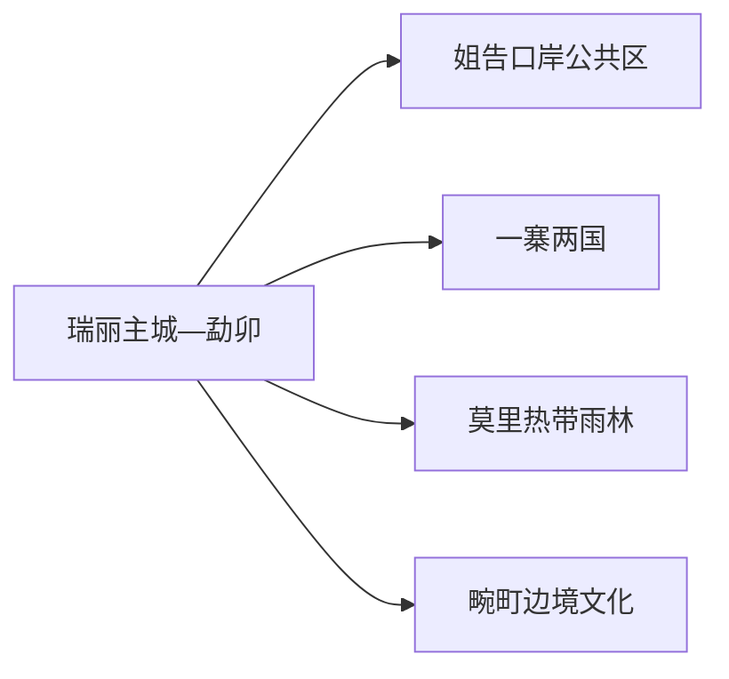
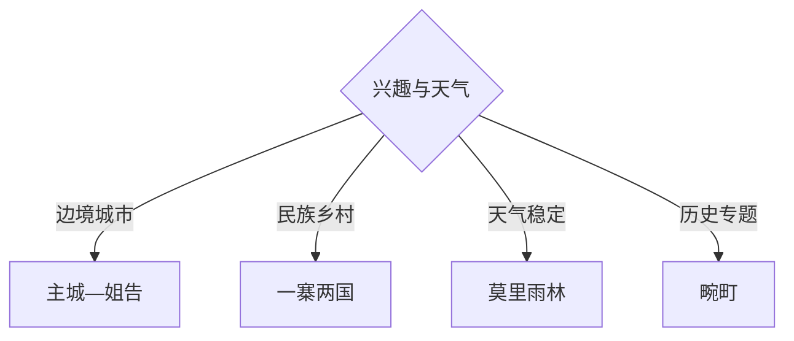

# 瑞丽旅行指南

瑞丽的旅行重点是“边境城市怎么体验”，而不是把口岸当普通商业街：先在主城和姐告理解傣族、景颇族文化、珠宝贸易与口岸城市生活，再从一寨两国、莫里热带雨林或畹町中选一条完整日。证件、口岸通行、拍摄和无人机规则优先于打卡计划。

> 建议停留：主城—姐告 1 天；自然或边境文化远线另留 1–2 天 
> 旅行关键词：姐告口岸、一寨两国、莫里瀑布、畹町、热带雨林、珠宝贸易 
> 主要体力：主城低至中等；雨林和远线中至高 
> 最近研究：2026-08-13

## 城市速览

| 项目 | 旅行信息 |
|---|---|
| 主要旅行价值 | 体验中国西南边境城市、民族文化与口岸贸易，再进入正式雨林和乡村景区 |
| 建议停留 | 1 天主城—姐告；2 天加一寨两国或莫里；3 天再加畹町 |
| 较舒适季节 | 旱季更利于户外；雨季重点核对暴雨、山洪、滑坡与道路 |
| 预算特点 | 主城中等；远线车辆、景区票务、珠宝消费和边境旺季住宿是变量 |
| 步行强度 | 主城可分段步行，雨林湿滑并有坡道台阶 |
| 主要天气风险 | 高温高湿、暴雨、雷电、山洪、滑坡、蚊虫和中暑 |
| 独行旅行 | 主城方便；边境乡村和雨林优先正规车辆与明确返程 |
| 亲子旅行 | 民族文化、正规雨林短线和城市公园可选，边境与水域加强看护 |
| 长者与低体力旅行 | 主城、姐告公共区和车辆到景区短段较合适 |
| 无障碍信息 | 城市公共设施可咨询，雨林、乡村和口岸周边的设施连续性需向官方确认 |

## 城市格局与游览区域

瑞丽市是德宏傣族景颇族自治州下辖县级市，法定代码 `533102`。固定 GeoNames `1280570` 名为 Mengmao，是瑞丽主城旧称/驻地标签；Wikidata `Q1355911` 同时关联该城市点和行政记录 `1280123`。主城点用于定位到发，法定市域还包括姐告、畹町、勐卯镇与边境乡村。

| 区域 | 主要内容 | 怎么安排 | 与其他区域的关系 |
|---|---|---|---|
| 瑞丽主城 | 城市文博、民族文化、珠宝市场与餐饮 | 半日至一天，住宿基地 | 与姐告可道路连接 |
| 姐告 | 国门、口岸公共区与边贸城市景观 | 半日，按现场管制和开放区活动 | 口岸监管区与公共旅游区边界明确 |
| 一寨两国 | 边境村寨与民族文化景区 | 半日至一天 | 景区开放不构成跨境通行许可 |
| 莫里 | 热带雨林、瀑布与正式步道 | 完整半日至一天 | 雨季水量和地灾影响大 |
| 畹町 | 抗战交通、口岸历史与边境城镇 | 完整一天 | 与主城有明显车程 |

国门、界碑、边境通道、检查站和口岸作业区适用出入境与边境管理规则。旅行者使用对公众开放的道路、广场、场馆和景区；跨境、临时通行、证件查验、摄影与无人机均按现场管理和国家移民管理规定执行。

## 主要景点

### 主城与姐告

| 景点 | 区域 | 类型 | 主要看点 | 建议用时 | 室内外 | 体力 | 预约风险 | 天气影响 | 优先级 |
|---|---|---|---|---:|---|---|---|---|---|
| 瑞丽主城民族文化与公共场馆 | 主城 | 地方文化 | 傣族、景颇族、边境城市与地方历史 | 2–3 小时 | 室内 | 低 | 高 | 低 | A |
| 弄莫湖公园公开区 | 主城 | 城市湿地与公园 | 湖面、城市休闲与鸟类观察 | 1–2 小时 | 室外 | 低 | 低 | 高 | B |
| 姐告国门公共游览区 | 姐告 | 口岸与边境城市 | 国门建筑、口岸城市空间和边贸环境 | 2–4 小时 | 室外为主 | 中 | 高 | 高 | A |
| 瑞丽古城等当期开放城市文旅空间 | 主城 | 当代文旅街区 | 民族文化展示、餐饮与活动 | 1–2 小时 | 混合 | 低 | 高 | 中 | B |

### 边境乡村与雨林

| 景点 | 区域 | 类型 | 主要看点 | 建议用时 | 室内外 | 体力 | 预约风险 | 天气影响 | 优先级 |
|---|---|---|---|---:|---|---|---|---|---|
| 一寨两国景区 | 银井方向 | 边境村寨与民族文化 | 村寨生活、边境文化和正式景区游线 | 半日至 1 天 | 室外为主 | 中 | 高 | 高 | A |
| 莫里热带雨林景区 | 市域东北 | 热带雨林与瀑布 | 森林、溪流、瀑布与正式步道 | 半日至 1 天 | 室外 | 中高 | 高 | 很高 | A |
| 畹町边关文化园及公开场馆 | 畹町 | 口岸史与抗战交通 | 滇缅公路、南洋华侨机工与口岸历史 | 3–5 小时 | 混合 | 中 | 高 | 中 | A |
| 独树成林景区 | 芒令方向 | 热带植物 | 大榕树生态与短程自然观察 | 1–2 小时 | 室外 | 低至中 | 中 | 高 | B |

姐告国门、市场和口岸监管空间按一个边境城市片区理解。一寨两国的景区体验与实际跨境手续是两套体系；旅游门票只覆盖景区公开游线。

## 美食与餐饮

瑞丽适合尝试撒苤、傣味烤鱼、手抓饭、米线、热带水果和缅式风味餐饮。生食、凉拌、野生菌和路边水果关注水源、冷链、充分加热与明码标价。

| 类型 | 常见区域 | 一人份量 | 饮食提示 | 选择方法 |
|---|---|---|---|---|
| 撒苤与傣味凉拌 | 主城、正规民族餐馆 | 可小份 | 生熟、苦味蘸水、肉类与香草较复杂 | 首次少量，询问熟制版本 |
| 傣味烤鱼与手抓饭 | 主城、景区正式餐饮 | 多人分享较常见 | 鱼刺、糯米、花生、香草和辣椒 | 一人选小鱼或套餐 |
| 过手米线、饵丝与米线 | 主城 | 一人一份 | 米制品、肉末、花生和酸辣调味 | 说明少辣和过敏原 |
| 热带水果与果汁 | 正规市场 | 小份购买 | 清洗、糖分、冰块水源和时价 | 选现切卫生、明码标价摊位 |

## 经典行程

### 一日经典路线

**路线**：瑞丽主城文化场馆 → 午餐 → 姐告国门公共游览区 → 主城夜间餐饮

- **串联逻辑**：先理解民族与城市背景，再到口岸公共区观察边境城市功能。
- **预约锚点**：场馆开放、姐告当日通行和活动范围。
- **休息安排**：午餐与口岸公共服务区。
- **时间不足时**：保留主城一馆与姐告核心公共区。

### 两日城市路线

**第 1 天**：主城—姐告 
**第 2 天**：一寨两国或莫里雨林二选一

- **串联逻辑**：第二天按文化或自然兴趣选择一个方向。
- **预约锚点**：景区票务、车辆、天气与返程。
- **休息安排**：游客中心和主城晚餐。
- **时间不足时**：第二天改独树成林短线。

### 三日深度路线

**第 1 天**：主城—姐告 
**第 2 天**：一寨两国 
**第 3 天**：畹町边关文化园与公开场馆

- **串联逻辑**：由当代口岸进入边境村寨，再补滇缅交通史。
- **预约锚点**：两地开放、车辆、口岸管理与返程。
- **休息安排**：村寨和畹町正式服务点。
- **时间不足时**：删除第三天。

### 雨天路线

**路线**：主城室内文化场馆 → 坐席午餐 → 正规珠宝文化或非遗展示空间

- **适用条件**：普通降雨且城区交通正常；暴雨预警时减少跨城与山地移动。
- **预约锚点**：场馆、展示和市场营业。
- **休息安排**：全程室内坐席。
- **时间不足时**：只保留一座场馆；暂停雨林线。

### 亲子与低体力路线

**亲子路线**：民族文化场馆 → 午休 → 弄莫湖短段 
**低体力路线**：车辆到主城场馆 → 坐席午餐 → 姐告公共区短程观景

- **减负方式**：亲子减少高温时段；低体力路线保留车辆和遮蔽休息。
- **预约锚点**：儿童活动、轮椅、坡道、卫生间和下客点。
- **休息安排**：场馆、餐厅与服务区。
- **时间不足时**：两条路线都只保留主城场馆。

### 雨林一日路线

**路线**：主城出发 → 莫里雨林官方入口 → 核心步道与瀑布 → 游客中心休息 → 返回

- **适用条件**：无暴雨、雷电、山洪或地灾预警，景区确认开放。
- **预约锚点**：票务、车辆、步道和最后入园。
- **休息安排**：游客中心与主城补给。
- **时间不足时**：缩短为独树成林或主城公园。

## 住宿区域

| 区域 | 优点 | 取舍 | 适合人群 | 交通特点 |
|---|---|---|---|---|
| 瑞丽主城 | 餐饮、市场、交通和医疗集中 | 到畹町和雨林有车程 | 首访与多日游 | 默认基地 |
| 姐告附近 | 观察口岸和早晚城市活动方便 | 管制、车流和营业时间变化大 | 口岸主题 | 先确认住宿登记和交通 |
| 畹町镇区 | 便于边关历史慢游 | 距主城较远，服务选择少 | 历史专题与跨城衔接 | 锁定返程和次日车辆 |

## 市内交通

| 场景 | 建议与取舍 | 行前核对 |
|---|---|---|
| 航空抵达 | 德宏芒市机场位于芒市，落地后公路前往瑞丽 | 航班、机场巴士、合规车辆和车程 |
| 主城—姐告 | 公交、出租或网约车 | 口岸交通管制、上下客和末班 |
| 一寨两国、莫里、畹町 | 正规客运、景区接驳或合规包车 | 入口、道路、停车、检查与返程 |
| 边境自驾 | 使用公共道路并服从检查 | 证件、临时管制、加油、通信和停车 |

## 不同旅行者须知

| 旅行者 | 怎么选 | 主要取舍 | 额外核对 |
|---|---|---|---|
| 独行 | 主城—姐告加一条正规远线 | 夜间和边境乡村临时交通少 | 证件、车辆、返程和紧急联系人 |
| 亲子 | 民族文化、城市公园和短程雨林 | 高温、蚊虫、水边与边境看护 | 防蚊、防晒、儿童票与医务点 |
| 长者或低体力 | 主城场馆、车辆到姐告短段 | 雨林湿滑、古村高差与高温 | 轮椅、座椅、坡道和下客点 |
| 摄影 | 国门建筑、民族文化、雨林与城市夜景 | 口岸、检查站、居民和航拍规则严格 | 拍摄许可、无人机、三脚架与商业拍摄 |
| 珠宝购物 | 选择证照、明码标价和检测退换说明清楚的商户 | 产地故事和口头承诺不替代鉴定 | 发票、证书、复检、退换和支付记录 |

## 行前核对

| 事项 | 何时核对 | 官方入口 | 怎么处理 |
|---|---|---|---|
| 景区与边境活动 | 订车前及当天 | [瑞丽市 A 级景区资料](https://www.rl.gov.cn/slyj/Web/_F0_0_6HOKHQC5A67637ADF7484C5CAA.htm) | 按属地、入口和运营公告选择 |
| 口岸与出入境 | 出发前一周及当天 | [国家移民管理局](https://www.nia.gov.cn/) | 证件和通行以主管部门为准 |
| 雨林与地灾 | 前三日及当天 | [云南省气象局](https://yn.cma.gov.cn/) | 暴雨或雷电时改主城线 |
| 航班与公路 | 购票时及当天 | [德宏州人民政府](https://www.dh.gov.cn/) | 核对机场接驳、道路与临时管制 |

## 来源与更新记录

### 主要来源

| 来源 | 类型 | 支持内容 | 核验日期 |
|---|---|---|---|
| [瑞丽市 A 级旅游景区资料](https://www.rl.gov.cn/slyj/Web/_F0_0_6HOKHQC5A67637ADF7484C5CAA.htm) | 市政府文旅部门 | 一寨两国、莫里、畹町等景区身份与属地 | 2026-08-13 |
| [瑞丽市城市资料](https://www.rl.gov.cn/Web/_M6_4QWS8V0X3BBCEBB5EB4943BCBD_1.htm) | 市政府 | 主城、口岸、民族与市域背景 | 2026-08-13 |
| [云南省民族宗教委：银井](https://mzzj.yn.gov.cn/html/2026/shenghuohao_0325/4063122.html) | 省级部门 | 边境村寨生活与民族文化 | 2026-08-13 |
| [瑞丽市生态环境规划](https://www.rl.gov.cn/Attach/2412/07N2BMW5SI2412231206552BD8C251.pdf) | 市政府规划 | 湿地、森林、水域与生产生态边界 | 2026-08-13 |
| [GeoNames 1280570](https://www.geonames.org/1280570/) | 开放地理数据 | Mengmao 固定主城点 | 2026-08-13 |
| [Wikidata Q1355911](https://www.wikidata.org/wiki/Q1355911) | 开放结构化数据 | 法定瑞丽市与双 GeoNames 粒度 | 2026-08-13 |

### 更新记录

| 日期 | 更新内容 |
|---|---|
| 2026-08-13 | 首次完成瑞丽独立旅行研究，建立主城、姐告、一寨两国、莫里与畹町选择框架，并补充口岸、雨林、生产空间和购物核验 |
