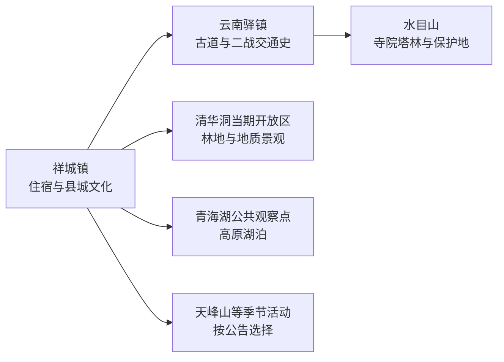
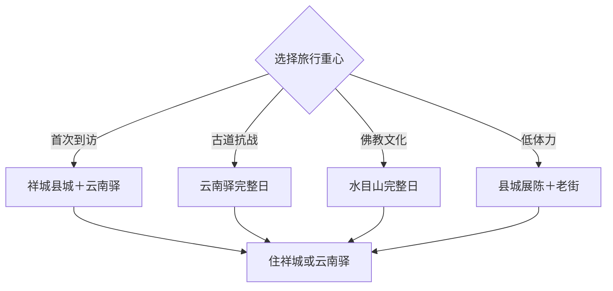

# 祥云旅行指南

祥云位于大理州东部，是从昆明进入滇西的重要陆路节点。旅行主线并不围绕洱海，而是由祥城县城、云南驿古道与抗战交通史、水目山佛教文化组成。首访适合 2–3 天：县城半日至一天，云南驿一天，水目山或季节山地再用一天。

固定清单中的 GeoNames **1790442**（Xiangcheng）定位祥云县祥城镇和县城生活区。页面以该点承接交通、住宿和县城内容，再按实际车程展开云南驿、水目山等县域方向；它与大理市、大理古城是不同目的地。

## 城市速览

| 项目 | 信息 |
|---|---|
| 主线 | 祥城县城—云南驿古镇与二战交通史—水目山文化遗产 |
| 停留 | 县城半日至 1 天；云南驿 1 天；水目山或季节支线另留 1 天 |
| 住宿 | 祥城镇便于铁路、公路与多方向换乘；云南驿住宿适合古道慢游 |
| 交通 | 祥云站、祥云西站和公路节点用途不同，县域远点以预约车辆更稳妥 |
| 季节 | 春秋适合古道和山地；夏季关注雷暴；冬春关注大风与森林火险 |
| 预算 | 县城公共空间成本较低，远线车辆、讲解和景区项目增加支出 |

## 城市格局与游览区域

祥城镇承担住宿、补给与交通转换；云南驿古镇和水目山在县城之外，适合按同向或分日安排。大理市、弥渡县、宾川县、南华县等均为独立行政目的地，铁路或高速连接只表示交通便利。水目山、清华洞自然公园、林场、水源地、机场净空区和农业生产地执行保护、运营与生产边界。

## 主要景点

| 景点 | 区域 | 类型 | 核心体验 | 用时 | 环境 | 体力 | 预约风险 | 天气影响 | 优先级 |
|---|---|---|---|---:|---|---|---|---|---|
| 祥云县博物馆或当期县级展陈 | 祥城镇 | 地方史 | 祥云历史、考古与多民族文化 | 1–2小时 | 室内 | 低 | 很高 | 低 | A |
| 祥城鼓楼与公共老街段 | 祥城镇 | 城镇历史 | 县城格局、传统街巷和日常生活 | 1–2小时 | 室外 | 低 | 低 | 高 | B |
| 王复生、王德三主题正式展陈 | 祥城镇方向 | 红色文化 | 云南早期革命人物与地方近现代史 | 1–1.5小时 | 室内为主 | 低 | 很高 | 低 | B |
| 祥云烈士陵园正式纪念区 | 清华洞林场方向 | 纪念设施 | 烈士纪念、地方革命史与保护空间 | 1小时 | 室外为主 | 低中 | 高 | 高 | B |
| 云南驿古镇 | 云南驿镇 | 古道聚落 | 茶马古道、驿站地名与村镇生活 | 2–4小时 | 室外为主 | 中 | 高 | 高 | A |
| 云南驿二战交通史正式展陈 | 云南驿镇 | 抗战与交通史 | 滇缅公路、航空与二战记忆 | 1.5–2小时 | 室内 | 低 | 很高 | 低 | A |
| 水目山正式游览区 | 云南驿镇方向 | 佛教文化与山地 | 寺院、塔林、古树与山地步道 | 半天至1天 | 混合 | 中高 | 很高 | 很高 | A |
| 清华洞景区当期开放区 | 祥城镇周边 | 森林与洞穴 | 林地、洞穴和近郊自然观察 | 2–3小时 | 室外为主 | 中 | 很高 | 很高 | B |
| 青海湖公共观察点 | 沙龙镇方向 | 高原湖泊 | 湖盆、湿地与乡村景观 | 1–2小时 | 室外 | 低中 | 很高 | 很高 | C |
| 天峰山正式活动或开放区 | 县域山地方向 | 山地与民俗 | 山地景观和当期歌会等活动 | 2–4小时 | 室外 | 中高 | 很高 | 很高 | C |

## 美食与餐饮

祥云可选择米线、饵丝、粑粑、乳扇、豆制品、牛羊肉和时令山野蔬菜。祥城县城适合解决稳定正餐，云南驿和水目山方向提前确认营业与午餐；乳制品、坚果、野生菌、辣度及清真餐需求在点餐时说明。野生菌只选正规餐馆充分熟制的菜品。

## 经典行程

### 祥城县城线
**路线**：县级展陈—县城午餐—鼓楼与公共老街—城市公园。**逻辑**：先建立祥云历史和县城尺度。**预约锚点**：博物馆或主题展陈。**休息**：祥城商业区。**删除条件**：场馆闭馆时保留公共街区和地方餐饮。

### 云南驿古道线
**路线**：祥城—云南驿古镇—午餐—公开古道段—返程或留宿。**逻辑**：把驿站聚落与古道空间连续阅读。**预约锚点**：古镇展陈、讲解与车辆。**休息**：云南驿镇正式接待点。**删除条件**：强降雨或道路调整时缩短为古镇核心区。

### 二战交通史线
**路线**：云南驿古镇—二战交通史正式展陈—相关公共遗迹点。**逻辑**：从古代驿道延伸到近现代交通史。**预约锚点**：展馆开放与讲解。**休息**：古镇餐饮点。**删除条件**：展馆无接待时保留古镇与公开说明牌。

### 水目山文化线
**路线**：正式入口—寺院与塔林开放区—主步道—返程。**逻辑**：用完整半日至一天理解宗教建筑和山林环境。**预约锚点**：景区开放、门票、交通和宗教活动。**休息**：游客服务区。**删除条件**：雷暴、山火、暴雨或保护区管控时改县城线。

### 近郊自然线
**路线**：清华洞当期开放区—县城午餐—青海湖公共观察点。**逻辑**：从林地转向湖盆，只在两点开放与道路稳定时组合。**预约锚点**：景区、湖岸开放与车辆。**休息**：县城或正式服务点。**删除条件**：湖岸、林区或道路管控时只保留一个点。

### 低体力文化线
**路线**：县级展陈—主题展陈—老街短段—早休。**逻辑**：以室内和车辆接驳降低山地负担。**预约锚点**：场馆无障碍与开放时段。**休息**：每站之间回县城餐饮区。**删除条件**：设施衔接不连续时缩为一座场馆。

### 三日完整线
**路线**：首日祥城县城，次日云南驿，第三日水目山。**逻辑**：县城、古道和山地分日，避免频繁横跨。**预约锚点**：住宿、场馆、景区车辆与退改。**休息**：前两晚住祥城或按古镇营业选择换宿。**删除条件**：压缩为两天时删除近郊自然支线。

## 住宿区域

祥城镇适合铁路到发、县城餐饮和多方向换乘，连续住宿最省搬运行李。云南驿镇正式民宿适合古道慢游，预订时核对营业季、隔音、停车、早餐和返程。水目山周边住宿按景区实际入口判断，地图距离近不等于步行可达。

## 市内交通

祥云站、祥云西站及客运点服务不同线路，购票时使用完整站名并核对到住宿地的接驳。县城内部可步行加短途车辆，云南驿、水目山、清华洞和青海湖方向适合分日预约车辆。山路、古道、林场、机场净空区、水源地和农业道路按当天公告及现场边界通行。

## 不同旅行者须知

首次到访者选择祥城加云南驿，历史旅行者增加二战交通史讲解，宗教与建筑爱好者为水目山留足半日至一天。亲子家庭可用展陈、古镇和短步道组合；长者与低体力旅行者逐点确认台阶、坡度、无障碍卫生间与落客点。摄影活动尊重宗教、纪念设施、居民肖像和无人机空域规则。

## 行前核对

- 通过祥云县、大理州文旅和云南省交通渠道核对云南驿、水目山、清华洞与场馆开放。
- 核对祥云站、祥云西站、县城住宿和各远线车辆接驳。
- 水目山及其他林地查看森林火险、雷暴、强降雨、地质灾害和保护区公告。
- 云南驿活动、讲解和民宿按正式接待单位预约，居民院落与生产场地按开放范围进入。

## 来源与更新记录

| 来源 | 支持内容 | 核验日期 |
|---|---|---|
| [云南省民政厅：祥云地名与历史文化](https://ynmz.yn.gov.cn/cms/dimingfengcai/9983.html) | 祥云区位、王氏三杰、水目山和云南驿古道 | 2026-09-04 |
| [大理州人民政府：户外运动发展方案](https://www.dali.gov.cn/dlzrmzf/xxgkml/c105994/pc/content/1998321040315486208/content_1998321040315486208.html) | 水目山、云南驿古道的徒步与骑行方向 | 2026-09-04 |
| [大理州人民政府：水目山](https://www.dali.gov.cn/dlzrmzf/xxgkml/c105909/pc/content/1971152913995763712/content_1971152913995763712.html) | 水目山寺院、塔林与文物身份 | 2026-09-04 |
| [云南省林业和草原局：祥云自然保护地](https://lcj.yn.gov.cn/html/2022/zuixindongtai_0316/65489.html) | 水目山、清华洞与自然保护边界 | 2026-09-04 |
| [GeoNames 1790442](https://www.geonames.org/1790442/) | Xiangcheng 固定人口点及祥云县城定位 | 2026-09-04 |
