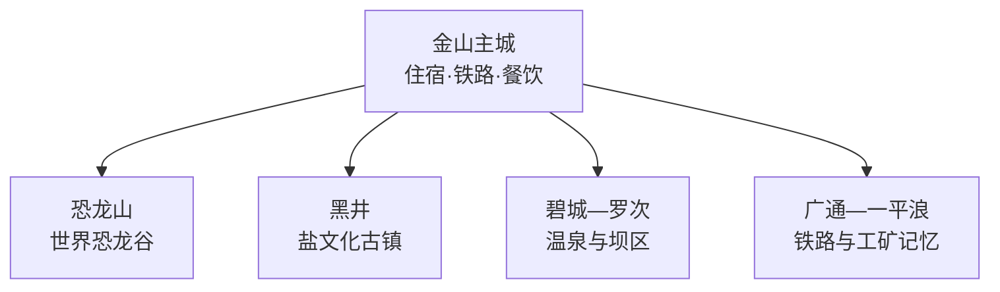
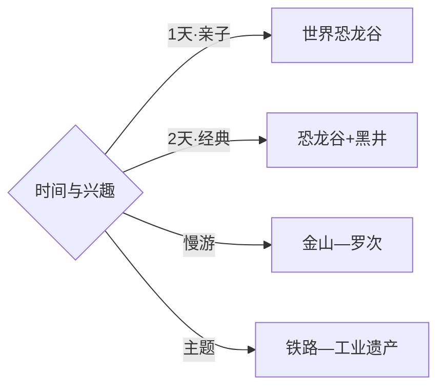

# 禄丰旅行指南

禄丰适合围绕“恐龙、古镇、温泉、滇中山地”来选线：金山主城承担住宿和补给，世界恐龙谷是亲子与古生物主线，黑井古镇适合完整一天，罗次温泉与五台山方向按兴趣和季节追加。固定快照中的 **Jinshan / GeoNames 1805399** 同时带有 Lufeng、禄丰旧拼写等别名，可直接锚定禄丰主城。

> 建议停留：2–4 天\
> 旅行关键词：恐龙化石、黑井盐文化、金山古镇、罗次温泉、彝乡山地\
> 主要体力：主城低至中等；古镇坡路与山地中等至较高\
> 最近研究：2026-09-03

## 城市速览

| 项目 | 旅行信息 |
|---|---|
| 主要旅行价值 | 从禄丰恐龙化石与古猿研究进入深时历史，再看盐业古镇、彝乡和滇中交通走廊 |
| 建议停留 | 2天覆盖恐龙谷与黑井；3–4天可加入金山、罗次温泉或一条乡村山地线 |
| 较舒适季节 | 春秋温和；雨季山路和河谷水情优先核对；冬春注意干燥与森林火险 |
| 预算特点 | 主城消费温和，恐龙谷票务、黑井接驳和温泉住宿是主要变量 |
| 步行强度 | 博物展示较低，黑井古镇有坡路，五台山等山地按开放段明显增加 |
| 主要天气风险 | 强紫外线、雷暴、山洪、落石与森林草原火险 |
| 独行旅行 | 金山和恐龙谷较易执行，黑井先落实往返或住宿 |
| 亲子旅行 | 恐龙谷和主城博物内容适配度高，给室外园区留足休息时间 |
| 长者与低体力旅行 | 选择金山—恐龙谷短线，黑井减少高处与连续石阶 |
| 无障碍信息 | 新建场馆相对友好，古镇石板路、山地和村落连续性需逐点确认 |

## 城市格局与游览区域

| 区域 | 主要内容 | 游览特点 | 与其他区域的关系 |
|---|---|---|---|
| 金山主城 | 金山古镇、城市服务、禄丰博物馆相关公共文化 | 适合抵达日与夜间补给 | 作为各方向共同换乘和住宿基地 |
| 恐龙山 | 世界恐龙谷、化石遗址展示与科普设施 | 园区面积大，亲子宜留完整一天 | 从昆明方向也可直接抵达 |
| 黑井 | 盐文化、历史街巷、武家大院等开放点 | 河谷古镇、坡路和铁路共同塑造体验 | 与主城往返时间长，宜独立成日 |
| 碧城—罗次 | 温泉、坝区生活与乡村 | 偏休闲，运营与水疗项目需预订 | 可与金山组成轻松一日 |
| 广通—一平浪 | 铁路交通、工矿历史与山地聚落 | 点位分散，适合主题旅行 | 只选明确开放的场馆和公共空间 |

## 主要景点

| 景点 | 区域 | 类型 | 主要看点 | 建议用时 | 室内外 | 体力 | 预约风险 | 天气影响 | 优先级 |
|---|---|---|---|---:|---|---|---|---|---|
| 禄丰世界恐龙谷 | 恐龙山镇 | 地质与主题景区 | 恐龙化石遗址、装架标本与侏罗纪科普 | 1天 | 混合 | 中 | 节假日高 | 中高 | A |
| 黑井古镇正式开放区 | 黑井镇 | 历史古镇 | 盐业史、龙川江河谷、古建筑与街巷 | 半天–1天 | 混合 | 中 | 中 | 高 | A |
| 金山古镇公共街区 | 金山主城 | 街区与地方文化 | 主城生活、地方建筑与夜间休闲 | 2–3小时 | 混合 | 低 | 低 | 中 | A |
| 禄丰市博物馆或当期公共展陈 | 金山主城 | 博物馆 | 恐龙、古猿与地方历史线索 | 1.5–2小时 | 室内 | 低 | 中 | 低 | B |
| 罗次温泉正规经营点 | 碧城方向 | 温泉 | 地热休闲与滇中坝区环境 | 半天–1天 | 混合 | 低 | 周末中高 | 中 | B |
| 广通铁路主题公共空间 | 广通镇 | 交通遗产 | 滇中铁路节点与城镇变迁 | 2–3小时 | 混合 | 低中 | 中 | 中 | B |
| 一平浪公开工业遗产点 | 一平浪镇 | 工业遗产 | 盐煤资源、工矿社区与铁路记忆 | 半天 | 混合 | 低中 | 高 | 中 | C |
| 五台山等正式开放山地游线 | 山地区域 | 森林与山地 | 滇中森林、彝乡与高地景观 | 1天 | 室外 | 中高 | 高 | 很高 | C |

## 美食与餐饮

| 菜品或餐饮类型 | 常见区域 | 一个人用餐与常见份量 | 风味、过敏原与饮食限制 | 排队风险与替代方法 |
|---|---|---|---|---|
| 黑井盐焖鸡 | 黑井、金山 | 多为共享菜，独行先问半份或套餐 | 咸鲜，常含鸡肉与较多油脂 | 黑井热门时段提前到，主城也可找地方菜馆 |
| 黑井豆豉与豆花 | 黑井、主城 | 小份友好，可作配菜 | 豆制品、辣椒和发酵风味需按口味选择 | 选正规门店和包装产品 |
| 禄丰香醋与家常凉拌 | 金山、市场周边 | 单份或小份易点 | 酸辣调味，花生和芝麻先询问 | 正餐高峰转向主城家常菜馆 |
| 彝族羊汤锅或烤肉 | 乡镇与主城 | 更适合多人，独行可找小锅 | 羊肉、辣椒及蘸水风味明显 | 先确认份量和计价，避免点菜过量 |
| 野生菌与滇中时蔬 | 正规餐饮店 | 可点小份炒菜或套餐 | 野生菌只选正规餐饮并充分加工 | 雨季热门店提前到，避免自行采食 |

## 经典行程

### 一日经典路线

**路线**：金山主城出发 → 禄丰世界恐龙谷 → 园区午餐与休息 → 返回金山古镇

- **串联逻辑**：把最具辨识度的恐龙化石资源放在完整白天，傍晚回主城补充地方生活。
- **预约锚点**：景区票务、开放时间、演出或科普活动。
- **休息安排**：景区游客中心和室内展馆之间分段休息。
- **时间不足时**：保留遗址与核心展馆，删减游乐项目。

### 两日城市路线

**第 1 天**：世界恐龙谷 → 金山古镇。\
**第 2 天**：黑井古镇公开街区 → 盐文化点位 → 龙川江河谷短线。

- **串联逻辑**：远古生命与历史盐业分日，形成两条独立主题。
- **预约锚点**：恐龙谷票务、黑井交通与开放院落。
- **休息安排**：两晚住金山，或第二晚按交通选择黑井正规住宿。
- **时间不足时**：黑井只走核心街区和一处盐文化点。

### 三日深度路线

**第 1 天**：金山主城与地方展陈。\
**第 2 天**：世界恐龙谷。\
**第 3 天**：黑井古镇，或罗次温泉慢住。

- **串联逻辑**：城市背景、古生物主线和历史/休闲兴趣各占一天。
- **预约锚点**：博物场馆、温泉住宿与黑井往返。
- **休息安排**：主城连住最稳妥；温泉线按住宿退改取舍。
- **时间不足时**：删主城半日，保留恐龙谷和黑井。

### 雨天路线

**路线**：禄丰市博物馆或当期公共展陈 → 主城午餐 → 金山古镇有遮蔽街段与茶馆

- **适用条件**：普通降雨采用室内线；暴雨、山洪或地灾预警时留在主城。
- **预约锚点**：场馆开放和临时活动。
- **休息安排**：场馆、主城餐饮和正规商业空间。
- **时间不足时**：保留核心展陈，街区顺延。

### 亲子或低体力路线

**亲子路线**：世界恐龙谷核心展馆 → 午休 → 亲子科普项目。\
**低体力路线**：主城展陈 → 金山古镇平缓段 → 正规温泉点。

- **减负方式**：园区按核心展馆优先，古镇与温泉之间用车辆连接。
- **预约锚点**：儿童身高规则、园区接驳和温泉健康提示。
- **休息安排**：每个室外阶段后进入室内或遮阴区。
- **时间不足时**：亲子线只留核心展馆，低体力线只留主城。

### 黑井一日路线

**路线**：金山或铁路站点出发 → 黑井古镇核心街区 → 盐文化展陈 → 武家大院等开放院落 → 返回或住宿

- **适用条件**：适合交通与河谷天气稳定的日期。
- **预约锚点**：列车或公路接驳、院落开放与住宿。
- **休息安排**：古镇正规餐饮和游客服务点。
- **时间不足时**：保留核心街区与盐文化展陈，删高处观景。

### 铁路与工业记忆路线

**路线**：广通公共铁路文化点 → 一平浪正式开放工业遗产点 → 金山主城

- **串联逻辑**：沿滇中交通走廊理解铁路、盐煤资源与城镇变迁。
- **预约锚点**：场馆开放、接待许可和道路交通。
- **休息安排**：广通镇区与金山主城，途中预留补给。
- **时间不足时**：只选广通或一平浪一处，不做跨镇赶场。

## 住宿区域

| 区域 | 优点 | 缺点 | 适合人群 | 交通特点 |
|---|---|---|---|---|
| 金山主城 | 餐饮、交通和住宿选择集中 | 与黑井距离较长 | 首访、独行、公共交通旅行者 | 适合作为多方向共同基地 |
| 恐龙谷周边正规住宿 | 便于亲子园区和早入园 | 夜间选择少于主城 | 亲子、主题度假 | 订房前核对到景区入口距离 |
| 黑井古镇正规住宿 | 可体验清晨与傍晚古镇 | 房量、隔音和设施差异较大 | 古镇慢游、摄影 | 先确认到达方式与次日返程 |
| 罗次温泉正规住宿 | 适合休闲与低体力行程 | 与恐龙谷、黑井分处不同方向 | 温泉度假、自驾 | 按具体经营点核对位置和退改 |

## 市内交通

| 场景 | 建议与取舍 | 行前需要重查的内容 |
|---|---|---|
| 从昆明或楚雄抵达 | 铁路与公路均可，先确定目的地是金山、恐龙谷还是黑井 | 到发站、客运班次与接驳 |
| 前往恐龙谷 | 自驾或正规接驳较直接，亲子给园区留完整白天 | 景区班车、停车与返程 |
| 前往黑井 | 铁路和公路需按当期班次组合，宜独立成日 | 车次、道路、末班与住宿 |
| 跨乡镇移动 | 每天只选一条方向，广通、黑井、罗次不压成环线 | 路况、施工、雨季地灾与补给 |

## 不同旅行者须知

| 旅行维度 | 可行条件 | 主要取舍 | 需额外核对 |
|---|---|---|---|
| 独行旅行 | 金山和恐龙谷较易安排 | 黑井与山地返程选择较少 | 末班、住宿位置与叫车覆盖 |
| 亲子旅行 | 恐龙谷科普主线清晰 | 园区面积和日晒消耗体力 | 儿童票、接驳、餐饮与防晒 |
| 长者或低体力旅行 | 主城、核心展馆和温泉可组合 | 黑井石阶与山地负担较高 | 坡度、休息点和车辆接驳 |
| 无障碍需求 | 新建场馆优先 | 古镇、老工业点和山地连续性有限 | 电梯、无障碍入口及卫生间 |
| 摄影旅行 | 化石展陈、古镇和铁路题材丰富 | 展厅与遗址拍摄规则各异 | 三脚架、闪光灯和航拍规则 |
| 预算有限 | 主城住宿和公共街区成本较稳 | 远线车辆与景区票务提高支出 | 联程交通、套票与退改 |
| 晚出发或紧凑行程 | 金山古镇可做半日 | 恐龙谷和黑井适合完整白天 | 最晚入园与返程班次 |
| 特殊天气或自然条件 | 普通小雨可转室内展陈 | 暴雨、山洪、落石与火险影响远线 | 气象、应急、道路和防火公告 |

恐龙化石遗址、地质剖面和古生物标本按保护与展示规则参观；铁路线路、站场、矿区、厂房和仓储空间选择明确开放的公共或工业旅游区域。黑井河道、山坡、古建筑院落、宗教场所和居民社区各有边界，山林在高火险期按防火命令调整路线，温泉以持证经营点的公开服务为准。

## 行前核对

| 核对事项 | 为什么需要重查 | 建议核对时间 | 官方入口 |
|---|---|---|---|
| 恐龙谷票务与运营 | 展馆、演出、接驳和设备维护会变化 | 购票前及到访前一日 | [禄丰市人民政府](https://ynlf.gov.cn/) |
| 黑井古镇与道路 | 院落开放、河谷天气和交通可能调整 | 出发前一周及当天 | [禄丰市文化和旅游局信息入口](https://ynlf.gov.cn/) |
| 铁路到发与接驳 | 车次、停站和末班会变化 | 购票前及当天 | [中国铁路12306](https://www.12306.cn/) |
| 山地天气与森林火险 | 雷暴、地灾和高火险会改变远线 | 出发前三日及当天 | [云南省气象局](https://yn.cma.gov.cn/) |
| 温泉经营与健康提示 | 营业、池型和适用人群需按经营方确认 | 预订前及入住当天 | [禄丰市人民政府](https://ynlf.gov.cn/) |

## 来源与更新记录

### 主要来源

| 来源 | 类型 | 支持内容 | 核验日期 |
|---|---|---|---|
| [禄丰市人民政府](https://ynlf.gov.cn/) | 政府 | 市域管理、公共服务与动态公告入口 | 2026-09-03 |
| [禄丰市人民政府：文旅产业发展](https://ynlf.gov.cn/info/4097/96660.htm) | 政府 | 恐龙谷、黑井、金山、罗次温泉与乡村旅游 | 2026-09-03 |
| [云南省民政厅：禄丰地名文化](https://ynmz.yn.gov.cn/cms/dimingfengcai/10522.html) | 政府部门 | 恐龙化石、古猿、黑井盐文化与温泉资源 | 2026-09-03 |
| [GeoNames 1805399](https://www.geonames.org/1805399/) | 开放数据 | Jinshan 固定人口点、Lufeng 别名与行政代码 | 2026-09-03 |

### 更新记录

| 日期 | 更新内容 |
|---|---|
| 2026-09-03 | 首次完成资料研究、空间拆分、七条路线与县级市映射 |
