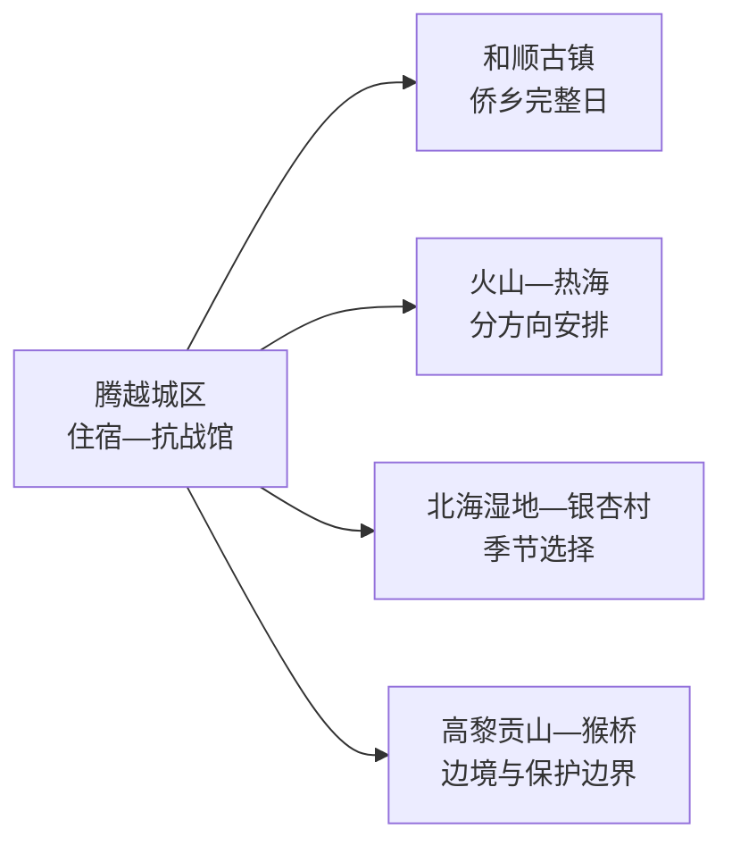
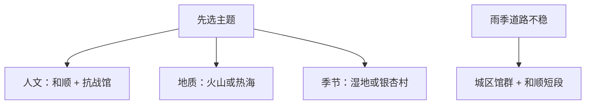

# 腾冲旅行指南

腾冲最好按主题分日：和顺古镇与腾越城区看侨乡和抗战史，火山与热海看地质，北海湿地或银杏村留给季节景观。三天适合第一次到访；若只有两天，就从火山和湿地中删去一项，保留和顺—城区与热海两条核心线。

> 建议停留：3–5 天  
> 旅行关键词：和顺、火山、热海、抗战、湿地、温泉、边地侨乡  
> 主要体力：古镇中等；火山、山地和远乡中至较高  
> 最近研究：2026-08-13

## 城市速览

| 项目 | 旅行信息 |
|---|---|
| 主要旅行价值 | 在侨乡、火山地热、滇西抗战史和高黎贡山生态之间建立完整认识 |
| 建议停留 | 2 天核心线；3 天加入火山或湿地；4–5 天增加银杏村、边境或温泉慢游 |
| 较舒适季节 | 春秋稳定；银杏季与节假日客流高；雨季重点看山路和地灾 |
| 预算特点 | 景区票务、观光车、温泉、机场接驳和换宿是主要支出 |
| 步行强度 | 和顺石板坡与火山台阶较多；湿地按正式栈道或船线 |
| 主要天气风险 | 强降雨、滑坡、低能见度、雷电和高海拔山地温差 |
| 独行旅行 | 城区与和顺方便；远乡、边境和高黎贡山方向先锁定返程 |
| 亲子旅行 | 火山地质与抗战馆适合主题学习；温泉和水域项目按年龄健康选择 |
| 长者与低体力 | 以城区、和顺短段和车辆可达景点为主，减少火山爬升 |
| 无障碍信息 | 新建游客中心可询问服务；古镇、火山、湿地和山地设施连续性需向官方确认 |

## 城市格局与游览区域

GeoNames `1279891` 是腾冲固定城市点；Wikidata `Q1355705` 对法定县级腾冲市同时列有城市点 `1279891` 与行政记录 `1279890`。本页按行政代码 `530581` 和完整市域组织，腾冲虽由保山市代管，仍有独立机场、城区、住宿和多日路线。

| 片区 | 核心体验 | 怎么选 | 关键边界 |
|---|---|---|---|
| 腾越城区 | 滇西抗战纪念馆、国殇墓园、叠水河、餐饮 | 抵达日或雨天线 | 馆园整体按一个抗战纪念单元组织 |
| 和顺镇 | 古镇、侨乡、民居与文化设施 | 完整半日至一日 | 住宿区、居民生活区与收费游览点规则不同 |
| 火山—热海 | 火山地貌与高温地热 | 各留半日至一日，交通紧张时二选一 | 火山热海是一个5A旅游区，但两片相距远，路线分别倒推 |
| 北海—固东 | 湿地、银杏村与季节景观 | 按水位、叶色与客流选择 | 湿地保护范围与游客经营区不同 |
| 高黎贡山与边境乡镇 | 自然教育、茶园、猴桥方向 | 只选正式开放线路和合规接待 | 保护区、国境线、口岸监管和生产道路有明确限制 |

## 主要景点

### 人文与抗战

| 景点 | 所在片区 | 类型 | 核心看点 | 建议用时 | 室内/室外 | 体力 | 预约 | 天气影响 | 优先级 |
|---|---|---|---|---|---|---|---|---|---|
| 和顺古镇景区 | 和顺镇 | 古镇与侨乡 | 民居、图书馆、侨乡历史和水岸空间 | 5–8 小时 | 混合 | 中 | 高 | 中 | A |
| 滇西抗战纪念馆—国殇墓园 | 腾越城区 | 纪念馆与纪念地 | 滇西抗战史、展陈与纪念空间 | 2.5–4 小时 | 混合 | 低至中 | 高 | 低 | A |
| 叠水河景区 | 腾越城区 | 瀑布与城市景观 | 城市近旁瀑布、河谷与步道 | 1–2 小时 | 室外 | 中 | 中 | 高 | B |

### 火山地热与湿地

| 景点 | 所在片区 | 类型 | 核心看点 | 建议用时 | 室内/室外 | 体力 | 预约 | 天气影响 | 优先级 |
|---|---|---|---|---|---|---|---|---|---|
| 火山景区 | 马站乡 | 火山地质 | 火山锥、地质展示和经营体验 | 4–6 小时 | 室外为主 | 中至高 | 高 | 很高 | A |
| 热海景区 | 清水镇 | 地热与温泉景观 | 高温泉群、地热地貌和经营游线 | 4–6 小时 | 室外为主 | 中 | 高 | 高 | A |
| 北海湿地景区 | 北海镇 | 湿地与自然教育 | 火山堰塞湿地、浮毯型沼泽和正式游线 | 3–5 小时 | 室外 | 中 | 高 | 很高 | A |
| 江东银杏村 | 固东镇 | 村落与季节景观 | 银杏林、村落和秋季色彩 | 3–5 小时 | 室外 | 中 | 高 | 很高 | B |
| 司莫拉佤族村 | 清水镇 | 村落文化 | 村落、民族文化和乡村接待 | 2–4 小时 | 混合 | 中 | 中 | 中 | B |

火山航空、骑乘、漂流和温泉属于单独经营项目，以当日资质、保险和天气决定是否参加。高温地热口、湿地水域和保护地核心区域保留明确安全与法律边界。

## 美食与餐饮

| 类型 | 场景 | 份量 | 注意 | 怎么选 |
|---|---|---|---|---|
| 饵丝、米线 | 早餐 | 一人一碗 | 骨汤、肉臊、花生和辣椒 | 先选汤底与帽子，调料另放 |
| 大救驾 | 小吃或主食 | 一盘可两人分享 | 米制品、鸡蛋、肉类和油脂 | 与清淡汤菜搭配 |
| 土锅子 | 多人正餐 | 2–4 人更合适 | 肉类、蛋、豆制品和高温锅具 | 先问份量、底料和加热方式 |
| 稀豆粉 | 早餐小吃 | 一人小份 | 豆类、油条小麦和辣椒 | 对豆类或麸质敏感者先确认 |
| 铜瓢牛肉等火锅 | 晚餐 | 共享 | 牛肉、汤底、辣椒和共锅 | 按人数点小锅并确认熟度 |

## 经典行程

### 一日经典：和顺与抗战记忆
- **路线**：和顺古镇 → 午餐 → 滇西抗战纪念馆—国殇墓园。
- **串联逻辑**：从侨乡社会走向近代边地历史。
- **预约锚点**：以和顺和纪念馆中规则较严格者为准。
- **休息安排**：和顺午餐加午休，下午馆园慢行。
- **时间不足时**：和顺与抗战馆二选一完整参观。

### 两日核心
- **路线**：第1天和顺—抗战线；第2天热海完整游览。
- **串联逻辑**：人文和地热分日，减少跨方向赶路。
- **预约锚点**：先锁热海票务、交通和温泉项目。
- **休息安排**：热海按服务区分段休息，控制高温暴露。
- **时间不足时**：只走热海核心游线，不追加村落。

### 三日深度
- **路线**：前两日按上；第3天火山景区 → 马站方向午餐 → 返回城区。
- **适用条件**：天气稳定且火山项目正常。
- **预约锚点**：核火山票务、观光车和体验项目。
- **休息安排**：上午完成主要爬升，中午充分休息。
- **时间不足时**：火山核心短线后直接返城。

### 雨天路线
- **路线**：滇西抗战纪念馆 → 城区午餐 → 当期开放室内文化空间 → 温泉经营项目可选。
- **适用条件**：城区交通正常；地灾预警时减少山路。
- **预约锚点**：场馆和温泉分别确认。
- **休息安排**：午后留长休息，温泉按健康条件控制时长。
- **时间不足时**：保留抗战馆单点。

### 亲子与低体力路线
- **路线**：抗战馆核心展 → 午餐 → 和顺车辆可达入口与平缓短段。
- **适用与减负**：亲子用讲解和地质展建立主题；低体力旅行删火山台阶。
- **预约锚点**：讲解、落客点、轮椅与卫生间。
- **休息安排**：上午馆内、午后古镇短段，各留坐席休息。
- **时间不足时**：只选抗战馆或和顺核心区。

### 季节远线
- **路线**：北海湿地、银杏村或正式开放高黎贡山自然教育线中选一处。
- **适用条件**：已确认水位、叶色、道路和接待。
- **预约锚点**：以景区或保护地管理机构公告为准。
- **休息安排**：在正式游客服务点用餐补水。
- **时间不足时**：保留一个季节匹配度最高的目的地。

## 住宿区域

| 区域 | 优点 | 取舍 | 适合人群 | 建议 |
|---|---|---|---|---|
| 腾越城区 | 餐饮、交通和多方向接驳最好 | 古镇氛围较弱 | 首次到访、无车旅行 | 以安静、停车或接驳便利为先 |
| 和顺古镇 | 清晨傍晚体验好 | 石板坡、车辆和行李搬运需核 | 古镇慢游、摄影 | 问清入口、接送和房间台阶 |
| 热海或温泉片区 | 适合康养慢住 | 与其他方向通勤不便 | 温泉主题 | 核实水质、健康提示、退改和交通 |
| 固东等远乡 | 靠近季节景观 | 服务和替代选择少 | 银杏季、自驾 | 提前锁定供餐、停车和返程 |

## 市内交通

腾冲驼峰机场服务腾冲；保山云瑞机场服务隆阳主城，两者不是同城机场。市内景点分散，城区—和顺可短途接驳，火山、热海、湿地和银杏村需分别计算公路时间。

| 场景 | 怎么走 | 核对 |
|---|---|---|
| 航空抵达 | 驼峰机场转城区或和顺 | 航班、机场接驳、夜间到达和行李 |
| 保山联程 | 公路跨越高黎贡山区域 | 班次、天气、施工与换宿 |
| 景区日 | 自驾、正规包车、公交或当期专线 | 入口、最晚返程、停车和观光车 |
| 边境乡镇 | 使用合规道路和运营服务 | 证件、检查、口岸开放、拍摄和无人机 |

## 不同旅行者须知

| 旅行者 | 推荐做法 | 需要留意 | 核对 |
|---|---|---|---|
| 独行 | 住城区，每日一方向 | 远乡返程与山路 | 车辆、信号、住宿电话 |
| 亲子 | 抗战馆、火山地质、湿地正式游线 | 水域、高温地热和项目年龄 | 护栏、讲解、保险、卫生间 |
| 长者低体力 | 城区馆群、和顺短段、车辆接驳 | 石板坡与火山台阶 | 落客点、轮椅、座椅、温泉禁忌 |
| 边境旅行 | 走公开景区、村落和口岸允许区域 | 国境线、检查和拍摄规则 | 身份证件、口岸、无人机和通信 |
| 生态旅行 | 进入批准的景区或自然教育线路 | 保护区核心缓冲区有法律限制 | 管理机构、线路、向导和火险 |

## 行前核对

| 事项 | 原因 | 时间 | 官方入口 |
|---|---|---|---|
| A级景区与票务 | 等级、联票、项目和开放变化 | 订房前及当天 | [腾冲市A级景区名单](https://www.tengchong.gov.cn/info/16031/5029153.htm) |
| 和顺、火山、热海 | 入口和观光车不同 | 排路线时 | [腾冲市人民政府](https://www.tengchong.gov.cn/) |
| 航班 | 高原天气和航线变化 | 购票及前一日 | [腾冲驼峰机场](https://tc.ynairport.com/) |
| 暴雨地灾 | 影响山路、湿地和边境乡镇 | 前三日及当天 | [云南省气象局](https://yn.cma.gov.cn/) |
| 边境与口岸 | 证件、检查和开放具有时效性 | 进入边境乡镇前 | [国家移民管理局](https://www.nia.gov.cn/) |

## 来源与更新记录

### 主要来源

| 来源 | 类型 | 支持内容 | 核验日期 |
|---|---|---|---|
| [腾冲市概况](https://www.tengchong.gov.cn/tcgk/tcjj.htm) | 市政府 | 市域、机场、景区和城市背景 | 2026-08-13 |
| [腾冲A级景区名单](https://www.tengchong.gov.cn/info/16031/5029153.htm) | 市政府 | 火山热海、和顺、抗战馆、湿地等等级 | 2026-08-13 |
| [腾冲文旅2025年上半年工作](https://www.tengchong.gov.cn/info/9130/5703043.htm) | 市文旅局 | 核心景区与当期发展状态 | 2026-08-13 |
| [腾冲五大文旅片区答复](https://www.tengchong.gov.cn/info/25671/5686223.htm) | 市政府 | 火山热海、和顺、高黎贡山、南部与边境片区 | 2026-08-13 |
| [云南省林草局：北海湿地保护区](https://lcj.yn.gov.cn/special/2025/0512/6598.html) | 省级林草部门 | 湿地保护对象与范围 | 2026-08-13 |
| [GeoNames 1279891](https://www.geonames.org/1279891/) | 开放地理数据 | 固定城市点 | 2026-08-13 |
| [Wikidata Q1355705](https://www.wikidata.org/wiki/Q1355705) | 开放结构化数据 | 法定腾冲市及双Geo粒度 | 2026-08-13 |

### 更新记录

| 日期 | 更新内容 |
|---|---|
| 2026-08-13 | 首次完成腾冲独立旅行研究；按和顺与抗战、火山热海、湿地季节线组织选择，补充保护地、边境、地热、地灾、机场和无障碍边界。 |
