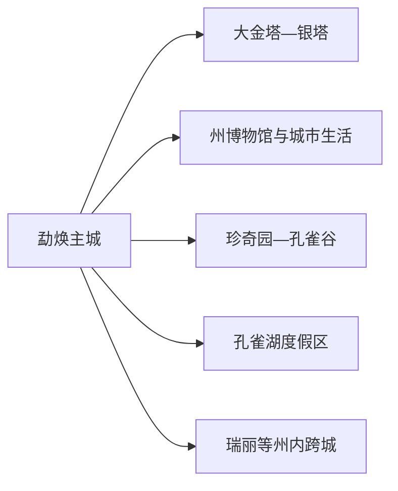
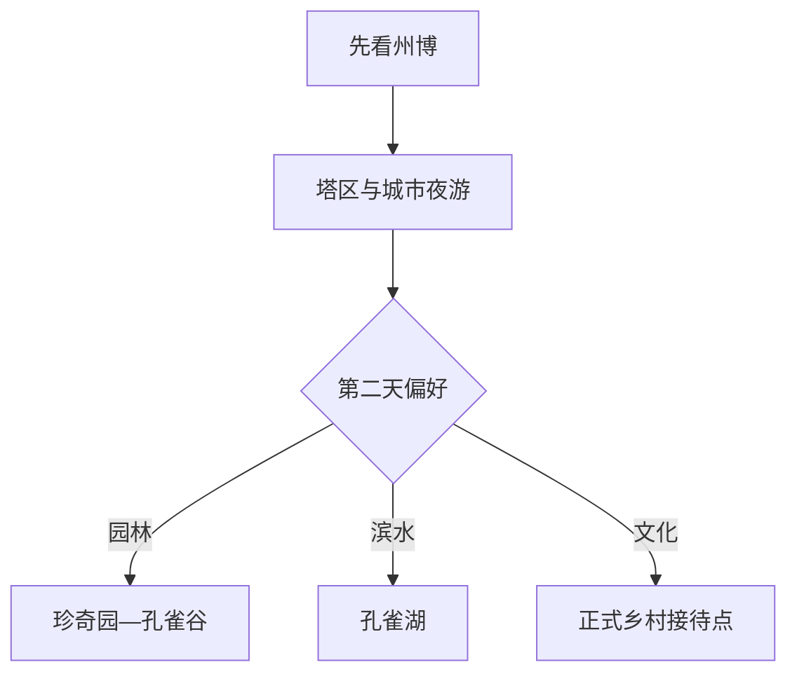

# 芒市旅行指南

芒市是德宏州府，适合以勐焕片区的塔、园林和夜间生活为城市核心，再从孔雀湖、乡村与州博物馆中选择一条延伸线。瑞丽、梁河、盈江和陇川各有独立边境与县域旅行结构；芒市机场虽然承担全州门户功能，也不把这些目的地变成城市近郊。

> 建议停留：主城 2 天；孔雀湖或乡村方向另留 1 天
> 关键词：勐焕大金塔、银塔、珍奇园、德宏州博物馆、孔雀湖、傣族景颇族饮食
> 体力：主城低至中等；山坡塔区、热带园林和乡村远线中等
> 最近研究：2026-08-13

## 城市速览
| 项目 | 旅行信息 |
|---|---|
| 主要价值 | 在紧凑州府中连接宗教建筑、民族文化、热带植物、夜市和边疆交通 |
| 建议停留 | 2天主城，3天增加孔雀湖或正式乡村体验 |
| 交通 | 德宏芒市机场、道路客运和市内车辆为主 |
| 季节 | 雨季湿热，强降雨影响山路；冬春较舒适 |
| 预算 | 主城易控制，演艺、园区和远线车辆增加支出 |
| 步行 | 塔区有坡度，白天注意日晒 |
| 无障碍 | 州博和部分城市景区较易安排，塔区坡路与乡村连续性需确认；设施连续性需向官方确认 |
| 亲子 | 州博、珍奇园和短夜市线较友好 |
| 边界 | 口岸、边境村寨与州内其他县市按属地安排 |
| 行前核心 | 核对景区营业、演艺、降雨、机场与远线返程 |

## 城市格局与游览区域
法定芒市代码 `533103`。固定 GeoNames `12358512` 名为 Menghuan，是勐焕主城驻地点；法定实体 `Q1023762` 的 `P1566` 连接旧行政记录 `1280623`。页面以县级芒市为范围，点坐标只用于核对主城。

| 区域 | 重点 | 安排 | 条件 |
|---|---|---|---|
| 主城 | 州博、市场、夜间餐饮 | 1天 | 场馆与演艺时段 |
| 雷牙让山片区 | 大金塔、银塔与城市俯瞰 | 半日至1天 | 坡路、着装、宗教礼仪 |
| 珍奇园—孔雀谷 | 热带植物与园区体验 | 半日至1天 | 运营、动物福利与接驳 |
| 孔雀湖 | 度假、滨水与近郊生态 | 独立半日或1天 | 限流、停车、水域边界 |
| 乡村方向 | 正式民族文化与季节活动 | 独立1天 | 接待、道路、社区规则 |

## 主要景点
| 名称 | 区域 | 类型 | 旅行价值 | 时长 | 室内外 | 体力 | 无障碍 | 预约 | 优先级 |
|---|---|---|---|---:|---|---|---|---|---|
| 勐焕大金塔 | 主城山坡 | 宗教建筑 | 城市标志与佛教文化 | 1–2小时 | 混合 | 中 | 低至中 | 建议核对 | A |
| 勐焕银塔 | 主城山坡 | 建筑、园林 | 白色塔群、城市观景与当期演艺 | 2–3小时 | 室外 | 中 | 低至中 | 建议 | A |
| 德宏州博物馆 | 主城 | 文博 | 建立州域民族、历史与边境背景 | 2–3小时 | 室内 | 低 | 高 | 建议 | A |
| 勐巴娜西珍奇园 | 主城 | 热带园林 | 植物、地方园林与城市休闲 | 2–4小时 | 混合 | 中 | 中 | 建议 | A |
| 傣族古镇公共街区 | 主城 | 街区、夜游 | 餐饮、活动与傣族文化场景 | 2–3小时 | 混合 | 低 | 中 | 通常无需 | B |
| 孔雀谷景区 | 近郊 | 森林、园区 | 近郊自然与家庭活动 | 4–6小时 | 室外 | 中 | 逐项确认 | 建议 | B |
| 孔雀湖旅游度假区公开区域 | 近郊 | 湖泊、度假 | 滨水休闲与城市近郊转换 | 3–6小时 | 室外 | 中 | 中 | 建议 | A |
| 正式乡村文化接待点 | 市域乡村 | 民族文化 | 在社区规则下体验饮食、歌舞和手工艺 | 半日至1天 | 混合 | 中 | 低 | 需要 | C |

## 美食与餐饮
| 类型 | 怎么点 | 注意 |
|---|---|---|
| 撒撇、米线 | 一人一份，先选熟食版本 | 酸辣、香草与肉汤按口味确认 |
| 泡鲁达与甜品 | 小份分享 | 含乳、椰、花生或面包 |
| 傣味烧烤 | 多人少量拼点 | 腌料含大豆、花生，注意充分加热 |
| 酸茶与地方茶饮 | 先小杯体验 | 咖啡因、发酵与糖量 |
| 热带水果 | 市场小份购买 | 洗净、控制糖分，不进入果园随意采摘 |

## 经典行程

### 一日经典
**路线**：州博物馆 → 午餐 → 大金塔 → 银塔 → 主城夜间餐饮。
- **串联逻辑**：先理解州域，再看城市标志与夜生活。
- **预约锚点**：州博、两塔和演艺。
- **休息安排**：午间室内长休，塔区分段上坡。
- **时间不足时**：州博与两塔二选一组。

### 两日
**第2天**：珍奇园 → 午餐 → 孔雀谷或傣族古镇。
- **串联逻辑**：集中处理热带园林与家庭体验。
- **预约锚点**：园区营业、接驳与活动。
- **休息安排**：正午避晒。
- **时间不足时**：只留珍奇园。

### 三日
**第3天**：孔雀湖公开区域或一处正式乡村接待点。
- **适用条件**：天气、道路和返程清楚。
- **串联逻辑**：只选一条近郊主题。
- **预约锚点**：接待、活动、停车。
- **休息安排**：午后安排室内或遮阴休息。
- **时间不足时**：改主城公园短线。

### 雨天
**路线**：州博 → 午餐 → 珍奇园可用室内段或商业街区。
- **适用条件**：城市交通正常。
- **串联逻辑**：减少山坡与乡村路。
- **预约锚点**：场馆开放。
- **休息安排**：室内为主。
- **时间不足时**：只看州博。

### 亲子
**路线**：州博 → 午休 → 珍奇园短线。
- **适用条件**：儿童适应湿热。
- **串联逻辑**：文博与植物观察组合。
- **预约锚点**：亲子活动与动物展示规则。
- **休息安排**：午睡、防晒、防蚊。
- **时间不足时**：保留珍奇园。

### 长者与低体力
**路线**：州博 → 午餐 → 车辆到银塔一处 → 返回。
- **适用条件**：有近距离上下车点。
- **串联逻辑**：车辆连接单点，减少连续坡路。
- **预约锚点**：电梯、轮椅与卫生间。
- **休息安排**：塔区只走短段。
- **时间不足时**：州博一馆即可。

## 住宿区域
| 区域 | 优势 | 取舍 | 适合 | 交通 |
|---|---|---|---|---|
| 主城中心 | 餐饮、州博、叫车便利 | 夜间可能嘈杂 | 首访 | 机场接驳方便 |
| 塔区周边 | 早晚景观方便 | 坡路较多 | 摄影、慢游 | 核上下车点 |
| 机场方向 | 早晚航班方便 | 离夜间核心较远 | 中转 | 核班车与接送 |
| 孔雀湖附近 | 度假节奏 | 餐饮与返程更依赖车辆 | 自驾、休闲 | 核停车与限流 |

## 市内交通
| 场景 | 推荐 | 核对 |
|---|---|---|
| 机场抵达 | 出租车、网约车或酒店接送 | 航班、上客区、夜间接送 |
| 主城移动 | 短途车辆加分段步行 | 拥堵、停车、演艺管制 |
| 孔雀湖/乡村 | 合规包车或自驾 | 道路、返程、通信 |
| 州内跨城 | 公路客运或车辆，另订住宿 | 边境、口岸、班次与证件 |

## 不同旅行者须知
| 旅行者 | 怎么选 | 重点 |
|---|---|---|
| 独行 | 主城与正规园区 | 夜间返程、远线通信 |
| 亲子 | 州博、珍奇园 | 湿热、防蚊、动物互动规则 |
| 长者 | 主城单点、车辆接驳 | 坡路、卫生间、休息 |
| 摄影 | 塔区公开点、城市夜景 | 宗教礼仪、无人机、肖像 |
| 自驾 | 孔雀湖或乡村单线 | 雨季、停车、司机休息 |
| 边境联程 | 芒市住宿后另行前往瑞丽等地 | 属地公告、证件、口岸开放 |

## 行前核对
| 项目 | 时点 | 官方入口 |
|---|---|---|
| 景区与演艺 | 前一日 | [德宏州政府](https://www.dh.gov.cn/) |
| 天气地灾 | 前三日及当天 | [云南气象](https://yn.cma.gov.cn/)；[云南自然资源](https://dnr.yn.gov.cn/) |
| 航班 | 购票与当天 | [中国民航局](https://www.caac.gov.cn/) |
| 州内交通 | 订住宿前 | [云南交通](https://jtyst.yn.gov.cn/) |
| 行政边界 | 跨县市规划时 | [民政部查询](https://dmfw.mca.gov.cn/xzqh/getList?code=533100&trimCode=false&maxLevel=3) |

## 来源与更新记录
### 主要来源
| 来源 | 支持内容 | 核验日期 |
|---|---|---|
| [德宏2026春节文旅](https://www.dh.gov.cn/lfw/Web/_F0_0_6I8Y14PP558D7B2C8B9944DDAF.htm) | 当前热门景区、州博与限流 | 2026-08-13 |
| [德宏文旅规划](https://www.dh.gov.cn/Web/_F0_0_5LF4HCW8D9DEBCECE6A6478E98.htm) | 孔雀湖、珍奇园、银塔、乡村与博物馆 | 2026-08-13 |
| [德宏政府工作报告](https://www.dh.gov.cn/Web/_F0_0_648IWQ42C03BF9F9ACF648FCBA.htm) | 孔雀湖度假区与景区提升状态 | 2026-08-13 |
| [GeoNames 12358512](https://www.geonames.org/12358512/) | 勐焕固定点 | 2026-08-13 |
| [Wikidata Q1023762](https://www.wikidata.org/wiki/Q1023762) | 法定实体与旧行政P1566 | 2026-08-13 |
| [行政区划533100](https://dmfw.mca.gov.cn/xzqh/getList?code=533100&trimCode=false&maxLevel=3) | 芒市533103与州内边界 | 2026-08-13 |

### 更新记录
| 日期 | 更新 |
|---|---|
| 2026-08-13 | 首次完成芒市旅行研究；建立主城、塔区、园林、孔雀湖和乡村分线，解释勐焕点与法定芒市粒度 |
