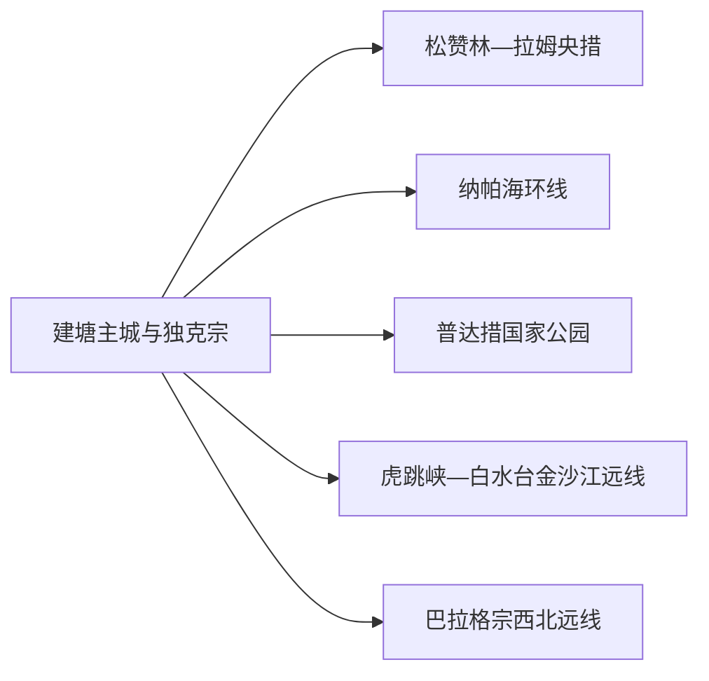
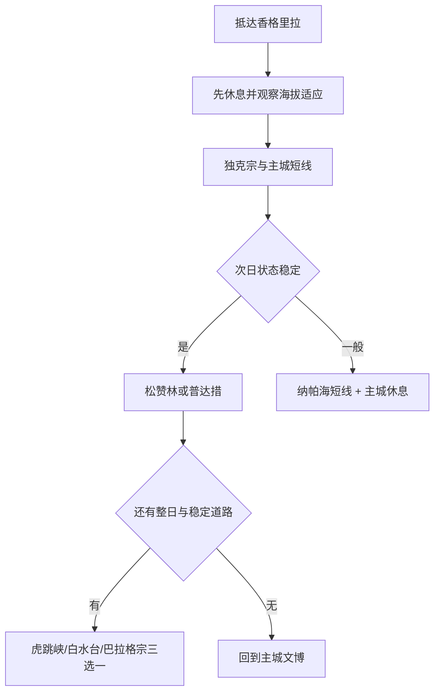

# 香格里拉旅行指南

香格里拉市是迪庆州府，也是独克宗古城、松赞林景区、普达措、纳帕海、虎跳峡和白水台等高原目的地的共同住宿与交通基地。路线安排的关键不是把景点塞满，而是先适应海拔，再按“主城文化—湿地寺院—国家公园—金沙江峡谷”逐步增加车程和体力。

> 建议停留：3–5 天；虎跳峡、白水台或巴拉格宗各需额外完整一天 
> 旅行关键词：独克宗、松赞林、普达措、纳帕海、高原适应 
> 主要体力：主城低至中等；国家公园、峡谷和远线为中高 
> 最近研究：2026-08-12

## 城市速览

| 项目 | 旅行信息 |
|---|---|
| 主要旅行价值 | 在州府主城理解藏地城市生活，以松赞林和独克宗进入人文，再从普达措、纳帕海及金沙江峡谷观察高原生态。 |
| 建议停留 | 抵达日只做主城慢行；第 2 天松赞林与纳帕海；第 3 天普达措；继续增加虎跳峡、白水台或巴拉格宗。 |
| 较舒适季节 | 不同季节各有雪景、花季、草甸与候鸟，核心是按气温、降雪、雨季道路和防火规定调整。 |
| 预算特点 | 古城步行成本低，景区票务、观光车、远线包车、氧气与高原住宿是主要增量。 |
| 步行强度 | 独克宗可分段慢走；松赞林有台阶，普达措和峡谷按正式游线步行；高海拔会放大平地活动负担。 |
| 主要天气风险 | 低温、强紫外线、雷电、降雪、道路结冰、雨季落石与高原反应。 |
| 独行旅行 | 主城和成熟景区较易安排；远线优先正规班车、景区车或资质车辆。 |
| 亲子旅行 | 古城、博物馆和普达措短线适合分龄安排，先确认海拔适应、观光车、保暖和儿童规则。 |
| 长者与低体力旅行 | 抵达首日充分休息，采用车辆接驳、单景区慢看和低台阶方案。 |
| 无障碍信息 | 古城石板、寺院台阶和自然景区栈道差异明显；设施连续性需向官方确认。 |

### 地名记录与法定城市边界

本页处理迪庆州代管的县级市 **533401**。固定 **GeoNames 7910932** 名为 `Shangri-La`，是州府城市点；法定实体 **Wikidata Q933866** 的 `P1566=1279460` 指向旧行政记录。两者用于交叉核对主城与市域，边界仍以行政代码为准。德钦县梅里雪山、维西县滇金丝猴等另作跨县行程。

## 城市格局与游览区域

| 区域 | 主要内容 | 游览特点 | 与其他区域的关系 |
|---|---|---|---|
| 建塘—独克宗主城 | 独克宗古城、龟山公园、州级文博、餐饮住宿 | 适合适应海拔和抵达日，夜间温差大 | 松赞林、纳帕海和机场均需车辆 |
| 松赞林片区 | 噶丹·松赞林寺、拉姆央措与景区展陈 | 宗教礼仪、台阶和团队时段需要预留 | 可与纳帕海组成一日，但节奏宜慢 |
| 纳帕海—依拉草原 | 国际重要湿地、草原与季节水面 | 水位、候鸟、牧业和交通组织随季节变化 | 只使用正式观景点与道路停靠 |
| 普达措方向 | 国家公园景区、湖泊、森林和自然教育 | 观光车与开放栈道决定实际游线 | 适合独立整日，返城后不再追加高体力项目 |
| 金沙江与西北远线 | 虎跳峡、白水台、巴拉格宗 | 单程车时长高，部分项目适合换宿 | 分方向单独安排，不合并成一日环线 |

## 主要景点

| 景点 | 区域 | 类型 | 主要看点 | 建议用时 | 室内外 | 体力 | 预约风险 | 天气影响 | 优先级 |
|---|---|---|---|---:|---|---|---|---|---|
| 独克宗古城（含龟山公园） | 主城 | 历史街区 | 古城格局、藏式建筑、公共文化与夜间生活 | 3–5 小时 | 混合 | 中 | 中 | 中高 | A |
| 松赞林景区 | 主城北侧 | 宗教与湿地文化 | 松赞林寺、拉姆央措和藏传佛教建筑 | 3–5 小时 | 混合 | 中高 | 高 | 中 | A |
| 普达措景区 | 东部 | 国家公园景区 | 高原湖泊、森林、自然教育和观光车游线 | 0.5–1 天 | 室外为主 | 中 | 高 | 高 | A |
| 纳帕海景区与正式观景点 | 主城西北 | 湿地与草原 | 季节水面、候鸟、草原和村落景观 | 3–5 小时 | 室外 | 低至中 | 中 | 高 | A |
| 迪庆州博物馆等主城文博 | 独克宗周边 | 博物馆 | 州域历史、民族文化与专题展览 | 1.5–3 小时 | 室内 | 低 | 中 | 低 | B |
| 虎跳峡景区 | 金沙江方向 | 峡谷景区 | 金沙江峡谷与正式观景游线 | 0.5–1 天 | 室外 | 中高 | 高 | 高 | B |
| 白水台景区 | 三坝乡 | 地质与文化景观 | 钙华台地及纳西文化环境 | 1 天含车程 | 室外 | 中 | 高 | 高 | C |
| 巴拉格宗景区 | 西北方向 | 峡谷与山地 | 大峡谷、村落和景区交通 | 1 天以上 | 混合 | 中 | 高 | 高 | C |

主景区内部子点按一个整体计。2026 年属地通告已列出若干未开发山地、峡谷和高路；徒步选择以当期正式开放、具备服务与救援的游线为准。

## 美食与餐饮

| 菜品或餐饮类型 | 常见区域 | 一个人用餐与常见份量 | 风味、过敏原与饮食限制 | 排队风险与替代方法 |
|---|---|---|---|---|
| 牦牛肉火锅 | 主城与古城 | 多人锅更丰富，单人找小锅或套餐 | 含牛肉，汤底较咸；蘸料可能含芝麻、花生 | 先问份量和锅底，改点牦牛肉面亦可 |
| 酥油茶、奶渣与糌粑 | 藏式餐馆 | 适合少量体验 | 含乳制品，糌粑含青稞；高脂饮食按身体状态控制 | 先点小份，乳糖不耐受者明确说明 |
| 尼西土锅鸡 | 主城及尼西方向 | 通常多人共享 | 含禽肉、菌菇或药材需询问 | 预约正规餐馆，人数少选半份或套餐 |
| 青稞饼、荞粑粑与面食 | 主城 | 单人友好 | 可能含小麦、乳制品和油脂 | 早餐高峰选择同类社区店 |
| 松茸等野生菌菜 | 正规餐馆 | 按季节和菜品计价 | 菌类必须彻底加工，混合菌种需确认 | 选择正规餐馆，非产季改点普通蔬菜 |

## 经典行程

### 一日经典路线

**路线**：独克宗古城 → 州级文博 → 午休 → 松赞林景区

- **串联逻辑**：先在低强度主城适应海拔，再用车辆前往寺院，体力逐步增加。
- **预约锚点**：松赞林票务与观光车、博物馆开放。
- **休息安排**：午间回主城，松赞林台阶前后各坐休。
- **时间不足时**：保留独克宗和松赞林，文博择一。

### 两日城市路线

**第 1 天**：独克宗—文博—休息  
**第 2 天**：松赞林 → 纳帕海正式观景点 → 回城

- **串联逻辑**：第一天适应，第二天把主城北侧人文与湿地组合。
- **预约锚点**：两个景区票务、车辆与天气。
- **休息安排**：纳帕海只做短停，午后回城休息。
- **时间不足时**：第二天保留松赞林，纳帕海缩为一个正式观景点。

### 三日深度路线

**第 1 天**：独克宗与州级文博  
**第 2 天**：松赞林—纳帕海  
**第 3 天**：普达措整日

- **串联逻辑**：海拔适应、文化、湿地、国家公园按负荷递进。
- **预约锚点**：普达措票务、观光车和返程车辆。
- **休息安排**：每天只设一个高投入时段，夜间保证睡眠。
- **时间不足时**：第三天改普达措精华游线，不追加远线。

### 雨雪天气路线

**路线**：州级文博 → 独克宗室内文化空间 → 午休 → 视道路选择松赞林短线

- **适用条件**：普通降雨或小雪；道路结冰、强降雪和雷暴时以主城室内为主。
- **串联逻辑**：用主城短距离场馆降低交通和暴露时间。
- **预约锚点**：场馆开放、寺院道路和景区交通。
- **休息安排**：午间回住宿地，下午只安排一个点。
- **时间不足时**：保留文博和古城短段。

### 亲子或低体力路线

**亲子路线**：独克宗短段 → 文博 → 午休 → 纳帕海一个正式观景点  
**低体力路线**：车辆游主城文博 → 午餐 → 松赞林观光车与低台阶范围

- **减负方式**：亲子减少长车程；低体力路线用车辆和单点观景替代完整环湖与长栈道。
- **预约锚点**：儿童票、观光车、氧气与无障碍设施。
- **休息安排**：每半日回到可供暖、可坐休空间。
- **时间不足时**：两类路线均保留文博和一处户外观景。

### 远郊一日路线

**路线**：主城 → 虎跳峡；或主城 → 白水台；或主城 → 巴拉格宗

- **适用条件**：只选一个方向，并确认道路、景区和高原状态。
- **串联逻辑**：三个目的地分处不同方向，单线往返更稳妥。
- **预约锚点**：票务、资质车辆、返程和换宿。
- **休息安排**：车辆途中设置正规服务点，景区内按观光车节奏休息。
- **时间不足时**：缩短景区内部游线，不临时叠加另一远点。

## 住宿区域

| 区域 | 优点 | 代价 | 适合人群 | 交通提示 |
|---|---|---|---|---|
| 独克宗古城内外 | 餐饮、夜间步行和文博方便 | 石板路、行李搬运和夜间噪声差异大 | 首访、文化主题 | 核对车辆能否到门口及供暖 |
| 建塘主城 | 医疗、交通和生活服务完整 | 氛围不如古城集中 | 高原适应、长者、公共交通 | 选靠近正规上车点的住宿 |
| 松赞林—纳帕海周边 | 景观与度假感强 | 海拔、夜间交通和餐饮选择更少 | 自驾、度假、摄影 | 确认接送、供暖和实际道路 |

## 市内交通

迪庆香格里拉机场和香格里拉站承担主要到发，航班与列车以民航、12306 为准。主城到松赞林、纳帕海和普达措使用景区车、公交、出租或资质车辆；远线在出发前写清目的地、停靠、费用和返程。

| 方式 | 适用场景 | 核对重点 |
|---|---|---|
| 航空 | 昆明等方向快速抵达 | 航季、天气、行李和高原适应 |
| 铁路 | 大理、丽江等方向 | 车次、实名、站城接驳 |
| 景区车与公交 | 松赞林、普达措等成熟景区 | 发车点、末班、票务联动 |
| 包车与自驾 | 虎跳峡、白水台、巴拉格宗 | 资质、保险、路况、驾驶时长 |

## 不同旅行者须知

- **高原适应**：抵达后放慢速度、保暖补水、保证睡眠；持续胸痛、呼吸困难、意识异常等症状及时就医。
- **独行者**：主城和成熟景区优先，远线把车辆、住宿和返程写进订单。
- **亲子与长者**：缩短台阶和长车程，先确认医疗、供暖、氧气和退改条件。
- **宗教与社区**：遵循寺院、村落和活动现场礼仪，人物拍摄先征得同意。
- **生态与生产空间**：湿地、草场、林区和牧业道路沿正式入口活动；未开发区域按 2026 通告执行。
- **无人机**：机场净空、寺院、保护地和景区另有规则，起飞前逐点确认。

## 行前核对

| 核对事项 | 建议时间 | 官方入口 |
|---|---|---|
| 各景区票务、观光车与开放 | 订行程前及前一日 | [香格里拉市政府文旅信息](https://xianggelila.gov.cn/zwxx/yw/202602/20260225_238433.html)、景区正式渠道 |
| 未开发区域与徒步 | 设计远线前 | [2026 年属地通告](https://www.diqing.gov.cn/xwzx/tzgg/202602/20260228_238494.html) |
| 高原天气、降雪和道路 | 出发前三日及当天 | [云南省气象局](https://yn.cma.gov.cn/)、交通与交警公告 |
| 航班与铁路 | 购票前及当天 | [中国民航局](https://www.caac.gov.cn/)、[12306](https://www.12306.cn/) |
| 医疗与无障碍 | 预订前 | 景区、住宿和属地医疗机构 |

## 来源与更新记录

### 主要来源

| 来源 | 支持内容 | 核验日期 |
|---|---|---|
| [民政部行政区划代码查询](https://dmfw.mca.gov.cn/) | 香格里拉市 533401 | 2026-08-12 |
| [Wikidata Q933866](https://www.wikidata.org/wiki/Q933866) | 法定实体与 P1566 行政记录 | 2026-08-12 |
| [GeoNames 7910932](https://www.geonames.org/7910932/shangri-la.html) | 固定州府城市点 | 2026-08-12 |
| [香格里拉市 2026 春节文旅](https://xianggelila.gov.cn/zwxx/yw/202602/20260225_238433.html) | 主要景区当期运营与主线 | 2026-08-12 |
| [迪庆州旅游资源](https://www.diqing.gov.cn/dqgk/lyzy.html) | 州域景区与饮食背景 | 2026-08-12 |
| [香格里拉文旅行动计划](https://xianggelila.gov.cn/ztzl/lqhmzcfwzl/hmzc/whty/202307/20230720_191028.html) | 市内景区、交通和项目关系 | 2026-08-12 |
| [普达措自然教育](https://www.diqing.gov.cn/xwzx/bmdt/202505/20250503_226818.html) | 国家公园生态与教育内容 | 2026-08-12 |
| [纳帕海湿地保护](https://www.diqing.gov.cn/ztzl/dslzysthjbhdc/mtjj/202404/20240424_207243.html) | 湿地生态、社区与水位边界 | 2026-08-12 |
| [未开发区域活动通告](https://www.diqing.gov.cn/xwzx/tzgg/202602/20260228_238494.html) | 2026 年户外与保护边界 | 2026-08-12 |
| [中国铁路 12306](https://www.12306.cn/) | 铁路动态 | 2026-08-12 |

### 更新记录

| 日期 | 更新内容 |
|---|---|
| 2026-08-12 | 首次系统整理固定州府点与县级市边界、主城适应、主要景区、远线、高原交通和生态保护。 |
