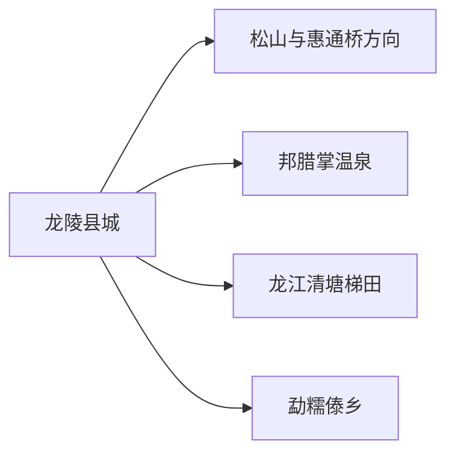
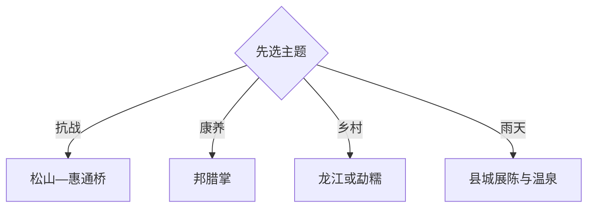

# 龙陵旅行指南

龙陵最鲜明的旅行组合是松山抗战遗址、邦腊掌温泉与滇西山地乡村。县城适合作为交通和住宿中心，松山、龙江清塘梯田、勐糯等方向分别安排；两天可抓住抗战与温泉，三天再增加一条乡村生态线。

## 城市速览

| 项目 | 信息 |
|---|---|
| 主线 | 县城—松山大战遗址—邦腊掌—龙江或勐糯 |
| 停留 | 核心2天；增加梯田或傣乡共3天 |
| 住宿 | 县城换线方便；邦腊掌适合温泉主题住宿 |
| 交通 | 从保山、腾冲或德宏方向公路进入，县内远点用正规包车或自驾 |
| 风险 | 雨季山路、滑坡落石、温泉高温、遗址坡地与远乡返程 |
| 边界 | 抗战遗址、文保单位、林地、河谷工程区和农业生产区按正式开放范围进入 |

## 城市格局与游览区域

固定 `Longling County / GeoNames 12492660` 对应保山市龙陵县，本页以 `Q1200726` 组织完整县域。县城、松山、邦腊掌和南部乡镇不在连续步行范围内，每日选择一个远端方向更从容。

## 主要景点

| 景点 | 区域 | 类型 | 核心体验 | 用时 | 环境 | 体力 | 预约风险 | 天气影响 | 优先级 |
|---|---|---|---|---:|---|---|---|---|---|
| 松山大战遗址纪念园 | 腊勐镇 | 抗战遗址 | 战场遗迹、纪念空间与滇缅交通史 | 半日至1天 | 混合 | 中高 | 中 | 高 | A |
| 惠通桥相关开放点 | 怒江河谷 | 交通史遗存 | 滇缅公路与抗战交通节点 | 2–4小时 | 室外 | 中 | 高 | 高 | B |
| 邦腊掌温泉养生度假区 | 香柏河 | 地热度假 | 多类型温泉与山谷休闲 | 半日至1天 | 混合 | 低中 | 高 | 中 | A |
| 龙山湖景区 | 县城 | 城市公园 | 湖岸、县城休闲与低体力散步 | 1–3小时 | 室外 | 低 | 低 | 中 | B |
| 东坡森林公园 | 县城 | 山林公园 | 近城林地与观景步道 | 2–4小时 | 室外 | 中 | 低 | 高 | B |
| 龙江清塘梯田景区 | 龙江乡 | 农耕景观 | 梯田、村落与季节田色 | 半日 | 室外 | 中 | 中 | 很高 | B |
| 勐糯大寨景区 | 勐糯镇 | 傣乡村落 | 民族文化、乡村公共空间与热区景观 | 半日 | 混合 | 中 | 中 | 高 | B |
| 品斛堂石斛科创园景区 | 县城周边 | 产业科普 | 石斛种植、地方产业与展陈 | 1.5–3小时 | 混合 | 低 | 中 | 低 | C |

## 美食与餐饮

县城和乡镇可找饵丝、米线、火烧肉、酸笋与滇西家常菜，温泉和远乡日提前确认供餐。多人菜先问份量与辣度；石斛等地方产品从正规经营点购买，把产业园参观与生产设施边界分开。

## 经典行程

### 两日基础线
**路线**：县城—松山—邦腊掌。**逻辑**：人文与温泉各用一日。**预约锚点**：遗址讲解、温泉与车辆。**休息**：腊勐镇和度假区。**删除条件**：山路预警时保留县城与温泉。

### 抗战史线
**路线**：县城展陈—松山大战遗址—惠通桥公开点。**逻辑**：先建立史实，再观察战场与交通地理。**预约锚点**：纪念园、讲解、道路。**休息**：腊勐镇。**删除条件**：道路或遗址管控时取消惠通桥段。

### 温泉慢游线
**路线**：县城—邦腊掌—山谷休息—返城或住一晚。**逻辑**：把地热体验作为完整半日。**预约锚点**：营业、泡池、健康提示。**休息**：度假区。**删除条件**：设备维护或身体条件不适合时改龙山湖。

### 龙江梯田线
**路线**：县城—龙江清塘梯田—村落午餐—返城。**逻辑**：围绕季节农耕景观展开。**预约锚点**：田色、接待与车辆。**休息**：龙江乡。**删除条件**：大雨、农忙作业或观赏季偏差时取消。

### 勐糯傣乡线
**路线**：县城—勐糯大寨—乡镇餐饮—返城。**逻辑**：用完整远线换取南部热区体验。**预约锚点**：活动、接待与返程。**休息**：勐糯镇。**删除条件**：活动停办或道路不稳时改县城。

### 雨天线
**路线**：县城地方展陈—石斛科普—邦腊掌室内休息。**逻辑**：减少遗址坡地和乡道。**预约锚点**：场馆与温泉。**休息**：县城。**删除条件**：地灾预警升级时留在交通便利区域。

### 低体力线
**路线**：龙山湖—县城展陈—车辆前往邦腊掌。**逻辑**：用平缓公园和车辆接驳替代遗址爬升。**预约锚点**：落客点与无障碍。**休息**：县城和度假区。**删除条件**：高温时只留室内与短段湖岸。

## 住宿区域

县城适合首次到访、公共交通和多方向换线；邦腊掌适合温泉慢住，订前核对泡池、健康提示与返程。龙江、勐糯等乡村住宿适合单一主题，重点确认供餐、热水、消防、信号和夜间交通。

## 市内交通

龙陵以公路交通为主，可从保山、腾冲或德宏方向衔接。松山、邦腊掌、龙江和勐糯分散，包车时明确合法运营、等待与返程费用；雨季把道路、地灾预警和最晚返城时间放在首位。

## 不同旅行者须知

历史兴趣者优先松山完整日；康养旅行者选邦腊掌；亲子可用纪念园讲解、石斛科普和龙山湖组合；低体力者减少遗址坡道。温泉按健康条件控制水温和时长，文保遗址、林地、河谷工程区与农田保留明确限制。

## 行前核对

- 核对松山、惠通桥相关点、邦腊掌及各A级景区的开放、讲解和票务。
- 核对公路班次、雨季地灾、乡道、温泉健康提示及远线返程。
- 遗址依正式步道参观，梯田与产业园尊重生产秩序，河谷工程区域按管理要求通行。

## 来源与更新记录

| 来源 | 支持内容 | 核验日期 |
|---|---|---|
| [龙陵县情简介](https://www.longling.gov.cn/info/5624/100881.htm) | 县域、抗战、温泉、黄龙玉与文化背景 | 2026-09-01 |
| [龙陵县A级旅游景区名录](https://www.longling.gov.cn/info/8896/4323909.htm) | 松山、邦腊掌、龙山湖、梯田、大寨与科创园 | 2026-09-01 |
| [松山大战遗址纪念园](https://www.baoshan.gov.cn/info/8046/9872944.htm) | 遗址属性与游览主题 | 2026-09-01 |
| [GeoNames 12492660](https://www.geonames.org/12492660/) | 固定县级记录 | 2026-09-01 |
| [Wikidata Q1200726](https://www.wikidata.org/wiki/Q1200726) | 龙陵县实体与跨库标识 | 2026-09-01 |

| 日期 | 更新 |
|---|---|
| 2026-09-01 | 首次完成龙陵旅行研究，按抗战、温泉与山地乡村组织。 |
