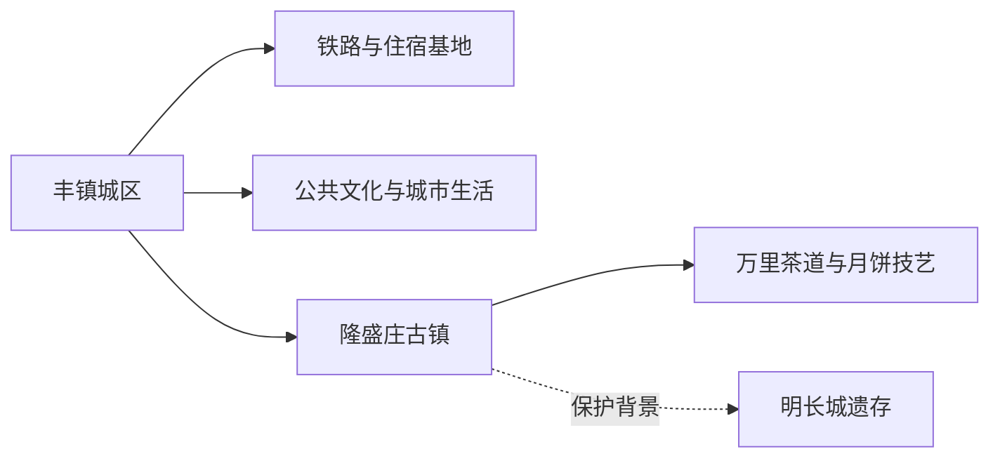
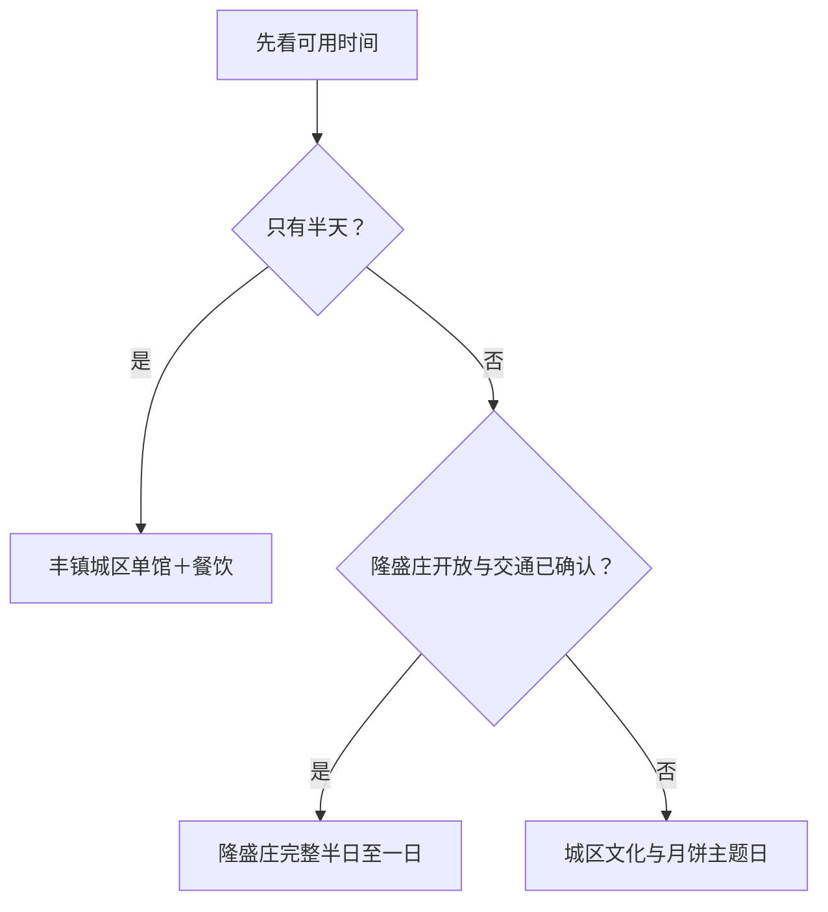

# 丰镇旅行指南

丰镇位于内蒙古南缘，是乌兰察布市代管的县级市。这里最清晰的旅行主线不是追求大量景点，而是用丰镇城区认识晋蒙交通节点和地方生活，再把隆盛庄作为万里茶道、历史城镇与月饼技艺的完整半日或一日。铁路抵离方便，适合与大同或集宁联程，但两地的住宿和景点应分别安排。

## 城市速览

| 项目 | 信息 |
|---|---|
| 旅行主线 | 丰镇城区公共文化、隆盛庄古镇、万里茶道节点、丰镇月饼与明长城保护背景 |
| 建议停留 | 半日至 1 天看城区；2 天加入隆盛庄并从容往返 |
| 住宿基地 | 丰镇城区，靠近铁路和成熟餐饮更稳妥 |
| 步行强度 | 城区低；隆盛庄中等，古街和村镇道路需分段步行 |
| 主要天气 | 大风、沙尘、雷暴、短时强降雨、寒潮与冬季结冰 |
| 联程 | 丰镇与集宁、大同分别是独立目的地，按铁路班次选择前后顺序 |
| 亲子 | 公共文化场馆、城区公园和隆盛庄短线较易组合 |
| 低体力 | 城区单馆加短公共空间；隆盛庄使用车辆近达 |
| 保护边界 | 明长城、古建和传统村落按文物保护标识与开放路线活动 |
| 无障碍 | 设施连续性需向官方确认，古街门槛、卫生间和落客点逐处核对 |

## 城市格局与游览区域

丰镇市法定代码为 `150981`。固定 GeoNames `2037391` 的别名包含北城区街道，Wikidata 上薄点实体 `Q49278712` 与其连接；法定丰镇市实体为 `Q1341574`，`P1566=2037390` 指向另一行政记录。本页以固定城市驻地点建页，以法定代码确定县级市范围。集宁是乌兰察布地级市主城，兴和县与丰镇相邻，均不与丰镇市域混写。

| 区域 | 旅行价值 | 怎么安排 |
|---|---|---|
| 丰镇城区 | 住宿、餐饮、公共文化、铁路抵离 | 半日至一日；作为两日行程基地 |
| 隆盛庄镇 | 历史文化名镇、传统村落、万里茶道节点与月饼技艺 | 完整半日至一日，先核开放和交通 |
| 明长城沿线 | 文物保护与边塞交通背景 | 从正式展示、标志牌或公开道路理解，按文保边界活动 |
| 乡村与生产空间 | 胡麻、粮食、糕点生产和普通村镇生活 | 选择有公开接待的工坊或活动，提前预约 |

## 主要景点

### 城区与公共文化

| 景点 | 所在区域 | 类型 | 核心看点 | 建议用时 | 室内/室外 | 体力 | 预约难度 | 天气敏感度 | 适合旅程 |
|---|---|---|---|---|---|---|---|---|---|
| 丰镇市公共文化场馆 | 丰镇城区 | 地方史与公共文化 | 地方历史、非遗和当期展览活动；以官方当期开放场馆为准 | 1–2.5 小时 | 室内 | 低 | 中 | 低 | A |
| 城区人民公园与公共广场 | 丰镇城区 | 城市休闲 | 市民生活、节庆花灯与短时散步 | 1–2 小时 | 室外 | 低 | 低 | 高 | B |
| 丰镇铁路城市观察线 | 车站—城区 | 城市路线节点 | 晋蒙交通、站城关系和街区生活 | 1–2 小时 | 混合 | 低至中 | 低 | 中 | 路线节点 |

### 隆盛庄与文化遗产

| 景点 | 所在区域 | 类型 | 核心看点 | 建议用时 | 室内/室外 | 体力 | 预约难度 | 天气敏感度 | 适合旅程 |
|---|---|---|---|---|---|---|---|---|---|
| 隆盛庄古镇文化旅游景区 | 隆盛庄镇 | 历史文化名镇 | 万里茶道节点、传统街镇格局、月饼文化与当期展陈 | 3–5 小时 | 混合 | 中 | 中 | 高 | A |
| 隆盛庄月饼制作技艺体验 | 隆盛庄或城区正规经营点 | 非遗与食品生产 | 胡麻油月饼的原料、工序和地方迁徙记忆 | 1–2 小时 | 室内 | 低 | 高 | 低 | B |
| 明长城保护展示点 | 隆盛庄周边公开区域 | 文物保护背景 | 边墙、关口与晋蒙交通历史 | 1–2 小时 | 室外 | 中 | 高 | 极高 | C |

隆盛庄以完整历史城镇和正式景区理解，古街、古建、月饼工坊与节庆活动无需拆成多个独立景点。明长城沿线的墙体、烽燧和农牧地交错，旅行者只使用官方说明的展示点、公共道路和开放区域。

## 美食与餐饮

| 类型 | 适合场景 | 份量 | 过敏与饮食提示 | 选择方法 |
|---|---|---|---|---|
| 丰镇月饼 | 早餐、加餐、伴手礼 | 单个偏实在，可分次吃 | 小麦、胡麻油、糖；新口味可能含乳、蛋、坚果、芝麻 | 看配料、生产日期和包装，先买少量 |
| 莜面与杂粮面食 | 正餐 | 一人份或共享笼 | 燕麦、小麦交叉接触，卤汁可能含肉和大豆 | 问清主粉、蘸汁和份量 |
| 羊肉与炖菜 | 两人以上正餐 | 多为合菜 | 羊肉、动物脂肪、乳制品和高盐 | 先问半份、小锅和计价方式 |
| 烧麦、包子与汤食 | 早餐 | 一笼或一碗 | 小麦、肉、葱和芝麻油 | 在居民区选择菜单、卫生和营业时间清楚的店 |

## 经典行程

### 一日经典路线

**路线**：丰镇城区公共文化场馆 → 城区午餐 → 人民公园或公共广场 → 月饼选购

- **串联逻辑**：用一座场馆和一段城市生活建立对丰镇的基本认识。
- **预约锚点**：场馆开馆、节庆活动和月饼工坊接待。
- **休息安排**：午间在成熟餐饮区长休，户外放在早晚。
- **时间不足时**：保留场馆与一顿本地餐。

### 两日城区与隆盛庄路线

**第 1 天**：城区文博与餐饮 
**第 2 天**：城区 → 隆盛庄古镇 → 正规月饼体验或展陈 → 返回

- **串联逻辑**：第一天认识城市，第二天完整理解万里茶道节点和食品传统。
- **预约锚点**：古镇开放、展馆、工坊体验、往返车辆和最晚返程。
- **休息安排**：隆盛庄镇区正规餐饮和游客服务点作为中场休息。
- **时间不足时**：第二天只保留古镇核心公开街区。

### 三日联程路线

**第 1 天**：丰镇城区 
**第 2 天**：隆盛庄 
**第 3 天**：按车票换到集宁或大同

- **串联逻辑**：丰镇内容先完整完成，第三天才跨城，避免把三地压成同一住宿基地。
- **预约锚点**：跨城铁路、住宿切换、行李寄存和目的地独立门票。
- **休息安排**：第三天只安排交通和新城市的轻量抵达活动。
- **时间不足时**：删去第三天，不压缩隆盛庄。

### 雨雪与大风路线

**路线**：公共文化场馆 → 室内午餐 → 正规糕点店或预约工坊 → 住宿

- **适用条件**：城区道路与场馆正常，长途公路条件不稳定时使用。
- **串联逻辑**：活动集中在城区室内，减少大风和结冰暴露。
- **预约锚点**：场馆、工坊、公交和铁路临时调整。
- **休息安排**：全程使用室内空间和短程车辆。
- **时间不足时**：只保留场馆或工坊其中一项。

### 亲子路线

**路线**：公共文化场馆 → 午餐 → 公园短段 → 月饼原料与包装观察

- **适用条件**：活动年龄、食品体验和卫生条件已确认。
- **串联逻辑**：历史、户外活动和饮食文化各选一个短项目。
- **预约锚点**：亲子活动、工坊名额、儿童座椅和卫生间。
- **休息安排**：午间回餐馆或住宿，户外不超过一小时。
- **时间不足时**：保留场馆和小份月饼体验。

### 低体力路线

**路线**：住宿 → 单一公共文化场馆 → 午间长休 → 城区公共空间近入口短段

- **适用条件**：最近落客点、门槛、座椅和卫生间已确认。
- **串联逻辑**：一天一个室内主项，户外为可随时结束的补充。
- **预约锚点**：无障碍入口、车辆等候和返程时间。
- **休息安排**：午间至少两小时，冬季优先供暖空间。
- **时间不足时**：只完成场馆。

### 隆盛庄主题路线

**路线**：丰镇城区 → 隆盛庄古镇游客服务点 → 公开街区与展陈 → 正规餐饮 → 返回

- **适用条件**：古镇开放、道路和返程车辆均已落实。
- **串联逻辑**：所有活动围绕同一历史城镇展开，不跨到其他县域远点。
- **预约锚点**：讲解、工坊、节庆交通与文保区域临时管理。
- **休息安排**：镇区固定座席、餐饮和卫生间。
- **时间不足时**：保留古镇核心街区，工坊与长城背景顺延。

## 住宿区域

| 区域 | 优点 | 取舍 | 适合人群 | 交通提示 |
|---|---|---|---|---|
| 丰镇城区 | 铁路、餐饮、补给和医疗更集中 | 去隆盛庄需车辆往返 | 首访、联程和两日旅行 | 核对到丰镇站或丰镇北站的实际接驳 |
| 车站周边 | 早晚车方便 | 与主要餐饮和场馆可能有距离 | 过夜转车、行李多 | 预订前核对完整站名和夜间上客点 |
| 隆盛庄正规接待 | 便于慢看古镇与节庆 | 房量、供暖和夜间服务有限 | 已确认活动、希望早晚体验者 | 询问消防、热水、餐食与返程车辆 |

## 市内交通

铁路是丰镇与集宁、大同联程的主要方式，车票上的丰镇站、丰镇北站需分别核对。城区适合短程公交、出租和分段步行；隆盛庄需公路往返，班线、旅游交通或正规预约车辆以当日可用服务为准。

| 场景 | 怎么走 | 出发前确认 |
|---|---|---|
| 铁路抵达 | 按票面站名进入城区住宿 | 车站、车次、末班公交与夜间出租 |
| 城区移动 | 公交加短程出租 | 场馆地址、开放和冬季步道结冰 |
| 隆盛庄往返 | 班线、正规包车或自驾 | 上下客点、返程、道路、停车与节庆管制 |
| 集宁或大同联程 | 单独购买跨城车票并切换住宿 | 行李、换乘时间和新目的地预约 |

## 不同旅行者须知

| 旅行者 | 更合适的安排 | 重点核对 |
|---|---|---|
| 亲子家庭 | 城区半日加隆盛庄半日 | 食品体验、护栏、卫生间和车辆安全 |
| 长者或低体力 | 城区单馆；隆盛庄车辆近达短线 | 门槛、座椅、供暖、落客和步行距离 |
| 文保兴趣者 | 隆盛庄完整日，使用讲解或展陈 | 古建开放、摄影、修缮和长城保护范围 |
| 冬季旅行 | 以城区为基地，隆盛庄作为道路允许时的选项 | 寒潮、大风、积雪、结冰与供暖 |

## 行前核对

| 项目 | 为什么会变 | 何时核对 | 官方入口 |
|---|---|---|---|
| 隆盛庄 | 古建修缮、节庆、展馆和交通会调整 | 出发前三日及当天 | [文化和旅游部：内蒙古·茶道重镇之旅](https://zhuanti.mct.gov.cn/xcss2024_xcygj/neimeng/detail/7213.html)及属地公告 |
| 公共文化场馆 | 开馆、临展和团体活动变化 | 前一日 | 丰镇市政府及文化部门公告 |
| 铁路 | 车次、停站和站名动态变化 | 购票时及出发前 | [中国铁路 12306](https://www.12306.cn/) |
| 天气与道路 | 大风、沙尘、积雪和结冰影响公路 | 出发前三日滚动查看 | [内蒙古自治区气象局](https://nmg.cma.gov.cn/) |
| 文物保护 | 古建、长城和传统村落按保护管理开放 | 排入路线前 | 内蒙古文物主管部门与属地公告 |

## 来源与更新记录

| 来源 | 支持内容 | 核验日期 |
|---|---|---|
| [内蒙古自治区政府：丰镇月饼](https://www.nmg.gov.cn/ztzl/yjnmg/ms/202507/t20250704_2753579.html) | 月饼原料、技艺、隆盛庄起源和非遗背景 | 2026-08-13 |
| [文化和旅游部：内蒙古·茶道重镇之旅](https://zhuanti.mct.gov.cn/xcss2024_xcygj/neimeng/detail/7213.html) | 隆盛庄的历史文化名镇、传统村落、万里茶道节点和交通关系 | 2026-08-13 |
| [内蒙古生态环境厅：隆盛庄明长城保护](https://sthjt.nmg.gov.cn/sthjdt/ztzl/zysthjbhdcznmg/bdbg/202506/t20250605_2734414.html) | 隆盛庄镇与明长城遗址保护背景 | 2026-08-13 |
| [内蒙古自治区基层政务公开入口](https://www.nmg.gov.cn/zwgk/jczwgk/) | 丰镇市与乌兰察布的行政关系、属地政府入口 | 2026-08-13 |
| [民政部行政区划代码服务](https://dmfw.mca.gov.cn/xzqh/getList?code=15&trimCode=true&maxLevel=3) | 丰镇市法定层级与代码 `150981` | 2026-08-13 |
| [GeoNames 2037391](https://www.geonames.org/2037391/fengzhen.html) | 固定驻地点名称、坐标与北城区别名 | 2026-08-13 |
| [Wikidata Q1341574](https://www.wikidata.org/wiki/Q1341574) | 法定丰镇市实体、P1566 与行政代码交叉核对 | 2026-08-13 |
| [中国铁路 12306](https://www.12306.cn/) | 实时铁路车次与站名 | 2026-08-13 |
| [内蒙古自治区气象局](https://nmg.cma.gov.cn/) | 天气与预警入口 | 2026-08-13 |

| 日期 | 更新 |
|---|---|
| 2026-08-13 | 首次完成丰镇公众旅行指南；以城区和隆盛庄为两层旅行空间，说明月饼、文保、铁路联程与标识符粒度。 |
