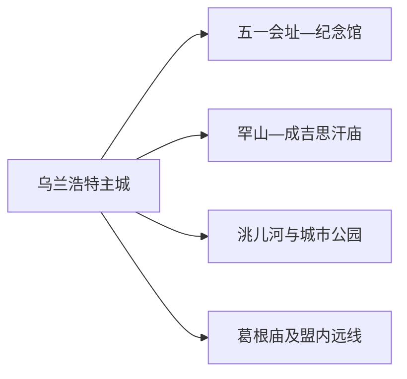
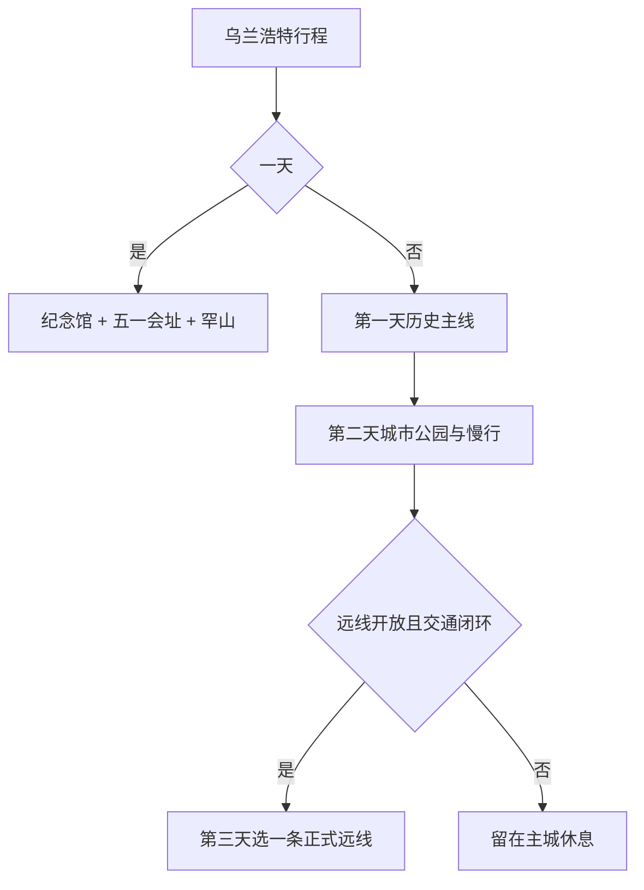

# 乌兰浩特旅行指南

乌兰浩特是兴安盟驻地，旅行主线集中在内蒙古自治政府成立史、成吉思汗庙和科尔沁城市生活。主城文博点位适合分段步行与短程乘车；葛根庙、乡村草原和盟内旗县则按远线安排。

> 建议停留：2 天；增加盟内联程可安排 3 天 
> 旅行关键词：内蒙古民族解放纪念馆、五一会址、成吉思汗庙、科尔沁、盟府城市 
> 主要体力：低至中等；山坡和远线依赖车辆 
> 最近研究：2026-08-12

## 城市速览

| 项目 | 旅行信息 |
|---|---|
| 主要旅行价值 | 以纪念馆和旧址理解内蒙古自治政府成立史，再到成吉思汗庙观察城市地标与多民族文化。 |
| 建议停留 | 1 天看文博旧址；2 天增加庙宇、公园和城市生活；3 天再选一条正式远线。 |
| 较舒适季节 | 晚春至初秋适合户外；冬季冰雪有特色，但严寒、风雪和短日照提高交通成本。 |
| 预算特点 | 主城场馆和餐饮成本可控，跨旗县车辆、冬季装备和节庆住宿是主要增量。 |
| 步行强度 | 旧址群可分段参观，成吉思汗庙所在罕山有坡度，远线使用车辆。 |
| 主要天气风险 | 大风、寒潮、暴雪、道路结冰、雷暴和草原火险。 |
| 独行旅行 | 主城适合独立安排；远郊和夜间返程先落实正规车辆。 |
| 亲子旅行 | 纪念馆、城市公园和适龄展陈可组合，纪念空间保持安静。 |
| 长者与低体力旅行 | 一天一馆一处短户外，车辆连接并预留长休。 |
| 无障碍信息 | 旧址、庙宇坡道和场馆之间的设施连续性需向官方确认。 |

### 城市身份与边界

乌兰浩特是兴安盟所辖县级市 **152201**，也是盟行政公署驻地。固定 **GeoNames 2034312** 与法定实体 **Wikidata Q1000383** 的 `P1566` 精确对应。阿尔山是独立县级市；科右前旗、扎赉特旗等旗县的景点、住宿和交通按各自属地规划。

## 城市格局与游览区域

| 区域 | 主要内容 | 游览特点 | 与其他区域的关系 |
|---|---|---|---|
| 五一会址—新桥街片区 | 内蒙古民族解放纪念馆、五一会址等旧址 | 历史主题集中，场馆开放需分别核对 | 适合作为第一天核心 |
| 罕山片区 | 成吉思汗庙、山体与城市视野 | 有坡度，宗教与纪念礼仪并存 | 可与主城午餐组合为半天 |
| 洮儿河—城市公园 | 公共绿地、河岸和居民生活 | 适合傍晚短段，水情和风力影响体验 | 作为文博日的低强度补充 |
| 葛根庙与盟内远线 | 宗教文化、乡村与草原方向 | 交通、开放和礼仪需要提前确认 | 独立一天；阿尔山不作为乌兰浩特郊区 |

## 主要景点

| 景点 | 区域 | 类型 | 主要看点 | 建议用时 | 室内外 | 体力 | 预约风险 | 天气影响 | 优先级 |
|---|---|---|---|---:|---|---|---|---|---|
| 内蒙古民族解放纪念馆 | 主城 | 历史纪念馆 | 内蒙古自治运动、民族团结与地方近现代史 | 2–3 小时 | 室内 | 低 | 中 | 低 | A |
| 五一会址及相关旧址片区 | 主城 | 革命旧址 | 内蒙古自治政府成立相关会议与办公旧址 | 2–4 小时 | 混合 | 低至中 | 高 | 中 | A |
| 成吉思汗庙 | 罕山 | 纪念建筑与文化景区 | 建筑、展陈、罕山地形与城市视野 | 2–4 小时 | 混合 | 中 | 中 | 高 | A |
| 洮儿河公共开放岸线 | 主城 | 城市公园与河岸 | 城市生活、季节景观和短段休闲 | 1–2 小时 | 室外 | 低 | 低 | 高 | B |
| 兴安盟博物馆 | 主城 | 综合博物馆 | 地区历史、非遗、临展与多民族文化 | 1.5–3 小时 | 室内 | 低 | 中 | 低 | B |
| 葛根庙正式开放区域 | 城郊 | 宗教建筑与文化 | 藏传佛教建筑、礼仪和当期开放展陈 | 3–5 小时 | 混合 | 中 | 高 | 高 | C |

宗教场所按现场礼仪参观；盟内草场、农牧场、防火道路和边远村屯优先通过正式线路了解。纪念馆与旧址各有机构边界，不把相邻建筑重复计为多个景点。

## 美食与餐饮

| 菜品或餐饮类型 | 常见区域 | 一个人用餐与常见份量 | 风味、过敏原与饮食限制 | 排队风险与替代方法 |
|---|---|---|---|---|
| 蒙餐奶茶、奶食 | 主城 | 奶茶可单点，奶食适合分享 | 含乳，咸甜配方不同 | 先问小份和是否加炒米 |
| 手把肉、羊肉菜 | 主城与正规蒙餐馆 | 多人更合适 | 羊肉、乳制品和盐分需确认 | 独食选小份羊汤或套餐 |
| 锅茶、炒米与果条 | 主城 | 适合早餐或加餐 | 常含乳、小麦和油脂 | 选择配料明示的同类店 |
| 东北家常菜与面食 | 主城生活区 | 单人可点小炒或面食 | 大豆、小麦、花生和肉汤常见 | 社区店可替代热门餐厅 |

## 经典行程

### 一日经典路线

**路线**：内蒙古民族解放纪念馆 → 五一会址片区 → 午餐 → 成吉思汗庙 → 主城晚餐

- **串联逻辑**：先看近现代史，再用罕山地标补充城市文化空间。
- **预约锚点**：纪念馆、旧址和庙宇开放。
- **休息安排**：午餐后完整坐休，再前往罕山。
- **时间不足时**：保留纪念馆与成吉思汗庙，旧址只选一处。

### 两日城市路线

**第 1 天**：纪念馆与旧址  
**第 2 天**：成吉思汗庙 → 主城午餐 → 兴安盟博物馆或洮儿河短段

- **串联逻辑**：历史展陈和城市生活分日，减少信息过载。
- **预约锚点**：第二天场馆临展与宗教活动安排。
- **休息安排**：罕山后回主城午休。
- **时间不足时**：第二天下午只保留室内场馆或河岸其一。

### 三日深度路线

**第 1 天**：历史主线  
**第 2 天**：罕山与城市生活  
**第 3 天**：葛根庙等一条正式远线

- **串联逻辑**：先理解盟府城市，再进入宗教或乡村远线。
- **预约锚点**：第三天接待、礼仪、车辆与返程。
- **休息安排**：远线午餐与休息点提前确定。
- **时间不足时**：第三天整段删除。

### 雨雪天路线

**路线**：民族解放纪念馆 → 室内午餐 → 兴安盟博物馆

- **适用条件**：普通降雪或降雨且道路正常；暴雪、结冰和大风预警时缩短到住宿周边。
- **串联逻辑**：全程主城短程车辆连接，减少坡道与远郊道路。
- **预约锚点**：场馆开放和交通运行。
- **休息安排**：午后只安排一个场馆。
- **时间不足时**：保留纪念馆。

### 亲子或低体力路线

**亲子路线**：纪念馆适龄展陈 → 午餐 → 城市公园短段  
**低体力路线**：车辆到纪念馆最近入口 → 核心展厅 → 午休 → 成吉思汗庙平缓开放段

- **减负方式**：亲子控制纪念内容时长；低体力路线减少罕山上坡和旧址步行。
- **预约锚点**：儿童讲解、最近落客点、电梯、坡道和座椅。
- **休息安排**：每个主题后安排室内坐休。
- **时间不足时**：两线均只保留纪念馆。

### 远郊一日路线

**路线**：主城 → 葛根庙正式入口 → 礼仪参观 → 附近成熟服务点午餐 → 返回

- **适用条件**：接待、道路、天气和返程已确认。
- **串联逻辑**：围绕同一宗教文化目的地成日，不横向串旗县景点。
- **预约锚点**：开放、活动回避时段、车辆与最晚返程。
- **休息安排**：在明确营业的服务点完成午休。
- **时间不足时**：远线整段删除，改看主城场馆。

## 住宿区域

| 区域 | 优点 | 代价 | 适合人群 | 交通提示 |
|---|---|---|---|---|
| 主城中心 | 餐饮、场馆和叫车集中 | 节庆时可能拥挤 | 首访、独行、文博主题 | 比较到乌兰浩特站和各旧址的车程 |
| 乌兰浩特站周边 | 铁路抵离方便 | 夜间活动较少 | 早晚列车 | 确认站前交通与行李寄存 |
| 罕山方向 | 靠近成吉思汗庙 | 与其他场馆仍需乘车 | 休闲、慢游 | 看实际入口而非地图直线距离 |

## 市内交通

乌兰浩特站和乌兰浩特义勒力特机场承担主要到发。主城使用公交、出租和网约车；盟内远线比较铁路、公路客运、正规包车或自驾，并按实际过夜地拆分。

| 场景 | 建议与取舍 | 行前需要重查的内容 |
|---|---|---|
| 铁路抵达 | 适合衔接主城住宿与文博 | 车次、站前交通、末班与冬季延误 |
| 航空抵达 | 按航班和住宿位置选择正规接驳 | 航班、机场巴士、出租车与除冰延误 |
| 主城跨片区 | 公交与车辆连接旧址、罕山和河岸 | 线路、道路施工、活动管制和上客点 |
| 盟内远线 | 每天只选一个方向 | 客运、道路、火险、通信和返程 |

## 不同旅行者须知

- **独行旅行**：主城线路成熟，远线先锁返程和住宿前台时间。
- **亲子旅行**：选择适龄展陈和短户外，纪念场所保持安静。
- **长者与低体力旅行**：车辆直达、精选展厅和罕山短段更从容。
- **无障碍需求**：确认旧址门槛、庙宇坡道、场馆电梯与车辆落客。
- **冬季旅行**：采用短户外、长室内节奏，预留航班铁路退改。

## 行前核对

| 核对事项 | 建议时间 | 官方入口 |
|---|---|---|
| 纪念馆、旧址与庙宇开放 | 排路线前及前一日 | [兴安盟行政公署](https://www.xam.gov.cn/) |
| 铁路、机场与市内交通 | 购票时、前一日及当天 | [12306](https://www.12306.cn/) · [乌兰浩特机场](https://www.caac.gov.cn/GYMH/MHGK/MYJC/) |
| 寒潮、暴雪、火险和道路 | 出发前三日及当天 | [内蒙古自治区气象局](https://nmg.cma.gov.cn/) |
| 宗教与节庆活动 | 排入路线前 | 属地管理方正式公告 |

## 来源与更新记录

### 主要来源

| 来源 | 支持内容 | 核验日期 |
|---|---|---|
| [民政部行政区划代码查询](https://dmfw.mca.gov.cn/) | 乌兰浩特市 152201 与兴安盟关系 | 2026-08-12 |
| [Wikidata Q1000383](https://www.wikidata.org/wiki/Q1000383) | 法定实体与 GeoNames 精确映射 | 2026-08-12 |
| [GeoNames 2034312](https://www.geonames.org/2034312/ulanhot.html) | 固定乌兰浩特城市点 | 2026-08-12 |
| [兴安盟行政公署](https://www.xam.gov.cn/) | 城市、文旅、交通与动态公告入口 | 2026-08-12 |
| [国家文物局博物馆名录资料](https://www.ncha.gov.cn/) | 民族解放纪念馆及相关旧址机构线索 | 2026-08-12 |
| [中国民航局运输机场名录](https://www.caac.gov.cn/GYMH/MHGK/MYJC/) | 乌兰浩特机场交通门户 | 2026-08-12 |

### 更新记录

| 日期 | 更新内容 |
|---|---|
| 2026-08-12 | 首次整理乌兰浩特实体、自治政府成立史—罕山主线、盟内边界、路线、住宿与交通。 |
