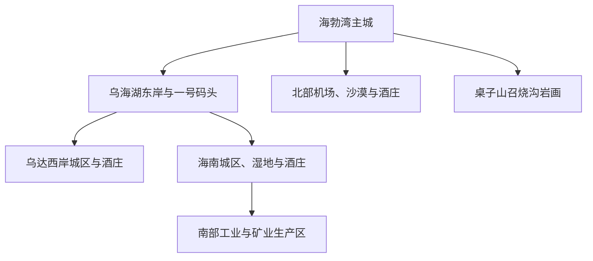
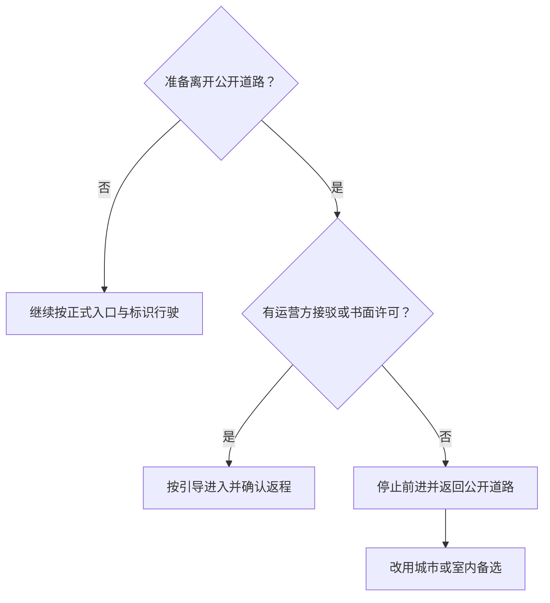

# 乌海旅行指南

乌海位于内蒙古西部，黄河海勃湾水利枢纽形成的乌海湖穿过城市，东岸是海勃湾主城与桌子山，西岸衔接乌兰布和沙漠，南部则展开乌达、海南两片城区、葡萄园和工业区。这里适合把湖岸、书法、岩画与沙漠葡萄酒串成一座紧凑地级市的旅行；但三区并非连续步行范围，水库岸线、矿山和工业生产空间也不能因靠近城市就自由进入。

> 建议停留：2–3 天；岩画、南部酒庄或沙漠项目各需独立半天至一天 
> 旅行关键词：乌海湖、书法城、桌子山岩画、沙水相连、沙漠葡萄酒、资源型城市转型 
> 主要体力：主城低至中等；岩画、山地和沙漠为中等至较高，另有跨区长车程 
> 最近研究：2026-08-12

## 城市速览

| 项目 | 旅行信息 |
|---|---|
| 主要旅行价值 | 在海勃湾主城认识乌海的移民城市、书法与工业历史，再到乌海湖正式开放岸线看沙水相接；按兴趣另选召烧沟岩画、北部沙漠或南部酒庄与工业遗产中的一个方向 |
| 建议停留 | 1 天可完成海勃湾文博与一号码头岸线；2 天可增加岩画或沙漠；3 天才适合把乌达、海南酒庄与工业文化分片安排。不同远点不宜压成一日环线 |
| 较舒适季节 | 春末和秋季通常更适合湖岸、岩画与酒庄，但大风沙尘、昼夜温差和火险仍需核对；夏季日照强、高温且可能有雷电暴雨，冬季严寒、结冰和大风限制水上及户外项目 |
| 预算特点 | 主城公共文化场馆和开放岸线为低至中等；跨三区车辆、岩画讲解、沙漠或水上项目、酒庄预约与接驳是主要增量成本 |
| 步行强度 | 文博与码头核心区可低至中等完成；召烧沟有坡面与不平整地表，沙地松软，山地与湿地游径受季节影响，均不适合用城市步行鞋和体力估算 |
| 主要天气风险 | 大风、沙尘、雷电、冰雹、短时强降雨、高温、严寒、暴雪、道路结冰及能见度下降；天气预警可使景区关闭、船艇停航或跨区交通延误 |
| 独行旅行 | 海勃湾住宿、点餐和城市交通较方便；岩画、沙漠、湿地与南部远线需先锁定往返，不单独进入矿区、荒漠生产路、库岸无管理段或无通信保障区域 |
| 亲子旅行 | 市博物馆、科技馆、书法艺术馆和正式码头岸线易组合；沙地车辆、水上项目、酒庄品鉴与长车程需分别核对年龄、身高、陪同、救生和饮酒限制 |
| 长者与低体力旅行 | 以海勃湾一日一馆、车辆直达一号码头最易减负；岩画、沙丘、湿地长栈道和三区当天往返都应缩短，必要时只保留游客中心或展馆 |
| 无障碍信息 | 新建车站、公共场馆和码头服务区可优先询问，但公开资料不足以证明下客点、岸线、船艇、岩画坡面、酒庄与沙漠项目全程连续可达；设施连续性需向官方确认 |

乌海市法定行政区划代码为 **150300**，是内蒙古自治区地级市，现辖海勃湾区、乌达区和海南区三个市辖区，没有下辖的独立县级市。海勃湾是行政、铁路、航空、住宿和文博核心；乌达位于黄河西岸偏南，海南位于市域南部，两者都有独立城区和产业空间，不是海勃湾可步行抵达的“街区”。

## 城市格局与游览区域

乌海南北狭长，黄河与乌海湖把三片城区、山地、湿地、沙地和葡萄产区分隔开。短住宜以海勃湾为基地，先完成文博与正式湖岸；乌达和海南各自安排半天以上，并为重载交通、道路施工和返程留余量。

| 区域 | 主要内容 | 游览特点 | 与其他区域的关系 |
|---|---|---|---|
| 海勃湾主城与滨河区 | 乌海市博物馆、当代中国书法艺术馆、科技馆、成熟商圈 | 住宿、餐饮与公共交通最集中，适合初到、雨雪和低体力旅行 | 与一号码头可组成一日；到岩画、机场北部或南部两区仍需车辆 |
| 乌海湖东岸正式开放区 | 乌海湖一号码头、公开滨水步道、当期开放船艇与活动区 | 湖面、水位、风力、清淤施工和赛事可改变可达岸线；只认入口、围栏与公告 | 与海勃湾主城最易组合；过桥去西岸或南部仍要另计车程 |
| 海勃湾北部 | 乌海机场、金沙湾正式景区、汉森与云飞等预约型酒庄 | 沙漠、农业和航空空间并存，项目运营和道路条件差异大 | 可作独立半日或一日，不把机场净空区、沙障和生产便道当游线 |
| 桌子山—召烧沟 | 召烧沟岩画遗址保护大厅、桌子山景观 | 文物原址、坡面和山沟环境要求按开放范围参观；其他岩画点不因有坐标就开放 | 从海勃湾专车往返最稳妥，不顺路穿越矿山或按导航找野外岩画 |
| 乌达城区与乌兰淖尔方向 | 乌达公共文化、吉奥尼等预约型酒庄、乌海湖西南岸 | 城区、酒庄、生态修复地和矿区交错，需逐点确认经营与道路 | 与海勃湾隔湖，不适合步行串联；可与同区酒庄组成独立半日 |
| 海南城区与巴音陶亥方向 | 小三线军工文化、龙游湾湿地正式利用区、阳光田宇酒庄、黄河乡村接待点 | 点位分散，工业遗产、湿地、酒庄和农业各有开放边界 | 适合住海南或包车一日；乌海南站可作为抵离点，但不是各景点公共接驳保证 |
| 工业、矿山、港区与库区作业空间 | 露天矿、井工矿、排土场、采空治理区、工业园、铁路专用线、码头作业区、清淤工区 | 有重型车辆、危化品、滑坡塌陷、扬尘和水上作业风险 | 只有运营主体明确组织的预约参访可进入；普通导航、观景欲望或生态修复外观都不构成准入 |

乌海湖是水利枢纽形成的库区，也承担航运监管、生态保护、饮用水源与工程作业功能。“湖边”不等于连续开放景区：一号码头等正式接待岸线可用于观景，施工围挡、港口泊位、堤坝设施、饮用水源地、滩涂与对岸荒漠无管理段不进入；船艇只选检验合格、按公告运营的项目。冬季更不能凭冰面外观判断承载力，不离开正式运营的冰雪项目范围。

桌子山岩画是分布式文物，旅行参观以召烧沟岩画遗址当期开放区域为核心。围栏外的苦菜沟、雀儿沟、苏白音沟等岩画点，以及长城、洞穴和化石坐标，不应按旧攻略自行寻找；不触摸、拓印、泼水、攀爬或用无人机贴近文物。矿山生态修复地也不是公园的同义词，排土场、采坑、矸石场和采空区可能仍有沉陷、滑坡与作业风险。

## 主要景点

优先级用于安排时间，不代表绝对排名：**A** 为首访核心，**B** 为按兴趣补充，**C** 为远郊、季节性或通常需要独立半天以上的目的地。码头入口、车站和公开短步道可标记为“路线节点”，不计入城市景点完成率。同一景区及其内部展馆、船艇或体验项目只作为一个项目记录。

### 海勃湾文博与湖岸

| 景点 | 区域 | 类型 | 主要看点 | 建议用时 | 室内外 | 体力 | 预约风险 | 天气影响 | 优先级 |
|---|---|---|---|---:|---|---|---|---|---|
| 当代中国书法艺术馆 | 海勃湾滨河区 | 艺术馆与书法主题建筑 | 馆藏和临展、书法城脉络及以岩画符号融入的建筑空间 | 2–4 小时 | 室内 | 低至中 | 中 | 低 | A |
| 乌海市博物馆 | 海勃湾主城 | 地方综合博物馆 | 乌海地质、化石、岩画拓片、历史与移民工业城市线索 | 2–4 小时 | 室内 | 低至中 | 中 | 低 | A |
| 乌海湖休闲度假旅游区正式开放岸线 | 海勃湾乌海湖东岸 | 库区湖岸与城市景观 | 一号码头、湖面与城市—沙漠对景；船艇、赛事和季节活动以当日公告为准 | 2–4 小时 | 混合 | 低至中 | 中至高 | 很高 | A |
| 乌海市科学技术馆 | 海勃湾滨河区 | 科普场馆 | 互动科普与亲子室内活动，当期展厅和团队活动需重查 | 2–3 小时 | 室内 | 低 | 中 | 低 | B |
| 乌海煤炭博物馆 | 海勃湾主城 | 工业专题馆 | 城市因煤而建的历史、生产工具与资源型城市转型背景 | 1–2 小时 | 室内 | 低 | 中至高 | 低 | B |

乌海湖可见水面不等于所有岸线都可进入，基础入区也不代表船艇、水上运动、露营或跨湖沙漠项目同时开放。遇大风、雷电、低能见度、水位变化、清淤施工或水上管制时，只保留远离水边的公共空间，必要时整段取消。

### 岩画、山地与沙漠

| 景点 | 区域 | 类型 | 主要看点 | 建议用时 | 室内外 | 体力 | 预约风险 | 天气影响 | 优先级 |
|---|---|---|---|---:|---|---|---|---|---|
| 召烧沟岩画遗址博物馆（当期开放区） | 桌子山召烧沟 | 原址文物保护与遗址博物馆 | 桌子山岩画代表性人面像、太阳神题材和原址保护方式 | 3–5 小时，另计往返 | 混合 | 中至高 | 高 | 很高 | C |
| 金沙湾生态旅游区正式运营范围 | 海勃湾北部 | 沙漠景区 | 指定沙丘游线、荒漠景观和当期运营的沙地项目 | 4–7 小时 | 室外 | 中至高 | 高 | 很高 | C |
| 甘德尔山当期开放游览区 | 海勃湾近郊 | 山地景观 | 山体、城市与乌海湖关系；仅使用正式入口、索道或开放步道 | 3–6 小时 | 室外 | 中至高 | 高 | 很高 | C |

岩画日与沙漠日都需要独立天气窗口。召烧沟只按博物馆确认的入口、讲解与开放区域参观；金沙湾只使用景区车辆和指定游线；甘德尔山不按施工路、检修路或山脊轨迹自行穿越。沙漠越野、骑乘、滑沙、索道及露营均为独立运营项目，需核对资质、保险、年龄、身体限制与停运阈值。

### 乌达、海南与酒庄主题

| 景点 | 区域 | 类型 | 主要看点 | 建议用时 | 室内外 | 体力 | 预约风险 | 天气影响 | 优先级 |
|---|---|---|---|---:|---|---|---|---|---|
| 阳光田宇国际酒庄 | 海南区巴音陶亥镇方向 | 葡萄园与酒庄景区 | 沙漠葡萄种植、酿造与当期开放的参观品鉴项目 | 3–5 小时 | 混合 | 低至中 | 高 | 中至高 | C |
| 汉森、吉奥尼或云飞酒庄中的一处 | 海勃湾北部或乌达方向 | 预约型酒庄 | 不同产区、酿造与葡萄酒文化体验；仅选确认对公众开放的一家 | 2–4 小时，另计往返 | 混合 | 低至中 | 高 | 中 | C |
| 内蒙古小三线军工文化纪念馆 | 海南区 | 工业遗产与纪念馆 | 三线建设、军工生产与乌海移民工业史 | 2–4 小时 | 混合 | 低至中 | 高 | 中 | C |
| 龙游湾国家湿地公园正式利用区 | 海南区沿黄方向 | 湿地公园与科普空间 | 黄河湿地、观鸟和生态修复，只进入合理利用区及开放游径 | 2–4 小时 | 室外 | 中 | 中至高 | 很高 | C |

酒庄是农业与生产经营场所，不把节庆路线、A级身份或过往开放视为每日散客接待保证。预约时确认参观时段、采摘季、是否进入生产车间、品鉴内容、儿童政策和返程；饮酒后不驾车。小三线纪念馆与实际工业园区完全不同：纪念馆可按公告参观，化工园、低碳产业园、厂区、仓储区和铁路专用线只接受运营主体明确组织的合规参访。

## 美食与餐饮

海勃湾的成熟商业区最适合日常点餐，乌达和海南远线则应把正餐放在城区或预约酒庄，不依赖景区外围临时摊点。乌海饮食融合蒙餐、西北面食、黄河鱼和移民城市家常菜，葡萄与葡萄酒辨识度高；鱼类应选择来源、称重和计价清楚的正规餐厅，不自行捕捞或购买来源不明的野生鱼。

| 菜品或餐饮类型 | 常见区域 | 一个人用餐与常见份量 | 风味、过敏原与饮食限制 | 排队风险与替代方法 |
|---|---|---|---|---|
| 黄河鱼 | 海勃湾成熟餐饮区、沿黄正规餐厅 | 常按整条或重量计价，单人先问小份、品种和加工前重量 | 淡水鱼刺多，常用酱油、面粉、辣椒；对鱼类、麸质或大豆过敏者逐项确认 | 节庆和周末可能等位；选择明码标价、可复秤的同类店，不在库岸临时点购买 |
| 爆炒羊羔肉 | 三区蒙餐或西北菜馆 | 多为共享份量，单人问半份并配主食 | 羊肉、油脂和辣椒较重；孜然、芝麻及共锅接触需询问 | 晚餐高峰较忙；用清炖羊肉或小份烤肉替代 |
| 手把肉与涮羊肉 | 海勃湾及三区蒙餐馆 | 通常按斤或套餐，适合多人；单人先确认最低份量 | 牛羊肉与动物油脂明显，蘸料可能含芝麻、花生、乳制品和麸质 | 热门店晚间等位；选择菜单计价清楚的同类型餐馆 |
| 咸奶茶与奶食品 | 蒙餐馆、早餐店 | 奶茶可单点，奶食品拼盘通常适合分享 | 含乳制品；炒米可能与含麸质食品共用加工环境 | 早餐高峰短暂；点小壶或单杯，不必购买大套餐 |
| 焖面、稍麦与西北面食 | 海勃湾、乌达、海南城区 | 单人容易点，焖面可能份量偏大 | 主要含麸质，馅料、汤底可能含牛羊肉和较多油盐 | 午餐高峰可换邻近家常面馆，避免为单店跨区 |
| 乌海鲜食葡萄 | 葡萄销售街区、正规果品店、采摘园 | 适合按小份购买；采摘按经营者规则 | 果糖较高，清洗后食用；酒庄葡萄不等于允许游客自行采摘 | 产季和节庆需求高；看产地、价格和计量标识，非产季不强求 |
| 乌海葡萄酒 | 预约酒庄、正规餐厅和零售点 | 品鉴通常多款少量，购买整瓶注意携带与保存 | 含酒精和亚硫酸盐；未成年人、孕期、驾驶者及不饮酒者应选择无酒精参观 | 节庆品鉴需预约；以葡萄汁、葡萄园或酿造讲解替代饮酒 |

## 经典行程

以下路线先锁定最难替代的场馆、遗址或运营项目，再按天气和交通删除整段。乌海市域虽小，三区、湖岸与山地仍需车辆连接；矿区、工业园和库区作业道路不作为捷径。

### 一日经典路线

**路线**：乌海市博物馆 → 海勃湾午餐与长休 → 当代中国书法艺术馆 → 乌海湖一号码头正式开放岸线 → 海勃湾晚餐

- **适用条件**：适合首次到访、只住海勃湾且希望以低至中等体力认识城市者；不适合把跨湖、岩画、沙漠或南部两区同时塞入一天。
- **串联逻辑**：两馆用于建立岩画、工业移民史和书法城框架，傍晚只到同侧正式湖岸看城市与沙水关系，避免跨区和远郊。
- **预约锚点**：先确认两馆闭馆、临展和预约；一号码头的岸线、船艇及活动分别核对，船艇不是必选项。
- **休息安排**：午餐和长休放在海勃湾成熟商业区，湖岸只走靠近入口、卫生间和室内服务点的短段。
- **时间不足时**：先删船艇和湖岸延长段，再缩短非核心临展；仍不足时只留市博物馆与书法艺术馆。

### 两日城市路线

**第 1 天**：乌海市博物馆 → 海勃湾午休 → 当代中国书法艺术馆 → 乌海湖一号码头岸线 
**第 2 天**：海勃湾早出发 → 召烧沟岩画遗址博物馆当期开放区 → 服务区或主城午餐长休 → 乌海煤炭博物馆或直接返回住宿

- **适用条件**：适合首次到访、能承受半日山地坡面并愿意为岩画单独安排车辆者；召烧沟未确认开放、同行者行动不便或天气预警时，第二天应改为主城室内线。
- **串联逻辑**：第一天认识城市与湖，第二天用独立车辆日把馆内岩画线索接到原址，返城后仅保留可取消的室内工业史补充。
- **预约锚点**：召烧沟开放范围、讲解和往返车辆优先级最高；两座主城馆舍分别核对闭馆与最晚入场。
- **休息安排**：岩画日不在遗址坡面或山沟野餐，午餐回正式服务区或海勃湾；返城后至少留一次完整坐席休息。
- **时间不足时**：先删煤炭博物馆；召烧沟未确认开放或天气不稳时整段改为科技馆，不寻找其他野外岩画替代。

### 三日深度路线

**第 1 天**：乌海市博物馆 → 当代中国书法艺术馆 → 一号码头岸线 
**第 2 天**：召烧沟岩画遗址博物馆 → 海勃湾长休 → 主城工业史场馆 
**第 3 天**：乌海南站或海南城区出发 → 内蒙古小三线军工文化纪念馆 → 海南城区午餐 → 阳光田宇国际酒庄预约参观 → 返回海南或海勃湾

- **适用条件**：适合有三个完整白天、愿意承担两次远点车辆日并对岩画、工业史和葡萄酒文化都有兴趣者；低体力、亲子或不饮酒同行者应缩短坡面与品鉴环节。
- **串联逻辑**：三天分别承担城市湖岸、史前岩画和南部工业—葡萄转型主题；第三天只在海南方向组织，不再绕乌达或北部沙漠。
- **预约锚点**：召烧沟、小三线纪念馆和酒庄都需逐项确认，第三天还要锁定车辆、酒后代驾或不饮酒方案及返程。
- **休息安排**：每天午间安排完整室内休息；酒庄日先吃正餐再品鉴，未成年人和不饮酒者以葡萄园、酿造讲解替代。
- **时间不足时**：先删每天的补充场馆；三天压为两天时整段删除海南方向，不把酒庄临时塞进岩画日。

### 雨天路线

**路线**：乌海市博物馆 → 室内午餐与长休 → 当代中国书法艺术馆 → 直接返回住宿

- **适用条件**：适用于普通降雨、沙尘或不适合湖岸步行的天气；暴雨、雷电大风、暴雪和道路结冰预警下不跨馆赶路，必要时只保留住宿附近一馆。
- **串联逻辑**：只串联海勃湾两座室内馆，馆际用城市道路短接，不以临时增加商场、跨区场馆或湖岸来填满时间。
- **预约锚点**：核对两馆当日开放、临时闭馆和最晚入场，预警升级时以交通与场馆公告为准。
- **休息安排**：馆际移动用正规出租车或网约车，午餐选择可长时间停留的室内地点，不到树下、临水岸线或地下低洼空间等待。
- **时间不足时**：先删书法艺术馆；若交通受阻则两馆都删，不以已预约为由冒险出行。

### 亲子或低体力路线

**亲子路线**：乌海市科学技术馆 → 室内午餐与休息 → 乌海市博物馆亲子友好展区 → 一号码头入口附近短暂停留或返回住宿 
**低体力路线**：车辆直达当代中国书法艺术馆无障碍入口 → 馆内核心展厅与坐席休息 → 就近午餐 → 车辆到一号码头最近下客点 → 返回住宿

- **适用与减负**：亲子线适合学龄儿童和希望用互动科普理解城市的家庭，不加沙漠、水上和跨区长车程，并提前确认推车、互动设施与儿童预约；低体力线适合需要轮椅、频繁坐席或减少步行者，只保留一馆一岸，询问电梯、轮椅、卫生间和最近下客点，不走完整滨水步道。
- **串联逻辑**：亲子线以室内互动和地方史为主、岸线为可删尾段；低体力线用车辆把无障碍入口、坐席和最近下客点直接连接，不追求景点数量。
- **预约锚点**：亲子线确认科技馆与市博物馆开放；低体力线以书法艺术馆无障碍入口和一号码头岸线开放为锚点。
- **休息安排**：两条路线午餐前后都安排完整坐席休息；湖边大风、高温或严寒时直接取消岸线。
- **时间不足时**：亲子线先删一号码头，再删市博物馆非核心展区；低体力线直接删湖岸，不压缩上下车和休息时间。

### 远郊一日路线

远线以下列三个方向三选一。每条都以正式入口、可靠往返和当期开放为前提，不穿越矿区、工业园、库区工地或荒漠生产路。

#### 桌子山岩画线

**路线**：海勃湾早出发 → 召烧沟岩画遗址博物馆 → 游客服务点休息 → 返回海勃湾

- **适用条件**：适合能承受坡面、不平整地表与半日户外者；大风、雷暴、强降雨、积雪结冰或遗址维护时取消。
- **串联逻辑**：全日只服务一个文保原址，从正式入口原路返回；不串联其他岩画坐标、矿山观景点或山沟穿越。
- **预约锚点**：遗址开放区、预约、讲解、摄影规则及往返车辆；不以第三方票务页面代替馆方确认。
- **休息安排**：只在游客服务区和正式休息点停留，不在文物坡面、沟口河道或矿运道路停车。
- **时间不足时**：只保留保护大厅和核心讲解；返程余量不足则整段取消，不改找其他岩画坐标。

#### 北部沙漠与酒庄线

**路线**：海勃湾早出发 → 金沙湾正式游客入口 → 景区短游线 → 午餐与长休 → 已预约的汉森或云飞酒庄 → 返回海勃湾

- **适用条件**：适合天气稳定、能承受软沙和日晒者；酒庄必须书面或电话确认散客接待，饮酒者不得驾车。
- **串联逻辑**：把海勃湾北部同方向的一个正式沙漠入口与一家预约酒庄连接，先完成受风沙影响更大的户外段，再进入室内讲解；不跨去乌达或海南。
- **预约锚点**：金沙湾开园、内部项目、车辆和保险，以及一家酒庄的参观时段与品鉴内容。
- **休息安排**：午餐和长休放在景区服务区或海勃湾北部正规经营点，酒庄只在接待范围内活动。
- **时间不足时**：先删酒庄，再缩短沙地项目；大风沙尘、雷电或景区停运时整段取消，不驶入无管理沙丘。

#### 海南工业文化与酒庄线

**路线**：海南城区或乌海南站出发 → 内蒙古小三线军工文化纪念馆 → 海南城区午餐 → 阳光田宇国际酒庄预约参观 → 返回海南或海勃湾

- **适用条件**：适合工业史与葡萄酒文化兴趣者；不适合作为临时从海勃湾午后出发的赶场路线。
- **串联逻辑**：只串联海南区内的工业记忆与葡萄产业转型主题，以海南城区承担午餐和休息；不穿工业园去乌达，也不把矿区外观当作参观点。
- **预约锚点**：纪念馆开放、酒庄接待、车辆、酒后代驾或不饮酒安排，以及返回住宿的最晚可接受时间。
- **休息安排**：午餐放在海南城区，酒庄参观按接待人员引导，不进入生产线、仓储或葡萄园未开放区。
- **时间不足时**：先删酒庄品鉴，只保留预约参观；返程不稳时整段改住海南，不走工业园和重载公路捷径。

## 住宿区域

| 区域 | 优点 | 缺点 | 适合人群 | 交通特点 |
|---|---|---|---|---|
| 海勃湾主城成熟商圈 | 餐饮、购物、医院和叫车选择最多，适合晚到与连续住宿 | 到新乌海站、机场、岩画和南部两区仍需车辆 | 初访、独行、短住、雨雪季与以文博为主者 | 可衔接乌海东站和主城公交；订房时按实际到达车站核对距离 |
| 滨河区与乌海湖东岸 | 靠近书法艺术馆、科技馆、一号码头和滨水公共空间 | 大风时户外价值下降，节庆赛事可能带来噪声与交通管制 | 亲子、低体力、湖景与公共文化旅行 | 到新乌海站相对方便，但不同湖岸入口仍不宜全靠步行 |
| 机场与海勃湾北部 | 便于早晚航班、金沙湾和北部酒庄 | 餐饮密度、夜间交通和无车移动弱于主城 | 航空抵离、沙漠或北部酒庄为主者 | 预先确认机场接送、景区车辆与酒庄接驳，不沿机场路徒步 |
| 乌达城区 | 便于乌达酒庄、西岸与本区公共服务 | 到海勃湾文博、机场和海南方向都需跨区，周边矿业交通复杂 | 乌达专题、商务或自驾者 | 只走公开城市道路，不把矿区路、堤坝路和工业道路当捷径 |
| 海南城区或乌海南站周边 | 便于小三线、南部酒庄、湿地和高铁抵离 | 远离海勃湾主城夜间活动，具体景点仍需二次接驳 | 海南一日线、次日高铁、长者避免长折返者 | 核对乌海南站实际车次、站前交通和酒店接送；不因“海南”名称误认海南省 |
| 正规酒庄、乡村或景区住宿 | 可减少项目日往返，适合慢节奏体验 | 营业季、消防、供暖、热水、通信和退改差异大 | 自驾、葡萄季或主题住宿者 | 付款前确认合法经营、夜间到达、恶劣天气退改和不饮酒驾驶方案 |

不建议以矿区、工业园、港区或清淤工地附近的非正规住宿换取“近景点”。订酒庄、营地或乡村住宿时，经营状态和交通比直线距离更重要；冬季还需确认供暖、热水和积雪道路。

## 市内交通

2025 年 12 月 23 日包银高铁全线贯通，乌海站和乌海南站进入高铁网络；原城区老站已更名为乌海东站。三站名称相近但位置和服务范围不同，购票与接送必须按票面站名确认。乌海机场位于海勃湾北部，三区日常移动依靠公交、出租车、网约车和自驾，没有投入运营的城市轨道交通。

| 场景 | 建议与取舍 | 行前需要重查的内容 |
|---|---|---|
| 从乌海站抵达 | 新乌海站适合高铁抵达海勃湾，带行李、晚到或低体力者优先正规出租车或网约车 | 票面站名、进出站口、公交与出租车上客区、道路施工和末班交通 |
| 从乌海东站抵达 | 位于老城建成区，接海勃湾成熟商圈较方便；不要与新乌海站混淆 | 普速或动车实际停靠、站名、接站点和公交调整 |
| 从乌海南站抵达 | 适合海南区及南部线路，但景点仍分散，不是下车即到 | 实际停靠车次、站前公交、出租车供给、酒店接送与返程 |
| 从乌海机场抵达 | 距海勃湾北部较近，白天可查公交，多人、晚到或沙尘严寒时优先正规车辆 | 航季时刻、天气延误、机场公交、出租车上客点和酒店接送 |
| 海勃湾主城与湖岸 | 公交适合预算旅行，馆际与码头移动可用出租车；湖岸入口之间不一定连续步行 | 线路调整、活动管制、码头入口、岸线围挡与共享交通规则 |
| 海勃湾—乌达—海南跨区 | 先按一天一个方向规划，再比较公交、客运、自驾和合规包车 | 末班、道路施工、重载货运、桥梁管制、返程叫车与恶劣天气 |
| 山地、沙漠、湿地和酒庄 | 优先运营方接驳或合规车辆，不凭导航驶入荒漠、葡萄园、山沟和生产便道 | 入口、停车、司机资质、项目保险、风力火险、道路和取消政策 |
| 自驾经过矿区与工业区 | 只走国省干线和公开城市道路，与重型车辆保持安全距离；不在路肩停车拍摄 | 矿运交通、危化品车辆、能见度、施工、加油充电与救援电话 |

露天矿、采空治理区、排土场、矸石场、工业园、港区、库区工地、铁路专用线和重载便道都不属于“工业风拍照点”。即使地图显示道路贯通，也可能存在滑坡塌陷、爆破、危化品、重型车辆、边坡与粉尘风险。只有政府、场馆或企业明确组织、配有接待与安全流程的参访才可进入。

## 不同旅行者须知

| 旅行维度 | 可行条件 | 主要取舍 | 需额外核对 |
|---|---|---|---|
| 独行旅行 | 海勃湾文博、商圈和正式湖岸可独立完成 | 岩画、沙漠、酒庄和南部远线返程不稳定，不独自进入无管理空间 | 末班、司机信息、入口通信、住宿入住和紧急联系人 |
| 亲子旅行 | 科技馆、市博物馆、书法艺术馆和短湖岸可组成轻量路线 | 岩画坡面、长车程、沙地车辆、船艇与品酒增加看护负担 | 儿童预约、推车、身高年龄、救生装备、保险与未成年人酒庄安排 |
| 长者或低体力旅行 | 主城一日一馆、车辆直达和午间长休最稳妥 | 岩画坡道、沙丘软地、湿地长游径与三区折返消耗大 | 无障碍入口、电梯、轮椅、最近下客点、厕所与陪同服务 |
| 无障碍需求 | 优先新建车站、公共文化场馆和一号码头服务区 | 车站到车辆、车辆到入口、岸线到船艇、遗址与酒庄之间可能断点 | 设施连续性需向官方确认，并核对无障碍客房和车辆空间 |
| 摄影旅行 | 书法建筑、公开湖岸、葡萄园接待区和正式沙丘观景点题材丰富 | 文物、无人机、酒庄生产区、工业设施和水源地限制不同 | 三脚架、闪光灯、无人机空域、商业拍摄和活动临时规则 |
| 预算有限 | 主城公共文化、公园岸线和公交可控制成本 | 跨区包车、水上、沙地和酒庄项目可能高于门票 | 公交末班、项目是否另收费、拼车合法性与退改 |
| 晚出发或紧凑行程 | 只保留海勃湾一馆或一号码头入口短段 | 午后不临时启程去召烧沟、金沙湾、乌达或海南 | 最晚入场、末班、日落、风力和司机返程时间 |
| 大风沙尘与高温 | 改走市博物馆和书法艺术馆，减少户外暴露 | 能见度、脱水、热射病和船艇停航会使湖岸、沙漠、山地取消 | 气象预警、空气质量、场馆公告、饮水和退改 |
| 严寒冰雪与水位变化 | 只在正式运营的冰雪或岸上项目活动 | 冰面承载、水位、流凌、结冰道路和清淤施工不可凭经验判断 | 水务、海事、景区、道路与气象公告；未开放冰面不进入 |

酒庄体验应把“不饮酒”视为正常选项。驾车者、未成年人、孕期和因健康或宗教原因不饮酒者可选择葡萄园、酿造、建筑或葡萄汁体验；任何品鉴后都不驾驶。黄河鱼与葡萄购买要看明码标价和计量，文物、矿石、化石、沙生植物与野生动物不能采集或带走。

## 行前核对

| 核对事项 | 为什么需要重查 | 建议核对时间 | 官方入口 |
|---|---|---|---|
| 市博物馆、书法艺术馆、科技馆和煤炭博物馆 | 闭馆、临展、社教活动、施工和预约会改变室内路线 | 确定日期后及到访前一日 | [乌海市文体旅游广电局](http://wtlygdj.wuhai.gov.cn/)、[乌海市人民政府](http://www.wuhai.gov.cn/) |
| 乌海湖一号码头、岸线和船艇 | 水位、清淤、风力、赛事、设备维护与水上管制可分段关闭 | 出发前三日、前一日及当天 | [乌海市文体旅游广电局](http://wtlygdj.wuhai.gov.cn/)、[乌海市交通运输局](http://jtj.wuhai.gov.cn/) |
| 召烧沟岩画遗址 | 文物保护、讲解、道路、天气和馆内活动影响开放范围 | 订车前及到访前一日 | [乌海市文体旅游广电局](http://wtlygdj.wuhai.gov.cn/)、[乌海市政府：乌海岩画](http://xzfw.wuhai.gov.cn/eportal/ui?pageId=2628) |
| 金沙湾、甘德尔山与湿地 | 防火、风沙、雷电、设备、栈道维护和生态管理可使项目停运 | 出发前三日及当天 | [乌海市文体旅游广电局](http://wtlygdj.wuhai.gov.cn/)、对应景区当日公告 |
| 酒庄、采摘与节庆 | 散客接待、产季、品鉴、车间开放、儿童和团体门槛变化快 | 付款和订车前、出发前一日 | [乌海市农牧局](http://nmj.wuhai.gov.cn/)、酒庄官方渠道 |
| 小三线纪念馆和工业参访 | 纪念馆开放与生产厂区准入完全不同，团队、实名和安全着装可能受限 | 排入路线前及到访前一日 | [乌海市文体旅游广电局](http://wtlygdj.wuhai.gov.cn/)、[海南区人民政府](https://www.hainanqu.gov.cn/) |
| 乌海站、乌海东站和乌海南站 | 三站名称、位置、实际停靠、进出站口和接驳不同 | 购票时、出发前一日及当天 | [中国铁路 12306](https://www.12306.cn/) |
| 航班、机场与市内公交 | 航季、风沙、低能见度、道路和公交线路调整具有时效性 | 购票时、出发前一日及落地前 | [中国民航局运输机场名录](https://www.caac.gov.cn/GYMH/MHGK/MYJC/index_22.html)、[乌海市出行信息](https://fgw.wuhai.gov.cn/eportal/ui?pageId=2678) |
| 大风、沙尘、雷电、高温、严寒与降雪 | 景区可依预警关闭区域、停业或组织避险，交通也可能延误 | 出发前三日、前一晚及当天 | [中央气象台：乌海](https://www.nmc.cn/publish/forecast/ANM/wuhai.html)、[乌海市人民政府](http://www.wuhai.gov.cn/) |
| 矿区、工业区、港区、库区与道路 | 爆破、危化品、重载车辆、采空塌陷、施工和水上作业风险不会在普通地图完整呈现 | 任何计划靠近相关区域前 | [乌海市应急管理局](http://yjglj.wuhai.gov.cn/)、[乌海市人民政府](http://www.wuhai.gov.cn/) |
| 无障碍连续通行 | 公开资料无法覆盖下客、安检、轮椅、电梯、船艇、遗址坡面和返程全链条 | 预约前及到访前一日 | 对应车站、机场、酒店、场馆、景区或酒庄官方客服 |

天气预报只提供概率和趋势，湖面实况、景区风力、山沟降雨、道路结冰、沙尘能见度与水上运营仍以主管部门和现场决定为准。远线应始终保留“不产生额外长途移动”的主城室内备选。

## 来源与更新记录

### 主要来源

| 来源 | 类型 | 支持内容 | 核验日期 |
|---|---|---|---|
| [乌海市人民政府](http://www.wuhai.gov.cn/) | 市政府 | 城市官方入口、地级市身份和三区公共信息 | 2026-08-12 |
| [乌海市国土空间与“十四五”规划](https://fgw.wuhai.gov.cn/eportal/ui?articleKey=1175810&columnId=834141&pageId=1514913) | 市政府规划 | 海勃湾一主、乌达和海南两副的城市格局，乌海湖—甘德尔山骨架及交通、产业与生态空间 | 2026-08-12 |
| [乌海概况](http://mw.wuhai.gov.cn/eportal/ui?pageId=1916) | 市政府 | 黄河、乌海湖、桌子山岩画、葡萄和书法城市特征 | 2026-08-12 |
| [乌海市建设旅游休闲城市实施方案](http://rsj.wuhai.gov.cn/eportal/ui?articleKey=1224415&columnId=844957&pageId=1462450) | 市政府文件 | 乌海湖、书法艺术馆、沙漠、湿地、酒庄和工业文化线路及公共服务规划 | 2026-08-12 |
| [2026—2028 年绿色转型行动计划](http://www.wuhai.gov.cn/wuhai/xxgk4/zfxxgkzl/1158857/1254530/1499897/2386907/index.html) | 市政府文件 | 乌兰布和—乌海湖度假区的当前创建状态、葡萄产业和区域交通方向 | 2026-08-12 |
| [乌海湖畔 2026 年春季观鸟](http://www.wuhai.gov.cn/wuhai/whyw75/whyw12/2418556/index.html) | 市政府新闻 | 一号码头作为当期公众湖岸入口、候鸟季与湖岸生态保护 | 2026-08-12 |
| [乌海市公路、水路交通运输发展规划](http://gxj.wuhai.gov.cn/eportal/ui?articleKey=1507296&columnId=1668408&pageId=2005) | 市交通主管部门规划 | 三区公路结构、乌海湖航运监管、码头、船舶和水上搜救边界 | 2026-08-12 |
| [包银高铁包惠段通车](https://cn.chinadaily.com.cn/a/202512/23/WS694a6e29a310942cc49982ee.html) | 国铁集团信息 | 2025 年 12 月 23 日全线贯通，以及乌海站、乌海南站实际进入高铁网络 | 2026-08-12 |
| [中国铁路 12306](https://www.12306.cn/) | 铁路运营服务 | 三站实际车次、票面站名、正晚点与重点旅客服务核对入口 | 2026-08-12 |
| [中国民航局运输机场名录](https://www.caac.gov.cn/GYMH/MHGK/MYJC/index_22.html) | 国家民航主管部门 | 乌海机场作为华北地区运输机场的当前身份 | 2026-08-12 |
| [乌海市政府出行信息](https://fgw.wuhai.gov.cn/eportal/ui?pageId=2678) | 市政府 | 公交、高铁、机场和道路动态的本地核对入口 | 2026-08-12 |
| [乌海市气象安全管理办法](http://swj.wuhai.gov.cn/eportal/ui?articleKey=2252400&columnId=844957&pageId=1462450) | 市政府文件 | 大风、沙尘、雷电、暴雨雪、高低温等风险及景区关闭、停业与避险职责 | 2026-08-12 |
| [乌海岩画](http://xzfw.wuhai.gov.cn/eportal/ui?pageId=2628) | 市政府地方资料 | 桌子山召烧沟岩画位置、遗存属性和人面像等核心内容 | 2026-08-12 |
| [桌子山岩画保护与文旅设施答复](http://wtlygdj.wuhai.gov.cn/ltw1/817015/zfxxgk812/fdzdgknr76/jyta91/842115/1323478/index.html) | 市文旅主管部门 | 保护规划、召烧沟配套设施、文物数字化和开放边界 | 2026-08-12 |
| [乌海葡萄产业三产融合](http://gxj.wuhai.gov.cn/eportal/ui?articleKey=2234859&columnId=2257&pageId=2005) | 市政府部门、乌海日报 | 四家沙漠葡萄酒庄等级、农业休闲与采摘品鉴项目 | 2026-08-12 |
| [2023 乌海沙漠葡萄酒文化旅游节方案](http://wtlygdj.wuhai.gov.cn/ltw1/817015/zfxxgk812/fdzdgknr76/834075/1500309/index.html) | 市政府文件 | 四家酒庄、三区与葡园绿道的空间关系；节庆线路不替代日常开放核对 | 2026-08-12 |
| [乌海市环境管控单元图与要求](https://fgw.wuhai.gov.cn/fgw/zfxxgk83/fdzdgknr47/834141/1173698/%E9%99%84%E4%BB%B6%EF%BC%9A%E4%B9%8C%E6%B5%B7%E6%94%BF%E5%8F%91%E3%80%942021%E3%80%9528%E5%8F%B7%E4%B9%8C%E6%B5%B7%E5%B8%82%E4%BA%BA%E6%B0%91%E6%94%BF%E5%BA%9C%E5%85%B3%E4%BA%8E%E5%AE%9E%E6%96%BD%E2%80%9C%E4%B8%89%E7%BA%BF%E4%B8%80%E5%8D%95%E2%80%9D%E7%94%9F%E6%80%81%E7%8E%AF%E5%A2%83%E5%88%86%E5%8C%BA%E7%AE%A1%E6%8E%A7%E7%9A%84%E6%84%8F%E8%A7%81%E9%99%84%E4%BB%B6.pdf) | 市政府生态环境管控 | 沙漠公园功能分区、自然保护区与矿山露天采场、排土场、尾矿库、沉陷区及采空区风险 | 2026-08-12 |
| [乌海矿区环境综合治理条例信息](https://fgw.wuhai.gov.cn/xywh/zzqzc/7883250.jhtml) | 市级法规信息 | 露天采场、采空区、滑坡、塌陷、排土场和矿区修复的生产安全边界 | 2026-08-12 |
| [GeoNames 1791249：Wuhai](https://www.geonames.org/1791249/) | 开放地名数据 | 本项目固定清单的城市居民点记录 | 2026-08-12 |
| [Wikidata Q570768：乌海市](https://www.wikidata.org/wiki/Q570768) | 开放知识数据 | 法定乌海市实体及 P1566 与 GeoNames 1791249 的关联 | 2026-08-12 |
| [Wikidata Q1378088：海勃湾区](https://www.wikidata.org/wiki/Q1378088) | 开放知识数据 | 海勃湾区也声明同一 GeoNames ID，说明居民点与市辖区粒度复用 | 2026-08-12 |

本页元数据保留项目固定清单中的 GeoNames **1791249**。该记录表达乌海／海勃湾一带的城市居民点；Wikidata **Q570768** 表达法定乌海市，其 `P1566` 指向同一 GeoNames ID，海勃湾区实体 **Q1378088** 也声明 `P1566=1791249`。这说明同一居民点坐标被地级市和核心市辖区复用，不能据此把乌海市只缩成海勃湾区。本页以法定代码 **150300**、辖海勃湾—乌达—海南三区的地级市 Q570768 为描述对象，并在正文透明区分海勃湾主城、两个市辖区和城市居民点粒度。

### 更新记录

| 日期 | 更新内容 |
|---|---|
| 2026-08-12 | 首次完成乌海公众旅行研究；核验 GeoNames 居民点、海勃湾区复用、Wikidata 地级市实体与法定代码差异，整理海勃湾文博、乌海湖开放岸线、桌子山岩画、乌达与海南酒庄和工业文化路线，并补充高铁三站、水位风沙高温严寒、矿区工业区准入与无障碍连续性 |
