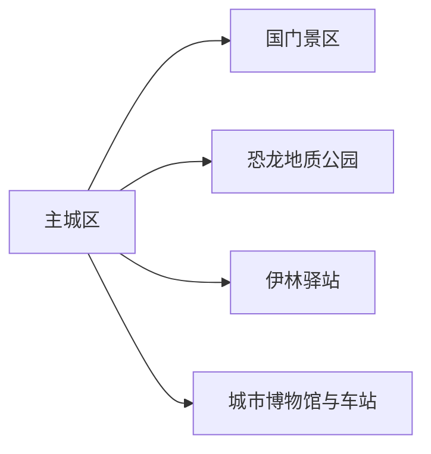
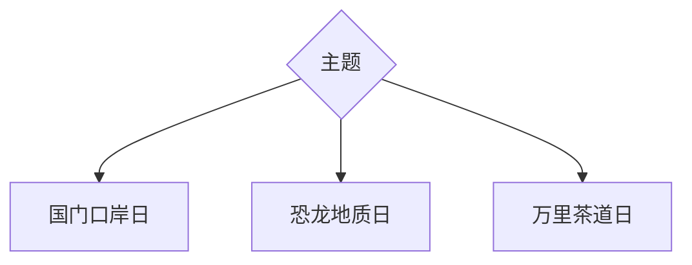

# 二连浩特旅行指南

二连浩特把口岸国门、万里茶道驿站和恐龙化石地质遗迹集中在一座边境城市周围。首访可用两天分别完成国门—口岸史与恐龙—伊林驿站；跨境旅行另按护照、签证、团队和口岸当期规则办理，市内观光资格不等同于出境资格。

## 城市速览

| 项目 | 信息 |
|---|---|
| 主线 | 国门景区—恐龙地质公园—伊林驿站—口岸城市生活 |
| 停留 | 2天基础，跨境或草原方向另计 |
| 住宿 | 主城区，围绕火车站、餐饮和合规交通选择 |
| 交通 | 铁路、公路、出租车与景区车辆 |
| 风险 | 大风、沙尘、严寒、边境与口岸监管 |
| 边界 | 国门景区、货运口岸、边防区、化石保护区和草原生产空间分别管理 |

## 城市格局与游览区域

主城区承担住宿与口岸文化；国门景区是正式观光单元，货运通道和监管区继续承担通关功能；恐龙地质公园与化石自然保护区按开放范围游览；伊林驿站展示万里茶道交通史。

## 主要景点

| 景点 | 区域 | 类型 | 核心体验 | 用时 | 环境 | 体力 | 研究价值 | 拥挤 | 优先级 |
|---|---|---|---|---:|---|---|---|---|---|
| 国门景区 | 北部 | 边境文化 | 国门、界碑与口岸发展 | 3–5小时 | 混合 | 中 | 高 | 高 | A |
| 二连浩特国家地质公园 | 市域 | 地质化石 | 恐龙化石遗迹与荒漠地层 | 4–6小时 | 室外 | 中 | 高 | 中 | A |
| 恐龙博物馆 | 城区或地质园体系 | 科普 | 化石、古生物与发掘史 | 2–3小时 | 室内 | 低 | 高 | 中 | A |
| 伊林驿站遗址博物馆 | 市域 | 交通遗产 | 万里茶道、驿站与古车辙 | 2–4小时 | 混合 | 中 | 高 | 低 | B |
| 二连浩特城市博物馆类场馆 | 主城 | 城市史 | 口岸、铁路与多民族城市发展 | 2–3小时 | 室内 | 低 | 中高 | 低 | B |
| 火车站与城市公共空间 | 主城 | 城市观察 | 国际铁路口岸的城市形态 | 1–2小时 | 室外 | 低 | 中 | 中 | C |

国门内部展陈按一个景区计算，地质公园内部化石点按一个保护与游览体系组织。界线、货场、海关、边检、军警设施和化石非开放区保持监管与保护用途。

## 美食与餐饮

蒙古族肉食、奶食、面食与口岸城市多样餐饮适合分餐体验；点烤肉和手把肉先问重量，奶制品关注乳糖与保存，尊重清真餐饮与当地用餐习惯。

## 经典行程

### 两日基础线
**路线**：国门—恐龙地质公园。**逻辑**：边境与地质各一天。**预约锚点**：两景区。**休息**：午后室内。**删除条件**：大风时优先保留博物馆。

### 国门口岸线
**路线**：城市博物馆—国门景区—主城晚餐。**逻辑**：先历史后现场。**预约锚点**：证件和拍摄规则。**休息**：景区服务区。**删除条件**：临时管制时改城市线。

### 恐龙科普线
**路线**：恐龙博物馆—地质公园。**逻辑**：展陈与遗址互证。**预约锚点**：开放与讲解。**休息**：馆内长休。**删除条件**：风沙增强时删除户外。

### 万里茶道线
**路线**：伊林驿站—城市铁路与商业空间。**逻辑**：连接古驿路与现代口岸。**预约锚点**：遗址馆。**休息**：主城午餐。**删除条件**：遗址未开放时留城区。

### 亲子线
**路线**：恐龙博物馆—地质公园短段。**逻辑**：古生物主题集中。**预约锚点**：儿童服务。**休息**：每小时避风。**删除条件**：低温或风沙时只留室内。

### 冬季低体力线
**路线**：城市场馆—国门室内展陈。**逻辑**：缩短户外。**预约锚点**：供暖、落客。**休息**：车辆与室内交替。**删除条件**：寒潮或道路管制时留酒店附近。

### 跨境准备线
**路线**：主城—口岸规则核对—合规旅行产品。**逻辑**：证件先于线路。**预约锚点**：护照、签证、团队和通关。**休息**：预留查验时间。**删除条件**：任何资格未确认时仅做境内城市行程。

## 住宿区域

主城区便于餐饮、铁路和两大景区往返。选择时确认供暖、停车、早班交通与沙尘天气取消政策；跨境产品的集合住宿以运营方书面信息为准。

## 市内交通

城区短途用车，国门、地质公园和伊林驿站分别落实往返。铁路客运、国际列车与口岸通关具有独立规则，购票与出境手续分开核对。

## 不同旅行者须知

独行者使用正式景区和车辆；亲子以恐龙科普为主；长者选择室内展陈与近落客；跨境旅行者按国籍、证件和当期口岸政策选择合规产品。

## 行前核对

- 核对国门、地质公园、恐龙馆和伊林驿站开放。
- 核对大风、沙尘、严寒、铁路与公路运行。
- 口岸监管、边境、化石保护与草原生产边界服从现场规则。

## 来源与更新记录

| 来源 | 支持内容 | 核验日期 |
|---|---|---|
| [二连浩特市人民政府：城市概况与观光](https://www.elht.gov.cn/zjel/) | 口岸、国门、恐龙与伊林驿站 | 2026-09-01 |
| [二连浩特市“旅游 N 有”实施方案](https://www.elht.gov.cn/c/2023-05-12/90181.shtml) | 国门、地质公园、恐龙博物馆与城市旅游服务 | 2026-09-01 |
| [民政部行政区划代码查询](https://dmfw.mca.gov.cn/xzqh/getList?code=15&trimCode=true&maxLevel=3) | 二连浩特代码与层级 | 2026-09-01 |
| [GeoNames 2037485](https://www.geonames.org/2037485/) | 二连浩特固定居民点 | 2026-09-01 |
| [Wikidata Q1001036](https://www.wikidata.org/wiki/Q1001036) | 城市实体与 GeoNames 对齐 | 2026-09-01 |

| 日期 | 更新 |
|---|---|
| 2026-09-01 | 首次完成二连浩特旅行研究；建立国门、恐龙、驿站与跨境边界 |
