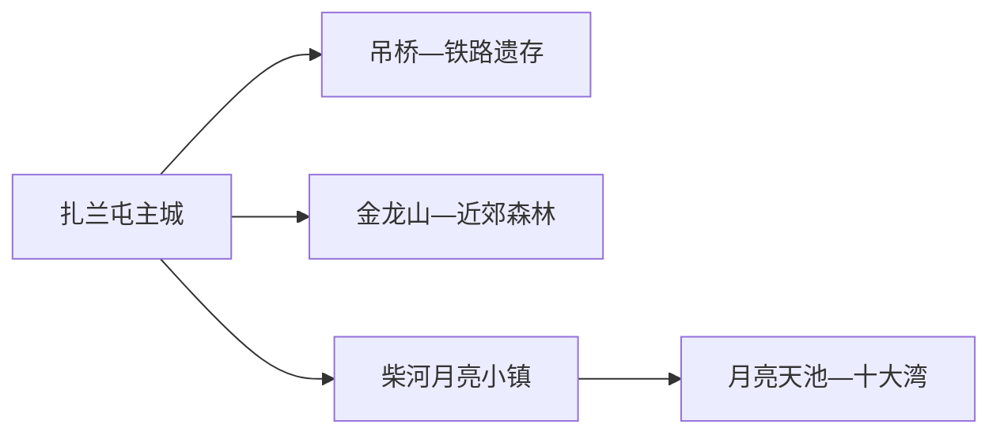
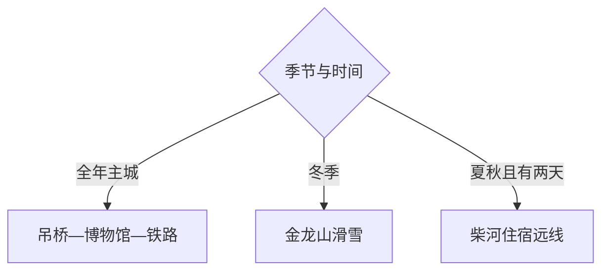

# 扎兰屯旅行指南

扎兰屯是呼伦贝尔代管的县级市，主城的吊桥公园、中东铁路遗存与历史博物馆适合用一天慢慢看；柴河月亮小镇、金龙山滑雪场和山水远线各自占用完整一天。第一次来，建议住主城，再根据季节从“柴河火山天池”“冬季滑雪”“近郊森林”中只选一个远线主题。

> 建议停留：2–4 天；柴河通常需单列 1–2 天 
> 旅行关键词：吊桥公园、中东铁路、柴河月亮小镇、月亮天池、金龙山、森林、火山地貌 
> 主要体力：主城低至中等；柴河和山地远线较高 
> 最近研究：2026-08-13

## 城市速览

| 项目 | 旅行信息 |
|---|---|
| 主要旅行价值 | 在雅鲁河谷认识百年城镇、铁路与森林文化，再前往柴河看火山天池和大兴安岭山水 |
| 建议停留 | 1 天主城；2 天加入近郊；3–4 天适合柴河或冬季滑雪专题 |
| 较舒适季节 | 夏秋适合森林与柴河，冬季适合正式雪场；春融、汛期和防火期按道路公告安排 |
| 预算特点 | 主城住宿餐饮较稳定；柴河长距离车辆、山地住宿与滑雪装备是主要增量 |
| 步行强度 | 主城公园可分段步行；天池、森林与雪场依路线和积雪明显增加 |
| 主要天气风险 | 严寒、暴雪、大风、雷暴、山洪、春融泥泞、森林火险与昼夜温差 |
| 独行旅行 | 主城容易组织；柴河与山地建议选择正规运营、明确车辆和通信的方案 |
| 亲子旅行 | 主城公园和历史场馆更轻松；雪场、天池与长途车按年龄和耐受度选择 |
| 长者与低体力旅行 | 主城一馆一园或柴河镇内观景较合适，山地只选接驳可达短线 |
| 无障碍信息 | 主城现代公共设施可询问；铁路遗存、森林、雪场和天池设施连续性需向官方确认 |

## 城市格局与游览区域

扎兰屯市法定行政代码为 `150783`，由呼伦贝尔市代管。GeoNames `2033225` 与 Wikidata `Q145015` 精确对应法定扎兰屯市。本市地域狭长，主城、成吉思汗镇、卧牛河、柴河与南木等方向不是连续景区。

| 区域 | 主要内容 | 游览特点 | 与其他区域的关系 |
|---|---|---|---|
| 主城—雅鲁河 | 吊桥公园、历史博物馆、中东铁路遗存、城市服务 | 步行与短途车可组合 | 住宿与交通首选基地 |
| 金龙山—近郊 | 正式滑雪场、森林与山地活动 | 冬夏项目不同，依运营方开放 | 从主城往返一日 |
| 柴河月亮小镇 | 镇区、火山地貌与远线服务 | 距主城较远，宜住一晚 | 作为天池线路基地 |
| 月亮天池—十大湾 | 天池、河谷、森林与观景道路 | 天气、保护地和道路限制明显 | 按正式线路选少量点位 |
| 其他林区乡镇 | 森林、湿地与生产生活空间 | 旅游接待密度低 | 只加入已有明确接待的项目 |

柴河部分景观与自然保护地、森林经营区重叠，旅行采用公布的道路、观景点和经营线路。林场道路、封闭防火道、采伐作业区和未经确认的天池小径不作为捷径；冬季冰面与林间雪道也按运营和安全公告选择。

## 主要景点

### 主城与近郊

| 景点 | 区域 | 类型 | 主要看点 | 建议用时 | 室内外 | 体力 | 预约风险 | 天气影响 | 优先级 |
|---|---|---|---|---:|---|---|---|---|---|
| 吊桥公园 | 主城 | 城市公园与历史景观 | 百年吊桥、雅鲁河与城市休闲空间 | 2–3 小时 | 室外 | 低至中 | 低 | 高 | A |
| 扎兰屯历史博物馆 | 主城 | 地方博物馆 | 城市、铁路、民族与区域历史 | 2–3 小时 | 室内 | 低 | 中高 | 低 | A |
| 中东铁路建筑群公开段 | 主城 | 铁路遗产 | 站区建筑与城市形成关系 | 2–3 小时 | 混合 | 中 | 中高 | 中 | A |
| 金龙山滑雪旅游区 | 近郊 | 正式滑雪场 | 冬季雪道、教学与山地活动 | 1 天 | 室外为主 | 高 | 很高 | 很高 | B |

### 柴河与森林远线

| 景点 | 区域 | 类型 | 主要看点 | 建议用时 | 室内外 | 体力 | 预约风险 | 天气影响 | 优先级 |
|---|---|---|---|---:|---|---|---|---|---|
| 柴河月亮小镇 | 柴河 | 山地旅游基地 | 小镇服务、火山森林背景与远线入口 | 半日至住宿 | 混合 | 中 | 高 | 高 | A |
| 月亮天池正式观景线 | 柴河 | 火山天池与森林 | 火山口湖、森林与观景路线 | 1 天 | 室外 | 高 | 高 | 很高 | A |
| 同心天池—十大湾当期线路 | 柴河 | 河谷与火山景观 | 天池、河湾和森林道路景观 | 1 天 | 室外 | 高 | 很高 | 很高 | B |
| 秀水等正式近郊景区 | 市域 | 森林与水景 | 雅鲁河谷、森林和季节户外 | 3–5 小时 | 室外 | 中 | 高 | 高 | C |

## 美食与餐饮

主城适合日常东北菜、面食和牛羊肉；柴河远线把正餐与补给安排在镇区或住宿点。野生菌、山野菜和河鱼重在来源与加工安全，不自行采食不认识的植物或菌类。

| 菜品或餐饮类型 | 常见区域 | 一个人用餐与常见份量 | 风味、过敏原与饮食限制 | 排队风险与替代方法 |
|---|---|---|---|---|
| 东北炖菜 | 主城、镇区 | 多人共享，先问小份 | 肉类、豆制品、粉条与较高盐分 | 单人改点盖饭、饺子或面食 |
| 牛羊肉与烧烤 | 主城、柴河 | 烧烤可少量点，火锅偏多人 | 肉类、乳制品、孜然和交叉接触 | 选明码标价正规店，远线提前订餐 |
| 山野菜与菌菇 | 正规餐馆 | 作为小菜尝试 | 物种、过敏和充分加热很重要 | 只吃可追溯食材，换常规蔬菜即可 |
| 列巴、奶制品与早餐 | 主城 | 便于一人购买 | 麸质、乳制品、蛋和糖 | 选有标签的小包装 |

## 经典行程

### 一日经典路线

**路线**：扎兰屯历史博物馆 → 主城午餐 → 中东铁路建筑公开段 → 吊桥公园

- **串联逻辑**：先建立城市史，再沿铁路与雅鲁河理解城市形成，片区集中。
- **预约锚点**：博物馆开放与铁路遗产可进入范围。
- **休息安排**：午餐在主城，下午在公园公共服务区休息。
- **时间不足时**：删除铁路外围段，保留博物馆和吊桥公园。

### 两日城市路线

**第 1 天**：主城经典线 
**第 2 天**：按季节选择金龙山正式项目或秀水近郊短线

- **串联逻辑**：第一天城市历史，第二天自然户外，住宿不变。
- **预约锚点**：雪票、教练、装备或近郊景区开放。
- **休息安排**：第二天使用正式游客中心和主城晚餐。
- **时间不足时**：第二天只保留一个项目；天气不佳改博物馆慢游。

### 三日深度路线

**第 1 天**：主城 
**第 2 天**：前往柴河月亮小镇 → 镇区休息与住宿 
**第 3 天**：月亮天池正式观景线 → 返回

- **串联逻辑**：把长途转场和天池游览拆开，给山路与天气留余量。
- **预约锚点**：柴河住宿、车辆、入口和保护地开放。
- **休息安排**：第二天在小镇完成补给，第三天用正式服务点。
- **时间不足时**：不做三日压缩；只有两天时改主城加近郊。

### 雨雪天路线

**路线**：扎兰屯历史博物馆 → 主城午餐 → 室内公共文化场馆或铁路建筑外观短段

- **适用条件**：普通雨雪；暴雪、冻雨或道路预警时留在住宿附近。
- **预约锚点**：场馆开放和城市交通。
- **休息安排**：全程使用主城室内空间。
- **时间不足时**：只保留博物馆。

### 亲子或低体力路线

**亲子路线**：历史博物馆 → 午休 → 吊桥公园核心公共段 
**低体力路线**：车辆到博物馆 → 主城午餐 → 吊桥附近短段

- **减负方式**：亲子减少长途林区和高强度雪道；低体力线缩短滨河步行并保留车辆。
- **预约锚点**：场馆儿童规则、雪场教学与辅助服务。
- **休息安排**：博物馆和主城餐饮区。
- **时间不足时**：均只留博物馆。

### 远郊一日路线

**路线**：柴河住宿点 → 月亮天池或同心天池正式线路二选一 → 小镇晚餐

- **适用条件**：已住柴河、道路与天气稳定、有正规车辆。
- **预约锚点**：保护地、入口、车辆和讲解。
- **休息安排**：使用小镇与正式线路服务点。
- **时间不足时**：缩短为小镇周边，不临时增加另一个天池。

## 住宿区域

| 区域 | 优点 | 缺点 | 适合人群 | 交通特点 |
|---|---|---|---|---|
| 扎兰屯主城 | 铁路、餐饮和公共服务集中 | 到柴河距离长 | 首访、独行、主城与近郊 | 默认基地 |
| 柴河月亮小镇 | 便于天池和清晨山地行程 | 供应、通信与道路受季节影响 | 夏秋森林、摄影、两日远线 | 提前订车辆与住宿 |
| 金龙山周边 | 便于早进雪场 | 非雪季吸引力和服务会变化 | 滑雪与冬季专题 | 核对雪场接驳和装备 |

## 市内交通

| 场景 | 建议与取舍 | 行前需要重查的内容 |
|---|---|---|
| 铁路抵达主城 | 扎兰屯站进入主城后再分方向 | 到发车次、站口、末班与叫车 |
| 主城内部 | 公交、步行和正规叫车组合 | 冬季路面、施工与夜间车辆 |
| 前往柴河 | 长距离公路，优先正规客运、运营方或合规车辆 | 路况、加油、通信、返程与救援 |
| 前往雪场 | 采用官方接驳或明确车辆 | 雪具携带、停车、散场与保险 |
| 自驾 | 远线灵活但对冬季驾驶要求高 | 冰雪胎、防滑、限速、封路与疲劳 |

## 不同旅行者须知

| 旅行维度 | 可行条件 | 主要取舍 | 需额外核对 |
|---|---|---|---|
| 独行旅行 | 主城方便 | 柴河宜选正规运营和稳定通信 | 车辆、住宿、保险与紧急联系人 |
| 亲子旅行 | 主城场馆与公园温和 | 滑雪和长途按年龄减量 | 教练、护具、儿童票与医务 |
| 长者或低体力旅行 | 主城一馆一园 | 天池步道与冰雪路面负担大 | 接驳、座椅、坡度与防滑 |
| 无障碍需求 | 主城现代设施可询问 | 林区、铁路遗存与雪场连续性有限 | 设施连续性需向官方确认 |
| 摄影旅行 | 河谷、铁路、森林与冰雪题材丰富 | 清晨返程、保护地和无人机有规则 | 日出车辆、低温电池、航拍许可 |
| 预算有限 | 主城日易控费 | 柴河车辆和雪场装备增加成本 | 套票、租赁、接驳、取消政策 |
| 特殊天气 | 严寒与暴雪可转主城 | 山路与户外直接受限 | 气象、道路、防火与景区公告 |

## 行前核对

| 核对事项 | 为什么需要重查 | 建议核对时间 | 官方入口 |
|---|---|---|---|
| 柴河道路与景点开放 | 保护、施工、天气和季节影响大 | 订房前、出发前三日及当天 | [扎兰屯市政府](https://www.zhalantun.gov.cn/) |
| 雪场运营 | 雪况、雪道、课程和设备会变 | 订票前及当天 | [扎兰屯市旅游入口](https://www.zhalantun.gov.cn/News/showList/31384/page_1.html) |
| 主城场馆 | 闭馆日和展览维护变化 | 出发前一周 | [扎兰屯市政府](https://www.zhalantun.gov.cn/) |
| 铁路与客运 | 车次、末班和道路可能调整 | 订票时及当天 | [中国铁路 12306](https://www.12306.cn/) |
| 严寒、暴雪、山洪和火险 | 决定林区与山地是否适合出行 | 出发前三日及当天 | [内蒙古气象局](https://nm.cma.gov.cn/) |

## 来源与更新记录

### 主要来源

| 来源 | 类型 | 支持内容 | 核验日期 |
|---|---|---|---|
| [扎兰屯旅游资源目录](https://www.zhalantun.gov.cn/News/showList/31384/page_1.html) | 市政府 | 月亮小镇、吊桥、历史博物馆、金龙山与秀水等方向 | 2026-08-13 |
| [柴河文旅项目资料](https://www.zhalantun.gov.cn/News/show/1317861.html) | 市政府 | 月亮天池、同心天池、十大湾、距离与保护地重叠 | 2026-08-13 |
| [柴河月亮小镇规划](https://www.zhalantun.gov.cn/OpennessContent/show/563144.html) | 市政府规划 | 小镇旅行基地、道路与运营背景 | 2026-08-13 |
| [自然保护与湿地管理](https://www.zhalantun.gov.cn/Elderly/News/show/1253913.html) | 市政府 | 天池、秀水、湿地和保护管理边界 | 2026-08-13 |
| [呼伦贝尔官方旅游线路](https://www.hlbe.gov.cn/OpennessGazette/show/8450.html) | 地级市政府 | 中东铁路博物馆、吊桥与柴河组合 | 2026-08-13 |
| [GeoNames 2033225](https://www.geonames.org/2033225/) | 开放地理数据 | 扎兰屯城市点与坐标 | 2026-08-13 |
| [Wikidata Q145015](https://www.wikidata.org/wiki/Q145015) | 开放结构化数据 | 法定扎兰屯市与 GeoNames 精确映射 | 2026-08-13 |

### 更新记录

| 日期 | 更新内容 |
|---|---|
| 2026-08-13 | 首次完成扎兰屯市独立旅行研究；建立主城铁路遗产、金龙山与柴河天池路线，补充森林保护、冬季驾驶、住宿与天气决策 |
