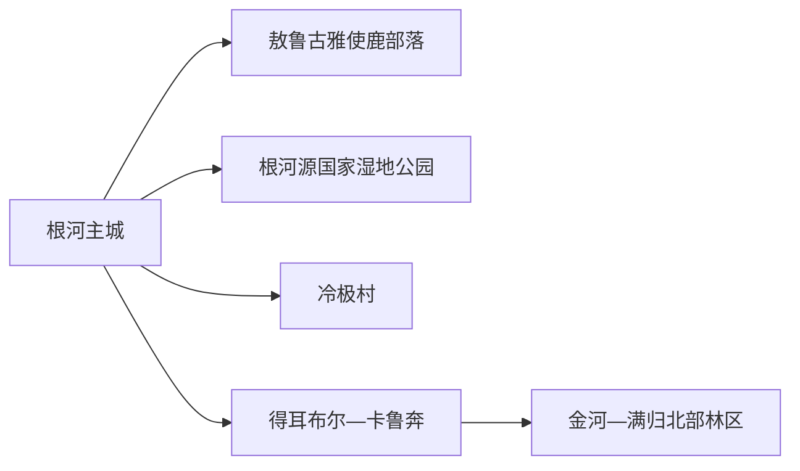
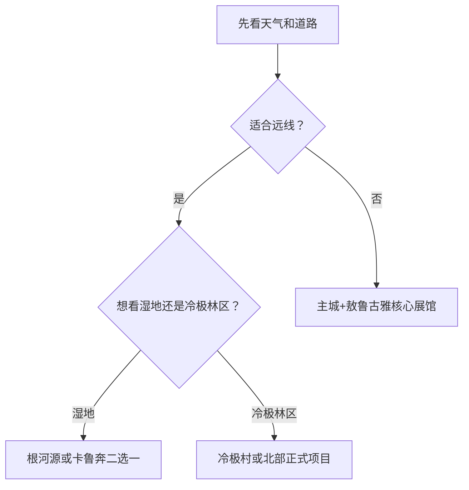

# 根河旅行指南

根河位于大兴安岭北段，森林、湿地、极寒气候和敖鲁古雅使鹿鄂温克文化共同构成旅行核心。主城适合作为铁路、住宿和补给基地，敖鲁古雅距离主城较近；根河源湿地、冷极村、得耳布尔—满归等方向需要整日公路行程。冬季项目与林区道路随天气、防火和运营调整，行程宜保留替代日。

## 城市速览

| 项目 | 信息 |
|---|---|
| 旅行主线 | 敖鲁古雅驯鹿文化、中国冷极、森林湿地、森工历史与冰雪 |
| 建议停留 | 2 天主城与敖鲁古雅；3–4 天增加湿地、冷极村或北部林区 |
| 住宿基地 | 根河主城；明确远线时可在正规接待点换宿 |
| 步行强度 | 主城低，景区中等，森林湿地与冰雪项目中至高 |
| 主要天气 | 极寒、暴雪、道路结冰、大雾、夏季雷雨、森林火险与蚊虫 |
| 预约核心 | 敖鲁古雅、冬季体验、根河源湿地和远线车辆 |
| 亲子 | 驯鹿文化博物馆、正式景区和适龄冰雪项目较合适 |
| 低体力 | 主城、敖鲁古雅核心展馆和车辆观景 |
| 生态边界 | 天然林、湿地、野生动物栖息地和林业施业区按保护与生产规则 |
| 无障碍 | 设施连续性需向官方确认，核对雪地、木栈道、景区车与卫生间 |

## 城市格局与游览区域

根河市是呼伦贝尔市代管县级市，代码 `150785`。GeoNames `2037252` 与法定实体 Wikidata `Q1354108` 的 `P1566` 精确对应。主城位于铁路和公路节点，敖鲁古雅鄂温克族乡在城西近郊，根河源湿地、冷极村、得耳布尔、金河、满归等方向沿林区公路展开。

| 区域 | 旅行价值 | 怎么安排 |
|---|---|---|
| 根河主城 | 铁路、住宿、补给、公共文化 | 抵达日、天气替代日、多日基地 |
| 敖鲁古雅 | 驯鹿文化、博物馆与民俗体验 | 半日至一日，先确认项目运营 |
| 根河源湿地 | 湿地、森林与季节活动 | 独立半日至一日 |
| 冷极村 | 极寒品牌、冰雪和林区生活 | 冬季完整一天，落实车辆与供暖 |
| 得耳布尔—卡鲁奔 | 森林、湿地与公路景观 | 天气稳定时完整一日 |
| 金河—满归 | 北部林区与长距离自驾 | 多日行程或换宿，单独规划 |

## 主要景点

### 主城与敖鲁古雅

| 景点 | 所在区域 | 类型 | 核心看点 | 建议用时 | 室内/室外 | 体力 | 预约难度 | 天气敏感度 | 适合旅程 |
|---|---|---|---|---|---|---|---|---|---|
| 根河市公共文化场馆 | 主城 | 地方史与森工文化 | 城市、林业、民族文化和当期展览 | 1–2 小时 | 室内 | 低 | 中 | 低 | B |
| 敖鲁古雅使鹿部落景区 | 敖鲁古雅乡 | 民族文化与生态体验 | 驯鹿文化博物馆、原始部落、艺术与非遗展示 | 4–6 小时 | 混合 | 中 | 高 | 高 | A |
| 敖鲁古雅驯鹿文化博物馆等核心展馆 | 景区内 | 博物馆与非遗 | 使鹿鄂温克历史、迁徙、驯鹿与桦树皮文化 | 1.5–3 小时 | 室内 | 低 | 中 | 低 | A |

### 湿地、冷极与林区

| 景点 | 所在区域 | 类型 | 核心看点 | 建议用时 | 室内/室外 | 体力 | 预约难度 | 天气敏感度 | 适合旅程 |
|---|---|---|---|---|---|---|---|---|---|
| 根河源国家湿地公园 | 主城近郊 | 湿地与森林 | 河流湿地、森林景观和当期开放游线 | 4–6 小时 | 室外 | 中 | 高 | 很高 | A |
| 冷极村正式开放项目 | 金林方向 | 冰雪与林区生活 | 极寒体验、林区文化和季节活动 | 1 天含往返 | 混合 | 中至高 | 高 | 极高 | B |
| 卡鲁奔国家湿地公园公开区 | 得耳布尔方向 | 湿地与森林 | 河谷、森林湿地与正式观景路线 | 1 天含往返 | 室外 | 中至高 | 高 | 极高 | C |
| 伊克萨玛国家森林公园等正式开放林区项目 | 北部 | 森林与山地 | 大兴安岭森林、河谷与季节游线 | 1 天以上 | 室外 | 高 | 高 | 极高 | C |

驯鹿是文化与生产生活的一部分。投喂、触摸、合影和雪橇项目以景区规则、动物福利和当期运营为准。天然林、湿地、林场、防火道、采伐或养护作业区具有保护与生产功能，旅行使用正式景区和公开道路。

## 美食与餐饮

| 类型 | 适合场景 | 份量 | 过敏与饮食提示 | 选择方法 |
|---|---|---|---|---|
| 列巴、蓝莓与林果制品 | 早餐、加餐、伴手礼 | 小份方便 | 小麦、乳、糖和果酱添加 | 看配料、产地与保存条件 |
| 牛羊肉、鹿肉相关餐饮 | 正餐 | 适合分享 | 肉类来源、油脂、孜然与共锅 | 选择证照清楚、来源可说明的餐馆 |
| 东北炖菜与饺子 | 主城正餐 | 一人或分享 | 小麦、大豆、肉汤和花生 | 先问小份和馅料 |
| 野生菌与林下产品 | 季节餐饮 | 少量尝试 | 误采、中毒、加工和药物相互作用 | 只在正规经营场所购买食用 |

## 经典行程

### 一日经典路线

**路线**：根河主城 → 敖鲁古雅使鹿部落景区 → 午餐与休息 → 核心展馆与公开体验 → 返回

- **串联逻辑**：用一座完整景区认识驯鹿文化、民族历史与当代展示。
- **预约锚点**：门票、展馆、演艺、驯鹿互动和景区交通。
- **休息安排**：午餐与核心展馆承担保暖和长休。
- **时间不足时**：保留博物馆和一个公开体验。

### 两日城市路线

**第 1 天**：根河主城公共文化 → 敖鲁古雅核心区 
**第 2 天**：根河源国家湿地公园完整游线

- **串联逻辑**：民族文化与湿地森林分日，减少景区间折返。
- **预约锚点**：两景区开放、内部交通与天气。
- **休息安排**：湿地日使用游客中心与正式服务点。
- **时间不足时**：第二天缩成湿地近入口短线。

### 三日深度路线

**路线**：主城与敖鲁古雅 → 根河源湿地 → 冷极村或卡鲁奔二选一

- **串联逻辑**：文化、湿地与远端林区主题分日。
- **预约锚点**：第三天车辆、道路、供暖、项目和返程。
- **休息安排**：远线每两小时安排车辆或室内休息。
- **时间不足时**：删除第三天，不压缩前两日。

### 雨雪与极寒天气路线

**路线**：根河市公共文化场馆 → 室内午餐 → 敖鲁古雅核心展馆 → 返回住宿

- **适用条件**：城市道路与景区接驳正常；极端天气按应急提示减少移动。
- **串联逻辑**：保留室内民族文化主题，户外只做近入口短段。
- **预约锚点**：寒潮、暴雪、道路结冰、闭馆和车辆启动。
- **休息安排**：每段户外后立即进入供暖空间。
- **时间不足时**：只留一座核心展馆。

### 亲子与低体力路线

**亲子路线**：驯鹿文化博物馆 → 午餐 → 当期适龄公开体验 
**低体力路线**：车辆到达景区核心展馆 → 长休 → 主城公共文化短线

- **适用条件**：亲子体验按年龄、低温和动物接触规则选择；低体力路线保持室内为主。
- **串联逻辑**：两条路线都集中在主城与敖鲁古雅，减少林区远线。
- **预约锚点**：轮椅、婴儿车、卫生间、座椅、供暖与落客。
- **休息安排**：每个项目之间至少一次室内长休。
- **时间不足时**：只留驯鹿文化博物馆。

### 冷极或北部林区主题路线

**路线**：根河主城 → 冷极村、卡鲁奔或伊克萨玛中的一个正式开放项目 → 午餐与休息 → 返回或正规换宿

- **适用条件**：道路、天气、防火、接待、车辆与住宿均已确认。
- **串联逻辑**：一次只选一个远端方向，避免在长距离林区公路上赶路。
- **预约锚点**：项目运营、车辆防寒、燃油、通信、返程和住宿。
- **休息安排**：以有供暖的正式服务点为休息锚点。
- **时间不足时**：整段改为根河源湿地或主城文化线。

## 住宿区域

| 区域 | 优点 | 取舍 | 适合人群 | 核对项 |
|---|---|---|---|---|
| 根河主城 | 铁路、餐饮、补给和叫车相对集中 | 去北部远线车程长 | 首访、无车、多日 | 供暖、热水、早餐、停车 |
| 敖鲁古雅周边正规住宿 | 便于早入景区 | 与主城服务有距离 | 民族文化慢游 | 营业、供暖、接驳与退订 |
| 冷极村或北部正规接待点 | 减少远线往返 | 条件有限且受天气影响大 | 已落实车辆的专题行程 | 证照、供暖、消防、通信、救援 |

## 市内交通

根河站承担铁路到发，主城内可用公交、出租车或网约车。敖鲁古雅距离主城较近；根河源湿地、冷极村、得耳布尔、金河和满归方向依靠公路车辆。冬季优先使用熟悉极寒路况的合规车辆。

| 场景 | 怎么做 | 核对项 |
|---|---|---|
| 铁路到达 | 按车票确认根河站 | 季节车次、晚点、站口和供暖 |
| 主城—敖鲁古雅 | 景区接驳、公交或叫车 | 开放、末班、夜间返程 |
| 湿地与冷极村 | 预订车辆并留天气替代日 | 路况、结冰、通信、燃油 |
| 北部林区 | 按多日公路行程规划 | 住宿、加油、救援、防火与封路 |

## 不同旅行者须知

| 旅行者 | 推荐做法 | 重点核对 |
|---|---|---|
| 独行 | 住主城，参加正规景区与车辆服务 | 通信、返程、低温装备 |
| 亲子 | 驯鹿文化展馆加适龄短体验 | 动物接触、低温、卫生间 |
| 长者与低体力 | 车辆连接主城与敖鲁古雅核心展馆 | 台阶、雪地、座椅、轮椅 |
| 摄影 | 在正式观景区拍摄森林、湿地和驯鹿 | 无人机、动物距离、肖像、防火 |
| 冬季旅行 | 每天一个核心项目，午后回供暖空间 | 失温、冻伤、道路、车辆、电池 |

## 行前核对

- 根河市政府、文旅和景区：敖鲁古雅、湿地、冷极村与冬季活动。
- 气象、应急、林草部门：寒潮、暴雪、结冰、雷雨、森林火险和封路。
- 交通和住宿经营者：车辆防寒、供暖、通信、退订与应急替代。
- 12306：根河站季节车次与实际到发日。

## 来源与更新记录

| 来源 | 支持内容 | 核验日期 |
|---|---|---|
| [根河市人民政府](https://www.genhe.gov.cn/) | 市情、文旅、交通和动态入口 | 2026-08-13 |
| [根河市政府：敖鲁古雅鄂温克民族乡](https://www.genhe.gov.cn/News/show/1082909.html) | 景区位置、驯鹿文化博物馆与核心项目 | 2026-08-13 |
| [根河市2025年政府工作报告](https://www.genhe.gov.cn/Elderly/OpennessContent/show/484137.html) | 根河源、冷极村、卡鲁奔与文旅方向 | 2026-08-13 |
| [根河市冬季旅游工作通知](https://www.genhe.gov.cn/OpennessGazette/show/8869.html) | 敖鲁古雅、冷极村、湿地与冬季项目动态 | 2026-08-13 |
| [根河市2026年发展计划](https://www.genhe.gov.cn/OpennessContent/show/567253.html) | 景区建设、生态保护和林区边界 | 2026-08-13 |
| [Wikidata Q1354108](https://www.wikidata.org/wiki/Q1354108) | 法定根河市与 `P1566=2037252` | 2026-08-13 |
| [GeoNames 2037252](https://www.geonames.org/2037252/) | 固定城市点与坐标 | 2026-08-13 |

| 日期 | 更新 |
|---|---|
| 2026-08-13 | 首次完成根河主城、敖鲁古雅、湿地、冷极村与林区旅行研究。 |
