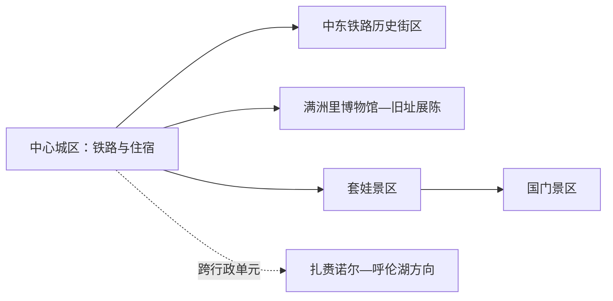
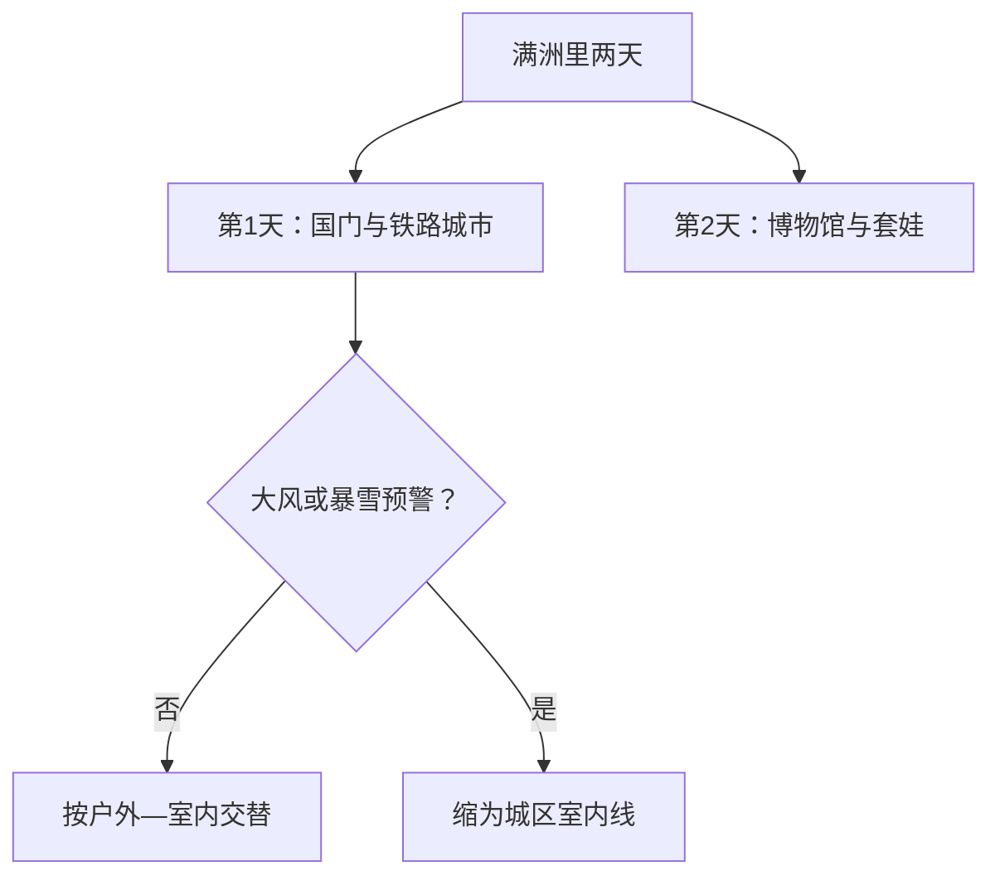

# 满洲里旅行指南

满洲里是一座以中东铁路历史、口岸城市景观和中俄蒙文化交往为核心的边境城市。国门、套娃景区与中心城区分属不同游览单元，扎赉诺尔区及呼伦湖方向还需公路交通；边境旅游区与口岸作业区也要按各自入口和规则区分。

## 城市速览

| 项目 | 信息 |
|---|---|
| 旅行主线 | 国门景区、套娃景区、中东铁路历史街区、博物馆与沙俄监狱旧址 |
| 建议停留 | 主城与两大景区 2 天；扎赉诺尔或呼伦湖方向再加 1 天 |
| 住宿基地 | 中心城区便于餐饮和夜景；套娃区域适合主题度假 |
| 步行强度 | 城区低至中；大型景区中等；冬季体力消耗明显上升 |
| 主要天气 | 严寒、暴雪、风吹雪、大风、雷暴、草原火险和道路结冰 |
| 预约核心 | 国门、套娃演艺、博物馆、远郊车辆与返程 |
| 边界重点 | 国门景区、边检海关、铁路货场、军事与边境巡护空间分别管理 |
| 无障碍 | 城区可缩短步行；大型景区先问接驳、电梯、轮椅和冬季除冰 |

## 城市格局与游览区域

满洲里是呼伦贝尔市代管的县级市，法定代码 `150781`；GeoNames `2035836` 与 Wikidata `Q890671` 对应城市实体。中心城区承担铁路、住宿和城市历史，国门与套娃景区位于西部方向；扎赉诺尔区是呼伦贝尔市辖区，不属于满洲里市行政区，但旅行中常作为邻近独立单元衔接。

| 区域 | 旅行价值 | 怎么安排 |
|---|---|---|
| 中心城区 | 铁路建筑、城市街区、餐饮、住宿与夜景 | 一日的骨架 |
| 国门方向 | 边境历史、界碑展示与红色展陈 | 留半日至一日并核对规则 |
| 套娃景区 | 主题建筑、演艺、娱乐和主题住宿 | 半日至夜间 |
| 扎赉诺尔—呼伦湖方向 | 煤矿工业史、古生物与湖泊湿地 | 作为另一行政单元独立一天 |

## 主要景点

| 景点 | 所在区域 | 类型 | 核心看点 | 建议用时 | 室内/室外 | 体力 | 预约难度 | 天气敏感度 | 适合旅程 |
|---|---|---|---|---|---|---|---|---|---|
| 国门景区 | 西部边境方向 | 边境历史与展陈 | 国门、41号界碑、红色交通线与口岸历史 | 3–5 小时 | 混合 | 中 | 高 | 高 | A |
| 套娃景区 | 西部 | 主题景区与演艺 | 套娃建筑、文化体验、剧场与夜间项目 | 4–8 小时 | 混合 | 中 | 高 | 中高 | A |
| 中东铁路历史文化街区 | 中心城区 | 历史街区与建筑 | 铁路城市形成、俄式建筑与街区尺度 | 2–4 小时 | 室外为主 | 低至中 | 低 | 高 | A |
| 满洲里博物馆 | 城区 | 城市博物馆 | 口岸、铁路、地方历史与文化交往 | 2–3 小时 | 室内 | 低 | 中高 | 低 | A |
| 沙俄监狱旧址陈列馆 | 城区 | 旧址与展览 | 近代边境史与旧址空间 | 1–2 小时 | 室内为主 | 低至中 | 中高 | 低 | B |
| 北湖或城中湿地公开空间 | 城区 | 城市生态 | 城市水景、步道与季节活动 | 1–3 小时 | 室外 | 低至中 | 低 | 极高 | B |

国门景区是面向游客开放的边境旅游区，口岸联检、货运线路、铁路编组和边境巡护空间继续执行作业规则。跨境旅行另按证件、口岸和旅行社资质核对；参观国门不等于获得跨境通行资格。

## 美食与餐饮

| 类型 | 适合场景 | 份量 | 过敏与饮食提示 | 怎么选 |
|---|---|---|---|---|
| 俄式西餐 | 城区晚餐 | 多为一人或共享 | 奶、蛋、麸质、牛肉和酒精 | 选菜单与价格清楚的餐厅 |
| 蒙餐与手把肉 | 多人正餐 | 共享更合适 | 牛羊肉、乳制品和较高盐分 | 先问重量、小份与主食 |
| 布里亚特包子等面食 | 早餐或简餐 | 一人份 | 麸质、肉类和洋葱 | 选择现制店并确认馅料 |
| 俄罗斯商品与甜点 | 购物或茶歇 | 小份 | 奶、蛋、坚果、巧克力和酒精 | 核对中文标签、进口信息与保质期 |

## 经典行程

### 一日口岸城市路线

**路线**：国门景区 → 午餐 → 中东铁路历史街区 → 城区夜景

- **串联逻辑**：从国家口岸进入铁路城市形成史。
- **预约锚点**：国门购票、证件规则和往返交通。
- **休息安排**：午后回城区用餐避风。
- **时间不足时**：保留国门与历史街区核心段。

### 两日经典路线

**第 1 天**：国门—中东铁路历史街区—城区夜景 
**第 2 天**：满洲里博物馆—套娃景区—当期夜间项目

- **串联逻辑**：历史认识与主题娱乐分日，减少连续排队。
- **预约锚点**：博物馆、套娃演艺和国门。
- **休息安排**：每天午后安排室内长休。
- **时间不足时**：第二天保留博物馆与套娃核心区。

### 城市历史路线

**路线**：满洲里博物馆 → 沙俄监狱旧址陈列馆 → 午餐 → 中东铁路历史街区

- **适用条件**：两馆开放且城区天气可步行。
- **预约锚点**：闭馆日、实名入馆与讲解。
- **休息安排**：正午用餐后走街区。
- **时间不足时**：保留博物馆与街区一小段。

### 风雪天气路线

**路线**：住宿地 → 满洲里博物馆 → 午餐 → 一处近距离室内展陈

- **适用条件**：城市交通正常；暴雪或风吹雪预警时以住宿地安全为先。
- **预约锚点**：场馆临时开放、道路与叫车。
- **休息安排**：减少户外等车时间。
- **时间不足时**：只保留一座场馆。

### 亲子路线

**路线**：满洲里博物馆 → 午休 → 套娃景区适龄项目

- **串联逻辑**：先建立城市背景，再选择主题娱乐。
- **预约锚点**：儿童身高、年龄、演出和室内休息区。
- **休息安排**：避开正午大风或严寒。
- **时间不足时**：套娃景区只选一个主题区。

### 低体力路线

**路线**：车辆到达博物馆 → 午餐长休 → 中东铁路街区近入口短段

- **适用条件**：落客、除冰和门到门车辆已落实。
- **预约锚点**：电梯、轮椅、座椅和返程。
- **休息安排**：户外段控制在一小时内。
- **时间不足时**：删除街区段。

### 扎赉诺尔联程路线

**路线**：满洲里早出发 → 扎赉诺尔正式场馆或呼伦湖明确开放景区一处 → 原路返回

- **适用条件**：按另一行政单元核对开放、边境、湿地和车辆规则。
- **预约锚点**：准确入口、道路、返程与天气。
- **休息安排**：在正式服务点用餐补给。
- **时间不足时**：整段删除，留在满洲里城区。

## 住宿区域

| 区域 | 优点 | 取舍 | 适合人群 | 核对项 |
|---|---|---|---|---|
| 中心城区 | 铁路、餐饮、博物馆与夜景方便 | 去国门和套娃需要车辆 | 首访、公共交通旅行 | 供暖、隔音、早餐与夜间入住 |
| 套娃景区周边 | 主题体验和夜间项目方便 | 与老城区生活距离较远 | 亲子、主题度假 | 门票权益、演出、接驳与退改 |
| 扎赉诺尔正规住宿 | 接近邻近区域景点 | 属另一行政单元 | 工业史、湖泊联程 | 目的地地址、交通和返程 |

## 市内交通

| 场景 | 怎么做 | 行前核对 |
|---|---|---|
| 铁路或航空到达 | 铁路到满洲里站；航空按机场当期交通转城区 | 车次、航班、机场巴士与夜间叫车 |
| 城区—国门—套娃 | 使用公交、出租或正规车辆分段串联 | 运营时间、上下客点和景区闭园 |
| 扎赉诺尔与呼伦湖方向 | 自驾或正规包车，单独留一天 | 道路、湿地开放、边境检查和返程 |
| 冬季移动 | 选择短转场并留足除冰和等车时间 | 暴雪、风吹雪、道路封闭与车辆冬季装备 |

## 不同旅行者须知

| 旅行者 | 推荐做法 | 重点核对 |
|---|---|---|
| 独行 | 住中心城区，景区间用正规交通 | 夜间叫车、边境检查和返程 |
| 亲子 | 博物馆加套娃适龄项目 | 身高、演出、室内休息和保暖 |
| 长者与低体力 | 场馆与街区短段组合 | 落客、电梯、除冰和卫生间 |
| 摄影 | 国门、街区和夜景分时段 | 边境拍摄、无人机、三脚架与严寒电池 |
| 跨境旅行 | 通过有资质渠道按证件办理 | 口岸开放、签证、旅行社与海关规定 |

## 行前核对

- 满洲里市政府文旅入口：国门、套娃、博物馆、活动与临时管理。
- 国家移民管理局、海关和口岸公告：跨境证件、通关与边境规则。
- 内蒙古气象、交通、林草与应急信息：严寒、暴雪、大风和火险。
- 中国铁路 12306 与机场渠道：车次、航班和接驳。

## 来源与更新记录

| 来源 | 支持内容 | 核验日期 |
|---|---|---|
| [满洲里市人民政府：国门](https://www.manzhouli.gov.cn/News/show/539987.html) | 国门景区组成与边境历史展示 | 2026-09-01 |
| [满洲里市人民政府：套娃广场](https://www.manzhouli.gov.cn/News/show/539985.html) | 套娃景区功能、演艺和住宿结构 | 2026-09-01 |
| [满洲里博物馆开放公告](https://www.manzhouli.gov.cn/OpennessContent/show/560783.html) | 博物馆与沙俄监狱旧址陈列馆 | 2026-09-01 |
| [Wikidata Q890671](https://www.wikidata.org/wiki/Q890671) | 满洲里市实体对齐 | 2026-09-01 |
| [GeoNames 2035836](https://www.geonames.org/2035836/) | 固定满洲里城市点 | 2026-09-01 |
| [内蒙古自治区气象局](http://nm.cma.gov.cn/) | 气象预警 | 2026-09-01 |

| 日期 | 更新 |
|---|---|
| 2026-09-01 | 首次完成口岸、铁路城市、博物馆和主题景区研究，并明确旅游区、作业区及跨行政联程边界。 |
