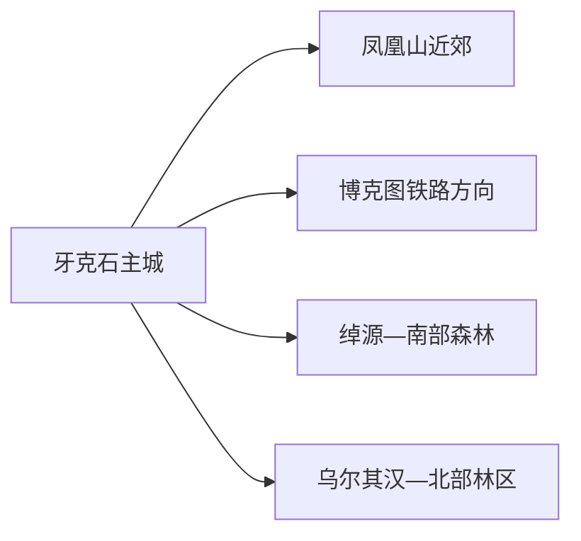
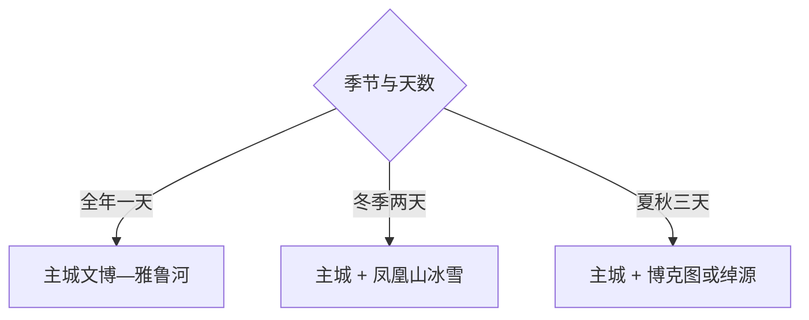

# 牙克石旅行指南

牙克石适合把“大兴安岭森林城市”和“季节性户外”分开体验：先用主城半日至一天熟悉林业、铁路与城市生活，再在凤凰山、博克图或绰源等方向中选一条完整日。冬季把雪场运营和道路放在第一顺位，夏秋则更适合森林、湿地与铁路遗产主题。

> 建议停留：主城 1 天；增加一条森林或冰雪线共 2–3 天 
> 旅行关键词：大兴安岭、林业城市、凤凰山、博克图铁路、森林湿地、冰雪 
> 主要体力：主城低至中等；森林、雪场与远线中至高 
> 最近研究：2026-08-13

## 城市速览

| 项目 | 旅行信息 |
|---|---|
| 主要旅行价值 | 以主城文博和林业城市空间建立背景，再按季节选择凤凰山、博克图铁路遗产或南北森林远线 |
| 建议停留 | 1 天主城；2 天加入凤凰山；3 天才考虑远线换宿 |
| 较舒适季节 | 6–9 月适合森林与城市步行；稳定雪季适合正规冰雪项目；春融和防火期按公告取舍 |
| 预算特点 | 主城中低；正规雪场、远线车辆、装备和换宿是主要增量 |
| 步行强度 | 主城可分段步行，远线依赖车辆；雪地、坡道和低温明显增加体力 |
| 主要天气风险 | 严寒、暴雪、大风、道路结冰、春融泥泞、雷雨与森林火险 |
| 独行旅行 | 主城方便；远线优先选择有固定集合点、返程和通信保障的产品 |
| 亲子旅行 | 城市公园、文博与低强度雪上体验较合适，年龄和装备按运营方规则选择 |
| 长者与低体力旅行 | 主城一馆一园或车辆抵达的短线更稳妥，远线减少步道与换乘 |
| 无障碍信息 | 现代公共场馆可先咨询，林地、铁路遗产和雪场的设施连续性需向官方确认 |

## 城市格局与游览区域

牙克石市是呼伦贝尔市代管的县级市，法定代码为 `150782`。GeoNames `2033536` 与 Wikidata `Q1010264` 精确对应牙克石市；地图上的主城点用于定位到发和住宿，法定市域还延伸到博克图、绰河源、乌尔其汉等林区城镇。

| 区域 | 主要内容 | 怎么安排 | 与其他区域的关系 |
|---|---|---|---|
| 主城 | 林业城市、公共文化、雅鲁河与铁路生活 | 作为住宿和补给基地，安排半日至一天 | 到各林区方向仍有长距离公路或铁路 |
| 凤凰山近郊 | 正规雪场、季节活动与山林 | 选一个当期开放主题做完整日 | 冬季与夏季项目、入口和装备不同 |
| 博克图方向 | 中东铁路遗存、城镇历史与山地 | 适合铁路历史专题，先核对可参观范围 | 与主城、绰源均不是连续步行区 |
| 绰源及南部 | 森林、峡谷、湿地和林区城镇 | 有两天并落实住宿、车辆时加入 | 保护地与林业生产边界优先于导航捷径 |
| 北部林区 | 乌尔其汉等林区城镇与森林资源 | 只选正式接待项目 | 与根河、鄂伦春旗等邻接方向分开核属地 |

天然林、湿地、林场作业区和防火道路各有管理边界。旅行采用政府或运营方公布的入口、步道和车辆线路；采伐作业、封闭防火道、瞭望与科研设施、未确认的林间支路属于保护或生产空间。

## 主要景点

### 主城与近郊

| 景点 | 区域 | 类型 | 主要看点 | 建议用时 | 室内外 | 体力 | 预约风险 | 天气影响 | 优先级 |
|---|---|---|---|---:|---|---|---|---|---|
| 牙克石城市文博与公共文化场馆 | 主城 | 地方文博 | 林业、铁路、民族与城市发展背景；按当期开放场馆选择 | 2–3 小时 | 室内 | 低 | 中 | 低 | A |
| 雅鲁河城市公共空间 | 主城 | 滨水与城市生活 | 观察河谷城市格局，适合与餐饮、场馆组合 | 1–2 小时 | 室外 | 低 | 低 | 高 | B |
| 凤凰山旅游区正式开放项目 | 近郊 | 山地、冰雪与季节活动 | 冬季雪上项目或夏秋山地活动，一次只选当期主项目 | 半日至 1 天 | 室外为主 | 中高 | 高 | 很高 | A |
| 牙克石林业科技馆等当期开放研学场馆 | 主城或近郊 | 林业科普 | 森林经营、生态保护与产业转型 | 1–2 小时 | 室内 | 低 | 高 | 低 | B |

### 林区与铁路远线

| 景点 | 区域 | 类型 | 主要看点 | 建议用时 | 室内外 | 体力 | 预约风险 | 天气影响 | 优先级 |
|---|---|---|---|---:|---|---|---|---|---|
| 博克图中东铁路遗产公开点 | 博克图 | 铁路遗产与城镇史 | 站区建筑、螺旋铁路相关展示与林区交通史 | 半日至 1 天 | 混合 | 中 | 高 | 高 | A |
| 巴林喇嘛山正式游线 | 博克图方向 | 山地与地貌 | 花岗岩山体、林地与季节步道 | 1 天 | 室外 | 高 | 高 | 很高 | B |
| 绰源森林与峡谷正式接待线 | 南部林区 | 森林、河谷与湿地 | 大兴安岭森林、河谷和林区城镇 | 1 天 | 室外 | 中高 | 很高 | 很高 | B |
| 乌尔其汉等北部林区当期项目 | 北部林区 | 森林与林业文化 | 林区生活、季节自然教育与公开活动 | 1 天 | 混合 | 中 | 很高 | 很高 | C |

博克图铁路设施仍可能承担运输、维护或办公功能，采用公开展陈和公共道路观察。凤凰山与林区项目按当季运营选择，宣传中的建设项目、赛事线路或踩线活动先核对是否转为日常散客产品。

## 美食与餐饮

主城适合解决日常东北菜、面食和牛羊肉；林区远线把正餐安排在城镇或住宿点。野生菌、山野菜和河鲜重在可追溯与充分加工，选择正规餐馆比自行采食更可靠。

| 类型 | 常见区域 | 一人用餐 | 饮食提示 | 选择方法 |
|---|---|---|---|---|
| 东北炖菜与锅包肉 | 主城 | 先问小份或半份 | 酱油、小麦、糖油和多人份量常见 | 单人可换盖饭、饺子或两道小菜 |
| 牛羊肉与烧烤 | 主城、林区镇 | 烧烤可少量点，火锅偏多人 | 肉类、乳制品、孜然和交叉接触 | 选明码标价、通风和冷链清楚的店 |
| 粘豆包、饺子与面食 | 主城 | 一人容易控制份量 | 小麦、糯米、豆馅、糖和肉馅 | 作为早午餐或远线补给 |
| 蓝莓及林下产品 | 正规商店 | 选有标签的小包装 | 核对配料、来源和储存 | 作为伴手礼，不以野外采摘替代 |

## 经典行程

### 一日经典路线

**路线**：主城公共文化场馆 → 城区午餐 → 雅鲁河公共空间 → 城市生活区

- **串联逻辑**：室内先建立林业与铁路背景，下午用河谷和城市街区补足空间感。
- **预约锚点**：公共场馆开放、入馆和讲解。
- **休息安排**：午餐与场馆坐席各一次。
- **时间不足时**：保留一座场馆与雅鲁河短段。

### 两日城市路线

**第 1 天**：主城经典线 
**第 2 天**：凤凰山当季一个正式项目

- **串联逻辑**：城市背景与近郊户外各用一天，住宿保持在主城。
- **预约锚点**：凤凰山票务、课程、装备、接驳与天气。
- **休息安排**：使用游客中心和暖区或遮蔽区。
- **时间不足时**：第二天只保留半日低强度项目。

### 三日深度路线

**第 1 天**：主城 
**第 2 天**：前往博克图，参观公开铁路遗产与镇区 
**第 3 天**：巴林喇嘛山正式游线或返回主城

- **串联逻辑**：把长距离转场、铁路遗产和山地分开，避免同日赶路。
- **预约锚点**：住宿、车辆、遗产开放与山地入口。
- **休息安排**：博克图镇区完成用餐和补给。
- **时间不足时**：删除山地日，保留铁路专题。

### 雨雪天路线

**路线**：主城文博 → 坐席午餐 → 当期开放室内公共文化空间

- **适用条件**：普通降雨或小雪且城区交通正常；暴雪和道路预警时缩短到住宿附近。
- **预约锚点**：场馆与城市交通。
- **休息安排**：全程使用室内坐席。
- **时间不足时**：只保留一座场馆。

### 亲子与低体力路线

**亲子路线**：林业科普场馆 → 午休 → 雅鲁河平缓公共段 
**低体力路线**：车辆到主城场馆 → 坐席午餐 → 城区短程观景

- **减负方式**：亲子减少连续低温暴露；低体力路线保留车辆和随时折返。
- **预约锚点**：儿童活动、推车、电梯、上下客点和卫生间。
- **休息安排**：场馆与餐厅两次坐休。
- **时间不足时**：两条路线都只保留场馆。

### 远郊一日路线

**路线**：已落实车辆与返程 → 绰源或北部林区一个正式接待项目 → 城镇午餐 → 原路返回

- **适用条件**：道路、天气、通信和防火状态正常。
- **预约锚点**：接待主体、入口、车辆与最晚返程。
- **休息安排**：城镇和正式服务点完成补给。
- **时间不足时**：缩短为主城近郊，不临时增加第二个林区方向。

## 住宿区域

| 区域 | 优点 | 取舍 | 适合人群 | 交通特点 |
|---|---|---|---|---|
| 牙克石主城 | 铁路、餐饮、医疗和补给集中 | 到远线车程长 | 首访、独行、两日游 | 默认基地，按站名和地址选房 |
| 凤凰山附近 | 早进当季项目方便 | 非旺季服务变化大 | 冰雪或赛事专题 | 先确认接驳、供暖和退改 |
| 博克图镇区 | 便于铁路遗产和周边山地 | 住宿选择少于主城 | 两日铁路历史线 | 锁定到发和次日车辆 |
| 绰源等林区镇 | 减少远线往返 | 通信、医疗与夜间交通有限 | 已有组织的森林专题 | 提前确认住宿资质与撤回方案 |

## 市内交通

| 场景 | 建议与取舍 | 行前核对 |
|---|---|---|
| 铁路抵达 | 牙克石站进入主城，再按方向分流 | 12306 票面、到发时刻、站口和夜间接驳 |
| 主城内部 | 公交、步行和正规出租组合 | 冬季路面、施工、末班与上下客点 |
| 凤凰山 | 采用运营方接驳或明确车辆 | 装备、雪具、停车、散场和保险 |
| 博克图与林区 | 优先正规客运、运营线路或合规包车 | 路况、加油、通信、最晚返程与救援 |

## 不同旅行者须知

| 旅行者 | 怎么选 | 主要取舍 | 额外核对 |
|---|---|---|---|
| 独行 | 主城加一个正规近郊项目 | 林区临时拼车和弱通信增加不确定性 | 车辆、返程、住宿和紧急联系人 |
| 亲子 | 林业科普、城市公园、入门雪上项目 | 低温、雪具和长途车按年龄缩短 | 儿童票、教练、防护与医务点 |
| 长者或低体力 | 一馆一园、车辆点到点 | 山地、雪面和遗产老建筑高差 | 坡道、电梯、轮椅、座椅与下客点 |
| 摄影 | 河谷、铁路建筑、森林和冰雪题材 | 日出车、低温电池和航拍规则 | 三脚架、无人机、商业拍摄和返程 |
| 预算有限 | 主城公共空间为核心 | 优先为远线车辆和必要装备留足预算 | 套票、租赁、接驳和退改 |

## 行前核对

| 事项 | 何时核对 | 官方入口 | 怎么处理 |
|---|---|---|---|
| 凤凰山运营 | 购票前及当天 | [牙克石市政府文旅动态](https://www.yks.gov.cn/News/show/1414416.html) | 按当季项目选择装备和用时 |
| 林区道路与防火 | 出发前三日及当天 | [牙克石市人民政府](https://www.yks.gov.cn/) | 预警或封控时改主城线 |
| 铁路与客运 | 订票时及出发当天 | [中国铁路 12306](https://www.12306.cn/) | 按票面站名和实际末班安排 |
| 天气 | 出发前三日及当天 | [内蒙古自治区气象局](https://nm.cma.gov.cn/) | 低温、大风或雷雨时降低户外强度 |

## 来源与更新记录

### 主要来源

| 来源 | 类型 | 支持内容 | 核验日期 |
|---|---|---|---|
| [牙克石市 2026 年政府工作报告](https://www.yks.gov.cn/OpennessContent/show/558789.html) | 市政府 | 凤凰山、博克图、绰源、北部林区与文旅发展方向 | 2026-08-13 |
| [牙克石市城市概况](https://www.yks.gov.cn/OpennessContent/show/401591.html) | 市政府 | 市域、林业城市和交通背景 | 2026-08-13 |
| [牙克石文旅活动资料](https://yks.gov.cn/OpennessContent/show/429178.html) | 市政府 | 主城、森林与季节活动 | 2026-08-13 |
| [牙克石生态修复规划](https://www.yks.gov.cn/file_hlbe/4/202512/202512161108392999c93go.pdf) | 市政府规划 | 林地、湿地、生产与生态边界 | 2026-08-13 |
| [GeoNames 2033536](https://www.geonames.org/2033536/) | 开放地理数据 | 固定城市点与坐标 | 2026-08-13 |
| [Wikidata Q1010264](https://www.wikidata.org/wiki/Q1010264) | 开放结构化数据 | 法定牙克石市与 GeoNames 精确映射 | 2026-08-13 |

### 更新记录

| 日期 | 更新内容 |
|---|---|
| 2026-08-13 | 首次完成牙克石独立旅行研究，建立主城、凤凰山、博克图与林区远线的选择框架，并补充森林保护、冬季交通和无障碍核对 |
