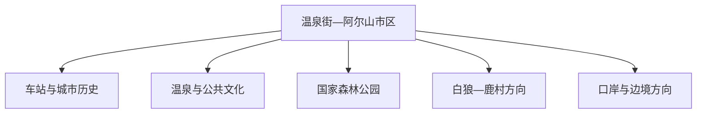
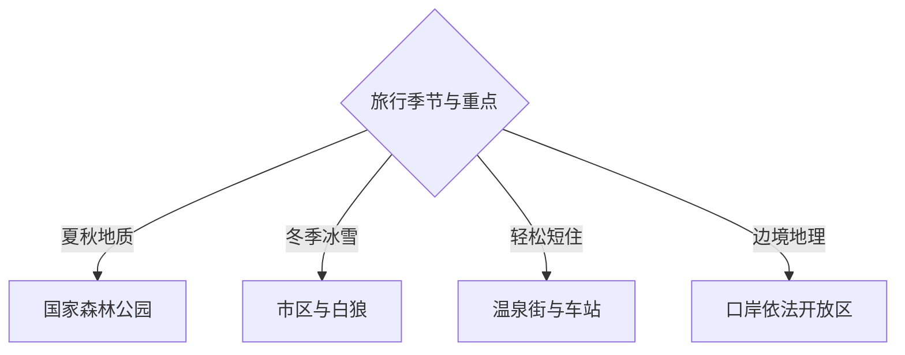

# 阿尔山旅行指南

阿尔山位于大兴安岭西南麓，以火山地质、森林湖泊、温泉、冰雪、边境林区和小型山城共同构成旅行体验。固定快照中的 **Wenquan / GeoNames 8054538** 对应温泉街道一带；市区紧凑，阿尔山国家森林公园、白狼和口岸等方向车程长，适合分别安排。

## 城市速览

| 项目 | 信息 |
|---|---|
| 主线 | 温泉山城—火山森林—白狼林俗—冰雪与边境 |
| 停留 | 市区 1 天；国家森林公园 1–2 天；白狼或口岸另加 1 天 |
| 住宿 | 温泉街适合交通餐饮；森林公园内住宿便于早晚但选择和条件有取舍 |
| 交通 | 航空、铁路、公路季节性强，远线多用景区车辆、包车或自驾 |
| 季节 | 夏季避暑、秋季彩林、冬季冰雪；春季融雪期重查道路与防火 |
| 预算 | 旺季住宿与远线车辆占比高，连续住宿能减少折返 |

## 城市格局与游览区域

市区沿河谷和铁路展开，是住宿补给中心；国家森林公园由多个火山湖、熔岩和森林景点组成，内部移动距离大。白狼侧重林俗与冬季体验，口岸方向涉及边境管理。保护区核心区、林业生产区、防火封控区、冰面和边境前沿按公告与现场边界活动。

## 主要景点

| 景点 | 区域 | 类型 | 核心体验 | 用时 | 环境 | 体力 | 研究价值 | 拥挤 | 优先级 |
|---|---|---|---|---:|---|---|---|---|---|
| 阿尔山国家森林公园 | 市域东北 | 火山森林景区 | 天池、火山地貌、熔岩、森林与湖泊 | 1–2天 | 室外 | 中高 | 很高 | 旺季高 | A |
| 阿尔山火车站及公共街区 | 温泉街 | 铁路建筑与城市街区 | 小城尺度、铁路史与山城生活 | 2小时 | 混合 | 低 | 高 | 旺季中 | A |
| 中国温泉博物馆或正规温泉体验 | 温泉街 | 温泉与地质 | 矿泉资源、疗养史与规范泡浴 | 2–3小时 | 室内 | 低 | 高 | 旺季中高 | A |
| 阿尔山世界地质公园公开展陈 | 市域 | 地质公园 | 火山活动、地貌演化与地学解释 | 半天 | 混合 | 低中 | 很高 | 团体时中 | A |
| 白狼峰与林俗村公开区 | 白狼镇 | 森林与林俗 | 大兴安岭林业记忆、山地与季节景观 | 1天 | 混合 | 中高 | 高 | 季节性 | B |
| 奥伦布坎等正规经营体验区 | 白狼方向 | 森林与文化体验 | 森林步道、地方文化与户外活动 | 半天至1天 | 室外 | 中 | 中 | 旺季中 | B |
| 阿尔山口岸依法开放参观点 | 西部边境方向 | 口岸与边境 | 国境交通、口岸城市与边地地理 | 1天 | 室外 | 低中 | 高 | 管理性 | C |

## 美食与餐饮

阿尔山餐饮融合蒙古族、东北和林区风味，可寻找牛羊肉、奶制品、山野菜、冷水鱼与炖菜。市区选择最多；景区餐饮点分散，提前准备饮水和应急食品。野生菌、野菜和自制酒选择有正规来源、加工充分的经营场所。

## 经典行程

### 市区一日线
**路线**：火车站公共区—城市展陈—午餐—正规温泉体验—河谷街区。**逻辑**：在紧凑范围内理解铁路、温泉与山城。**预约锚点**：温泉和展馆。**休息**：温泉街。**删除条件**：时间不足时保留车站与温泉二选一。

### 森林公园一日线
**路线**：早出发—景区核心火山湖与熔岩公开点—景区住宿或返城。**逻辑**：按景交顺序减少折返。**预约锚点**：门票、景交、住宿。**休息**：游客中心。**删除条件**：大雾、雷雨或封闭时按景区建议缩短。

### 森林公园两日线
**路线**：首日火山湖与地质点；次日森林、河流与次核心景点。**逻辑**：把长距离景交和步道拆开。**预约锚点**：连续住宿和两日票制。**休息**：景区服务区。**删除条件**：只有一天时按当日开放选择核心组团。

### 白狼林俗线
**路线**：市区—白狼镇—林俗公开体验—白狼峰依法开放段—返程。**逻辑**：连接林业城市史与自然环境。**预约锚点**：车辆、经营点和道路。**休息**：白狼镇。**删除条件**：积雪、火险或山路关闭时改市区线。

### 冬季冰雪线
**路线**：市区冰雪公共空间—正规冰雪项目—温泉。**逻辑**：户外活动后回到室内恢复。**预约锚点**：项目开放、装备与温泉。**休息**：市区。**删除条件**：极寒、大风预警时以文博和温泉为主。

### 亲子低体力线
**路线**：火车站公共区—地质展陈—午餐—正规温泉或短段河谷。**逻辑**：减少长步道和景交。**预约锚点**：儿童泡浴规则。**休息**：温泉街。**删除条件**：低温时只保留室内段。

### 口岸边境线
**路线**：市区—口岸方向依法开放参观点—沿途公共观景区—返程。**逻辑**：以完整一天承接边境距离和检查。**预约锚点**：证件、开放范围和车辆。**休息**：正规服务点。**删除条件**：临时管制、道路或天气变化时整段取消。

## 住宿区域

温泉街便于车站、餐饮和各方向集散，适合首访；森林公园住宿可减少往返，房型、餐饮、通信与供暖选择较有限；白狼适合林俗和冬季专题。旺季连续订房并核对退改、接送和夜间供暖。

## 市内交通

阿尔山机场、阿尔山站和公路班车受季节与天气影响，出发前复核。市区适合步行与短途出租；森林公园内部以景交规则为主，白狼和口岸方向提前安排车辆。自驾准备足够燃油、离线地图、保暖装备并遵守森林防火检查。

## 不同旅行者须知

地质旅行者给森林公园至少一天；亲子与长者优先市区、展陈和短步道；冬季旅行者控制户外暴露时间；摄影者关注日出前后低温和野生动物距离。自然保护地核心区、未开放林道、野生动物栖息地、非承载冰面与边境管理区保留明确限制。

## 行前核对

- 核对森林公园、白狼、冰雪项目、温泉与口岸开放状态。
- 核对机场、铁路、公路、景交和跨景点车辆。
- 核对森林草原火险、雷暴、积雪、极寒和道路封闭。
- 核对边境证件、摄影、无人机及临时管制要求。

## 来源与更新记录

| 来源 | 支持内容 | 核验日期 |
|---|---|---|
| [阿尔山市政府：走进阿尔山](https://www.aes.gov.cn/aes/zjaes/index.html) | 火山、森林、湿地、温泉、林俗与城市概况 | 2026-09-03 |
| [霍林郭勒市政府：区域旅游线路](https://www.hlgls.gov.cn/zjhs/lyhs/xzhs/) | 霍林郭勒—阿尔山区域交通与草原森林联动 | 2026-09-03 |
| [GeoNames 8054538](https://www.geonames.org/8054538/) | Wenquan 固定人口点与阿尔山市区位置 | 2026-09-03 |

