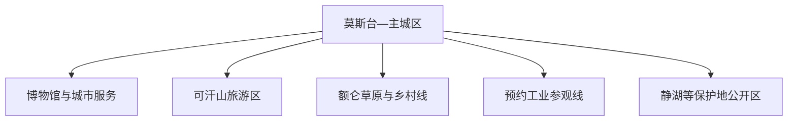
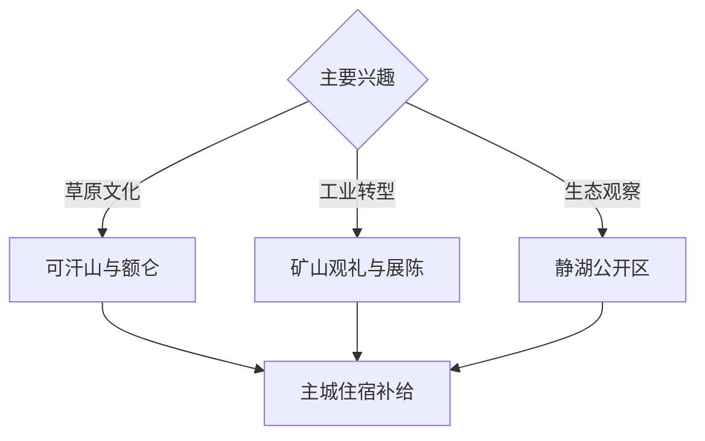

# 霍林郭勒旅行指南

霍林郭勒位于科尔沁草原北部，是草原、露天煤矿、铝产业、军马场记忆和资源型城市生态修复并置的县级市。固定快照中的 **Mositai / GeoNames 6569940** 对应莫斯台街道一带；主城是交通与住宿基地，可汗山、额仑草原和正式开放的工业参观点分方向安排。

## 城市速览

| 项目 | 信息 |
|---|---|
| 主线 | 主城文博—可汗山—额仑草原—工业与生态修复 |
| 停留 | 主城与可汗山 1 天；草原或工业主题另加 1 天 |
| 住宿 | 莫斯台—主城便于餐饮补给；草原住宿重在合法经营与保暖 |
| 交通 | 航空、铁路、公路均有季节变化，远点适合预约车辆或自驾 |
| 季节 | 夏秋适合草原；冬季可体验冰雪；全年关注强风和温差 |
| 预算 | 住宿平实，车辆、草原体验和跨区域线路是主要成本 |

## 城市格局与游览区域

主城区集中机场、车站、住宿和公共文化；草原、湿地、矿区与工业园区各有独立边界。草原行程沿公共道路和经营主体开放范围展开，牧业生产空间、矿坑、输电设施、厂区、湿地核心区和森林草原防火封控区执行现场管理。

## 主要景点

| 景点 | 区域 | 类型 | 核心体验 | 用时 | 环境 | 体力 | 研究价值 | 拥挤 | 优先级 |
|---|---|---|---|---:|---|---|---|---|---|
| 可汗山旅游区 | 主城近郊 | 草原文化景区 | 山地草原、城市视野与文化景观 | 半天 | 室外 | 中 | 高 | 旺季中高 | A |
| 霍林郭勒地方文博或展览馆 | 主城区 | 博物馆 | 建市史、草原文化与创业记忆 | 2–3小时 | 室内 | 低 | 很高 | 低 | A |
| 额仑草原依法开放体验区 | 市域草原 | 草原与民俗 | 科尔沁草原、牧业文化与季节花草 | 半天至1天 | 室外 | 中 | 高 | 旺季中 | A |
| 正式开放露天矿观礼点 | 工业区 | 工业研学 | 露天采矿尺度、设备与生态治理 | 半天 | 混合 | 低中 | 很高 | 预约制 | A |
| 静湖国家湿地公园公开区 | 市域湿地 | 湿地与生态 | 高寒湿地、候鸟与生态修复 | 半天 | 室外 | 低中 | 高 | 季节性 | B |
| 军马场红色教育公开点 | 额仑方向 | 红色与牧业史 | 军马场记忆、草原生产与地方建设 | 2–3小时 | 混合 | 低 | 高 | 团体时中 | B |
| 马拉嘎冰川遗迹依法开放点 | 查格达方向 | 地质 | 冰缘地貌与草原地质 | 半天至1天 | 室外 | 中高 | 很高 | 低 | C |

## 美食与餐饮

霍林郭勒适合体验手把肉、奶制品、蒙古馅饼、牛羊肉火锅和东北风味家常菜。主城区点餐最灵活；草原餐饮多按桌或套餐，独行者提前确认份量。对奶制品、羊肉、酒精或坚果敏感时，在预订餐食阶段说明。

## 经典行程

### 主城一日线
**路线**：地方文博—午餐—可汗山—主城晚餐。**逻辑**：先理解建市与草原背景，再看城市外围地貌。**预约锚点**：场馆和景区开放。**休息**：主城区。**删除条件**：强风时缩短山顶停留。

### 草原一日线
**路线**：主城—额仑草原开放体验区—正规牧户或营地—返程。**逻辑**：给草原景观和文化体验完整白天。**预约锚点**：经营主体、车辆和餐食。**休息**：正规营地。**删除条件**：火险、雷雨或道路管制时改主城线。

### 工业转型线
**路线**：城市展陈—露天矿正式观礼点—生态修复展示。**逻辑**：按开采、城市建设和修复理解资源型经济。**预约锚点**：实名、劳保和接待时间。**休息**：主城。**删除条件**：企业停接时只保留展陈。

### 湿地生态线
**路线**：主城—静湖公开区—生态观察—返程。**逻辑**：以短步行观察湿地与候鸟。**预约锚点**：开放季与观鸟规则。**休息**：入口服务点。**删除条件**：候鸟保护、强风或积水封闭时整段顺延。

### 军马场记忆线
**路线**：地方文博—军马场公开教育点—额仑方向乡村。**逻辑**：连接草原生产与城市创业史。**预约锚点**：接待安排。**休息**：正规乡村服务点。**删除条件**：团体接待暂停时改可汗山。

### 亲子低体力线
**路线**：地方展陈—可汗山低坡公开区—主城公园。**逻辑**：控制车程与步行，保留城市核心叙事。**预约锚点**：场馆。**休息**：主城。**删除条件**：低温或大风时只保留室内展陈。

### 两日组合线
**路线**：首日主城与可汗山；次日草原、工业或湿地三选一。**逻辑**：远线按兴趣独立成日。**预约锚点**：第二日车辆和接待。**休息**：连续住主城。**删除条件**：一天时保留主城线。

## 住宿区域

莫斯台及主城商业区适合补给、交通与夜间用餐；草原营地适合日落与星空体验。营地预订核对持证经营、消防、夜间保暖、卫浴、饮水、通讯和恶劣天气退改。

## 市内交通

霍林河机场、霍林郭勒站和公路客运的线路具有季节性，订票后复核实际运行。主城用公交、出租车和网约车；草原、湿地、地质与工业点提前安排车辆。自驾留足燃油和通信余量，沿公共道路行驶并服从草原防火检查。

## 不同旅行者须知

草原摄影者准备防风与防晒；产业旅行者先锁定正式接待；亲子家庭以文博、可汗山短线为主；观鸟者使用长焦并保持保护距离。矿坑、生产车间、输电走廊、牧场生产区、湿地核心区和边境管理区域保留明确限制。

## 行前核对

- 核对机场与铁路班次、道路施工、燃油补给和返程时间。
- 核对可汗山、额仑草原、静湖、军马场和地质点开放范围。
- 核对工业参观实名、劳保、拍摄和接待要求。
- 核对雷暴、强风、低温、森林草原火险及候鸟保护公告。

## 来源与更新记录

| 来源 | 支持内容 | 核验日期 |
|---|---|---|
| [霍林郭勒市政府：自然风光](https://www.hlgls.gov.cn/zjhs/hsgk/sqjj/201505/t20150509_165732.html) | 可汗山、草原、冰川遗迹与城市自然景观 | 2026-09-03 |
| [霍林郭勒市政府：十四五规划](https://www.hlgls.gov.cn/zwgk/zfxxgk/fdzdgknr/ghxx/fzgh/202205/t20220508_154982.html) | 草原、工业、湿地、军马场及旅游线路格局 | 2026-09-03 |
| [GeoNames 6569940](https://www.geonames.org/6569940/) | Mositai 固定人口点与霍林郭勒主城位置 | 2026-09-03 |

