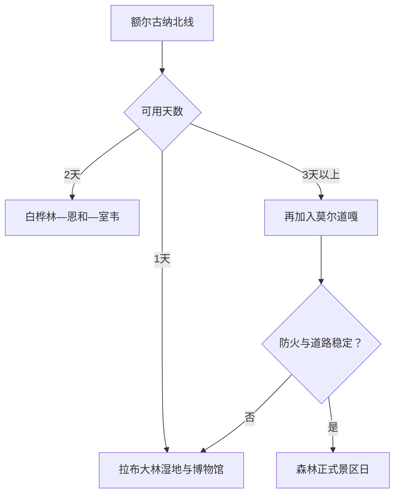

# 额尔古纳旅行指南

额尔古纳是一个从拉布大林湿地城市向白桦林、恩和、室韦和莫尔道嘎森林纵深展开的超大县级市。城市页的关键不是把地名全部装进环线，而是按湿地、民族乡镇、边境河谷和森林四种管理环境分日，并预留长距离公路与天气缓冲。

## 城市速览

| 项目 | 信息 |
|---|---|
| 旅行主线 | 额尔古纳湿地公开景区、白桦林、恩和、室韦、莫尔道嘎正式景区 |
| 建议停留 | 拉布大林 1 天；恩和—室韦 2 天；莫尔道嘎再加 1–2 天 |
| 住宿基地 | 拉布大林便于补给；恩和或室韦适合北线过夜；莫尔道嘎用于森林线 |
| 步行强度 | 湿地栈道中等；乡镇低至中；森林步道中至高 |
| 主要天气 | 大风、雷暴、短时强降雨、早霜、严寒、道路结冰与森林草原火险 |
| 预约核心 | 湿地与森林景区、住宿、长途车辆、边境与防火规则 |
| 边界重点 | 自然保护区、牧场、林业施业区、边境巡护路和河岸分别管理 |
| 无障碍 | 拉布大林场馆较易询问；湿地观景坡道与远线服务连续性需确认 |

## 城市格局与游览区域

额尔古纳是呼伦贝尔市代管的县级市，法定代码 `150784`；GeoNames `2036266` 与 Wikidata `Q1209710` 对应城市实体。市政府驻拉布大林，白桦林和恩和沿北向公路展开，室韦位于边境河谷，莫尔道嘎进入大兴安岭森林，彼此距离适合分段住宿。

| 区域 | 旅行价值 | 怎么安排 |
|---|---|---|
| 拉布大林 | 城市服务、湿地景区与民族博物馆 | 到达日或完整一日 |
| 白桦林—恩和 | 森林景观与民族乡镇生活 | 一日并在北线过夜 |
| 室韦方向 | 边境河谷、蒙兀室韦文化与乡镇景观 | 独立一日，按边境规则活动 |
| 莫尔道嘎方向 | 大兴安岭森林与林业文化 | 一至两日，按防火和景区开放安排 |

## 主要景点

| 景点 | 所在区域 | 类型 | 核心看点 | 建议用时 | 室内/室外 | 体力 | 预约难度 | 天气敏感度 | 适合旅程 |
|---|---|---|---|---|---|---|---|---|---|
| 额尔古纳湿地景区 | 拉布大林 | 湿地与观景 | 湿地河流曲线、观景台与公开栈道 | 3–5 小时 | 室外 | 中 | 中高 | 极高 | A |
| 额尔古纳民族博物馆 | 拉布大林 | 地方博物馆 | 多民族历史、牧林生活与地方文化 | 2–3 小时 | 室内 | 低 | 中高 | 低 | A |
| 白桦林景区 | 北线 | 森林与自然 | 成片白桦林、林下生态与季节景观 | 2–4 小时 | 室外 | 中 | 中高 | 高 | A |
| 恩和俄罗斯族民族乡 | 北线 | 乡镇与文化 | 聚落景观、地方饮食和文化交流 | 半日至 1 天 | 混合 | 低至中 | 中 | 高 | A |
| 蒙兀室韦文化旅游景区 | 室韦 | 边境乡镇与历史 | 额尔古纳河谷、蒙兀室韦文化与边境景观 | 半日至 1 天 | 室外为主 | 中 | 高 | 极高 | B |
| 莫尔道嘎国家森林公园 | 森林线 | 森林与山地 | 大兴安岭森林、河谷与正式游览线路 | 1 天 | 室外 | 中至高 | 高 | 极高 | B |

额尔古纳湿地景区、国家湿地公园和额尔古纳湿地自然保护区是不同管理对象。旅行进入有明确游客设施的景区和公开步道；保护区内的经营、穿越、露营与车辆活动执行管理通告。牧场、林场作业区和边境巡护道路同样按许可使用。

## 美食与餐饮

| 类型 | 适合场景 | 份量 | 过敏与饮食提示 | 怎么选 |
|---|---|---|---|---|
| 蒙餐与手把肉 | 拉布大林或乡镇正餐 | 多为共享 | 牛羊肉、乳制品和较高盐分 | 先问重量、小份和主食 |
| 列巴与俄式点心 | 恩和、室韦早餐或茶歇 | 一人或分享 | 麸质、奶、蛋、坚果和糖 | 选当日制作并确认配料 |
| 奶制品 | 途中补给 | 小份 | 乳糖、发酵程度和冷链 | 少量试吃，核对储存条件 |
| 森林山野菜与菌类 | 正规餐馆正餐 | 共享 | 菌类识别、野菜来源和共锅 | 只选正规经营点供应的食材 |

## 经典行程

### 一日拉布大林路线

**路线**：民族博物馆 → 午餐 → 额尔古纳湿地景区公开游线

- **串联逻辑**：先理解民族与生态背景，再登高看湿地格局。
- **预约锚点**：博物馆、湿地景区和往返交通。
- **休息安排**：正午在城区用餐。
- **时间不足时**：保留博物馆与湿地核心观景点。

### 两日北线经典路线

**第 1 天**：拉布大林—湿地—白桦林—恩和入住 
**第 2 天**：恩和—室韦正式景区—原住宿地或下一站

- **串联逻辑**：沿北向公路顺行，避免回拉布大林折返。
- **预约锚点**：车辆、住宿、白桦林、室韦与边境规则。
- **休息安排**：恩和承担过夜和补给。
- **时间不足时**：第二天只保留恩和或室韦一处。

### 森林深度路线

**路线**：恩和或拉布大林早出发 → 莫尔道嘎正式景区 → 镇区住宿

- **适用条件**：森林防火、道路、景区和住宿稳定。
- **预约锚点**：准确入口、景交、最晚离园与返程。
- **休息安排**：只在正式服务点补给。
- **时间不足时**：整段顺延，不压缩为夜路往返。

### 雨天路线

**路线**：额尔古纳民族博物馆 → 午餐 → 拉布大林近距离室内活动

- **适用条件**：城区交通正常；暴雨或雷暴时取消湿地、林区和边境远线。
- **预约锚点**：场馆开放、道路与住宿退改。
- **休息安排**：减少户外等车和坡道。
- **时间不足时**：只保留博物馆。

### 亲子路线

**路线**：民族博物馆 → 午休 → 白桦林景区短线

- **串联逻辑**：地方文化与林下生态各一个主题。
- **预约锚点**：儿童讲解、步道、卫生间和车辆。
- **休息安排**：户外段控制在两小时左右。
- **时间不足时**：保留博物馆。

### 低体力路线

**路线**：车辆到达民族博物馆 → 午餐长休 → 湿地景区近入口观景段

- **适用条件**：景区落客、景交和坡道信息已确认。
- **预约锚点**：轮椅、座椅、卫生间与返程。
- **休息安排**：每处只看核心区域。
- **时间不足时**：删除湿地段。

### 室韦边境延伸路线

**路线**：恩和早出发 → 室韦正式景区与公共街区 → 服务点午休 → 按原计划住宿

- **适用条件**：边境、道路、天气和住宿稳定。
- **预约锚点**：证件、检查、准确入口与最晚到店。
- **休息安排**：在镇区正规经营点用餐。
- **时间不足时**：整段删除，留在恩和慢游。

## 住宿区域

| 区域 | 优点 | 取舍 | 适合人群 | 核对项 |
|---|---|---|---|---|
| 拉布大林 | 补给、餐饮、医疗和叫车更完整 | 北线往返距离长 | 首访、到达日 | 供暖、停车、早餐和车辆 |
| 恩和正规住宿 | 便于白桦林与室韦衔接 | 旺季紧张、服务差异大 | 北线慢游 | 合法经营、供暖、消防和退改 |
| 室韦正规住宿 | 接近边境河谷与早晚景观 | 边境与道路条件更敏感 | 摄影、深度游 | 准确地址、证件、通信和最晚入住 |
| 莫尔道嘎镇区 | 便于森林线 | 去其他主线距离长 | 森林旅行 | 防火、景区入口、供暖和返程 |

## 市内交通

| 场景 | 怎么做 | 行前核对 |
|---|---|---|
| 海拉尔或其他城市到达 | 客运、自驾或正规车辆到拉布大林 | 班次、道路、夜间到达和行李 |
| 拉布大林—恩和—室韦 | 顺方向包车或自驾，并分段住宿 | 路况、加油、通信、检查和返程 |
| 莫尔道嘎方向 | 单独安排车辆与至少一天 | 防火、道路、景交、住宿和最晚离园 |
| 冬季与肩季 | 缩短远线并增加天气缓冲 | 降雪、结冰、供暖和车辆冬季装备 |

## 不同旅行者须知

| 旅行者 | 推荐做法 | 重点核对 |
|---|---|---|
| 独行 | 住镇区并使用正规车辆 | 司机资质、通信、夜间到店和返程 |
| 亲子 | 博物馆加白桦林短线 | 儿童座椅、防虫、防晒和卫生间 |
| 长者与低体力 | 拉布大林一日，湿地用景交减步行 | 坡道、轮椅、座椅和落客 |
| 摄影 | 湿地、室韦和森林分日 | 边境拍摄、无人机、日落返程和保暖 |
| 自驾 | 每日一个方向并白天完成长路 | 雨雪、野生动物、燃油、轮胎和疲劳 |

## 行前核对

- 额尔古纳市政府特色旅游：景区、乡镇、博物馆与活动。
- 湿地保护区、林草和景区公告：开放边界、防火、露营、车辆与无人机。
- 内蒙古气象、交通与应急信息：雷暴、降雪、大风、火险和道路。
- 住宿与车辆经营方：准确位置、合法资质、保险、退改和紧急联系。

## 来源与更新记录

| 来源 | 支持内容 | 核验日期 |
|---|---|---|
| [额尔古纳市政府：特色景区](http://eegn.gov.cn/News/showList/8787/page_1.html) | 湿地、白桦林、恩和、室韦、莫尔道嘎与博物馆 | 2026-09-01 |
| [额尔古纳市政府：白桦林景区](http://eegn.gov.cn/News/show/529284.html) | 白桦林位置、规模与交通背景 | 2026-09-01 |
| [额尔古纳湿地自然保护区通告](http://www.eegn.gov.cn/News/show/1439809.html) | 保护区内旅游经营与活动边界 | 2026-09-01 |
| [Wikidata Q1209710](https://www.wikidata.org/wiki/Q1209710) | 额尔古纳市实体对齐 | 2026-09-01 |
| [GeoNames 2036266](https://www.geonames.org/2036266/) | 固定额尔古纳城市点 | 2026-09-01 |
| [内蒙古自治区气象局](http://nm.cma.gov.cn/) | 气象预警 | 2026-09-01 |

| 日期 | 更新 |
|---|---|
| 2026-09-01 | 首次完成拉布大林、白桦林、恩和、室韦与莫尔道嘎研究，并区分景区、保护区、牧场、林区和边境空间。 |
