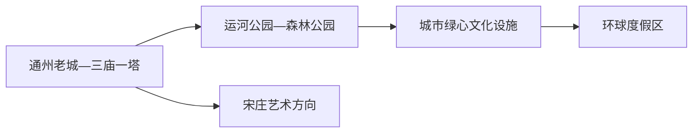
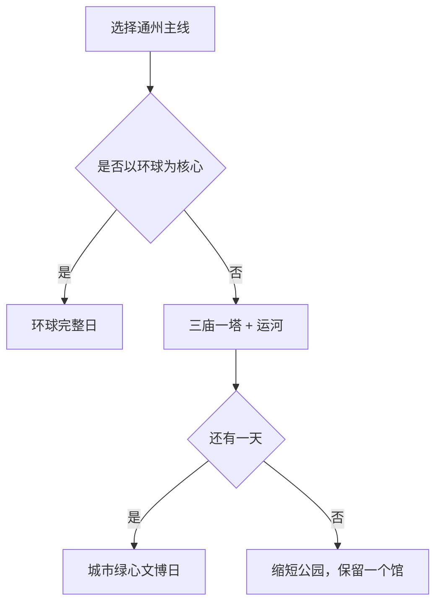

# 通州旅行指南

通州是北京城市副中心，也是一座以大运河为主轴、文化设施与大型主题度假区分属不同组团的远郊城区。运河文化旅游景区、城市绿心文化设施和环球度假区最好分日安排；住宿选择应围绕当天的核心入口，而不是笼统选择“北京东部”。

> 建议停留：2–3 天 
> 旅行关键词：大运河、三庙一塔、北京大运河博物馆、城市绿心、环球度假区 
> 主要体力：中等；公园与主题度假区可达高强度 
> 最近研究：2026-08-12

## 城市速览

| 项目 | 旅行信息 |
|---|---|
| 主要旅行价值 | 在运河沿线理解漕运和古通州，在城市绿心看大型公共文化设施，再按兴趣安排环球度假区。 |
| 建议停留 | 1 天选运河或环球；2 天分别完成；3 天增加绿心文博与宋庄艺术方向。 |
| 较舒适季节 | 春秋适合长距离公园步行；夏季防暑雷雨，冬季防风寒并缩短户外。 |
| 预算特点 | 运河公共空间较易控制，环球票务、园区消费和跨组团住宿是主要增量。 |
| 步行强度 | 运河森林公园和环球均尺度大；场馆内部也需要长时间站立。 |
| 主要天气风险 | 高温、雷暴、暴雨、大风、冰雪和河道水情。 |
| 独行旅行 | 轨道交通和场馆便于独立安排，热门预约与晚间返程提前锁定。 |
| 亲子旅行 | 大运河博物馆、城市图书馆和环球适合分龄选择，避免一天塞入多个大馆。 |
| 长者与低体力旅行 | 每天只选一座大馆或一段运河，利用地铁与正规车辆减少折返。 |
| 无障碍信息 | 新场馆和园区有服务基础，跨站、跨园和长距离户外的设施连续性需向官方确认。 |

### 城市身份与边界

通州区法定代码为 **110112**，是北京市辖区。固定 **GeoNames 1792520** 连接薄居民点实体 **Q28795252**；法定区实体采用 **Wikidata Q393836**，其 `P1566=1792555` 指向行政记录。北京中心城区、顺义、大兴和河北三河均按跨区或跨省移动理解。

## 城市格局与游览区域

| 区域 | 主要内容 | 游览特点 | 与其他区域的关系 |
|---|---|---|---|
| 老城—三庙一塔 | 燃灯塔、文庙等古建、西海子公园 | 历史点位集中，修缮和活动影响开放 | 可与运河公园北段组成一天 |
| 运河公园—森林公园 | 大运河水岸、绿道和正规游船 | 线性距离长，入口与码头先选 | 与绿心相邻但不宜全程步行串完 |
| 城市绿心 | 北京大运河博物馆、北京城市图书馆、北京艺术中心 | 三座大型设施各自需要预约和时间 | 一天安排一至两座，留室内休息 |
| 环球度假区 | 主题公园、商业与度假酒店 | 通常占完整一天，票制和项目动态性高 | 与运河文博分日 |
| 宋庄方向 | 美术馆、艺术空间和活动 | 场馆开放差异大，公共交通末端需核 | 作为兴趣半日，逐馆选择已公布开放的空间 |

## 主要景点

### 运河与老城

| 景点 | 区域 | 类型 | 主要看点 | 建议用时 | 室内外 | 体力 | 预约风险 | 天气影响 | 优先级 |
|---|---|---|---|---:|---|---|---|---|---|
| 北京（通州）大运河文化旅游景区 | 老城至森林公园 | 5A景区、城市水岸 | 三庙一塔、运河公园和森林公园组成的完整运河文化主轴 | 5–8 小时 | 户外为主 | 中高 | 中 | 高 | A |
| 正规运河游船 | 公布码头 | 水上体验 | 从水面观察运河与城市副中心 | 1–2 小时 | 户外 | 低 | 高 | 极高 | B |

### 城市绿心与度假区

| 景点 | 区域 | 类型 | 主要看点 | 建议用时 | 室内外 | 体力 | 预约风险 | 天气影响 | 优先级 |
|---|---|---|---|---:|---|---|---|---|---|
| 北京大运河博物馆 | 城市绿心 | 综合博物馆 | 大运河历史、考古、漕运与文化遗产 | 2.5–4 小时 | 室内 | 低至中 | 高 | 低 | A |
| 北京城市图书馆 | 城市绿心 | 公共文化建筑 | 阅读空间、建筑和公共文化活动 | 1.5–3 小时 | 室内 | 低 | 中 | 低 | B |
| 北京艺术中心 | 城市绿心 | 表演艺术 | 当期戏剧、音乐与演出空间 | 按演出 | 室内 | 低 | 高 | 低 | B |
| 北京环球度假区 | 梨园—文景方向 | 主题度假区 | 主题园区、演艺、商业与度假体验 | 8–12 小时 | 混合 | 高 | 极高 | 高 | A |

大运河文化旅游景区按一个完整父景区理解，三庙一塔、运河公园和森林公园作为内部游览片区选择。河道、闸坝、施工岸线和非公布码头不作为游客入口。

## 美食与餐饮

| 菜品或餐饮类型 | 常见区域 | 一个人用餐与常见份量 | 风味、过敏原与饮食限制 | 排队风险与替代方法 |
|---|---|---|---|---|
| 通州小楼烧鲇鱼等运河菜 | 老城正规餐馆 | 鱼菜多适合分享 | 鱼刺、酱油、小麦和大豆需注意 | 先问重量、价格和小份 |
| 北京早餐与面食 | 老城、社区 | 单人友好 | 小麦、芝麻、大豆和肉汤常见 | 社区同类店可替代热门店 |
| 环球园区餐饮 | 度假区 | 套餐和快餐为主 | 配料、过敏原和清真素食选择先查 | 错峰并准备园区允许的补给 |
| 商务区与绿心周边餐饮 | 副中心 | 单人套餐选择多 | 连锁与地方菜并存，按菜单确认 | 演出散场时提前订位或错峰 |

## 经典行程

### 一日经典路线

**路线**：三庙一塔 → 老城午餐 → 运河公园 → 大运河森林公园一个短段

- **串联逻辑**：沿运河由历史核心向南推进，减少跨区折返。
- **预约锚点**：三庙一塔开放、游船或公园活动。
- **休息安排**：老城午餐，森林公园入口再坐休。
- **时间不足时**：保留三庙一塔和运河公园，森林公园缩短。

### 两日城市路线

**第 1 天**：三庙一塔与运河  
**第 2 天**：北京大运河博物馆 → 午休 → 城市图书馆或艺术中心

- **串联逻辑**：第一天看线性文化景观，第二天在绿心集中看公共文化。
- **预约锚点**：大运河博物馆与演出。
- **休息安排**：第二天最多两座大型设施。
- **时间不足时**：第二天只保留大运河博物馆。

### 三日深度路线

**第 1 天**：运河老城  
**第 2 天**：城市绿心  
**第 3 天**：环球度假区完整日或宋庄艺术半日二选一

- **串联逻辑**：三条空间主线分日，第三天按预算和兴趣选择。
- **预约锚点**：环球票务或宋庄场馆开放。
- **休息安排**：环球日预设室内休息，宋庄日午后返回主城。
- **时间不足时**：第三天整段删除。

### 雨雪天路线

**路线**：北京大运河博物馆 → 室内午餐 → 城市图书馆或有票演出

- **适用条件**：普通降雨降雪且交通正常；极端天气按官方停运信息调整。
- **串联逻辑**：同在城市绿心，短程连接并以室内停留为主。
- **预约锚点**：两馆与演出票务。
- **休息安排**：午餐和馆内座位分开安排。
- **时间不足时**：只看大运河博物馆。

### 亲子或低体力路线

**亲子路线**：大运河博物馆适龄展陈 → 午餐 → 城市绿心短段  
**低体力路线**：车辆到三庙一塔最近入口 → 核心开放建筑 → 午休 → 运河公园短段

- **减负方式**：亲子控制大馆时长；低体力路线用车辆和短段替代森林公园长线。
- **预约锚点**：儿童活动、无障碍入口、轮椅和最近落客点。
- **休息安排**：每个主题后安排室内坐休。
- **时间不足时**：两线均保留一个核心点。

### 环球度假区一日路线

**路线**：住宿地 → 园区正式入口 → 按优先项目组织一条环线 → 室内午餐与休息 → 晚间按体力离园

- **适用条件**：票务、入园、项目身高健康规则和返程已确认。
- **串联逻辑**：围绕少量高优先项目排队，减少全园往返。
- **预约锚点**：门票、快速服务、演出和住宿退改。
- **休息安排**：午后安排室内长休，夏季增加补水。
- **时间不足时**：删低优先项目，保留离园交通缓冲。

## 住宿区域

| 区域 | 优点 | 代价 | 适合人群 | 交通提示 |
|---|---|---|---|---|
| 通州老城—运河商务区 | 运河、餐饮与城市服务方便 | 到环球仍需轨道或车辆 | 运河文博、两日首访 | 以实际地铁站和入口选房 |
| 城市绿心周边 | 靠近大馆和演出 | 晚间餐饮分布不如老城密集 | 文博、演出 | 核对场馆出口与住宿步行距离 |
| 环球度假区周边 | 早入园和晚离园方便 | 价格和退改压力较高 | 主题乐园核心行程 | 比较园区酒店、地铁与正规接驳 |
| 北京中心城区 | 城市联程方便 | 每日往返通州耗时 | 多区组合 | 用门到门时间而非行政区名判断 |

## 市内交通

通州依靠地铁、公交、市郊铁路、出租和步行组成多层交通。地铁站、铁路站、景区入口和码头的名字不能互换；大型活动和节假日还会改变进出站与停车安排。

| 场景 | 建议与取舍 | 行前需要重查的内容 |
|---|---|---|
| 从北京其他城区抵达 | 地铁适合稳定跨区移动，市郊铁路按班次选择 | 线路、首末班、换乘电梯和车站实名要求 |
| 运河沿线 | 公交、步行、骑行与正规游船分段组合 | 码头、船期、骑行规则、封路和水情 |
| 城市绿心与环球 | 轨道到达后按具体入口步行或接驳 | 安检、出口、末班、散场和无障碍路径 |
| 自驾 | 适合携老幼或多人，但停车压力高 | 预约停车、限行、活动交通管制和充电 |

## 不同旅行者须知

- **独行旅行**：地铁与大馆容易组合，夜间散场提前确认末班。
- **亲子旅行**：一天只选一个大馆或环球，按年龄与身高选择项目。
- **长者与低体力旅行**：车辆或地铁连接，一段运河加一座馆即可形成完整日。
- **无障碍需求**：联系场馆、园区与交通运营方确认电梯、轮椅、落客和连续路线。
- **骑行与水上体验**：只使用开放绿道、共享设施和公布码头，按天气与现场管理调整。

## 行前核对

| 核对事项 | 建议时间 | 官方入口 |
|---|---|---|
| 大运河景区与三庙一塔 | 排路线前及前一日 | [首都之窗·三庙一塔](https://www.beijing.gov.cn/renwen/rwzyd/qxdw/qyyhxzdy/smyt/202309/t20230922_3264921.html) |
| 北京大运河博物馆 | 确定日期后及前一日 | [北京市文物局](https://wwj.beijing.gov.cn/bjww/wwjzzcslm/1737418/1738088/1742745/743627282/index.html) |
| 环球度假区 | 购票、订房前及当天 | [北京环球度假区](https://www.universalbeijingresort.com/) |
| 地铁、天气与水情 | 出发前三日及当天 | [北京地铁](https://www.bjsubway.com/) · [北京市气象局](https://bj.cma.gov.cn/) |

## 来源与更新记录

### 主要来源

| 来源 | 支持内容 | 核验日期 |
|---|---|---|
| [民政部行政区划代码查询](https://dmfw.mca.gov.cn/) | 通州区 110112 | 2026-08-12 |
| [Wikidata Q393836](https://www.wikidata.org/wiki/Q393836) | 法定区与 GeoNames 行政记录 | 2026-08-12 |
| [GeoNames 1792520](https://www.geonames.org/1792520/tongzhou.html) | 固定通州居民点 | 2026-08-12 |
| [首都之窗：大运河景区结构](https://www.beijing.gov.cn/renwen/sy/whkb/202207/t20220729_2781722.html) | 三庙一塔、运河公园和森林公园关系 | 2026-08-12 |
| [北京市文物局：北京大运河博物馆](https://wwj.beijing.gov.cn/bjww/wwjzzcslm/1737418/1738088/1742745/743627282/index.html) | 场馆性质、地址和功能 | 2026-08-12 |
| [北京市公园名录](https://yllhj.beijing.gov.cn/ggfw/bjsggml/bjsgymlzb/202511/P020251127601806691724.pdf) | 通州公园与管理单位 | 2026-08-12 |

### 更新记录

| 日期 | 更新内容 |
|---|---|
| 2026-08-12 | 首次整理通州实体、运河—绿心—环球三组团、路线、住宿、交通与水域边界。 |
