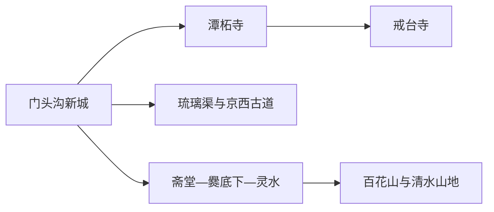
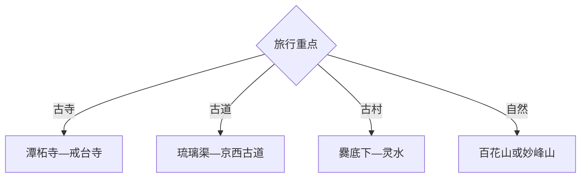

# 门头沟旅行指南

门头沟适合把北京西山的古寺、古道、古村与山地自然景观拆成多次短途：潭柘寺和戒台寺可组成近郊文化日，京西古道与琉璃渠看山地交通和工艺，爨底下、灵水及百花山方向留给完整远郊日。两天以上更能消化区内距离。

## 城市速览

| 项目 | 信息 |
|---|---|
| 主线 | 门头沟新城—潭柘寺—戒台寺—京西古道—斋堂古村—百花山方向 |
| 停留 | 近郊文化1天；增加古村或山地共2–3天 |
| 住宿 | 新城适合交通换线，斋堂与清水方向适合远山早出晚归 |
| 交通 | 北京城区乘轨道和公交到新城，再按片区换公交、预约车或自驾 |
| 风险 | 山区天气、落石积水、汛期道路调整、林地防火与冬季结冰 |
| 边界 | 寺院、文保建筑、古村民宅、自然保护地和修复路段按开放范围进入 |

## 城市格局与游览区域

固定 `Mentougou / GeoNames 1800657` 对应门头沟主城，本页以法定门头沟区 `Q185584` 组织。潭柘寺、戒台寺处在较近的东南山麓；古道、古村和百花山继续向西，适合按走廊分日。

## 主要景点

| 景点 | 区域 | 类型 | 核心体验 | 用时 | 环境 | 体力 | 预约风险 | 天气影响 | 优先级 |
|---|---|---|---|---:|---|---|---|---|---|
| 潭柘寺 | 潭柘寺镇 | 古寺 | 古建筑、古树与西山寺院格局 | 3–5小时 | 室内外 | 中 | 高 | 中 | A |
| 戒台寺 | 永定镇西侧 | 古寺 | 戒坛、古松与寺院建筑 | 3–5小时 | 室内外 | 中 | 高 | 中 | A |
| 京西古道公开段 | 妙峰山镇等 | 线性遗产 | 商旅古道、蹄窝与山村关系 | 4–7小时 | 室外 | 中高 | 中 | 很高 | A |
| 爨底下村 | 斋堂镇 | 传统村落 | 山地院落、村巷与聚落格局 | 4–6小时 | 室外为主 | 中 | 高 | 高 | A |
| 灵水村 | 斋堂镇 | 传统村落 | 古村、乡贤文化与街巷 | 3–5小时 | 室外为主 | 中 | 中 | 高 | B |
| 妙峰山开放游线 | 妙峰山镇 | 山地文化 | 山景、传统香会文化与步道 | 半日至1天 | 室外 | 高 | 高 | 很高 | B |
| 百花山开放区 | 清水镇方向 | 山地生态 | 高山草甸、花期与自然观察 | 1天 | 室外 | 高 | 很高 | 极高 | B |
| 琉璃渠与永定河文化展陈 | 龙泉镇 | 工艺与地方史 | 琉璃烧造、河谷聚落与区史 | 3–5小时 | 室内外 | 低中 | 高 | 中 | B |

## 美食与餐饮

新城适合解决稳定正餐，山区可选斋堂、清水等成熟接待点的农家菜、贴饼子、炖菜和时令山货。远线在出发前确认供餐和饮水；采买山货按明码标价选择，野生植物以正规经营渠道为准。

## 经典行程

### 一日经典线
**路线**：潭柘寺—午餐—戒台寺。**逻辑**：用同一山麓的两座古寺建立门头沟文化印象。**预约锚点**：寺院票务、开放区与返程公交。**休息**：潭柘寺镇。**删除条件**：道路管制时保留一寺。

### 两日古村线
**路线**：首日两寺；次日爨底下—灵水。**逻辑**：近山宗教建筑与深山聚落分日。**预约锚点**：古村接待、乡村客运。**休息**：斋堂镇。**删除条件**：汛期预警时取消古村远线。

### 古道徒步线
**路线**：琉璃渠—古道公开入口—选定折返点。**逻辑**：从工艺聚落进入古代山路。**预约锚点**：步道开放、轨迹与接驳。**休息**：公开驿站。**删除条件**：雨雪、大风或林火风险时取消徒步。

### 山地自然线
**路线**：百花山或妙峰山二选一—景区公开步道—原路返程。**逻辑**：把高差和长车程留给完整一天。**预约锚点**：景区、道路、天气和末班接驳。**休息**：游客中心。**删除条件**：关闭、雷雨或能见度差时改两寺。

### 摄影古村线
**路线**：爨底下村巷—高处公开观景点—灵水短段。**逻辑**：上午看院落光影，下午比较两村格局。**预约锚点**：村落开放与包车返程。**休息**：斋堂。**删除条件**：客流饱和时只选一村。

### 亲子认知线
**路线**：永定河文化展陈—琉璃渠—河谷公开空间。**逻辑**：用室内信息配合短距离户外观察。**预约锚点**：展馆、研学活动。**休息**：新城。**删除条件**：高温时只留室内展陈。

### 低体力线
**路线**：新城区级展陈—车辆到潭柘寺核心区—城区晚餐。**逻辑**：用落客点和一处核心景点控制步行。**预约锚点**：无障碍、落客和开放殿院。**休息**：寺前服务区。**删除条件**：台阶条件不合适时改城区展陈。

## 住宿区域

门头沟新城适合轨道、公交通勤和稳定餐饮；潭柘寺周边适合古寺早游；斋堂镇适合爨底下、灵水联游；清水方向住宿用于百花山等远线。乡村住宿重点确认经营资质、供暖、热水、停车和取消政策。

## 市内交通

先用轨道交通进入门头沟新城，再按东部古寺、中部古道和西部古村山地分线。山区公交班次与道路状态变化大，远线应锁定返程；自驾把夜间山路、汛期临时封控和冬季结冰计入余量。

## 不同旅行者须知

古建爱好者优先两寺与古村；徒步者选择已开放、可退回的古道段；亲子家庭用展陈与短步道；低体力者集中一寺。自然保护地核心区、林区防火封控段、修复施工区、古村私宅和寺院非开放空间保留明确限制。

## 行前核对

- 核对寺院、古道、古村、百花山及展馆的预约、开放和临时限流。
- 核对山区天气、防汛、道路、林火等级、公交末班和移动通信。
- 徒步保存离线线路并设置折返点，文保与宗教空间按现场规则参观。

## 来源与更新记录

| 来源 | 支持内容 | 核验日期 |
|---|---|---|
| [门头沟区旅游信息](https://www.bjmtg.gov.cn/bjmtg/zjmtg/lyxx/202501/1001208.shtml) | 永定河、两寺与三山的区级旅游格局 | 2026-09-01 |
| [门头沟区旅游产业发展规划](https://www.bjmtg.gov.cn/bjmtg/2024zcwj/202601/eefd6d05a3e54e58905d0105dd823d1b.shtml) | 京西古道、爨底下、妙峰山和百花山 | 2026-09-01 |
| [GeoNames 1800657](https://www.geonames.org/1800657/) | Mentougou 固定主城点 | 2026-09-01 |
| [Wikidata Q185584](https://www.wikidata.org/wiki/Q185584) | 门头沟区实体与跨库标识 | 2026-09-01 |

| 日期 | 更新 |
|---|---|
| 2026-09-01 | 首次完成门头沟旅行研究，按古寺、古道、古村与山地分线。 |
