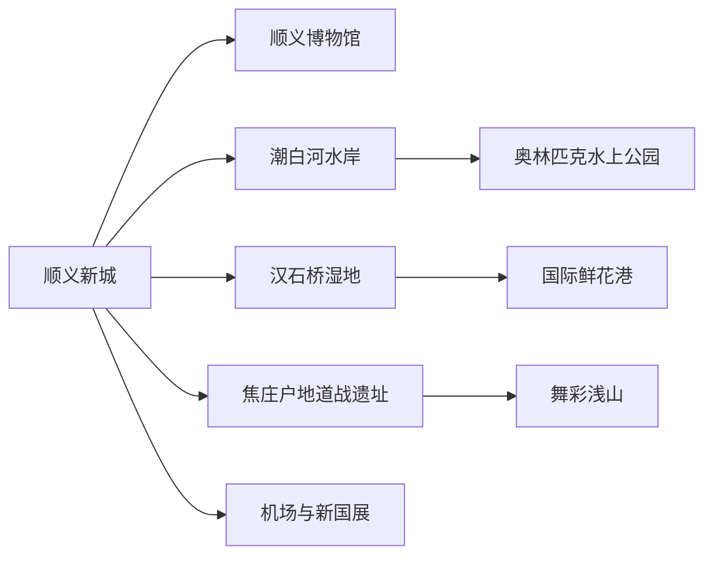
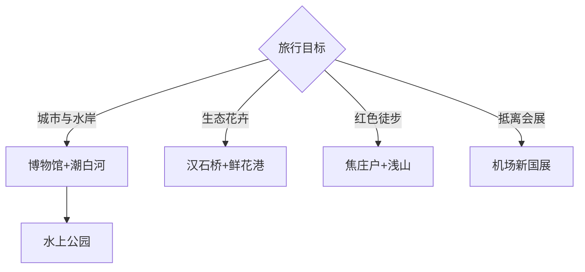

# 顺义旅行指南

顺义位于北京东北部，旅行空间由顺义新城、潮白河—奥林匹克水上公园、汉石桥湿地—国际鲜花港、焦庄户—舞彩浅山和首都机场—新国展五组构成。首次到访可用两天选择“城区与水岸”加“湿地花卉”或“红色浅山”；机场和会展片区更适合抵离、商务与住宿，按枢纽功能规划。

## 城市速览

| 项目 | 信息 |
|---|---|
| 主线 | 顺义博物馆—潮白河水岸—奥林匹克水上公园；远线选湿地花港或焦庄户浅山 |
| 停留 | 单一主题1天；完整组合2–3天 |
| 住宿 | 顺义新城适合公共交通；后沙峪—新国展适合机场会展；龙湾屯乡村住宿需确认接待 |
| 交通 | 北京地铁、市郊公交、区内公交与合规车辆 |
| 季节 | 春季花卉、秋季湿地与浅山突出；盛夏高温雷雨、冬季冰雪需调整 |
| 边界 | 首都机场空侧、会展作业区、湿地保护区、河道行洪区和农业生产区分别管理 |

## 城市格局与游览区域

固定 **Shunyi / GeoNames 2034754** 对应顺义新城连续建成区，本页承接顺义区完整旅行。城区、潮白河和奥林匹克水上公园相对集中；汉石桥湿地、国际鲜花港位于东部，焦庄户与舞彩浅山位于东北浅山区。首都机场、天竺、后沙峪和新国展在西南部，与顺义老城区仍需轨道或公路移动。

机场名称带“北京”不表示位于中心城区，航站楼空侧、跑道、货运和维修区执行航空安保。潮白河与湿地兼有防洪和生态功能，水上活动、观鸟、露营和骑行使用正式运营项目与开放区域。

## 主要景点

| 景点 | 区域 | 类型 | 核心体验 | 用时 | 环境 | 体力 | 研究价值 | 拥挤 | 优先级 |
|---|---|---|---|---:|---|---|---|---|---|
| 顺义区博物馆 | 顺义新城 | 综合博物馆 | 地方考古、历史与区域发展 | 2–3小时 | 室内 | 低 | 很高 | 低 | A |
| 顺义奥林匹克水上公园 | 马坡—潮白河 | 奥运遗产与公园 | 奥运场馆、水岸步行与当期活动 | 半日至1天 | 混合 | 中 | 高 | 高 | A |
| 汉石桥湿地公园 | 杨镇方向 | 湿地与观鸟 | 芦苇湿地、鸟类观察和自然教育 | 半日至1天 | 室外 | 中 | 很高 | 中 | A |
| 北京国际鲜花港 | 杨镇 | 花卉专类公园 | 郁金香等季节花展与园艺 | 3–5小时 | 室外为主 | 中 | 中高 | 高 | A |
| 焦庄户地道战遗址纪念馆 | 龙湾屯镇 | 红色遗址 | 抗战历史、地道与村落文化 | 2–4小时 | 混合 | 中 | 很高 | 中 | A |
| 舞彩浅山国家登山步道开放段 | 龙湾屯—木林 | 浅山与徒步 | 林地、果园背景与分段步道 | 3–6小时 | 室外 | 中高 | 高 | 中高 | B |
| 潮白河滨河公共公园 | 顺义新城东侧 | 城市水岸 | 河流生态、绿道与城市休闲 | 2–4小时 | 室外 | 低至中 | 中高 | 中 | B |
| 温榆河公园顺义片区 | 后沙峪方向 | 郊野公园 | 湿地、田园和城市近郊生态 | 2–4小时 | 室外 | 中 | 中高 | 中 | B |
| 罗红摄影艺术馆 | 天竺方向 | 摄影与艺术 | 摄影展览、建筑和艺术空间 | 2–3小时 | 室内 | 低 | 中高 | 中 | C |
| 牛栏山酒厂文化相关正式参观项目 | 牛栏山镇 | 工业与地方文化 | 地方酿造史和获准展陈 | 2–3小时 | 室内 | 低 | 中 | 中 | C |

湿地观鸟保持距离并使用开放步道，季节水位会改变可见范围。舞彩浅山按体力选择单段。水上公园、鲜花港、艺术馆和工业参观均以当期运营、预约和活动公告为准。

## 美食与餐饮

顺义新城、后沙峪、天竺和新国展周边餐饮选择较多，乡村线可在焦庄户、龙湾屯或杨镇选择有固定经营场所的农家菜。北京烤鸭、饺子、炖菜与本地农产品适合多人共享，点单时确认份量、花生芝麻、大豆、乳制品和清真需求。酒文化项目可只看工艺与历史，驾驶日选择无酒精饮品。

## 经典行程

### 一日城区水岸线
**路线**：顺义区博物馆—城区午餐—潮白河公共岸线—奥林匹克水上公园。**逻辑**：从地方历史走向新城与奥运水岸。**预约锚点**：博物馆、水上公园活动和返程。**休息**：文化中心与公园服务区。**删除条件**：大风雷雨时保留博物馆和城区餐饮。

### 湿地花卉线
**路线**：汉石桥湿地—杨镇午餐—北京国际鲜花港。**逻辑**：把东部生态与园艺放在同一方向。**预约锚点**：湿地开放、花期、门票和末班。**休息**：两处游客中心。**删除条件**：花期落空或湿地保护管制时只留一项。

### 焦庄户浅山线
**路线**：焦庄户地道战遗址纪念馆—村内午餐—舞彩浅山开放短段。**逻辑**：先看红色历史，再按体力走浅山。**预约锚点**：纪念馆、步道入口、天气和返程。**休息**：焦庄户村正规接待点。**删除条件**：森林防火、雷雨或结冰时取消徒步。

### 两日基础线
**路线**：第一天城区水岸；第二天湿地花卉或焦庄户浅山。**逻辑**：一天城市、一天远郊，减少东西往返。**预约锚点**：住宿、场馆、花期和区内车辆。**休息**：每天午后设置室内休息。**删除条件**：只有一天时按季节选一条主线。

### 机场会展衔接线
**路线**：机场或新国展住宿—罗红摄影艺术馆—后沙峪餐饮—温榆河公园短段。**逻辑**：服务半天空档与商务抵离。**预约锚点**：航班、展会、艺术馆和行李寄存。**休息**：酒店或商业空间。**删除条件**：航班临近或展会交通紧张时直接返回枢纽。

### 雨天文化线
**路线**：顺义区博物馆—罗红摄影艺术馆—城区餐饮。**逻辑**：用两处室内场馆替代湿地与浅山。**预约锚点**：开放日和跨片区交通。**休息**：场馆与商场。**删除条件**：暴雨或道路积水预警时只留最近场馆。

### 低体力线
**路线**：顺义区博物馆—车辆到奥林匹克水上公园近入口—潮白河短段。**逻辑**：以场馆、落客和短步行为主。**预约锚点**：无障碍入口、座椅、卫生间与车辆。**休息**：每站固定服务点。**删除条件**：户外体感不适时保留博物馆。

## 住宿区域

顺义新城适合博物馆、潮白河和东部远线出发；天竺—后沙峪适合首都机场、新国展和温榆河公园；马坡适合水上公园；龙湾屯乡村住宿适合焦庄户与舞彩浅山连续行程。订房时核对航站楼、展馆入口、地铁站、接驳时刻、隔音、早餐、停车和退改。

## 市内交通

北京地铁可连接中心城区、机场片区与顺义新城，东部湿地花港、东北焦庄户浅山及潮白河部分点位仍需公交或合规车辆。首都机场线、普通地铁和市郊公交按票制、站点与末班分别核对。大型展会、花展、赛事和节假日会改变道路与停车，远线预留返程余量。

## 不同旅行者须知

亲子可选博物馆、鲜花港和正式农事活动；观鸟者优先汉石桥并遵守安静与距离要求；徒步者按舞彩浅山开放段选择长度；商务旅客可用机场会展片区的半天空档；长者以新城、博物馆和水岸近入口为主。机场空侧、湿地核心区、河道行洪区、林区防火区和农业生产设施保留明确限制。

## 行前核对

- 核对博物馆、焦庄户、艺术馆与工业参观的开放和预约。
- 核对汉石桥湿地、鲜花港花期、水上公园活动与舞彩浅山入口。
- 核对地铁、机场航站楼、新国展活动、区内公交和返程末班。
- 核对雷雨、高温、冰雪、森林防火、河道水位与湿地保护公告。

## 来源与更新记录

| 来源 | 支持内容 | 核验日期 |
|---|---|---|
| [北京市政府：顺义区博物馆](https://www.beijing.gov.cn/renwen/rwzyd/bwg/bjssyqbwg/202301/t20230117_2902212.html) | 场馆位置、地方历史展陈与文化中心 | 2026-09-04 |
| [北京市政府：顺义代表性文旅点](https://www.beijing.gov.cn/tsbj/sxym/202404/t20240424_3635260.html) | 水上公园、汉石桥湿地、鲜花港与罗红摄影艺术馆 | 2026-09-04 |
| [北京市政府：顺义区专题发布](https://www.beijing.gov.cn/shipin/Interviewlive/929.html) | 温榆河公园、东郊湿地、舞彩浅山及生态旅游格局 | 2026-09-04 |
| [北京市农业农村局：焦庄户村](https://nyncj.beijing.gov.cn/nyj/jcsn/whgs/bjxczxgs/326159391/index.html) | 焦庄户地道战遗址、村落与舞彩浅山组合 | 2026-09-04 |
| [北京市文物局：焦庄户地道战遗址](https://wwj.beijing.gov.cn/bjww/362771/362782/djphdwbdwdbhfwjjkdd/665494/index.html) | 文物保护范围与历史文化街区边界 | 2026-09-04 |
| [北京市园林绿化局：2025年度公园名录](https://yllhj.beijing.gov.cn/ggfw/bjsggml/bjsgymlzb/202511/P020251127601806691724.pdf) | 鲜花港、水上公园及顺义城市公园名录 | 2026-09-04 |
| [GeoNames 2034754](https://www.geonames.org/2034754/) | Shunyi 固定人口点 | 2026-09-04 |

| 日期 | 更新 |
|---|---|
| 2026-09-04 | 首次完成顺义旅行研究；拆分新城水岸、湿地花卉、焦庄户浅山与机场会展片区。 |
