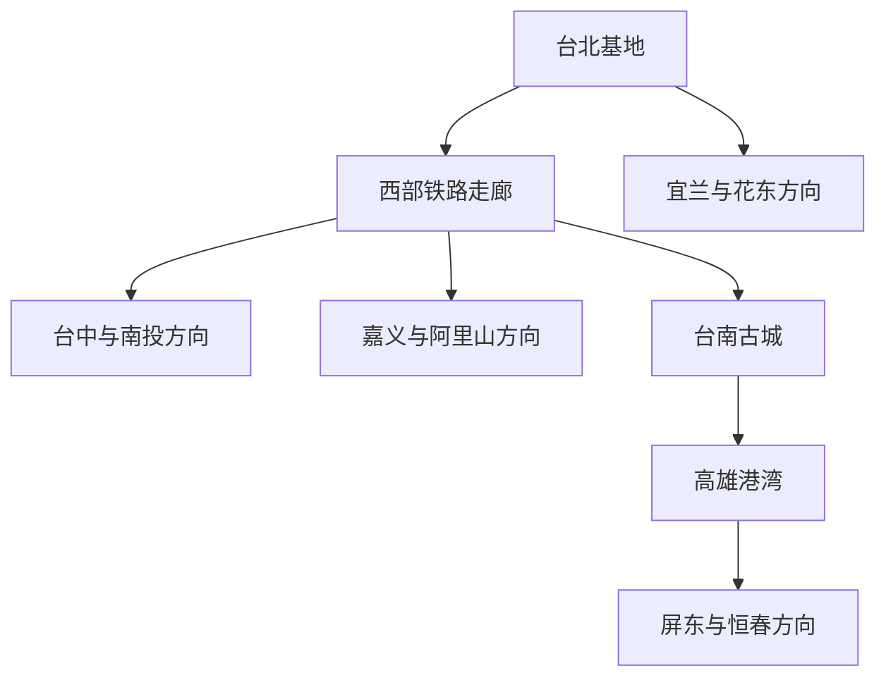
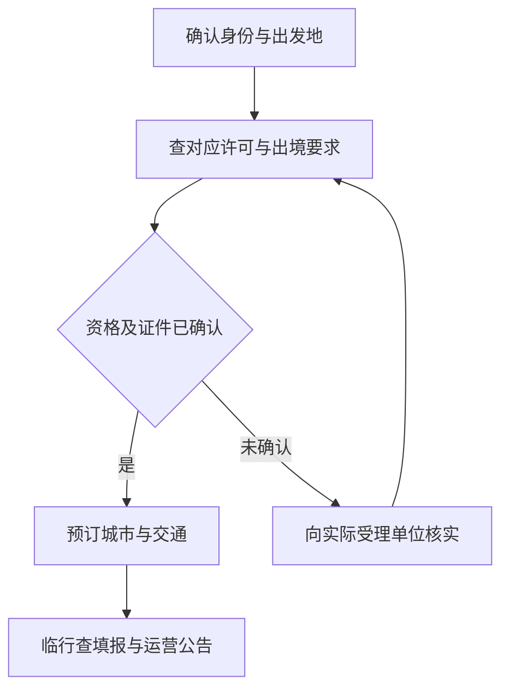

# 台湾旅行总览

台湾的城市与乡镇沿着山海展开。西部平原聚集了繁忙的都会与古老市街，台北的茶行、台南的庙宇、高雄的港湾，各有不同的生活面貌。中央山地保留着森林与茶乡，东部的纵谷、稻田和海岸则呈现出开阔的风景。客家聚落、原住民族文化和各地市场饮食，让地域差异落在具体的日常里；澎湖、绿岛与兰屿又各自拥有独特的海岛生活。

本页汇集台湾本岛、澎湖、绿岛与兰屿的城市和区域攻略。金门、马祖按仓库地理分组另归福建，未纳入本页。最近核查：**2026-09-06**；文中用时为规划建议，车次、开放和入境许可以出发日期的官方确认结果为准。

## 首访选择与时间分配

| 可用时间与兴趣 | 建议组合 | 得到的体验与取舍 |
|---|---|---|
| 3–4 天，第一次短住 | 台北作为唯一住宿基地，另选一天新北方向 | 博物馆、老城、当代都会兼顾；淡水和九份择一，保留雨天弹性 |
| 5 天，更喜欢古城与小吃 | 台南 2 天＋高雄 2 天，另留到离日 | 减少长距离换城，市区古迹和港湾各有完整时间；不强塞阿里山 |
| 7–8 天，希望比较南北 | 台北 3 天＋转城半天＋台南 2 天＋高雄 1–2 天 | 沿西部向南，适合多点进出；同一机场往返还要加回程余量 |
| 9–12 天，偏好自然 | 上述城市减一座，加入日月潭、阿里山或花东其中一个方向 | 山区与东岸的接驳不等同于高铁换城；先确认开放、交通再决定停留 |

**优先留下一个完整的当地下午。** 台南的小吃与巷道、高雄港湾的傍晚、台北的馆舍与街区都需要停留才能形成印象。每天换旅馆会消耗这些时间。住宿位置通常比酒店星级更影响这趟旅行是否轻松：台北靠捷运，台南靠中西区或台铁站的实际接驳，高雄靠捷运且便于抵达港湾。

预算以新台币（TWD）安排，住宿、长途铁路和收费展览是主要变量。先比较住宿总价与取消条件，再加上机场和高铁站到酒店的接驳；交通套票只在实际乘坐区间和票种适用时购买。当地默认时区为 Asia/Taipei（UTC+8）。

## 城市与旅行区域入口

23 篇城市攻略围绕各自市区及明确标注的延伸方向展开。先从城市入口了解街区、景点与饮食，再按兴趣选择区域；日月潭、阿里山、垦丁各有独立区域攻略。

| 方向 | 城市攻略 | 城市之间的区别 |
|---|---|---|
| 北部都会与港口 | [台北](./台北市.md)、[新北](./新北市.md)、[基隆](./基隆市.md) | 台北看都会文化；新北的淡水、九份与陶瓷街区分属不同方向；基隆围绕港口与海岸 |
| 桃竹苗 | [桃园](./桃园市.md)、[新竹](./新竹市.md)、[竹北](./竹北市.md)、[苗栗](./苗栗市.md)、[头份](./头份市.md) | 老街、城隍信仰、客家聚落与现代城貌各有所长；县域乡镇另见区域篇 |
| 中部 | [台中](./台中市.md)、[彰化](./彰化市.md)、[员林](./员林市.md)、[南投](./南投市.md)、[斗六](./斗六市.md) | 从博物馆和街区文化走向平原市镇；南投市与日月潭不在同一地点 |
| 嘉义平原 | [嘉义](./嘉义市.md)、[太保](./太保市.md)、[朴子](./朴子市.md) | 嘉义市有木业与铁路记忆；故宫南院在太保，朴子以庙宇、老街和刺绣文化见长 |
| 南部 | [台南](./台南市.md)、[高雄](./高雄市.md)、[屏东](./屏东市.md) | 古城饮食、港湾转型和南部平原生活；屏东市与恒春半岛分别阅读 |
| 东部 | [宜兰](./宜兰市.md)、[花莲](./花莲市.md)、[台东](./台东市.md) | 城市文化与沿海生活各成一篇；温泉乡、纵谷和远处海岸属于区域行程 |
| 澎湖 | [马公](./马公市.md) | 老街、庙宇、渔港与岛城生活；跨岛看澎湖群岛篇 |

| 旅行区域 | 主要内容 | 规划边界 |
|---|---|---|
| [北部山海与客家乡镇](./旅行区域/北部山海与客家乡镇/README.md) | 宜兰平原温泉、北埔与内湾、南庄与三义 | 宜兰与桃竹苗隔着山地，分组选线 |
| [彰化与云林乡镇](./旅行区域/彰化与云林乡镇/README.md) | 鹿港、北港、西螺、虎尾的老街、信仰和产业记忆 | 各镇间需接驳，不是连续步行街区 |
| [日月潭与南投山地](./旅行区域/日月潭与南投山地/README.md) | 湖区、埔里、集集水里及山地延伸 | 清境、溪头等分属不同山路，按住宿和交通选线 |
| [阿里山与嘉义海岸](./旅行区域/阿里山与嘉义海岸/README.md) | 森林铁路、茶乡、布袋与东石 | 山地与海岸分开安排，先确定实际交通 |
| [恒春半岛与屏东沿海](./旅行区域/恒春半岛与屏东沿海/README.md) | 恒春、垦丁、东港与小琉球 | 海岸陆路与离岛船程各有天气条件 |
| [花东纵谷与东海岸](./旅行区域/花东纵谷与东海岸/README.md) | 稻田、温泉、海岸与聚落文化 | 纵谷和海岸分线；太鲁阁按具体路段开放核对 |
| [澎湖群岛](./旅行区域/澎湖群岛/README.md) | 本岛北环、七美望安与海洋环境 | 跨岛按实际航船航班安排，留返程缓冲 |
| [绿岛与兰屿](./旅行区域/绿岛与兰屿/README.md) | 两座离岛的自然与文化 | 两岛各自成行，尊重当地社区与海况限制 |

西部城市依铁路连接；山区从门户城市转公路，东岸需要独立的铁路安排。可以按下面的方向选择组合，再查各段交通：

## 可调整的跨城线路

### 七天南北城市线

这条线串起台北、台南与高雄。按台北进入、高雄离开安排；机场是否有适用航班须先确认。台北与高雄交换进出方向也可，馆舍日期应随之重排。

| 日程 | 主线与用餐 | 预约锚点、休息与退出 |
|---|---|---|
| 第 1 天，抵达台北 | 办理入住，住处附近吃一顿坐下来的晚饭；早到可选大稻埕短段 | 锚点是实际航班和酒店入住；晚到直接删街区散步，保留恢复时间 |
| 第 2 天，台北馆舍与城市 | 故宫作为半日重点，之后在士林或住处附近用餐；按余力补短街区 | 先核对故宫当日开放及票务，午后坐下休息；错过入馆时段改城市老街，不横穿市区追三个景点 |
| 第 3 天，台北老城或观景 | 龙山寺、街区午餐、西门一线；偏好天际线可替换为信义方向 | 101 若购固定时段票即成为锚点；能见度差时删观景。疲劳从最近捷运站返回，保留晚餐 |
| 第 4 天，台北至台南 | 上午或午后高铁至台南，转沙仑线/其他正规接驳到住处，傍晚只走中西区短段 | 长途票是当天锚点。把车站接驳和入住算进半天；延误就取消散步，不预订紧接抵达的展览 |
| 第 5 天，台南古城与饮食 | 孔庙、府中街一带；午餐后休息，再选赤崁片区或神农街 | 场馆开放和施工优先；在有座位餐馆完成正餐。安平与奇美留给加一天的人，不与古城全塞同日 |
| 第 6 天，台南至高雄 | 搭实际停靠的台铁车次抵高雄市区，寄存行李后走驳二与哈玛星 | 车票与寄存点营业是锚点；午后室内展馆/餐馆休息。渡轮队伍长或风浪影响时删旗津，港湾陆侧仍成线 |
| 第 7 天，高雄离开 | 按航班时间决定是否增加一段短市区活动 | 出发前确认航空公司要求的到场时间，并另加酒店到机场交通；不排远郊、离岛和必须排长队的餐厅 |

第 6 天不必为短距离换城坚持高铁：如果住在台南台铁站附近，而高雄住宿也靠市区，台铁可能减少两端接驳；比较的是酒店到酒店的总过程。高铁台南站通过二楼通廊连接台铁沙仑站，沙仑线才把旅客带往台南市区。[高铁台南站转乘说明](https://www.thsrc.com.tw/ArticleContent/9c5ac6ca-ec89-48f8-aab0-41b738cb1814)

**缩成五天：** 选台北 3 天＋台南或高雄 2 天，或全部留在台南—高雄；增加两天则先给台南安平/奇美与高雄多一个完整下午。台北往返的七天版本应在第 6 天返回北部住宿，第 7 天出境，缩短南部停留，不以长途铁路准点作为国际航班的唯一保障。

### 北部四天基地线

第 1 天抵达入住；第 2 天按台北城市稿选故宫或老城；第 3 天按[新北指南](./新北市.md)在淡水和九份中选择一处；第 4 天留给出发。淡水适合河岸慢走，九份需要山城台阶与道路交通，两处不适合紧接着串联。返程班次先于晚餐决定；雨大、起雾或交通受影响时留在台北，选已确认开放的室内馆舍。

### 五天南部慢行线

第 1 天抵台南，第 2 天走古城，第 3 天在安平与奇美中择一并转高雄，第 4 天走港湾，第 5 天离开。奇美如选择特展，先确认票种与开放日，再决定第 3 天顺序；时间紧时把转城提前到第 3 天上午并删奇美，而不是压缩两端接驳。台南与高雄的跨城餐饮安排，以住处附近可以坐下用餐为备选，不围绕单家网红店设计不可更改的车次。

### 六天中部城市与湖区线

第 1 天抵台中并住市区，第 2 天在博物馆与街区间选一组；第 3 天赴彰化或鹿港，晚上仍回台中。第 4 天转日月潭入住，第 5 天留在湖区，第 6 天返回交通枢纽离开。彰化市与鹿港可分别读[彰化指南](./彰化市.md)和[彰化与云林乡镇](./旅行区域/彰化与云林乡镇/README.md)；湖区接驳见[日月潭与南投山地](./旅行区域/日月潭与南投山地/README.md)。

这条线保留两个住宿基地，兼顾城市、古镇与湖景。第 3 天选择古迹兴趣对应的一处，避免两个老城都只匆匆经过。湖区雨势较大时以确认开放的室内点替换户外；不临时把清境、合欢山加成雨天备选。若只有四天，保留台中与湖区，删去第 3 天并压缩一个抵离日；班次或航班不允许时宁可只选一地。

### 七天花东慢行线

第 1 天抵花莲，第 2 天认识花莲市区；第 3 天沿纵谷前往瑞穗或池上入住，第 4 天留在同一聚落周边。第 5 天转台东，第 6 天游台东市区，第 7 天离开。城内内容分别看[花莲](./花莲市.md)、[台东](./台东市.md)，乡间停留看[花东纵谷与东海岸](./旅行区域/花东纵谷与东海岸/README.md)。

这是以铁路门户为基础的纵谷线，乡间景点仍需当地接驳。更喜欢海岸的人可把第 3–4 天换成海岸住宿与接送，前提是先确认完整交通；海岸与纵谷隔着山脉，不用两边每天来回。太鲁阁不是本线默认项目，只有计划路段明确开放、接驳可行后再替换一天。强降雨影响铁路或道路时先处理改签与续住，取消户外段。

### 四至五天澎湖停留线

第 1 天抵马公，第 2 天看老街与市区，第 3 天走本岛北环，第 4 天按返程安排留在本岛或离开；有第 5 天且海况、航班和船班允许，再考虑增加一组离岛行程。安排与交通分别见[马公](./马公市.md)及[澎湖群岛](./旅行区域/澎湖群岛/README.md)。

离岛出游应放在返程日前，保留可以调整的本岛时间；七美与望安是否同船停靠，以所购产品的实际行程为准。若紧接国际航班，需在台湾本岛另留缓冲。绿岛与兰屿有各自进出路径与社区节奏，作为另一趟独立行程选择，不接在这条澎湖线后面凑环岛。

## 铁路、机场与天气的行动准备

以下准备适用于各条线路；城市与区域篇另列当地接驳和开放条件。

| 事项 | 怎么准备 | 核查入口与时间 |
|---|---|---|
| 西部长途 | 先定城市停留，再查实际车次及站名；高铁台南站与台南台铁站、高铁左营站与高雄站分别核对 | [高铁官网](https://www.thsrc.com.tw/)、[台铁时刻查询](https://www.railway.gov.tw/tra-tip-web/tip/tip001/tip123/query)；订房前比较，乘车前一天复核 |
| 预售与连假 | 高铁一般可订含乘车当日 29 天内、至发车前 1 小时的车次，周五周六有延伸规则；台铁一般提前 28 天，连假另有公告 | [高铁订票规则](https://www.thsrc.com.tw/ArticleContent/dea241a9-fe69-4e9d-b9a5-6caed6e486d6)、[台铁订票规则](https://www.railway.gov.tw/tra-tip-web/tip/tip00C/tipC21/view?lang=zh_TW&proCode=8ae4cac3756b7b41017572e5974c178b&subCode=8ae4cac3756b7b41017573dba4e4186f)；核验于 2026-09-06 |
| 机场 | 比较桃园与松山、高雄等机场的实际航班；把入境、行李、末班接驳和酒店前台条件加入到达安排 | 订票时查航空公司与机场当日接驳；城市交通详见对应城市指南 |
| 天气 | 高温时午间留室内休息，强降雨时缩短山地与海岸线。预警或停运发生后先解决住宿和返程 | [中央气象署](https://www.cwa.gov.tw/)与运营方公告；出发前一周、前一天及当天 |
| 太鲁阁与山地 | 管理处当前仍有重建和分段开放公告，山路通行不代表步道可进入；按计划前往的具体区域核对 | [太鲁阁官方消息](https://www.taroko.gov.tw/ch/titlelist/news)；订山地住宿前与出发当天 |
| 离岛 | 船/机票、住宿取消条件和回本岛缓冲一起决定；遇停航先与运营方办理改签 | 对应风景区及船/航空公司，订票前及出发当天 |

城市内交通卡适用范围按各运营方票种确认，不能把储值卡等同于所有对号列车的订位票。随身准备能使用的支付方式与少量现金，卡片境外支付、取现费用和手机联网在出发前确认。

## 证件与入境条件按身份核对

**在购买不可退行程前，先确定自己适用哪种入台许可和出发地出境要求。** 旅行者的国籍、户籍、居留身份、旅行证件、目的和出发地都会影响条件，不能只按“从哪里起飞”判断。下表提供官方办理路径，不替代个案核准，也不表示所有路径在所有地区都开放受理。

| 身份与出发情形 | 需分别核对的条件 | 官方入口 |
|---|---|---|
| 大陆居民，自大陆出发 | 往来台湾通行证、与旅行目的和范围一致的有效签注，以及入台许可；核实当地当前实际受理范围。法规列出某种签注不等于当地已恢复受理 | [国家移民管理局办理入口](https://s.nia.gov.cn/mps/bszy/wlgaot/sqwltw/)、[大陆赴台旅游管理办法](https://www.nia.gov.cn/n741440/n741547/c757462/content.html)、[入台观光业务分类](https://www.immigration.gov.tw/5385/7244/7250/7257/7266/) |
| 大陆居民，旅居国外或港澳并从该地出发 | 按旅居身份、留学/工作/居留证明和随行关系核对专门申请资格，再办理入台许可；持第三地机票或短期旅游签证本身不证明符合旅居资格 | [旅居国外或港澳观光申请分类](https://www.immigration.gov.tw/5385/7244/7250/7257/7266/?Page=1&PageSize=30&alias=attitute&type=%E8%87%AA%E5%9C%8B%E5%A4%96%E6%88%96%E9%A6%99%E6%B8%AF%E6%BE%B3%E9%96%80%E4%BE%86%E8%87%BA)，查 0516/0523 等当前须知和实际受理单位 |
| 香港或澳门居民 | 按出生地、既往来台记录、护照/身份及其他资格选择网签或其他许可流程；港澳居留身份也须符合规则对居民的定义 | [港澳网签业务入口](https://www.gov.tw/News_Content_2_371269)、[临时停留许可规定](https://www.immigration.gov.tw/media/114401/396285-%E6%B8%AF%E6%BE%B3%E8%87%A8%E6%99%82%E5%85%A5%E5%A2%83%E5%81%9C%E7%95%99%E4%BD%9C%E6%A5%AD%E8%A6%8F%E5%AE%9A.pdf) |
| 外国护照持有人 | 按具体国籍、护照类别、有效期、出生地例外和目的核对免签或签证；免签天数因国籍不同，通常要求返程/续程证明 | [领事事务局免签规则](https://www.boca.gov.tw/fp-149-4486-7785a-1.html)；2026-07-17 发布页，2026-09-06 核验 |
| 台湾居民、持居留证或其他特殊身份 | 按本人户籍、证件与居留条件核对，不套用短期游客流程；出境要求同时核实 | [移民署](https://www.immigration.gov.tw/)对应身份业务 |

对需要填写 TWAC 的外来旅客，当前可在**抵达前 7 天内** 在线提交，使用[移民署官方 TWAC](https://twac.immigration.gov.tw/)；该填报不替代签证或入台许可。期限依据[2026-07-15 官方公告](https://www.immigration.gov.tw/5385/7229/7238/415735/cp_news)，核验于 2026-09-06。持居留证等情形是否免填，应按系统身份说明判断。

准备时依次完成身份分类、核准条件、交通安排和临行复核：

## 来源与覆盖记录

本页依据上述官方旅游、铁路、入境和气象入口原创编写；来源支持区域定位、交通与当前规则，停留天数、删减顺序和餐饮安排属于编辑建议。外部页面上的图片、地图和长篇文字没有复制入库。

| 来源组 | 支持内容 | 核查状态与日期 |
|---|---|---|
| 观光署景点总览、北部与中部入口 | 区域构成、代表旅行方向 | 页面检索/读取，2026-09-06 |
| 高铁订票及台南站；台铁订票与时刻查询 | 预售规则、沙仑转乘、查询入口 | 页面检索/读取，2026-09-06；未预订具体车次 |
| 移民署、国家移民管理局、领事事务局 | 身份分流、办理入口、免签条件与 TWAC | 页面检索/读取，2026-09-06；未确认任何个人申请资格 |
| 太鲁阁管理处消息、中央气象署 | 重建与分段开放提示、临行天气入口 | 官方检索，2026-09-06；太鲁阁公告列表直接读取技术失败，未据此断言任何具体步道已开放 |
| 城市和区域篇所列旅游主管机构、场馆与运营方 | 当地景点、空间关系及实用条件 | 具体页面与核查日期列于各篇来源记录，不把网站首页等同于所有事实的证据 |

本页共有 23 篇城市攻略与 8 篇旅行区域攻略，覆盖既有台湾城市清单和主要旅行方向；各篇按当地特点精选内容，并非穷举所有乡镇与景点。[本批覆盖账本与验收记录](../../../coverage/CN/taiwan-2026-09-06/README.md)记录范围与验证；[返回中国索引](../README.md)。
