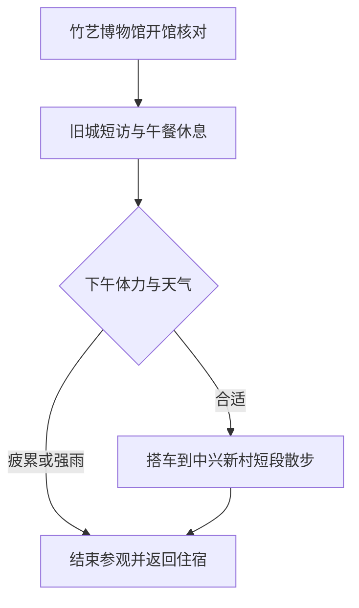

# 南投旅行指南

南投市位于台湾中部内陆，猫罗溪流经城边，旧市街与中兴新村呈现两种不同的生活面貌。蓝田书院留下地方教育与信仰的痕迹，竹艺收藏连接着山区材料和日常器用；北面的中兴新村则以林荫道路、低层宿舍和公共建筑，保存了战后行政新市镇的布局。市场里的面食与肉圆、老房舍中的小店，让这座县城的文化落在日常生活里。

## 城市速览

首访可在中兴新村的街道与竹艺博物馆之间选择兴趣：前者看社区与城市规划，后者看竹材怎样变成生活器具。南投市不是整个南投县，日月潭在鱼池乡，清境在仁爱乡，均需另行安排。

| 项目 | 旅行信息 |
|---|---|
| 建议停留 | 半天选一个片区；完整一天可组合旧城与中兴新村 |
| 首访重点 | 竹艺博物馆、中兴新村；蓝田书院作为旧城补充 |
| 季节与体力 | 凉爽日适合街区步行；夏季中午转室内，户外强度低至中 |
| 预算特点 | 公共展馆与小吃花费有限，跨片区接驳是主要增项 |

## 城市格局与游览区域

| 区域 | 主要内容 | 游览特点 | 与其他区域的关系 |
|---|---|---|---|
| 旧市街 | 蓝田书院、市场与饭铺 | 街巷仍服务居民，适合短段步行 | 与建国路文化设施可组合，途中留过街及休息时间 |
| 建国路文化区 | 竹艺博物馆 | 室内工艺主题，普通雨天也可安排 | 去中兴新村需搭车，不作为连续步行段 |
| 中兴新村 | 林荫大道、宿舍及公共建筑 | 看完整社区格局，住宅尊重私人边界 | 位于市区北面，单独留半日较舒适 |

## 主要景点

A 为首访优先，B 为兴趣补充；用时为编辑估计，不含交通。预约风险也包含临时休馆的不确定性。

| 景点 | 区域 | 类型 | 主要看点 | 建议用时 | 室内外 | 体力 | 预约风险 | 天气影响 | 优先级 |
|---|---|---|---|---|---|---|---|---|---|
| 南投县竹艺博物馆 | 建国路 | 工艺博物馆 | 竹编器具、家具与材料运用 | 1–1.5 小时 | 室内 | 低 | 中 | 低 | A |
| 中兴新村 | 市区北侧 | 历史社区 | 林荫道路、宿舍与公共空间 | 2–3 小时 | 室外为主 | 中 | 低 | 高 | A |
| 蓝田书院 | 旧市街 | 书院、信仰 | 院落与地方文教传统 | 30–45 分钟 | 混合 | 低 | 低 | 中 | B |
| 台湾文献馆展览 | 中兴新村 | 文献展馆 | 地方历史与档案主题 | 1–1.5 小时 | 室内 | 低 | 中 | 低 | B |

**竹艺博物馆。** 从竹篮、家具等熟悉的器物看编织与结构，比只看作品外形更容易理解工艺。县旅游网列常规周二至周日 09:00–17:00，周一休息；特殊展览和体验须另查，不能把常设互动当作随到随开的课程。[官方介绍](https://travel.nantou.gov.tw/attractions/civilization-museum/)。

**中兴新村。** 重点是道路、绿地和低层房屋共同形成的社区，不必逐栋找打卡点。公共道路可游览，不代表会堂、旧办公楼或宿舍都开放入内。台湾文献馆可补充历史兴趣，但先确认当前展厅与日历，档案阅览服务不等于展览参观。[社区介绍](https://travel.nantou.gov.tw/attractions/zhongxing-new-village/)；[文献馆展览入口](https://www.th.gov.tw/CL/5/)。

**蓝田书院。** 以门额、院落和祭祀空间认识地方读书传统；保持安静，遇活动让出通道。不要把它与集集的明新书院混淆。[县政府文化介绍](https://www.nantou.gov.tw/big5/ce.php)。

## 美食与餐饮

中兴新村的面馆和饭铺与居民生活联系紧密；旧市街肉圆、汤面适合轻量午餐。选住宿或景点附近正常营业的店，比跨城追单店更便于坐下休息。

| 菜品或餐饮类型 | 常见区域 | 一个人用餐与常见份量 | 风味、过敏原与饮食限制 | 排队风险与替代方法 |
|---|---|---|---|---|
| 意面、汤面 | 旧城及社区商街 | 一碗配青菜即可成餐 | 小麦、肉燥或高汤；素食需确认汤底 | 热门店久候可换邻近饭铺 |
| 肉圆配汤 | 旧城小吃店 | 一份较轻，按食量加配菜 | 常含猪肉、大豆调味；粉皮不等于无麸质整餐 | 售完改面食，不为加餐延误接驳 |
| 面点与家常饭 | 中兴新村 | 适合正餐和亲子分食 | 面点含小麦，馅料逐项确认 | 避开午间尖峰，优先有座位店 |

地方餐饮线索见[南投旅游网中兴新村周边美食](https://travel.nantou.gov.tw/attractions/zhongxing-new-village/)，不据列表保证店家当日营业。

## 经典行程

**一日：工艺与社区。** 09:30 左右参观竹艺博物馆，接旧城蓝田书院短访；12:00–14:00 午餐并坐下休息。下午搭车前往中兴新村，选择一段林荫道路和一处开放的小店，傍晚返回住宿或离城。博物馆开馆是当日锚点；若专程参加体验，以确认的预约时段重排。

只有半天时保留竹艺与旧城，或完整留给中兴新村。晚到先删文献馆，疲累时删旧城补充；中兴新村结束前先确认回程车辆，不走长距离道路回市中心。普通雨天以已确认开馆的展馆为主，极端天气按停班停课与交通公告调整。

## 住宿区域

旧市街住宿便于吃饭与乘车，适合一晚停留；中兴新村附近适合主要关注社区与文献馆的旅行者，订房前核查晚餐、停车或接驳。若已经住台中，可一日往返，但将往返候车算进行程，不再串日月潭。

## 市内交通

南投市区以公路客运、出租车及步行为主。订交通时辨认南投市与南投县目的地，不能把到日月潭的车等同于到市中心。旧城内部短段步行，中兴新村独立接驳；班次、站名及末班请由县旅游网交通入口转查经营者当天资料，未核实的车次不写成固定承诺。自行车仅适合天气、路况和骑行能力允许的路段。

## 不同旅行者须知

亲子以竹艺的器物观察配合一次户外短走，手作课程需单独确认年龄和预约。长者及轮椅使用者先问展馆电梯与无障碍入口；老街骑楼高差、书院门槛不能视作连续无障碍路线。入境资格按护照或旅行证件、居住身份和出发地分别核对，见[台湾总览](README.md)的证件提醒。

## 行前核对

- 查竹艺博物馆特殊休馆、台湾文献馆实际开放展厅；周一不要照搬上述主线。
- 查市中心与中兴新村的去回程班次，预留出租车预算。
- 带水、防晒与轻便雨具；大雨、台风警报期间不坚持社区长距离步行。

## 来源与更新记录

核查日期：2026-09-06。地方事实和常规开放依据以下官方页面；文献馆页面正文读取有限，未据此写死开放时间。停留及顺序为编辑建议。

| 来源 | 支撑内容 |
|---|---|
| [南投旅游网：中兴新村](https://travel.nantou.gov.tw/attractions/zhongxing-new-village/) | 市域归属、社区背景与餐饮线索 |
| [南投旅游网：竹艺博物馆](https://travel.nantou.gov.tw/attractions/civilization-museum/) | 展陈、地址与常规开放 |
| [南投县政府文化介绍](https://www.nantou.gov.tw/big5/ce.php) | 书院、陶艺及地方文化背景 |
| [台湾文献馆：展览参观](https://www.th.gov.tw/CL/5/) | 展览核查入口，开放细节待出发前复查 |

本页覆盖市区工艺与中兴新村；八卦山台地步道、酒厂体验等未纳入完整线路，日月潭与清境另属县域旅行。
