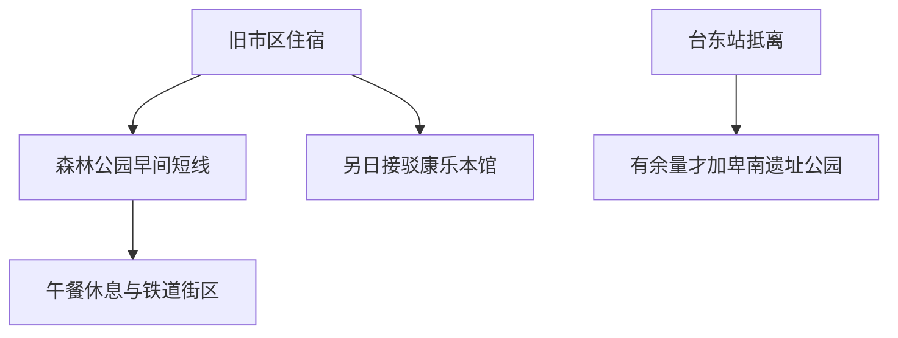

# 台东旅行指南

台东市在卑南溪口南侧面向太平洋，森林公园与滨海绿地让开阔的自然空间进入城区。旧车站和铁道路廊转为艺术与休闲场所，保留了铁路塑造城市的痕迹；史前文化博物馆则把眼光放到更久远的人群迁徙与岛屿文化。街头的米苔目、原住民族风味餐和地方创作，让台东既有东部城镇的日常，也有不同文化共同生活的鲜明面貌。

## 城市速览

**首访精选。** 以史前馆认识考古与原住民族文化，再用森林公园和旧铁道街区观察城市今天的公共生活。市区以 2 天较从容；鹿野、池上、东河、绿岛与兰屿均须另作县域或离岛行程。

| 项目 | 旅行信息 |
|---|---|
| 建议停留 | 市区 2 天，只有 1 天时博物馆与户外二选一为主 |
| 范围 | 旧市区、森林公园、康乐本馆及卑南遗址公园，均在台东市 |
| 天气 | 户外曝晒明显，强风及台风会影响海岸与航班 |
| 预算与体力 | 片区分散，用车是主要增项；不必把公园骑行当必需活动 |
| 住宿 | 旧市区便于用餐，台东站周边便于早晚列车 |

## 城市格局与游览区域

旧铁道艺术村在市中心，现台东车站在另一处；康乐本馆靠近康乐站，卑南遗址公园靠近台东站。两处史前文化设施不同，导航与预约必须用全名。

| 区域 | 性格与体验 | 连接关系 |
|---|---|---|
| 旧市区、铁道艺术村 | 旧铁路空间、餐饮与创作 | 适合傍晚短走，不保证每天有演出 |
| 森林公园、海滨 | 树林、湖景和公共海岸 | 可选短段，完整骑行不是必要条件 |
| 康乐 | 史前馆本馆 | 从市中心另行接驳，留独立半天 |
| 台东站、卑南遗址 | 铁路抵离、考古遗址 | 可与抵离日组合，行李先处理 |

## 主要景点

A 为首访重点，B 为兴趣补充；用时为编辑估计，未含接驳及等候。

| 景点 | 区域 | 类型 | 主要看点 | 建议用时 | 室内外 | 体力 | 预约风险 | 天气影响 | 优先级 |
|---|---|---|---|---|---|---|---|---|---|
| 史前文化博物馆康乐本馆 | 康乐 | 博物馆 | 考古、自然史与原住民族文化 | 2.5–3 小时 | 室内 | 低至中 | 中 | 低 | A |
| 台东森林公园 | 溪口南侧 | 生态、公园 | 林地、湖景与开放空间 | 1.5–2 小时 | 室外 | 中 | 低 | 高 | A |
| 铁道艺术村及旧铁道路廊 | 旧市区 | 工业空间再利用 | 旧车站与城市公共空间 | 1–1.5 小时 | 室外为主 | 低至中 | 中 | 高 | B |
| 卑南遗址公园 | 台东站附近 | 考古遗址 | 遗址与人群生活的解释 | 1.5–2 小时 | 混合 | 中 | 中 | 高 | B |
| 海滨公园短段 | 市区东侧 | 公共海岸 | 面向太平洋的城市边缘 | 30–60 分钟 | 室外 | 低 | 低 | 高 | B |

**史前馆：给“史前”一个具体面貌。** 从器物与环境变化看人群如何生活，再看原住民族文化的呈现，避免只把展厅当古物陈列。康乐本馆常规周二至周日 09:00–17:00，周一及特定节日例外以馆方日历为准；2026 年列有 9 月 29 日、10 月 27 日调休及 11 月 28 日至 12 月 4 日岁修。团体导览与特别活动需另确认预约，南科馆的日历不能套用。[本馆参观信息](https://www.nmp.gov.tw/cp.aspx?n=1973)。

**森林公园：选一段林地，而非追完全部湖景。** 园区广大，适合按体力选择步行或骑行，骑车也需避让行人。县府有道路与景观改善记录，具体施工段须看当天现场公告，不凭旧路线认定全园可通。[官方景点](https://tour.taitung.gov.tw/zh-tw/attraction/details/454)；[园区改善说明](https://tour.taitung.gov.tw/zh-tw/news/details/5943)。

**旧铁道与卑南遗址：属于不同年代的两种线索。** 旧铁道适合认识近代交通如何进入市区；卑南遗址则需结合说明与展览，单看草地不容易理解价值。旧资料里的“铁花村”演出经营安排可能已经变化，本页仅推荐现有旧铁道公共空间，不承诺固定音乐节目。[市公所旧站说明](https://www.taitungcity.gov.tw/article/%25E9%2590%25B5%25E9%2581%2593%25E8%2597%259D%25E8%25A1%2593%25E6%259D%2591%25E3%2580%2581%25E9%2590%25B5%25E8%258A%25B1%25E6%259D%2591%25E3%2580%2581%25E5%258F%25B0%25E6%259D%25B1%25E6%2595%2585%25E4%25BA%258B%25E9%25A4%25A8)；[馆方分馆入口](https://www.nmp.gov.tw/)。

## 美食与餐饮

米苔目把米食带进日常一餐，汤头常见肉燥与柴鱼，不能从米制外观判断为素食。原住民族风味菜则涉及具体族群与家庭做法，阿拜、刺葱或马告相关料理宜在说明清楚的餐厅认识，不把不同族群揉成一种“山地餐”。[县府旅行折页饮食介绍](https://tour.taitung.gov.tw/file/1057/)。

| 类型 | 场景 | 份量与限制 | 取舍 |
|---|---|---|---|
| 米苔目 | 旧市区早餐、午餐 | 一碗适合独食；汤底肉与鱼需确认 | 热门店排队时换邻近饭面 |
| 原住民族风味餐 | 提前选定的餐厅正餐 | 套餐可能需多人；香料、肉类及酒需问 | 预约时确认人数与饮食限制 |
| 便当与家常饭面 | 车站抵离、普通午餐 | 份量清楚，便于儿童和独行 | 不把全部餐次排成点心 |
| 甜品、洛神饮品 | 午后休息 | 糖、奶和配料各店不同 | 找有座位的店，保留降温时间 |

## 经典行程

### 两日市区：自然与考古

| 日程 | 上午 | 午餐与休息 | 下午与傍晚 | 锚点、删减与退出 |
|---|---|---|---|---|
| 第一天 | 森林公园选 1–2 小时短线 | 回市区午餐，休息至少 1 小时 | 旧铁道艺术村短走；风浪允许再选海滨一小段 | 先核公园开放；删海滨最容易，热或累即从正式出口乘车回住宿 |
| 第二天 | 已确认开馆的康乐本馆约 3 小时；导览预约优先 | 午餐及室内休息 | 有余量且开放时才去卑南遗址；否则直接取行李去车站 | 两馆不在同处，晚到删卑南遗址；预留候车而非赶最后入馆 |

遇博物馆休馆可交换两天。只有一天，选择“本馆加旧市区晚餐”或“森林公园加铁道街区”，保留午休。普通雨天优先已确认开馆的室内展览；强风暴雨、地震影响与停交通期间取消跨区游览，不把博物馆当无条件开放的避难场所。

## 住宿区域

| 区域 | 优点 | 取舍 | 适合需求 |
|---|---|---|---|
| 旧市区 | 餐饮和铁道街区方便 | 到现台东站须接驳 | 首访、无车慢游 |
| 台东站附近 | 早晚列车便利 | 离市区晚餐和海滨较远 | 铁路抵离优先 |
| 康乐方向 | 靠近本馆 | 夜间餐饮选择需先查 | 明确看馆或已有车辆 |

## 市内交通

现台东站、旧铁道艺术村、康乐站是三个不同节点。[台铁](https://www.railway.gov.tw/)按具体站名查询，不是所有列车都停康乐。台东机场也需地面接驳，不把航班抵达时刻当入住时刻。城内公交先查实际班次，跨区用出租车时确认回程；骑行仅选熟悉且开放的短段，曝晒、风力及车流都会增加负担。

## 不同旅行者须知

| 需求 | 实际安排 |
|---|---|
| 亲子 | 博物馆主题精选加午休；公园步行可替代骑车，湖边看护儿童 |
| 长者、低体力 | 本馆与公园择一主项，跨区用车，公园不追全程 |
| 无障碍 | 本馆官方列轮椅等借用与无障碍设施，仍先确认借用和入口；遗址、公园另问可达段 |
| 独行 | 市区饭面好安排，往康乐或遗址前先落实回程 |
| 特殊饮食 | 米苔目汤底可含柴鱼与肉燥；风味餐提前说明过敏和蛋奶肉类限制 |

## 行前核对

本馆与卑南遗址分别查日历、活动和临时停止开放公告；公园看施工及天气。绿岛、兰屿船班与鹿野活动不属于市区交通条件，另行研究，不能临时作为半天备选。

大陆居民、港澳居民与外国护照持有人须按身份及出发地分别查[移民署](https://www.immigration.gov.tw/)和[领事事务局](https://www.boca.gov.tw/np-137-2.html)；大陆出发者另查[国家移民管理局](https://www.nia.gov.cn/)。证件资格确认后再订不可退的机票与住宿。

## 来源与更新记录

| 来源 | 支持内容 | 核验日期 |
|---|---|---|
| [史前馆参观信息](https://www.nmp.gov.tw/cp.aspx?n=1973) | 本馆开放、2026 例外日、辅助设施与两处地址 | 2026-09-06 |
| [森林公园](https://tour.taitung.gov.tw/zh-tw/attraction/details/454) | 地点与公园主题 | 2026-09-06 |
| [县府改善公告](https://tour.taitung.gov.tw/zh-tw/news/details/5943) | 溪口位置、园区规模与工程背景 | 2026-09-06 |
| [县府旅行折页](https://tour.taitung.gov.tw/file/1057/) | 市区空间、米苔目及风味菜线索 | 2026-09-06 |
| [官方山海铁马道](https://tour.taitung.gov.tw/zh-tw/tour/details/831) | 旧铁道与公共空间关系，非当前全线开放证明 | 2026-09-06 |

2026-09-06：完成台东市代表性攻略；依据官方正文与搜索返回核验。馆方首页含历史版块与多个分馆信息，具体时间以本馆参观页和当期公告为准；未核定每日音乐演出、所有公园施工段与具体店铺营业。时间与路线为编辑判断。
