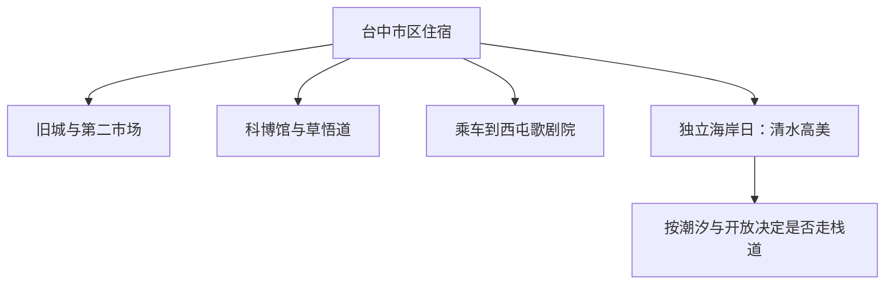

# 台中旅行指南

台中在台湾中部展开了一幅尺度宽阔的城市风景：旧城的车站、市场与街屋保留着商贸生活，向西则是绿园道、文化场馆和高楼商圈。第二市场的米食与面摊、草悟道周边的咖啡馆，呈现出不同世代的日常节奏。国家歌剧院以弯曲的墙面改变了公共建筑的表情，而市域延伸至清水海岸与东部山地，也让台中拥有都会之外的辽阔背景。

## 城市速览

**首访精选。** 对城市生活感兴趣，选旧城早餐与草悟道；对建筑感兴趣，为歌剧院导览留一个确定时段；亲子或自然史爱好者优先科博馆。高美湿地是海岸方向的独立加项，不宜挤入旧城步行日。

| 项目 | 旅行信息 |
|---|---|
| 建议停留 | 市区 2 天；增加海岸约 3 天，山地另排专门行程 |
| 季节 | 凉爽天气利于步行；夏季午后安排室内，台风期间按停班停园调整 |
| 预算特点 | 市场餐食较易控制；跨区车费、演出票和分馆门票增加开支 |
| 体力 | 园道与场馆为低至中等，片区之间距离会累积步行量 |
| 本页范围 | 中区、西区、北区、西屯与清水高美；谷关、梨山等山地需独立规划 |

## 城市格局与游览区域

| 区域 | 性格与内容 | 组合方式 |
|---|---|---|
| 台铁台中站—第二市场 | 旧车站、市场街区、河川与街屋 | 同属旧城主线；按体力选短段步行 |
| 草悟道—审计新村 | 绿地、独立店铺与旧宿舍再利用 | 下午逛街与坐下休息，店铺时段各异 |
| 北区科博馆 | 自然科学展示与家庭出游 | 留完整半天，可接草悟道北段 |
| 西屯歌剧院 | 建筑、表演与现代商圈 | 与旧城之间乘车，演出前就近吃饭 |
| 清水高美 | 潮间带生态和开阔海景 | 距市中心较远，单独安排接驳与返程 |

## 主要景点

用时为参观规划估计，不含候车和排队。A 为首访优先，B 为兴趣补充，C 为条件合适再选。

| 景点 | 区域 | 类型 | 主要看点 | 建议用时 | 室内外 | 体力 | 预约风险 | 天气影响 | 优先级 |
|---|---|---|---|---|---|---|---|---|---|
| 台中旧车站周边 | 中区 | 铁道街区 | 旧站建筑与城市起点 | 45–90 分钟 | 混合 | 低 | 商店活动分开确认 | 户外段怕雨 | A |
| 第二市场 | 中区 | 生活市场 | 米食、面摊与市场格局 | 60–90 分钟 | 半室内 | 低 | 热门摊排队 | 闷热，走道拥挤 | A |
| 草悟道 | 西区 | 园道 | 绿地和周边生活街区 | 1–2 小时 | 户外 | 低至中 | 商店各自营业 | 午后热、雨天缩短 | A |
| 审计新村 | 西区 | 旧宿舍街区 | 小尺度建筑与创作店铺 | 45–90 分钟 | 混合 | 低 | 市集非每日保证 | 户外空间受雨影响 | B |
| 国立自然科学博物馆 | 北区 | 博物馆 | 自然史与科学主题展 | 3–4 小时 | 室内为主 | 中 | 剧场、特展独立核对 | 雨天可选，仍需接驳 | A |
| 台中国家歌剧院 | 西屯区 | 建筑与表演 | 曲墙公共空间、导览及演出 | 1–2 小时，不含演出 | 混合 | 低至中 | 导览与演出分开预约 | 屋顶遇雨调整 | A |
| 高美湿地 | 清水区 | 海岸生态 | 潮间带与栈道视野 | 1.5–2 小时 | 户外 | 中 | 栈道受潮汐及管制影响 | 强风、雷雨、涨潮影响大 | B |

**歌剧院的看点在空间。** 沿开放公共区域观察弯曲墙面怎样连成大厅，比只在门口拍外观更能理解建筑。公共参观不等于能进入观众席；想看剧场内部应选明确开放的导览场次。官网现行开馆时间为周二至周日及国定假日 11:30–21:00，周一常规休馆；空中花园提前 15 分钟停止入场。网上导览不开放当日预约，演出期间动线可调整。[开馆与交通](https://www.npac-ntt.org/visit/transportation)、[导览预约](https://www.npac-ntt.org/visit/tour/reservation)。

**科博馆宜选主题。** 把兴趣集中在一至两个展区，给观察和互动留时间；展示场、剧场与植物园等票种需要分别比较，不沿用旧游记的统一票价。[现行票务](https://www.nmns.edu.tw/ch/visit/ticket/)。

**高美不是随时能下去的海滩。** 从岸上与允许开放的栈道认识湿地，按保护区现场标识行动；日落、退潮与栈道开放并不必然重合。这里属于清水海岸，交通成本应在决定出发前算入。[海岸区域官方资料](https://travel.taichung.gov.tw/zh-tw/tourist/tour/1224)。

## 美食与餐饮

炒面、萝卜糕和米食构成台中早餐的重要部分；第二市场同时是买菜与吃饭的生活空间。先点一份主食再决定是否加汤、小菜，比把几家名摊都当作正餐轻松。市场摊位各有营业时间，午后才到可能错过目标。[当地饮食资料](https://travel.taichung.gov.tw/zh-tw/event/newsdetail/10325)。

草悟道周边适合把咖啡或茶饮当作下午的坐席休息；西屯适合在歌剧院演出前找可预约的正餐。餐厅与演出之间保留至少一段步行及进场余量。素食者点汤面或米糕时需确认高汤、肉燥和油葱配料；过敏者先说明花生、海鲜、乳蛋等限制。

## 经典行程

### 两天认识旧城与新城

第一天上午从台中站旧站周边走向第二市场，把早餐和街区观察合在约 2–3 小时内；午后乘车到草悟道，坐下休息 45–60 分钟，再选审计新村。旧城与西区之间不要求全程步行。晚餐后返回住宿，体力不足可直接删掉审计新村。

第二天上午留给科博馆，午餐后休息，再乘车到歌剧院。**预约锚点** 是事先订妥的歌剧院下午导览或晚间演出，二者不必同时参加；科博馆若看得投入，就删去导览并改为公共空间参观。散场前查返程方式，不用赶海岸日落。

### 第三天的海岸选择

愿意承担较长接驳时，另留半天以上给清水高美；出发前先核查潮汐、栈道公告与回城班次，再决定抵达时段。不要用未经确认的末班车兜底，必要时预订接送。天气转坏或栈道关闭，取消海岸段，返回市区场馆或缩短旅行；雷雨、台风时不采用普通雨天散步替代。

## 住宿区域

| 区域 | 适合情境 | 订房前确认 |
|---|---|---|
| 台铁台中站周边 | 铁路抵离、旧城早餐 | 选清楚的步行出入口，确认隔音与电梯 |
| 西区草悟道周边 | 咖啡店、园道与慢逛 | 与车站间接驳成本，夜间周边营业情况 |
| 西屯歌剧院附近 | 演出、购物、偏好较新旅馆 | 与旧城距离，距捷运站的实际步行路线 |

## 市内交通

高铁台中站在乌日，与台铁新乌日站及捷运衔接；旧城的台铁台中站是另一个站。订票时区分站名。台铁适合跨城，捷运与公交承担部分市区移动，最后一段仍可能步行；歌剧院官方从市政府捷运站给出的步行参考为约 10–15 分钟。[台铁查询](https://www.railway.gov.tw/tra-tip-web/tip)。

公交优惠可能带身份或卡片条件，不把市民补贴当作所有访客免费。海岸、谷关和梨山各自需要班次与天气核对；市区一套交通安排不能直接照搬到山地。

## 不同旅行者须知

亲子优先把科博馆作为半天主活动，减少同日连续场馆。轮椅与长者可选择场馆配合短程接驳，旧城骑楼的高差和人车交错需留意；歌剧院预约时说明协助需求。建筑摄影遵从场馆规定，不进入未开放剧场或阻挡进场人流。

从境外抵达者，应先按本人身份、证件和出发地核对入境条件，参阅[台湾总览](README.md)的分类提醒；本市攻略不构成入境资格判断。

## 行前核对

- 确认歌剧院预约日期、报到方式及周一安排；场馆开放不等于演出有票。
- 按实际参观项目比较科博馆票种与最新展厅公告。
- 海岸段同时核对天气、潮汐、现场开放和回城交通，任何一项不确定就保留市区备选。
- 查清高铁与台铁站名，给跨区候车、吃饭和休息留空档。

## 来源与更新记录

核查日期：2026-09-06。以下官方页面已取得正文或搜索返回正文；线路与停留时间为编辑规划估计，未承诺即时路况。

| 来源 | 用途与核查边界 |
|---|---|
| [台中观旅局：旧城旅宿与漫游](https://travel.taichung.gov.tw/zh-tw/event/newsdetail/10319) | 旧城街区、车站与市场的城市关系；不据推广活动保证每店营业 |
| [台中观旅局：当地饮食与街区](https://travel.taichung.gov.tw/zh-tw/event/newsdetail/10325) | 早餐文化、草悟道和审计新村；非店铺排名 |
| [歌剧院开馆与交通](https://www.npac-ntt.org/visit/transportation)、[预约](https://www.npac-ntt.org/visit/tour/reservation) | 核对 2026 开馆时段、捷运步行与导览须预订；未查询特定演出票库存 |
| [科博馆票务](https://www.nmns.edu.tw/ch/visit/ticket/) | 当前分项票种；未把优惠资格泛化 |
| [台中观旅局：海岸线路](https://travel.taichung.gov.tw/zh-tw/tourist/tour/1224) | 高美所属清水海岸与远郊关系；具体出行日潮汐和临时开放需另查 |
| [台铁时刻与订票](https://www.railway.gov.tw/tra-tip-web/tip) | 车站名称与查班次入口；未锁定班次或座位 |
